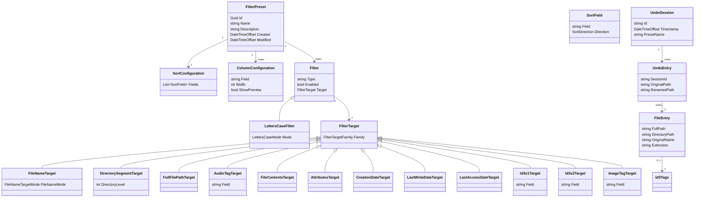

# Mfr — Magic File Renamer 8 Design

**Version:** 8.0 (Mfr)  
**Stack:** C# 13 · .NET 10 · Avalonia UI 11  
**Date:** 2026-04-02  
**Based on:** MFR v7.4 feature parity + cross-platform rebuild, phased from CLI core to full UI

---

## Table of Contents

1. [Project Overview](#1-project-overview)
2. [Architecture & Core Data Model](#2-architecture--core-data-model)
3. [Implementation Phases](#3-implementation-phases)
4. [JSON Serialization Contract](#4-json-serialization-contract)
5. [Embedded File Explorer](#5-embedded-file-explorer)
6. [Rename List](#6-rename-list)
7. [Filter System — All 38 Filters](#7-filter-system--all-38-filters)
8. [Formatting Parameters & Token System](#8-formatting-parameters--token-system)
9. [Filter Preset Manager](#9-filter-preset-manager)
10. [ID3 Tag Editor](#10-id3-tag-editor)
11. [File Attributes & Date Editor](#11-file-attributes--date-editor)
12. [Rename Pipeline](#12-rename-pipeline)
13. [FreeDB Integration](#13-freedb-integration)
14. [Reverse Geocoding](#14-reverse-geocoding)
15. [Log & Multi-Level Undo](#15-log--multi-level-undo)
16. [CLI / Console Mode](#16-cli--console-mode)
17. [Windows Shell Integration](#17-windows-shell-integration)
18. [UI Layout & Screens](#18-ui-layout--screens)
19. [Library Reference](#19-library-reference)
20. [Distribution Targets](#20-distribution-targets)
21. [Testing Strategy](#21-testing-strategy)
22. [Error Handling Strategy](#22-error-handling-strategy)

---

## 1. Project Overview

Magic File Renamer is a single-process, cross-platform (Windows / macOS / Linux) batch file renamer, metadata editor, and file organizer. It is the full-feature successor to MFR v7.4, rebuilt on .NET 9 and Avalonia UI for cross-platform distribution while preserving 100% of the original feature set.

Core capabilities:

- Embedded file explorer — add files/folders without leaving the app
- 38 filters in 7 groups, each applicable to filename, extension, parent folder, audio tags, image tags, file attributes, dates, or text file contents
- Full ID3 v1/v2.3/v2.4 read/write for MP3, OGG, FLAC, APE, ASF, WAV, AVI, RIFF
- EXIF/XMP/IFD/IPTC metadata reading from JPEG, TIFF, PNG, GIF, PDF, JPEG 2000
- Image property extraction (width, height, bit depth, DPI, frame count)
- Video/media property extraction (duration, bitrate, resolution)
- GPS reverse geocoding: latitude/longitude to nearest country/region/city via GeoNames.org
- FreeDB.org online music database for album/track lookup
- File attributes editing (Read-Only, Hidden, Archive, System)
- File date/time editing (Creation, Last Write, Last Access)
- Text file contents editing (apply any text filter to the actual file content)
- Mover filter — move files into dynamically-created folder hierarchies via formatting patterns
- Real-time preview with color-coded change/error highlighting
- Multi-level undo for all operations including tag changes
- Full rename log with per-operation history and undo
- Preset system: named filter stacks that also save sort config and column layout
- Manual rename: directly edit any writable field inline in the Rename List
- Export name list: generate a text file from any column
- Free names edit: open any column in an external text editor for bulk editing
- Advanced multi-field sort editor
- CLI/Console mode (mfr-console) for unattended batch renaming via task scheduler
- Windows Explorer right-click context menu integration
- Batch file (.bat / .sh) generation from rename operations
- All persistent state serialized as human-readable JSON

---

## 2. Architecture & Core Data Model

```
┌─────────────────────────────────────────────────────────────────┐
│                     Host Process (.NET 10)                      │
│                                                                 │
│  ┌──────────────────┐  ┌──────────────────┐  ┌──────────────┐  │
│  │   Avalonia UI     │  │   Core Services  │  │ Console Mode │  │
│  │ (MVVM/ReactiveUI) │  │  (no UI deps)    │  │ mfr-console  │  │
│  └──────────────────┘  └───────┬──────────┘  └──────────────┘  │
│                                │                                │
│        ┌───────────────────────┼───────────────────┐           │
│        ▼                       ▼                   ▼           │
│  ┌───────────┐         ┌─────────────┐    ┌──────────────┐    │
│  │FileScanner│         │RenameList    │    │MetadataLayer │    │
│  │Channel<T> │         │Preview+Commit│    │TagLibSharp   │    │
│  └───────────┘         └─────────────┘    │MetadataEx.   │    │
│                                            │GeoNames API  │    │
│                                            │FreeDB API    │    │
│                                            └──────────────┘    │
│                                                                 │
│  ┌───────────────────────────────────────────────────────────┐  │
│  │               JSON Persistence Layer                       │  │
│  │  presets\*.json · settings.json · session.json           │  │
│  │  undo\sess-*.json                                        │  │
│  └───────────────────────────────────────────────────────────┘  │
└─────────────────────────────────────────────────────────────────┘
```

### Key design principles

- **Single process, no IPC.** All work runs on the .NET ThreadPool via `Channel<T>` pipelines.
- **UI depends on Core; Core has no UI dependency.** Console mode and GUI share identical service classes.
- **Every domain object is a plain C# record**, serializable to/from JSON with `System.Text.Json` source generators.
- **Immutable filter definitions.** `Filter` records are never mutated; edits produce new filter snapshots for undo.
- **Lazy metadata loading.** EXIF, ID3, and media properties are loaded only when a filter or column actually needs them.
- **CLI-first, UI-later.** Core pipeline, filters, presets, and logging are implemented and tested in console mode before the Avalonia UI is added on top.

### 2.1 Core data model

Core records and enums that back presets, filters, rename pipeline, and undo:

```csharp
public sealed record FilterPreset
{
    public Guid Id { get; init; } = Guid.NewGuid();
    public string Name { get; init; } = "";
    public string Description { get; init; } = "";
    public DateTimeOffset Created { get; init; } = DateTimeOffset.UtcNow;
    public DateTimeOffset Modified { get; init; } = DateTimeOffset.UtcNow;
    public IReadOnlyList<string> Tags { get; init; } = [];
    public SortConfiguration Sort { get; init; } = new();
    public IReadOnlyList<ColumnConfiguration> Columns { get; init; } = [];
    public IReadOnlyList<Filter> Filters { get; init; } = [];
}

public sealed record SortConfiguration
{
    public IReadOnlyList<SortField> Fields { get; init; } = [];
}

public sealed record SortField
{
    public string Field { get; init; } = "";
    public SortDirection Direction { get; init; } = SortDirection.Ascending;
}

public enum SortDirection { Ascending, Descending }

public sealed record ColumnConfiguration
{
    public string Field { get; init; } = "";
    public int Width { get; init; } = 120;
    public bool ShowPreview { get; init; } = false;
}

// Each filter has its own type-safe options record and filter definition record.
public abstract record Filter
{
    // Written to JSON as discriminator; used by FilterEngine to resolve implementation.
    public abstract string Type { get; }
    public bool Enabled { get; init; } = true;
    public FilterTarget Target { get; init; } = default!;
}

public abstract record Filter<TOptions> : Filter
{
    public TOptions Options { get; init; } = default!;
}

// Example filter definitions (all 38 follow the same typed pattern).
public enum LettersCaseMode { UpperCase, LowerCase, FirstLetterUp, TitleCase, SentenceCase, InvertCase }
public sealed record LettersCaseOptions
{
    public LettersCaseMode Mode { get; init; } = LettersCaseMode.UpperCase;
    public IReadOnlyList<string> SkipWords { get; init; } = [];
}

public sealed record LettersCaseFilter : Filter<LettersCaseOptions>
{
    public override string Type => "LettersCase";
}

public enum CounterPosition { Prepend, Append, Replace }
public sealed record CounterOptions
{
    public int Start { get; init; } = 1;
    public int Step { get; init; } = 1;
    public int Width { get; init; } = 3;
    public string PadChar { get; init; } = "0";
    public CounterPosition Position { get; init; } = CounterPosition.Replace;
    public string Separator { get; init; } = " - ";
    public bool ResetPerFolder { get; init; } = false;
}

public sealed record CounterFilter : Filter<CounterOptions>
{
    public override string Type => "Counter";
}

public sealed record FormatterOptions
{
    public string Template { get; init; } = "";
}

public sealed record FormatterFilter : Filter<FormatterOptions>
{
    public override string Type => "Formatter";
}

// FilterTarget is an abstract base with one derived type per FilterTargetFamily.
public abstract record FilterTarget
{
    public abstract FilterTargetFamily Family { get; }
}

public sealed record FileNameTarget : FilterTarget
{
    public override FilterTargetFamily Family => FilterTargetFamily.FileName;
    public FileNameTargetMode FileNameMode { get; init; } = FileNameTargetMode.Full;
}

public sealed record FullFilePathTarget : FilterTarget
{
    public override FilterTargetFamily Family => FilterTargetFamily.FullFilePath;
}

public sealed record DirectorySegmentTarget : FilterTarget
{
    public override FilterTargetFamily Family => FilterTargetFamily.DirectorySegment;
    public int DirectoryLevel { get; init; } // 0 = direct parent, 1 = parent-of-parent, ...
}

public sealed record FileContentsTarget : FilterTarget
{
    public override FilterTargetFamily Family => FilterTargetFamily.FileContents;
}

public sealed record AttributesTarget : FilterTarget
{
    public override FilterTargetFamily Family => FilterTargetFamily.Attributes;
}

public sealed record CreationDateTarget : FilterTarget
{
    public override FilterTargetFamily Family => FilterTargetFamily.CreationDate;
}

public sealed record LastWriteDateTarget : FilterTarget
{
    public override FilterTargetFamily Family => FilterTargetFamily.LastWriteDate;
}

public sealed record LastAccessDateTarget : FilterTarget
{
    public override FilterTargetFamily Family => FilterTargetFamily.LastAccessDate;
}

public sealed record AudioTagTarget : FilterTarget
{
    public override FilterTargetFamily Family => FilterTargetFamily.AudioTag;
    public string? Field { get; init; } = null;
}

public sealed record Id3v1Target : FilterTarget
{
    public override FilterTargetFamily Family => FilterTargetFamily.Id3v1;
    public string? Field { get; init; } = null;
}

public sealed record Id3v2Target : FilterTarget
{
    public override FilterTargetFamily Family => FilterTargetFamily.Id3v2;
    public string? Field { get; init; } = null;
}

public sealed record ImageTagTarget : FilterTarget
{
    public override FilterTargetFamily Family => FilterTargetFamily.ImageTag;
    public string? Field { get; init; } = null;
}

public enum FilterTargetFamily
{
    FileName,
    FullFilePath,
    DirectorySegment,
    FileContents,
    Attributes,
    CreationDate,
    LastWriteDate,
    LastAccessDate,
    AudioTag,
    Id3v1,
    Id3v2,
    ImageTag
}

public enum FileNameTargetMode
{
    Prefix,
    Extension,
    Full
}

public sealed record UndoEntry
{
    public string SessionId { get; init; } = "";
    public string OriginalPath { get; init; } = "";
    public string RenamedPath { get; init; } = "";
    public Id3Tags? OriginalTags { get; init; }
    public Id3Tags? NewTags { get; init; }
    public FileAttributes? OriginalAttributes { get; init; }
    public FileAttributes? NewAttributes { get; init; }
    public DateTimeOffset? OriginalCreated { get; init; }
    public DateTimeOffset? OriginalModified { get; init; }
}

public sealed record UndoSession
{
    public string Id { get; init; } = "";
    public DateTimeOffset Timestamp { get; init; } = DateTimeOffset.UtcNow;
    public string PresetName { get; init; } = "";
    public IReadOnlyList<UndoEntry> Entries { get; init; } = [];
}
```

Metadata and settings records (unchanged from v7.4 in spirit) remain:

```csharp
public sealed record Id3Tags { /* see detailed definition below */ }

public sealed record AppSettings
{
    public UiSettings Ui { get; init; } = new();
    public RenameSettings Rename { get; init; } = new();
    public string ExternalEditor { get; init; } = "";
    public string GeoNamesUsername { get; init; } = "";
    public CliSettings Cli { get; init; } = new();
}

public sealed record RenameSettings
{
    public ConflictStrategy ConflictStrategy { get; init; } = ConflictStrategy.Skip;
    public bool CreateUndoJournal { get; init; } = true;
    public bool BackupOriginalContent { get; init; } = false;
    public bool FailFast { get; init; } = true;
    public bool AddFiles { get; init; } = true;
    public bool AddFolders { get; init; } = false;
    public bool Recursive { get; init; } = false;
    public bool IncludeHidden { get; init; } = false;
    public string WildcardInclude { get; init; } = "*.*";
    public string WildcardExclude { get; init; } = "";
}

public enum ConflictStrategy { Skip, AutoNumber, Overwrite, Fail }
```

### 2.2 Class diagram



---

## 3. Implementation Phases

The Mfr implementation is intentionally phased to de-risk the feature set. Each phase is shippable and builds on the previous one.

### Phase 1 — CLI-only core, basic filters

- Target runtime: **.NET 10**, single `mfr-console` entry point.
- Supports **file name–only targets** (no MP3/EXIF/attributes yet).
- Presets and filters are defined in **hand-edited JSON files**.
- Minimal logging (console output + per-run summary), no undo journal.

Scope:
- `FileEntry` scanning.
- `RenameList` preview/commit flow with a small subset of filters (case, space, trimming, basic replace, formatter, counter).
- JSON contracts for presets and sessions.

Out of scope:
- Audio tags, EXIF, FreeDB, GUI, Windows shell integration.

### Phase 2 — Logging and undo support

- Still CLI-first on .NET 10.
- Introduces **per-session undo journals** stored as separate JSON files under `undo/`.
- Adds **structured log output** (JSON/CSV) for batch results.

Scope:
- `UndoSession` and `UndoEntry` records and `IUndoJournal` interface.
- `/COPE`-style preview error handling and exit codes.
- Retention policy: keep at most N (default 50) undo files and delete any older than M days (default 90), configurable via `RenameSettings`.

### Phase 3 — Advanced filename/path filters

- Expands the filter set but still limits targets to filenames/paths/directories.
- Introduces the extended `FilterTarget` model:
  - `FilterTargetFamily.FileName` with `FileNameMode` = Prefix/Extension/Full.
  - `FilterTargetFamily.DirectorySegment` with `DirectoryLevel` (0 = direct parent, 1 = parent-of-parent, etc.).

Scope:
- All text/formatting filters that operate on names/paths only.
- Conflict detection, batch commit, and undo are stabilized.

Out of scope:
- MP3 tags, EXIF/image metadata, FreeDB, geocoding.

### Phase 4 — MP3/audio tag support

- Adds TagLibSharp-based `Id3Tags` loading and writing.
- Enables filters targeting `FilterTargetFamily.AudioTag`, `Id3v1`, and `Id3v2`.
- Extends formatter tokens with ID3/audio tokens (see §7.4–7.6).

Scope:
- `Id3Tags` record fully implemented.
- Audio-related filters (`AudioTagSetter`, `Id3v2FieldSetter`, `AudioTagRemover`, `SetFromFreeDB`).

### Phase 5 — EXIF and image metadata

- Adds metadata extraction via MetadataExtractor for image formats.
- Enables filters targeting `FilterTargetFamily.ImageTag`.
- Introduces EXIF-related formatter tokens and date filters.

### Phase 6 — Avalonia UI (Mfr GUI)

- Adds the Avalonia UI layer on top of the stabilized core.
- Includes:
  - List-based embedded file explorer (see §5).
  - Rename list, preset manager UI, log/undo windows.
  - ID3/attributes/date editors.
- CLI mode continues to use the same core services.

---

## 4. JSON Serialization Contract

All files: **UTF-8, LF line endings, 2-space indent**.

### 4.1 Preset files (`presets/*.json`)

Location:
- Windows: `%APPDATA%\MagicFileRenamer\presets\*.json`
- macOS/Linux: `~/.config/magic-file-renamer/presets/*.json`

Each preset is stored in its **own file**. File name convention: `<slug>-<id>.json` (e.g. `music-artist-album-a1b2c3d4.json`).

```json
{
  "version": 2,
  "id": "a1b2c3d4-e5f6-7890-abcd-ef1234567890",
  "name": "Music — Artist/Album folder tree",
  "description": "Moves MP3s into Artist/Album hierarchy, tags from FreeDB",
  "created": "2026-01-15T10:30:00Z",
  "modified": "2026-02-20T14:12:00Z",
  "tags": ["music", "id3", "mover"],
  "sort": {
    "fields": [
      { "field": "Id3.TrackNumber", "direction": "Ascending" }
    ]
  },
  "columns": [
    { "field": "Filename",   "width": 220, "showPreview": true },
    { "field": "Id3v2.Artist", "width": 150, "showPreview": false }
  ],
  "filters": [
    {
      "type": "SetFromFreeDB",
      "enabled": true,
      "target": { "family": "AudioTag" },
      "options": { "promptOnMultipleMatches": true }
    },
    {
      "type": "Counter",
      "enabled": true,
      "target": { "family": "AudioTag", "field": "TrackNumber" },
      "options": { "start": 1, "step": 1, "width": 2, "padChar": "0" }
    },
    {
      "type": "Formatter",
      "enabled": true,
      "target": {
        "family": "FileName",
        "fileNameMode": "Full"
      },
      "options": { "template": "<counter:1,1,0,2,0> - <id3-title:0><ext:0>" }
    },
    {
      "type": "Mover",
      "enabled": true,
      "target": {
        "family": "DirectorySegment",
        "directoryLevel": 0
      },
      "options": {
        "rootFolder": "C:\\Music\\Organized",
        "subFolderTemplate": "<id3-artist:0>\\<id3-album:0>"
      }
    }
  ]
}
```

### 4.2 `settings.json`

```json
{
  "version": 2,
  "ui": {
    "theme": "System",
    "explorerRootPaths": ["C:\\Users\\user\\Music"],
    "showHiddenFiles": false,
    "showSystemFiles": false,
    "previewDebounceMs": 250,
    "maxPreviewRows": 50000,
    "explorerWidth": 300,
    "filterStackWidth": 320
  },
  "rename": {
    "conflictStrategy": "Skip",
    "createUndoJournal": true,
    "backupOriginalContent": false,
    "failFast": true,
    "addFiles": true,
    "addFolders": false,
    "recursive": false,
    "includeHidden": false,
    "wildcardInclude": "*.*",
    "wildcardExclude": ""
  },
  "externalEditor": "notepad.exe",
  "geoNamesUsername": "",
  "cli": {
    "defaultOutputFormat": "Table",
    "colorOutput": true
  }
}
```

### 4.3 `session.json`

```json
{
  "version": 2,
  "lastOpenedDirectory": "/home/user/Music/Albums",
  "activePresetId": "a1b2c3d4-e5f6-7890-abcd-ef1234567890",
  "renameListItems": ["/home/user/Music/Albums/track01.mp3"],
  "filterStack": [],
  "sortConfig": { "fields": [] }
}
```

### 4.4 Filter envelope

The `type` string discriminates deserialization. All filters share:

```json
{
  "type": "<FilterTypeName>",
  "enabled": true,
  "target": {
    "family": "FileName | FullFilePath | DirectorySegment | FileContents | Attributes | CreationDate | LastWriteDate | LastAccessDate | AudioTag | Id3v1 | Id3v2 | ImageTag",
    "field": "<tag field name (optional; depends on filter) — only when family is AudioTag/Id3v1/Id3v2/ImageTag>",
    "fileNameMode": "Prefix | Extension | Full",
    "directoryLevel": 0
  },
  "options": { }
}
```

---

## 4. Embedded File Explorer

### 4.1 Component overview (list-based)

The embedded explorer is **list-based**, not tree-based. It shows only the contents of the **current folder** in a grid, with an **upper folder selector** used to change location.

```
┌──────────────────────────────────────────────────────┐
│ Folder: [ C:\Music\Albums ▾ ]                       │
│ Include: [*.mp3 *.flac]  Exclude: [thumbs.db]       │
│ [☑ Files] [☐ Folders] [☐ Recursive] [☐ Hidden]      │
├──────────────────────────────────────────────────────┤
│ Name              Type      Size      Modified       │
│ track01.mp3       File      3.4 MB    2024-01-15     │
│ track02.mp3       File      3.1 MB    2024-01-15     │
│ Singles           Folder    —         2023-12-01     │
├──────────────────────────────────────────────────────┤
│ [+ Add Selected]  [+ Add All in Folder]              │
└──────────────────────────────────────────────────────┘
```

The **Folder** selector is a combo-box / path picker that:
- Shows a history of recently used folders.
- Allows manual path entry and browse dialog.
- Supports a special entry for the last CLI-provided path when launched with arguments.

### 4.2 Add behaviors

| Action | Result |
|--------|--------|
| Add Selected button | Adds selected Explorer items to Rename List |
| Add All in Folder | Adds all visible items in the current folder |
| Drag to Rename List | Works from File Explorer or any external app |
| Alt + Drag | Clears Rename List before adding |
| Drop on desktop shortcut | Launches MFR with those items pre-loaded |

Only items matching Include mask and not Exclude mask are added. Hidden/system items only added when checkbox is active.

### 4.3 Folder history and favorites

- `settings.json → ui.explorerRootPaths` is interpreted as a **favorites list** shown at the top of the Folder selector.
- The explorer remembers the last N (default 10) visited folders per-session.

### 4.4 System icon resolution

```csharp
public interface ISystemIconProvider
{
    Task<IImage> GetIconAsync(string path, IconSize size);
}
// Windows: SHGetFileInfo P/Invoke
// macOS:   NSWorkspace.IconForFile
// Linux:   GtkIconTheme
// Cache keyed by extension
```

### 4.5 Non-filesystem items (Windows only)

Launch parameter `/NFS` shows Control Panel and other shell namespace virtual folders.

---

## 5. Rename List

The central workspace. Shows all queued items with configurable columns, real-time preview, inline editing, and rich sorting.

### 5.1 Column / field system

Users configure columns via the **Field Selector** (right-click column header → Select Fields).

| Group | Writable | Notable fields |
|-------|----------|----------------|
| File Name | Yes | Filename, Extension, ParentFolder, FullFilename, FullFilePath, File/Folder indicator, FilenameNumericValue, FilenameLength, FullPathLength |
| File Properties | Partial | FileContents (rw), CreationDate (rw), LastWriteDate (rw), LastAccessDate (rw), Size (ro), Attributes (rw), FolderFileCount (ro) |
| ID3v1 | Yes | Album, Artist, Comment, Genre, Title, TrackNumber, Year |
| ID3v2 | Yes | All standard TXXX/Txx frames — see §9 |
| MP3 Properties | No | Bitrate, Duration, DurationSec, Encoding, Frequency, Mode, MpegVersion, Layer, VbrQuality |
| Image | No | Format, Width, Height, BitDepth, HorzResolution, VertResolution, FramesCount |
| JPEG Tag | No | Title, Subject, Author, Keywords, Comments, DateTime, Make, Model, Artist, UserComment |
| JPEG-Geo | No | Latitude, Longitude, NearestCountry, NearestRegion, NearestCityOrPlace |
| FreeDB | No | Artist, Album, Year, Genre, Title (per-track) |
| Media Properties | No | MimeType, Duration, DurationSec, AudioBitrate, SampleRate, BitsPerSample, Channels, VideoWidth, VideoHeight |
| Audio Tag (multi-format) | Yes | Title, Performers, AlbumArtists, Composers, Album, Comment, Genres, Year, Track, TrackCount, Disc, DiscCount, Lyrics, Grouping, BPM, Conductor, Copyright, MusicBrainz IDs |
| Image Tag (multi-format) | No | Keywords, DateTime, Orientation, Software, GPS, ExposureTime, FNumber, ISO, FocalLength, Make, Model, Creator |

Preview columns (red header text) show predicted post-filter values. Any writable field can have a preview column. Column visibility, order, and widths are saved per-session and per-preset.

### 5.2 Color coding

| Display | Meaning |
|---------|---------|
| Red text in preview column | Field will change |
| Blue text | Field was manually renamed |
| Gray text | File not found on disk |
| `[Error]` cell value | Field cannot be read |
| Pink background + gray text | Preview error — item excluded from commit |
| Plum background | Commit error from last GO! operation |

Toggle the color legend overlay via the legend button in the toolbar.

### 5.3 Preview engine

Recalculates on every filter stack change, debounced by `settings.json → ui.previewDebounceMs` (default 250ms). Auto-preview can be toggled off for large lists. When `failFast` is enabled (default), processing stops on the first preview or rename error.

### 5.4 Sorting

**Auto-sort:** Click a column header to sort; Shift-click adds a secondary field. The **Advanced Sort Editor** supports multi-field sort with direction control, saved per-preset.

**Manual sort:** Toolbar arrows, Ctrl+↑/↓, or drag selected rows. Deactivates auto-sort.

**Sort by preview column:** One-time sort by predicted values. Counter-dependent filters recalculate after this.

### 5.5 Manual rename

Select items, focus the target column, press F2 or right-click → Manual Rename Field.

- Editing an **original** column overrides the input value fed into filters
- Editing a **preview** column overrides the output value after filters
- Blue text marks manually renamed cells
- F5 (Refresh) resets all manual renames
- Right-click manually renamed cell → Cancel Manual Rename

### 5.6 Export Name List

Right-click any column header → **Export Name List** → saves all values in that column to a text file (one per line). Works on original and preview columns.

### 5.7 Free Names Edit

Right-click any writable column header → **Free Names Edit**:
1. A temp `.txt` file is created from the column values
2. A NameList filter is automatically added targeting that column
3. The file opens in the configured external editor (`settings.json → externalEditor`)
4. F5 (Refresh) reloads the edited file into the NameList filter

### 5.8 Remove Unchanged Items

Right-click a **preview** column header → **Remove Unchanged Items** → removes items where that field is not predicted to change.

### 5.9 Locate

F4 or right-click → **Locate** → navigates File Explorer to the selected item's folder.

### 5.10 Batch File Generation

Rename List menu → Export → **Generate Batch File** → creates a `.bat` (Windows) or `.sh` (macOS/Linux) of all rename/move commands for the current preview, without executing them.

---

## 6. Filter System — All 38 Filters

Every filter has: `enabled` toggle, `target` field, and a type-specific `options` object. The `target` field is expressed via `FilterTarget` and `FilterTargetFamily`:

- `family` — which **family** of data to operate on (FileName, DirectorySegment, AudioTag, etc.).
- `fileNameMode` — how to interpret the filename (Prefix / Extension / Full) when `family` is `FileName`.
- `directoryLevel` — which parent directory to target when `family` is `DirectorySegment` (0 = direct parent, 1 = parent-of-parent, etc.).

In code, the JSON `type` discriminator maps to a concrete typed `Filter<TOptions>` record (one per filter), and the JSON `target.family` maps to a concrete derived `FilterTarget` record (one per family). `RenameList.Preview(...)` applies each typed filter definition to build per-item preview paths.

A **Filter Options** panel (gear icon on each filter row) provides:
- **Apply Target** override without editing the JSON
- **Apply Condition** — only apply when a field matches a condition (equals/contains/matches/starts-with)
- **Apply to Part** — apply only to a substring delimited by a character (e.g. apply LettersCase only to the part before ` - `)

---

### Group 1 — Case Manipulating (5 filters)

#### LettersCase
```json
{
  "type": "LettersCase",
  "target": { "family": "FileName", "fileNameMode": "Full" },
  "options": {
    "mode": "UpperCase | LowerCase | FirstLetterUp | TitleCase | SentenceCase | InvertCase",
    "skipWords": ["a", "an", "the", "of", "in", "at"]
  }
}
```

#### UppercaseInitials
Uppercases the first letter of each word using specified delimiters to identify word boundaries.
```json
{
  "type": "UppercaseInitials",
  "target": { "family": "AudioTag", "field": "Title" },
  "options": { "delimiters": " -_.", "keepExistingCase": false }
}
```

#### CapitalizeAfter
Capitalizes the character after any occurrence of specified characters.
```json
{
  "type": "CapitalizeAfter",
  "target": { "family": "FileName", "fileNameMode": "Full" },
  "options": { "chars": ".-_(", "uppercaseFirst": true }
}
```

#### CasingList
User-defined dictionary of words with fixed casing applied regardless of input case.
```json
{
  "type": "CasingList",
  "target": { "family": "FileName", "fileNameMode": "Full" },
  "options": {
    "entries": [
      { "match": "mfr", "replacement": "MFR" },
      { "match": "dj",  "replacement": "DJ"  }
    ],
    "caseSensitive": false
  }
}
```

#### SentenceEndCharacters
Capitalizes the first letter after sentence-ending punctuation.
```json
{
  "type": "SentenceEndCharacters",
  "target": { "family": "AudioTag", "field": "Comment" },
  "options": { "endChars": ".!?", "capitalizeFirst": true }
}
```

---

### Group 2 — Space Manipulating (6 filters)

#### SpaceCharacter
Defines the single character used as the word separator for filters that follow, and optionally maps common separators (space, underscore, percent-twenty, custom text) to that character.
```json
{
  "type": "SpaceCharacter",
  "target": { "family": "FileName", "fileNameMode": "Full" },
  "options": {
    "SpaceCharacter": "_",
    "ReplaceSpaces": false,
    "ReplaceUnderscores": false,
    "ReplacePercent20": true,
    "CustomText": ""
  }
}
```

#### RemoveSpaces
Removes all occurrences of the current word-separator character (default U+0020 SPACE when no `SpaceCharacter` filter ran).
```json
{ "type": "RemoveSpaces", "target": { "family": "FileName", "fileNameMode": "Full" }, "options": {} }
```

#### ShrinkSpaces
Collapses consecutive runs of the current word-separator character to a single occurrence (default U+0020 SPACE when no `SpaceCharacter` filter ran).
```json
{ "type": "ShrinkSpaces", "target": { "family": "FileName", "fileNameMode": "Full" }, "options": {} }
```

#### SpaceAfter
Inserts a space after every occurrence of specified characters.
```json
{
  "type": "SpaceAfter",
  "target": { "family": "FileName", "fileNameMode": "Full" },
  "options": { "chars": ",-" }
}
```

#### SpaceAround
Inserts a space before and after every occurrence of specified characters.
```json
{
  "type": "SpaceAround",
  "target": { "family": "FileName", "fileNameMode": "Full" },
  "options": { "chars": "-" }
}
```

#### SeparateCapitalizedText
Inserts a separator before each capital letter (for CamelCase to spaced conversion).
```json
{
  "type": "SeparateCapitalizedText",
  "target": { "family": "FileName", "fileNameMode": "Full" },
  "options": { "separator": " ", "skipConsecutiveCaps": true }
}
```

---

### Group 3 — Trimming (8 filters)

#### TrimLeft
```json
{ "type": "TrimLeft", "target": { "family": "FileName", "fileNameMode": "Full" }, "options": { "count": 3 } }
```

#### TrimRight
```json
{ "type": "TrimRight", "target": { "family": "FileName", "fileNameMode": "Full" }, "options": { "count": 5 } }
```

#### TrimSpacesLeft
```json
{ "type": "TrimSpacesLeft", "target": { "family": "AudioTag", "field": "Title" }, "options": {} }
```

#### TrimSpacesRight
```json
{ "type": "TrimSpacesRight", "target": { "family": "AudioTag", "field": "Title" }, "options": {} }
```

#### ExtractLeft
Keeps only the leftmost N characters.
```json
{ "type": "ExtractLeft", "target": { "family": "FileName", "fileNameMode": "Full" }, "options": { "count": 20 } }
```

#### ExtractRight
Keeps only the rightmost N characters.
```json
{ "type": "ExtractRight", "target": { "family": "FileName", "fileNameMode": "Full" }, "options": { "count": 10 } }
```

#### TrimBetween
Removes content between two delimiter strings.
```json
{
  "type": "TrimBetween",
  "target": { "family": "FileName", "fileNameMode": "Full" },
  "options": {
    "startDelimiter": "(",
    "endDelimiter": ")",
    "includeDelimiters": true,
    "removeAll": true
  }
}
```

#### RemoveDuplicateCharacters
Collapses consecutive occurrences of specified characters to one.
```json
{
  "type": "RemoveDuplicateCharacters",
  "target": { "family": "FileName", "fileNameMode": "Full" },
  "options": { "chars": " _-." }
}
```

---

### Group 4 — Replace (3 filters)

#### Replacer
Search and replace with literal, wildcard, or regex mode.
```json
{
  "type": "Replacer",
  "target": { "family": "FileName", "fileNameMode": "Full" },
  "options": {
    "find": "(feat\\.)",
    "replacement": "ft.",
    "mode": "Literal | Wildcard | Regex",
    "caseSensitive": false,
    "replaceAll": true,
    "wholeWord": false
  }
}
```

#### ReplaceList
Applies a sequence of find/replace pairs from an embedded list or external file (`find=replacement` per line).
```json
{
  "type": "ReplaceList",
  "target": { "family": "FileName", "fileNameMode": "Full" },
  "options": {
    "source": "Inline | File",
    "filePath": "",
    "entries": [
      { "find": "feat.", "replacement": "ft." },
      { "find": " - ",  "replacement": "_"   }
    ],
    "caseSensitive": false,
    "mode": "Literal | Regex"
  }
}
```

#### Cleaner
Removes or replaces illegal or user-specified characters. `removeIllegalChars` strips characters invalid in filenames on the target OS.
```json
{
  "type": "Cleaner",
  "target": { "family": "FileName", "fileNameMode": "Full" },
  "options": {
    "removeIllegalChars": true,
    "illegalCharReplacement": "_",
    "customCharsToRemove": "[]{}()",
    "customReplacement": ""
  }
}
```

---

### Group 5 — Formatting (5 filters)

#### Formatter
Renames any target field to a format string built from literals and formatting parameter tokens (see §7). Edited via the **Formatting Editor** dialog with a token picker and live preview.
```json
{
  "type": "Formatter",
  "target": { "family": "FileName", "fileNameMode": "Full" },
  "options": {
    "template": "<counter:1,1,0,2,0>.<image-width:0>x<image-height:0>.<image-format:0><ext:0>"
  }
}
```
Example: `Dsc00019.jpg` → `1.2048x1536.JPEG.jpg`

#### Counter
Adds an auto-incrementing serial number to the target field.
```json
{
  "type": "Counter",
  "target": { "family": "FileName", "fileNameMode": "Full" },
  "options": {
    "start": 1,
    "step": 1,
    "width": 3,
    "padChar": "0",
    "position": "Prepend | Append | Replace",
    "separator": " - ",
    "resetPerFolder": false
  }
}
```

#### NameList
Replaces each item's target field value with the corresponding line from a text file. Line N → item N in the Rename List. Used by the Free Names Edit feature.
```json
{
  "type": "NameList",
  "target": { "family": "FileName", "fileNameMode": "Full" },
  "options": {
    "filePath": "C:\\names.txt",
    "skipEmptyLines": true,
    "encoding": "UTF8"
  }
}
```

#### TokenMover
Splits the target field by a delimiter and rearranges the parts. E.g. `Lastname, Firstname` → `Firstname Lastname`.
```json
{
  "type": "TokenMover",
  "target": { "family": "FileName", "fileNameMode": "Full" },
  "options": {
    "delimiter": ", ",
    "outputOrder": [1, 0],
    "outputSeparator": " "
  }
}
```

#### Inserter
Inserts text at a specified position within the target field.
```json
{
  "type": "Inserter",
  "target": { "family": "FileName", "fileNameMode": "Full" },
  "options": {
    "text": "PREFIX_",
    "position": "Start | End | Index | BeforeMatch | AfterMatch",
    "index": 0,
    "matchPattern": "",
    "matchMode": "Literal | Regex"
  }
}
```

---

### Group 6 — Audio (4 filters)

#### AudioTagSetter
Sets a standard audio tag field (multi-format via TagLibSharp). Value can be a literal or a format string.
```json
{
  "type": "AudioTagSetter",
  "target": { "family": "AudioTag", "field": "Title" },
  "options": { "value": "<file-name:0>", "useFormatter": true }
}
```

#### Id3v2FieldSetter
Sets any specific ID3v2 frame by frame ID (e.g. TXXX, TIT1) for frames not accessible via AudioTagSetter.
```json
{
  "type": "Id3v2FieldSetter",
  "target": { "family": "Id3v2" },
  "options": {
    "frameId": "TXXX",
    "value": "my custom value",
    "createIfMissing": true
  }
}
```

#### AudioTagRemover
Deletes audio tags entirely or clears specific fields.
```json
{
  "type": "AudioTagRemover",
  "target": { "family": "AudioTag" },
  "options": {
    "removeId3v1": true,
    "removeId3v2": false,
    "removeFields": ["Comment", "Lyrics"]
  }
}
```

#### SetFromFreeDB
Queries FreeDB.org using the disc ID computed from track lengths. Populates the FreeDB field group. Must precede any Formatter using FreeDB tokens.
```json
{
  "type": "SetFromFreeDB",
  "enabled": true,
  "target": { "family": "AudioTag" },
  "options": {
    "preferredMatchIndex": 0,
    "promptOnMultipleMatches": true
  }
}
```

---

### Group 7 — Attributes (3 filters)

#### AttributesSetter
```json
{
  "type": "AttributesSetter",
  "target": { "family": "Attributes" },
  "options": {
    "readOnly":  "Set | Clear | Keep",
    "hidden":    "Set | Clear | Keep",
    "archive":   "Set | Clear | Keep",
    "system":    "Set | Clear | Keep"
  }
}
```

#### DateSetter
Sets a file date from a fixed value, EXIF date, ID3 year, or current time.
```json
{
  "type": "DateSetter",
  "target": { "family": "CreationDate" },
  "options": {
    "source": "Fixed | FileModified | ExifDateTaken | Id3Year | Now",
    "fixedDate": "2024-01-01"
  }
}
```

#### TimeSetter
Sets the time portion of a file datetime.
```json
{
  "type": "TimeSetter",
  "target": { "family": "LastWriteDate" },
  "options": {
    "source": "Fixed | Now | ExifDateTaken",
    "fixedTime": "12:00:00",
    "offsetSeconds": 0
  }
}
```

---

### Group 8 — Misc (3 filters)

#### Mover
Moves files to a different folder. Destination = `rootFolder` + `subFolderTemplate` (a format string). Non-existent folders are created. Cross-volume moves supported for files. Applies to the `ParentFolder` target. Any other text filter can also target `ParentFolder` for the same effect.
```json
{
  "type": "Mover",
  "target": { "family": "DirectorySegment", "directoryLevel": 0 },
  "options": {
    "rootFolder": "C:\\Music\\Organized",
    "subFolderTemplate": "<id3-artist:0> (<id3-year:0>)\\<id3-album:0>",
    "createFolders": true
  }
}
```
Example: `C:\Downloads\03 - Blue Moon Revisited.mp3` → `C:\Music\Organized\Cowboy Junkies (1988)\The Trinity Session\03 - Blue Moon Revisited.mp3`

#### FixLeadingZeros
Normalizes numbers within the field to a consistent digit width.
```json
{
  "type": "FixLeadingZeros",
  "target": { "family": "FileName", "fileNameMode": "Full" },
  "options": { "width": 2, "removeExtraZeros": true }
}
```

#### StripParentheses
Removes specified bracket types and their contents.
```json
{
  "type": "StripParentheses",
  "target": { "family": "FileName", "fileNameMode": "Full" },
  "options": {
    "types": "Round | Square | Curly | Angle",
    "removeContents": true
  }
}
```

---

## 7. Formatting Parameters & Token System

The Formatter filter, Mover sub-folder template, AudioTagSetter value, and date filters use a template language with `<token-name:argument>` syntax. The **Formatting Editor** provides a visual token picker grouped by category with live preview.

### 7.1 File Name Group

| Token | Description | Example |
|-------|-------------|---------|
| `<file-name:0>` | Filename without extension | `track01` |
| `<file-ext:0>` | Extension with dot | `.mp3` |
| `<ext:0>` | Extension with dot (alias) | `.mp3` |
| `<full-name:0>` | Filename with extension | `track01.mp3` |
| `<parent-folder:0>` | Immediate parent folder name | `Albums` |
| `<full-path:0>` | Full file path | `/music/albums/track01.mp3` |

### 7.2 File Properties Group

| Token | Description |
|-------|-------------|
| `<file-size:0>` | File size in bytes |
| `<create-date:format>` | Creation date (e.g. `<create-date:yyyy-MM-dd>`) |
| `<mod-date:format>` | Last modified date |
| `<access-date:format>` | Last access date |
| `<folder-count:0>` | Number of files in the same folder |

Date formats follow .NET format strings: `yyyy`, `MM`, `dd`, `HH`, `mm`, `ss`, etc.

### 7.3 General Group

| Token | Description | Example |
|-------|-------------|---------|
| `<counter:start,step,reset,width,pad>` | Auto-incrementing counter | `<counter:1,1,0,3,0>` → `001` |
| `<random:length>` | Random alphanumeric string | `<random:6>` → `k3m9xw` |
| `<clipboard:0>` | Current clipboard text | |
| `<text-file:path,line>` | Line N from a text file | |
| `<now:format>` | Current date/time | `<now:yyyy-MM-dd>` |

Counter parameters: `start`, `step`, `reset` (0=no/1=per folder), `width`, `padchar` (0=zero/1=space).

### 7.4 ID3 Group (MP3 ID3v2)

| Token | Frame | Example |
|-------|-------|---------|
| `<id3-title:0>` | TIT2 | `Bohemian Rhapsody` |
| `<id3-artist:0>` | TPE1 | `Queen` |
| `<id3-album-artist:0>` | TPE2 | `Queen` |
| `<id3-album:0>` | TALB | `A Night at the Opera` |
| `<id3-year:0>` | TYER | `1975` |
| `<id3-genre:0>` | TCON | `Rock` |
| `<id3-track:0>` | TRCK left | `11` |
| `<id3-track-count:0>` | TRCK right | `12` |
| `<id3-disc:0>` | TPOS | `1` |
| `<id3-comment:0>` | COMM | `Remastered` |
| `<id3-composer:0>` | TCOM | `Freddie Mercury` |
| `<id3-conductor:0>` | TPE3 | |
| `<id3-bpm:0>` | TBPM | `128` |
| `<id3-lyrics:0>` | USLT | |
| `<id3-publisher:0>` | TPUB | `EMI` |
| `<id3-grouping:0>` | TIT1 | |
| `<id3-copyright:0>` | TCOP | `1975 EMI` |
| `<id3-encoded-by:0>` | TENC | |
| `<id3-initial-key:0>` | TKEY | `Am` |
| `<id3-language:0>` | TLAN | `eng` |
| `<id3-mood:0>` | TMOO (v2.4) | `Melancholic` |

### 7.5 MP3 Properties (read-only)

`<mp3-bitrate:0>`, `<mp3-duration:0>`, `<mp3-duration-sec:0>`, `<mp3-frequency:0>`, `<mp3-mode:0>`, `<mp3-mpeg-ver:0>`, `<mp3-encoding:0>`, `<mp3-vbr-quality:0>`

### 7.6 Audio Tag Group (multi-format)

`<audio-title:0>`, `<audio-artist:0>`, `<audio-album:0>`, `<audio-year:0>`, `<audio-genre:0>`, `<audio-track:0>`, `<audio-disc:0>`, `<audio-composer:0>`, `<audio-bpm:0>`, `<audio-duration:0>`, `<audio-duration-sec:0>`, `<audio-bitrate:0>`, `<audio-samplerate:0>`, `<audio-channels:0>`

### 7.7 Image Properties (read-only)

`<image-width:0>`, `<image-height:0>`, `<image-bit-depth:0>`, `<image-format:0>`, `<image-horz-res:0>`, `<image-vert-res:0>`, `<image-frames:0>`

### 7.8 EXIF Group (JPEG)

| Token | Description |
|-------|-------------|
| `<exif-date:format>` | Date/time image taken |
| `<exif-make:0>` | Camera manufacturer |
| `<exif-model:0>` | Camera model |
| `<exif-exposure:0>` | Exposure time |
| `<exif-fnumber:0>` | F-number |
| `<exif-iso:0>` | ISO speed |
| `<exif-focal:0>` | Focal length mm |
| `<exif-focal-35:0>` | Focal length 35mm equivalent |
| `<exif-gps-lat:0>` | GPS latitude |
| `<exif-gps-lon:0>` | GPS longitude |
| `<exif-tag:source,name>` | Extended EXIF by source+name — Canon, Casio, FujiFilm, GPS, IPTC, Nikon, Olympus |

### 7.9 Nearby Location Group

| Token | Description |
|-------|-------------|
| `<geo-country:0>` | Nearest country from GPS EXIF |
| `<geo-region:0>` | Nearest region |
| `<geo-city:0>` | Nearest city or place |

Requires GeoNames.org username in settings. See §13.

### 7.10 FreeDB Group (requires SetFromFreeDB filter first)

`<freedb-artist:0>`, `<freedb-album:0>`, `<freedb-year:0>`, `<freedb-genre:0>`, `<freedb-title:0>` (nth item → nth track title)

### 7.11 Media Properties Group

`<media-mime:0>`, `<media-duration:0>`, `<media-duration-sec:0>`, `<media-audio-bitrate:0>`, `<media-samplerate:0>`, `<media-channels:0>`, `<media-video-width:0>`, `<media-video-height:0>`

---

## 8. Filter Preset Manager

### 8.1 Storage and hot-reload

All presets live as **individual JSON files** under the `presets` directory (see §4.1). `PresetService` uses `FileSystemWatcher` for automatic reload on external edits. Each preset stores filter stack, sort config, and column layout.

### 8.2 PresetService API

```csharp
public sealed class PresetService
{
    public ReadOnlyObservableCollection<FilterPreset> Presets { get; }

    Task InitializeAsync(CancellationToken cancellationToken);

    Task<FilterPreset> SaveAsync(FilterPreset preset);
    Task DeleteAsync(Guid id);
    Task<FilterPreset> DuplicateAsync(Guid id, string newName);

    Task<string> ExportAsync(IEnumerable<Guid> ids, string filePath);
    Task<IReadOnlyList<FilterPreset>> ImportAsync(string filePath);

    Task ReorderAsync(Guid id, int newIndex);
}
```

### 8.3 Preset Panel UI

```
┌────────────────────────────────────────────────┐
│ Presets                    [+ New] [Import]    │
│ [Search...]                        [Export]    │
├────────────────────────────────────────────────┤
│ ★ Music — Artist/Album tree      4 filters      │
│   modified 2026-02-20          [▶] [✏] [⋮]   │
├────────────────────────────────────────────────┤
│   Photo Organizer — EXIF Date    5 filters       │
│   modified 2026-01-10          [▶] [✏] [⋮]   │
└────────────────────────────────────────────────┘
```

`[▶]` applies preset immediately to current Rename List. `[✏]` opens in filter editor. `[⋮]` → Duplicate / Rename / Delete / Pin / Export.

---

## 9. ID3 Tag Editor

### 9.1 Supported formats

| Format | Standard written |
|--------|-----------------|
| MP3 | ID3v1.1, ID3v2.3 (default) or v2.4 |
| OGG Vorbis | XIPH |
| FLAC | XIPH + FLAC metadata |
| APE | APEv2 |
| ASF / WMA | ASF |
| AVI / DIVX | RIFF |
| WAV / RMI | RIFF |

ID3v2.3 is written by default. v2.4 only when the existing tag is v2.4 or explicitly requested (v2.4 not fully supported by Windows Explorer/Media Player).

### 9.2 ID3v2 writable fields

All standard text frames: TIT1/2/3, TPE1/2/3/4, TALB, TYER, TCON, TRCK, TPOS, TCOM, TBPM, USLT, COMM, TPUB, TENC, TKEY, TLAN, TCOP, TEXT, TOAL, TOPE, TOLY, TORY, TRDA, TDAT, TOWN, TFLT, TMED, TRSN, TRSO, TSSE, TSIZ, TOFN, APIC (album art), TXXX (user-defined text). ID3v2.4 frames: TSST, TIPL, TMOO, TDEN, TDOR, TDRC, TDRL, TDTG, TSOA, TSOP.

### 9.3 Tag Editor panel

```
┌──────────────────────────────────────────────────────┐
│ ID3 Tag Editor [3 files selected]   [Save] [Reset]   │
├─────────────────┬────────────────────────────────────┤
│ Title           │ [<multiple values>             ]   │
│ Artist          │ [Queen                         ]   │
│ Album Artist    │ [Queen                         ]   │
│ Album           │ [<multiple values>             ]   │
│ Year            │ [1975]  Genre: [Rock          ▾]  │
│ Track #         │ [11] / [12]   Disc: [1] / [1]     │
│ BPM             │ [128]    Initial Key: [Am]         │
│ Composer        │ [Freddie Mercury               ]   │
│ Conductor       │ [                              ]   │
│ Publisher       │ [EMI Records                   ]   │
│ Encoded By      │ [iTunes 12                     ]   │
│ Language        │ [eng]                              │
│ Comment         │ [Remastered 2011               ]   │
│ Grouping        │ [                              ]   │
│ Lyrics          │ [                ] (expand ▾)     │
│ Copyright       │ [1975 EMI Records              ]   │
│ MusicBrainz IDs │ [Advanced ▸]                      │
├─────────────────┴────────────────────────────────────┤
│ Album Art: [thumbnail]  [Change] [Remove]            │
├──────────────────────────────────────────────────────┤
│ ID3 Version: [v2.3 ▾]                                │
├──────────────────────────────────────────────────────┤
│ MP3 Info (read-only)                                 │
│ 320 kbps CBR · 44.1 kHz · Joint Stereo · 5:55       │
└──────────────────────────────────────────────────────┘
```

`<multiple values>` shown in gray when selected files differ. Editing replaces all. Only touched fields are written (patch semantics). ID3 fields can also be edited inline in the Rename List via Manual Rename.

---

## 10. File Attributes & Date Editor

### 10.1 Attributes panel

```
Attributes:  [☐ R] Read-Only  [☐ H] Hidden  [☑ A] Archive  [☐ S] System
```

Three-state checkboxes (Set / Cleared / Mixed). Automated in batch via `AttributesSetter` filter.

### 10.2 Dates panel

```
Creation Date:    [2024-01-15  10:30:00]  [Set]
Last Write Date:  [2024-01-15  10:30:00]  [Set]
Last Access Date: [2024-01-15  10:30:00]  [Set]
                                      [Copy From EXIF]
```

**Copy From EXIF** sets Last Write Date from EXIF DateTaken for image files.

### 10.3 FileContents target

When a filter targets `FileContents`, it reads and writes the actual content of the file. This allows any text filter (Replacer, LettersCase, Formatter, etc.) to perform in-place text file editing. The original is overwritten — always back up first. Only the first 200 characters are shown in the preview column.

---

## 11. Rename Pipeline

### 11.1 Data flow

```
FileEntry[] (Rename List)
     │
     ▼
[Filter Engine — Preview]  ← debounced 250ms
     │
     ▼
RenameResult[]  (before → after for each target field)
     │
     ├──▶ Conflict Detector
     │
     ▼
[User reviews, resolves conflicts]
     │
     ▼
[Filter Engine — CommitAsync]
     ├──▶ File.Move (same volume) / File.Copy+Delete (cross-volume)
     ├──▶ Id3WriteService.WriteTagsAsync
     ├──▶ AttributesSetter.ApplyAsync
     ├──▶ DateSetter.ApplyAsync
     ├──▶ TextFileWriter.ApplyAsync (FileContents target)
     └──▶ UndoJournal.RecordAsync → log.json
```

### 11.2 FileEntry

```csharp
public sealed record FileEntry
{
    public string FullPath { get; init; } = "";
    public string DirectoryPath { get; init; } = "";
    public string OriginalName { get; init; } = "";
    public string Extension { get; init; } = "";
    public long SizeBytes { get; init; }
    public DateTimeOffset Modified { get; init; }
    public DateTimeOffset Created { get; init; }
    public FileAttributes Attributes { get; init; }
    public Id3Tags? Tags { get; set; }           // lazy
    public ExifData? Exif { get; set; }          // lazy
    public MediaProperties? Media { get; set; }  // lazy
    public FreeDbData? FreeDb { get; set; }      // set by SetFromFreeDB
    public GeoLocation? GeoLocation { get; set; } // set by geocode service
}
```

### 11.5 Core interfaces

Core interfaces define where filter implementations and pipeline behavior live.

```csharp
public interface IFilterStep
{
    string Type { get; }
    FilterTarget Target { get; }

    ValueTask ApplyPreviewAsync(FilterContext context, CancellationToken cancellationToken);
    ValueTask ApplyCommitAsync(FilterContext context, CancellationToken cancellationToken);
}

public interface IFilterStep<TFilterDefinition> where TFilterDefinition : Filter
{
    // Must match `TFilterDefinition.Type`.
    string Type { get; }

    ValueTask ApplyPreviewAsync(FilterContext context, TFilterDefinition filter, CancellationToken cancellationToken);
    ValueTask ApplyCommitAsync(FilterContext context, TFilterDefinition filter, CancellationToken cancellationToken);
}

public sealed record FilterContext
{
    public FileEntry File { get; init; } = default!;
    public IReadOnlyDictionary<string, object?> State { get; init; } = new Dictionary<string, object?>();
    public CancellationToken CancellationToken { get; init; }
}

public interface IRenamePipeline
{
    ValueTask<IReadOnlyList<RenameResult>> PreviewAsync(
        IReadOnlyList<FileEntry> files,
        FilterPreset preset,
        CancellationToken cancellationToken);

    ValueTask<CommitSummary> CommitAsync(
        IReadOnlyList<FileEntry> files,
        FilterPreset preset,
        CancellationToken cancellationToken);
}

public interface IUndoJournal
{
    ValueTask<string> WriteSessionAsync(UndoSession session, CancellationToken cancellationToken);
    ValueTask<UndoSession?> ReadSessionAsync(string sessionId, CancellationToken cancellationToken);
    ValueTask PruneAsync(CancellationToken cancellationToken);
}
```

Concrete filters such as `LettersCaseFilter`, `FormatterFilter`, `ReplacerFilter`, etc. each implement `IFilterStep<TFilterDefinition>` for their corresponding typed `Filter` record, and are resolved during preview based on `Filter.Type`.

### 11.3 Conflict detection rules

| Condition | Conflict reason |
|-----------|----------------|
| Two results → same output path | `"Duplicate output name"` |
| Output path exists on disk | `"File already exists"` |
| Windows reserved name (CON, NUL, COM1–9, LPT1–9) | `"Reserved filename"` |
| Path > 260 chars (Windows) / 255 bytes (Linux/macOS) | `"Path too long"` |
| Circular chain (A→B, B→A) | Resolved via topological sort + temp name swap |

### 11.4 Conflict strategies

`Skip` (default) · `AutoNumber` (appends `(1)`, `(2)`, …) · `Overwrite` (requires confirmation) · `Fail` (aborts batch)

---

## 12. FreeDB Integration

The **SetFromFreeDB** filter queries freedb.org (or a compatible CDDB server) using the disc ID computed from track count, offsets, and total length of the Rename List items. If multiple matches are returned, the user selects one in a dialog (or `preferredMatchIndex` is used in console mode). The lookup populates the FreeDB field group; FreeDB tokens in subsequent Formatter filters resolve per-track.

**FreeDB fields (read-only):** Artist, Album, Year, Genre, Title (item N → track N's title).

---

## 13. Reverse Geocoding

When image files have GPS coordinates in EXIF, the Nearby Location fields and tokens resolve those coordinates to country/region/city via the GeoNames.org web API. Requires a free GeoNames.org username in `settings.json → geoNamesUsername`. Results are cached in memory per session.

**Available fields:** NearestCountry, NearestRegion, NearestCityOrPlace (read-only).  
**Available tokens:** `<geo-country:0>`, `<geo-region:0>`, `<geo-city:0>`.

---

## 14. Log & Multi-Level Undo

### 14.1 Log schema and storage

Each rename session writes a **separate undo file** under the `undo` directory:

- Windows: `%APPDATA%\MagicFileRenamer\undo\sess-*.json`
- macOS/Linux: `~/.config/magic-file-renamer/undo/sess-*.json`

File name convention: `sess-<timestamp>-<short-id>.json`.

```json
{
  "version": 2,
  "id": "sess-001",
  "timestamp": "2026-04-02T14:22:00Z",
  "presetName": "Music — Artist/Album tree",
  "totalItems": 42,
  "successCount": 40,
  "errorCount": 2,
  "operations": [
    {
      "originalPath":   "/music/01 song.mp3",
      "renamedPath":    "/music/001 - Queen - Bohemian Rhapsody.mp3",
      "originalParent": "/music",
      "renamedParent":  "/music",
      "tagsWritten": true,
      "originalTags": { "title": "song", "trackNumber": 1 },
      "attributesChanged": false,
      "datesChanged": false,
      "status": "Ok | Error | Skipped",
      "error": null
    }
  ]
}
```

The Log window (View → Log) shows all past sessions (enumerated from `undo/`) as an expandable tree. Console mode writes the same schema.

### 14.2 Undo retention policy

To avoid unbounded disk growth, Mfr enforces a **retention policy**:

- Keep at most `Rename.MaxUndoSessions` files (default 50).
- Delete any undo file older than `Rename.MaxUndoAgeDays` days (default 90).

These settings live under `RenameSettings` in `settings.json`. Cleanup runs:
- On application startup.
- After each successful commit.

### 14.3 Multi-level undo

Edit → Undo (Ctrl+Z) for the most recent commit, or any past session from the Log window. Undo reverses file renames, ID3 tag writes, attribute changes, and date changes. Text file content changes are reversible only if `backupOriginalContent` is enabled. Only successfully completed operations are recorded.

---

## 15. CLI / Console Mode

Two entry points in one binary:

- **`magic-file-renamer`** — GUI, or adds files to Rename List when given path arguments
- **`mfr-console`** — headless console mode for unattended batch renaming

### 15.1 GUI launch with file arguments

```
magic-file-renamer [filename|pathname|filemask] [parameters]

  /F+  /F-    Enable/disable adding files (default: enabled)
  /D+  /D-    Enable/disable adding folders (default: disabled)
  /R+  /R-    Enable/disable recursive subfolder traversal (default: disabled)
  /H+  /H-    Enable/disable adding hidden/system files (default: disabled)
  /NFS        Show non-filesystem items in File Explorer (Windows)
```

```
magic-file-renamer D:\music\*.mp3
magic-file-renamer C:\mp3\indie /R+ /F+ /D-
```

### 15.2 Console mode

```
mfr-console /P:preset-name /A:path [parameters]

Required:
  /P:preset-name    Named preset. Use "/P:my preset" for names with spaces.
  /A:path           File, folder, or wildcard. Repeat for multiple sources.

Optional:
  /F-               Do not add files; folders only. Default: OFF.
  /D+               Add folder names. Default: OFF.
  /R+               Recursive subfolder processing. Default: OFF.
  /H+               Include hidden/system files. Default: OFF.
  /COPE             Continue on preview errors (skip errored items). Default: OFF.
  /Confirm          Per-item confirmation. Default: OFF.
  /S                Silent mode. Default: OFF.
  /V                Verbose mode. Default: OFF.
  --output <fmt>    table (default) | json | csv.
  /Help             Show help.
```

### 15.3 Exit codes

| Code | Description |
|------|-------------|
| 0 | Completed successfully |
| 1 | Cancelled: invalid parameters |
| 2 | Cancelled: failed to add files/folders |
| 3 | Cancelled: failed to load preset |
| 4 | Cancelled: preview error on at least one file (use `/COPE` to continue) |
| 5 | Error saving rename log |
| 99 | Other error |

### 15.4 Console examples

```bash
mfr-console /P:counter /A:C:\Images /R+

mfr-console "/P:Pretty Names" "/A:C:\My Music\*.mp3" /A:D:\music /R+ /COPE /V

mfr-console "/P:Random Names" /A:*.htm* /Confirm

mfr-console /P:counter /A:C:\Images /R+ --output json
```

### 15.5 JSON output format

```json
{
  "preset": "counter",
  "totalFiles": 42,
  "renamed": 40,
  "skipped": 1,
  "errors": 1,
  "results": [
    {
      "original": "C:\\Images\\DSC00019.jpg",
      "result":   "C:\\Images\\001.DSC00019.jpg",
      "status": "Ok | Skipped | Error | ConflictSkipped",
      "error": null
    }
  ]
}
```

### 15.6 Additional CLI subcommands

```
magic-file-renamer presets list [--output json]
magic-file-renamer presets show <n>
magic-file-renamer presets export <n> --out <file>
magic-file-renamer presets import <file>
magic-file-renamer tags read <glob> [--output json]
magic-file-renamer tags write <glob> --field <field>=<value>
magic-file-renamer tags write <glob> --patch <patch.json>
```

---

## 16. Windows Shell Integration

### 16.1 Explorer context menu

Registered under `HKEY_CURRENT_USER\Software\Classes\*\shell\MagicFileRenamer`. Right-clicking files/folders/selections in Explorer shows **Magic File Renamer**, launching the app with those items pre-loaded. Toggle via Options window or installer.

### 16.2 Drag and drop

Files/folders dragged from any application onto the Rename List are accepted. Alt+Drag clears the list before adding.

### 16.3 Desktop icon drop target

Dragging files onto the MFR desktop shortcut launches MFR with those items pre-loaded.

---

## 17. UI Layout & Screens

### 17.1 Main window

```
┌───────────────────────────────────────────────────────────────────────────┐
│ Magic File Renamer                                     [_] [□] [×]       │
│ File  Edit  View  Presets  Tools  Help                                    │
├──────────────────┬──────────────────────────────────┬─────────────────────┤
│ File Explorer    │ Rename List                      │ Available Filters   │
│ (300px)          │                                  │                     │
│ [roots + tree]   │ [toolbar: +sel +all -sel clr     │ Case Manip. ▶       │
│                  │  autosort preview legend refresh] │ Space Manip. ▶      │
│ Include: [*.mp3] │                                  │ Trimming ▶          │
│ Exclude: [     ] │ Name │Preview│Artist│Title│...   │ Replace ▶           │
│ [F][D][R][H]     │──────┼───────┼──────┼─────┼──── │ Formatting ▶        │
│ [+ Add Selected] │ a.mp3│001…   │Queen │Boh  │     │ Audio ▶             │
│ [+ Add All]      │ b.mp3│002…   │Queen │We W │     │ Attributes ▶        │
│                  │ c.mp3│ ⚠     │      │     │     │ Misc ▶              │
├──────────────────┴──────────────────────────────────┤─────────────────────┤
│                                                      │ Applied Filters     │
│                                                      │                     │
│                                                      │ ≡ 1. SetFromFreeDB  │
│                                                      │ ≡ 2. Counter        │
│                                                      │ ≡ 3. Formatter      │
│                                                      │ ≡ 4. Mover          │
│                                                      │                     │
│                                                      │ [Preset ▾] [Save]  │
│                                                      │ [GO!] Target: Files │
├──────────────────────────────────────────────────────┴─────────────────────┤
│ ID3 / Attributes / Dates panel (collapsible)                              │
│ Title: [Bohemian Rhapsody]  Artist: [Queen]  Track: [11/12]  …           │
├───────────────────────────────────────────────────────────────────────────┤
│ Status: 42 items · 40 will change · 1 conflict · 1 error  [Log] [Undo]  │
└───────────────────────────────────────────────────────────────────────────┘
```

### 17.2 Filter Configuration Panel (inline expansion)

```
≡ 3. Formatter                         [enabled ☑] [×] [Options ⚙]
   Apply to: [Filename ▾]   When: [Always ▾]   Part: [None ▾]
   ┌────────────────────────────────────────────────────────────────┐
   │ <counter:1,1,0,2,0> - <id3-artist:0> - <id3-title:0><ext:0>  │
   └────────────────────────────────────────────────────────────────┘
   [Token Picker ▾]   Preview: "01 - Queen - Bohemian Rhapsody.mp3"
```

Filters are drag-reorderable via the `≡` handle.

### 17.3 Visual Trim Helper

Accessible from TrimLeft/TrimRight/ExtractLeft/ExtractRight filter config. Shows the field value with a bracket indicating which characters will be removed, updated live as count changes.

```
  t r a c k 0 1 _ a r t i s t . m p 3
  └─────┘
  Remove 7 chars from left → "artist.mp3"
```

### 17.4 Formatting Editor

Full dialog with token picker tree grouped by category (File, Properties, ID3, EXIF, FreeDB, Media, etc.), live preview for the first selected Rename List item, and token insertion by double-click.

### 17.5 Advanced Sort Editor

Prioritized list of sort fields with direction (Asc/Desc), drag to reorder, saved per-preset.

### 17.6 Log Window

All past sessions in an expandable tree. Per-item original/result paths, status, errors. Per-session undo. Filter to show only errored items.

---

## 18. Library Reference

```csharp
public sealed record Id3Tags
{
    // ID3v1
    public string? V1Title { get; init; }
    public string? V1Artist { get; init; }
    public string? V1Album { get; init; }
    public string? V1Genre { get; init; }
    public string? V1Comment { get; init; }
    public uint V1TrackNumber { get; init; }
    public uint V1Year { get; init; }

    // ID3v2 standard fields
    public string? Title { get; init; }
    public string? Artist { get; init; }
    public string? AlbumArtist { get; init; }
    public string? Album { get; init; }
    public string? Genre { get; init; }
    public string? Comment { get; init; }
    public string? Composer { get; init; }
    public string? Conductor { get; init; }
    public string? Copyright { get; init; }
    public string? Lyrics { get; init; }
    public string? Grouping { get; init; }
    public string? Publisher { get; init; }
    public string? EncodedBy { get; init; }
    public string? OriginalArtist { get; init; }
    public string? Language { get; init; }
    public string? InitialKey { get; init; }
    public string? Mood { get; init; }
    public uint TrackNumber { get; init; }
    public uint TrackCount { get; init; }
    public uint DiscNumber { get; init; }
    public uint DiscCount { get; init; }
    public uint Year { get; init; }
    public uint BeatsPerMinute { get; init; }
    public string Id3Version { get; init; } = "";
    public byte[]? AlbumArtPng { get; init; }
    public string? MusicBrainzArtistId { get; init; }
    public string? MusicBrainzReleaseId { get; init; }
    public string? MusicBrainzTrackId { get; init; }

    // MP3 read-only properties
    public int Bitrate { get; init; }
    public string Encoding { get; init; } = "";
    public int VbrQuality { get; init; }
    public int SampleRate { get; init; }
    public string ChannelMode { get; init; } = "";
    public TimeSpan Duration { get; init; }
    public string MpegVersion { get; init; } = "";
    public string MpegLayer { get; init; } = "";
}

public sealed record AppSettings
{
    public UiSettings Ui { get; init; } = new();
    public RenameSettings Rename { get; init; } = new();
    public string ExternalEditor { get; init; } = "";
    public string GeoNamesUsername { get; init; } = "";
    public CliSettings Cli { get; init; } = new();
}

public sealed record RenameSettings
{
    public ConflictStrategy ConflictStrategy { get; init; } = ConflictStrategy.Skip;
    public bool CreateUndoJournal { get; init; } = true;
    public bool BackupOriginalContent { get; init; } = false;
    public bool FailFast { get; init; } = true;
    public bool AddFiles { get; init; } = true;
    public bool AddFolders { get; init; } = false;
    public bool Recursive { get; init; } = false;
    public bool IncludeHidden { get; init; } = false;
    public string WildcardInclude { get; init; } = "*.*";
    public string WildcardExclude { get; init; } = "";
}

public enum ConflictStrategy { Skip, AutoNumber, Overwrite, Fail }
```

---

| Purpose | Library | NuGet ID | Version |
|---------|---------|----------|---------|
| UI framework | Avalonia | `Avalonia` | 11.2+ |
| MVVM toolkit | CommunityToolkit.Mvvm | `CommunityToolkit.Mvvm` | 8.3+ |
| Reactive binding | ReactiveUI.Avalonia | `ReactiveUI.Avalonia` | 20+ |
| Audio tags (all formats) | TagLibSharp | `TagLibSharp` | 2.3+ |
| JPEG / EXIF / IPTC read | MetadataExtractor | `MetadataExtractor` | 2.8+ |
| PDF metadata read | PdfPig | `UglyToad.PdfPig` | 0.1.8+ |
| PDF metadata write | iText7 Community (AGPL) | `itext7` | 9.x |
| JSON serialization | System.Text.Json | built-in | .NET 10 |
| CLI parsing | System.CommandLine | `System.CommandLine` | 2.0+ |
| Glob matching | FileSystemGlobbing | built-in | .NET 10 |
| File watching | FileSystemWatcher | built-in | .NET 10 |
| Async pipelines | System.Threading.Channels | built-in | .NET 10 |
| TreeDataGrid | Avalonia.Controls.DataGrid | `Avalonia.Controls.DataGrid` | 11.2+ |
| HTTP (FreeDB, GeoNames) | HttpClient | built-in | .NET 10 |

---

## 20. Distribution Targets

### Windows — Portable single .exe (~28 MB)

```xml
<PropertyGroup>
  <PublishSingleFile>true</PublishSingleFile>
  <SelfContained>true</SelfContained>
  <RuntimeIdentifier>win-x64</RuntimeIdentifier>
  <EnableCompressionInSingleFile>true</EnableCompressionInSingleFile>
  <PublishTrimmed>true</PublishTrimmed>
</PropertyGroup>
```

`mfr-console.exe` is a thin shim that delegates to the same binary with `--console`.

### Windows — MSIX (Store)

```xml
<Capabilities>
  <rescap:Capability Name="broadFileSystemAccess"/>
</Capabilities>
```

Context menu integration requires a desktop extension manifest in the MSIX package.

### macOS — Universal .dmg (notarized, not sandboxed)

```bash
dotnet publish -c Release -r osx-arm64 && dotnet publish -c Release -r osx-x64
lipo publish-arm64/MagicFileRenamer publish-x64/MagicFileRenamer -create -output MagicFileRenamer
codesign --deep --force --timestamp --options runtime --sign "Developer ID Application: ..." MagicFileRenamer.app
xcrun notarytool submit MagicFileRenamer.dmg --wait
xcrun stapler staple MagicFileRenamer.dmg
```

### Linux — AppImage (self-contained, no runtime dep)

```bash
dotnet publish -c Release -r linux-x64 --self-contained
# Wrap with appimagetool
```

### GitHub Actions matrix

```yaml
strategy:
  matrix:
    include:
      - os: windows-latest,  rid: win-x64,   artifact: MagicFileRenamer.exe
      - os: macos-14,        rid: osx-arm64, artifact: MagicFileRenamer.dmg
      - os: ubuntu-latest,   rid: linux-x64, artifact: MagicFileRenamer.AppImage
steps:
  - uses: actions/setup-dotnet@v4
    with: { dotnet-version: '10.x' }
  - run: dotnet publish -c Release -r ${{ matrix.rid }} --self-contained
```

---

## 21. Testing Strategy

Mfr uses **xUnit on .NET 10** for automated testing. Tests are organized in layers:

- **Unit tests (Core):**
  - `FilterTarget` / `FilterTargetFamily` behavior (FileNameMode, DirectoryLevel).
  - Individual `IFilterStep` implementations (LettersCase, Replacer, Formatter, Counter, Mover, etc.).
  - Preset loading/saving for individual `presets/*.json` files.
  - Undo journal read/write and retention pruning.
- **Integration tests (Pipeline):**
  - End-to-end rename pipeline (`IRenamePipeline`) over temp directories.
  - MP3 tag read/write (Phase 4+) via faked or sample media files.
  - EXIF/date filters over sample images (Phase 5+).
- **UI tests (Phase 6+):**
  - Lightweight interaction tests for critical flows (load preset, preview, commit, undo).

### 21.1 Filter test fixtures

Filters are tested using JSON-defined fixtures:

```json
{
  "name": "LettersCase basic upper",
  "file": { "fullPath": "C:\\Music\\track01.mp3", "originalName": "track01.mp3" },
  "filter": {
    "type": "LettersCase",
    "enabled": true,
    "target": { "family": "FileName", "fileNameMode": "Full" },
    "options": { "mode": "UpperCase" }
  },
  "expected": {
    "previewName": "TRACK01.MP3"
  }
}
```

`FilterFixtureRunner` loads fixtures from JSON, constructs `FileEntry` and `Filter`, resolves the `IFilterStep` implementation, and asserts on `RenameResult`.

### 21.2 Filesystem and metadata isolation

- Filesystem operations in tests use temp directories (`Path.GetTempPath()`) and are cleaned up after each run.
- Media/EXIF tests rely on small sample files stored under a dedicated `TestData` folder.
- TagLibSharp and MetadataExtractor calls are:
  - Wrapped in interfaces so core filters can be unit-tested against fakes.
  - Covered with a smaller number of integration tests hitting the real libraries.

### 21.3 CLI and console tests

- CLI parsing and exit codes are tested by invoking `mfr-console` with:
  - Valid/invalid argument combinations.
  - Different `/COPE` and output format options.
- Tests assert on:
  - Exit code.
  - Structured JSON output shape.
  - Presence or absence of undo session files.

---

## 22. Error Handling Strategy

### File I/O errors during commit

Each file is wrapped individually — failure on one item never aborts the batch:

```csharp
try { File.Move(source, dest); result = CommitResult.Ok(...); }
catch (IOException ex) { result = CommitResult.Failed(source, ex.Message); }
```

### Tag write failures

TagLibSharp `CorruptFileException` and `UnsupportedFormatException` are caught per-file and reported without aborting the batch.

### Preview errors

Items with preview or rename errors can halt processing immediately when `failFast` is enabled (default). Disable `failFast` to continue processing remaining items.

### FreeDB / GeoNames network errors

HTTP failures are non-fatal. The filter reports the error in the status bar and leaves affected fields empty. A retry button is available in the FreeDB dialog.

### Text file contents (FileContents target)

Writes use a temp file + atomic rename to protect the original. Reported as a per-item commit error if the write fails.

### Undo after partial failure

Only successfully completed operations are recorded in the undo journal.

---

*End of design document — Magic File Renamer v2.0*
