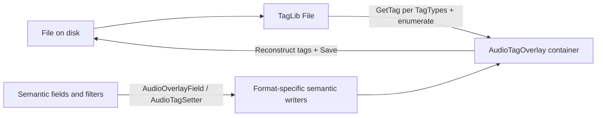

# Audio tags: per-type overlays and frame-aware persistence

## Overview

Phased work: (1) structured overlay + MP3 ID3v1/v2 round-trip and semantic mapping, (2) extend to other TagLib tag types, (3) harden parity with existing filters/commit tests, **(4) derived semantic fields from blocks only** (remove duplicate façade + coalesce), **(5) selective per-type tag deletion**, **(6) frame-level filter targets**. Replaces flat `AudioTagOverlay` + merged `file.Tag` I/O.

## Checklist (phases)

- [ ] **Phase 1:** Structured overlay (ID3v1/v2 blocks, frame inventory, deep equality); `AudioTagPersistence` Read/Apply for MP3 only; semantic projections + mappers; core/tests on MP3 slice.
- [x] **Phase 2:** Add Xiph, Apple/Mp4, Ape, Asf blocks + Read/Apply round-trips; extend mappers per container.
- [x] **Phase 3:** Wire `AudioTagSetter` + all `AudioOverlayField` paths; update `RenamePropertyChangeBuilder` / Commit / RenameList tests; `EmbeddedTagRemover` empty-overlay contract.
- [ ] **Phase 4:** **Derived semantic surface** — `Title`, `Album`, `Year`, etc. are computed from tag blocks (single source of truth); writes go through per-format mappers into frames/atoms/descriptors only; remove redundant stored façade fields and the **façade→block coalesce** step in `AudioTagPersistence.Apply` once all call sites use the mapper layer.
  - **Progress:** Preview paths merge façade edits into native blocks via **`AudioTagPersistence.TryMaterializePreviewFacadeIntoNativeBlocks`**: **`RenameList.Preview`** (end of chain), **`StringTargetFilter`** after each **`AudioOverlayField`** write, and **`AudioTagSetterFilter`** when any semantic field appears in **`options`**. **`AudioTagOverlay.TagBlocksStructurallyEquals`** and **`MergedSemanticFacadesEqual`** split block vs merged-façade comparisons. **`RenamePropertyChangeBuilder`** emits **`AudioTag.Native.*`** summary rows when structured blocks diverge even if merged scalars align. **`AudioTagSemanticSurface.FromOverlay` / `FromNativeBlocksOnly`** implement block-first read projections (façade fill-in only in **`FromOverlay`**). **Public** `MaterializePreviewFacadeIntoNativeBlocks` remains for strict call sites and tests. **StringTargetFilter** and audio format tokens read embedded fields via **`AudioTagSemanticSurface.FromOverlay`** + **`AudioOverlaySemanticFieldStrings`**. Remaining: replace stored façade properties with projections / mapper-only writes; drop redundant `Apply` coalesce when no path still relies on façade-only drift.
- [ ] **Phase 5:** Absent optional blocks + per `TagTypes` removal on Apply; filter/UI hooks for deleting specific tag types or frames (keep AllTags nuclear remover).
- [ ] **Phase 6:** `FilterTarget` variants + preview dispatch for specific frames/fields; Id3v2FieldSetter-style filter.

## Current behavior (problem)

- [`Mfr.Metadata/AudioTagPersistence.cs`](../Mfr.Metadata/AudioTagPersistence.cs) reads and writes only TagLib’s merged [`Tag`](https://github.com/mono/taglib-sharp) via `file.Tag`. That collapses ID3v1 vs ID3v2, hides duplicate/conflicting frames, and drops fields that are not mapped to the common surface (e.g. many TXXX variants, APIC, arbitrary Vorbis keys).
- [`Mfr.Models/Tags/AudioTagOverlay.cs`](../Mfr.Models/Tags/AudioTagOverlay.cs) is a single flat “canonical” snapshot, so the app never represents multiple coexisting tag blocks or raw frame lists.

## Target behavior

1. **Load**: For each relevant `TagTypes` instance present on the opened [`File`](https://github.com/mono/taglib-sharp), materialize a **detached** model of that tag (full ID3v2 frame list where applicable; full Vorbis comment key/value multiset; Apple `ilst` atoms; etc.). No silent merge at the overlay level—keep each block separate so ID3v1 vs ID3v2 remain visible and round-trippable.
2. **Semantic edits** (today’s `Title`, `Album`, [`AudioOverlayField`](../Mfr.Models/Tags/AudioOverlayField.cs), [`AudioTagSetterFilter`](../Mfr.Filters/Audio/AudioTagSetterFilter.cs)): do **not** write through `file.Tag` properties. Instead, apply a **small mapping layer per container** (MP3/ID3v2 → `TIT2`, `TPE1`, …; Vorbis → `TITLE`, `ARTIST`, …; MP4 → `©nam`, `©ART`, …) so the same logical field updates the correct underlying storage for that file’s format(s).
3. **Commit**: [`AudioTagPersistence.Apply`](../Mfr.Metadata/AudioTagPersistence.cs) compares the **full structured overlay** to a fresh read from disk (same as today’s “no-op if equal”), then writes by **reattaching** each tag block to TagLib (clear/replace as needed) and `Save()`.

## Phased delivery

Work is split so each phase is shippable and reviewable; later phases assume the overlay container and equality semantics from **Phase 1**.

- **Phase 1 — MP3 vertical slice:** Structured `AudioTagOverlay` with **ID3v1 + ID3v2** blocks (frame inventory, deep **Clone/Equals**); [`AudioTagPersistence`](../Mfr.Metadata/AudioTagPersistence.cs) **Read/Apply for MP3 only**; **semantic properties** (`Title`, …) as projections + writers targeting ID3v2 (documented precedence vs ID3v1); update [`CommitExecutor`](../Mfr.Core/CommitExecutor.cs) and critical tests (commit, persistence, rename list) for this path. **Outcome:** end-to-end proof without boiling the ocean.

- **Phase 2 — More TagLib tag types:** Add blocks and Read/Apply for **Xiph** (FLAC/Vorbis), **Apple** (MP4), **Ape**, **Asf**, etc.; golden round-trip tests per type. **Outcome:** “all formats” coverage from the product goal.
  - **Status:** Implemented in `AudioTagOverlay` / `AudioTagPersistence` (Xiph and Ape use canonical `SerializedTagBlob` bytes; Apple uses sorted `ilst` text atoms with explicit ordinal equality on `AppleAtomRow`; Asf uses sorted content descriptors; WMA round-trip covered by TagLib# sample fixture `taglib-sharp-sample.wma`). Pure per-format **semantic mappers** without duplicate façade storage are **Phase 4**.

- **Phase 3 — Semantic and pipeline parity:** Ensure [`AudioTagSetterFilter`](../Mfr.Filters/Audio/AudioTagSetterFilter.cs), [`FileMetaPreviewExtensions`](../Mfr.Models/FileMetaPreviewExtensions.cs), formatter tokens, and [`EmbeddedTagRemover`](../Mfr.Filters/Audio/EmbeddedTagRemoverFilter.cs) behave correctly with structured overlay; adjust [`RenamePropertyChangeBuilder`](../Mfr.Core/RenamePropertyChangeBuilder.cs) as needed. **Outcome:** no regressions vs current feature set.
  - **Status:** `AudioTagPersistence.Apply` merges façade fields into loaded per-`TagTypes` blocks (ID3v1/v2, Xiph, Ape, Apple, Asf) before writing so filter/commit paths stay consistent; integration tests cover `AudioTagSetter` commit on FLAC/M4A/WMA plus FLAC semantic-only persistence.

- **Phase 4 — Derived semantic surface (single source of truth):** Eliminate duplicate façade fields on `AudioTagOverlay` in favor of **computed** semantic values from the blocks (or explicit **get** accessors backed by cached projection results invalidated when any block changes). **Writes** (`AudioTagSetter`, `FileMetaPreviewExtensions.SetTargetString`, etc.) call **one mapper layer per container** that updates `TIT2`/`TITLE`/`©nam`/ASF descriptors / … directly in the block models. Then **drop** `_CoalesceSemanticIntoNativeBlocks` (or make it a no-op): `Apply` only serializes blocks + merged-tag façade where TagLib still requires it. **Outcome:** no drift between “what the UI shows” and “what will be written” for semantic fields; **Phase 6** frame tools and `Title` share the same underlying block data.

**Migration notes (Phase 4):**

1. Introduce **read projections** (`GetTitle(overlay)` or properties implemented over blocks) with tests for precedence (MP3: ID3v2 vs ID3v1; multi-container files: define one rule).
2. Replace **direct assignment** to `overlay.Title` in filters/tokens with **mapper setters** (`SetTitle(overlay, value)`) that patch the right frame/atom rows.
3. Update **equality** for commit/preview: semantic scalars either disappear from `Equals` (compare blocks only) or compare **materialized** projections from both sides consistently.
4. Clarify **null/empty/absent** semantics when the only storage is in frames (e.g. “clear title” = remove or empty the `TIT2`/`TITLE` field per policy).
5. Remove coalesce step once **no code path** relies on stored façade-only edits.

- **Phase 5 — Selective deletion:** Optional absent blocks = **remove that TagTypes** on disk; **frame-level** removal inside ID3v2 list; optional dedicated filter or UI later; **EmbeddedTagRemover** stays **all tags**. **Outcome:** user can drop e.g. ID3v1 only. Easier once **Phase 4** removes duplicate façade fields so “drop this block” does not fight parallel `Title`/`Album` scalars.

- **Phase 6 — Frame-level targets:** New [`FilterTarget`](../Mfr.Models/Targets.cs) types + preview get/set for specific frames/keys; **Id3v2FieldSetter**-style filter. **Outcome:** power-user editing; reads/writes go to the same structures **Phase 4** uses for semantic projection (no parallel truth).

**Phases 4–6 — order and dependencies:** Phases **1–2** supply addressable frames and per–`TagTypes` blocks; **Phase 1** also anchors the nullable-block model and Apply loop; **2–3** extend containers and pipeline parity. **Phase 4** (derived semantics) is **before Phase 5** (selective deletion): single source of truth makes “absent block ⇒ remove tag type” and **equality** consistent. **Phase 6** (frame-level targets) follows **Phase 4** so `AudioTagSetter` / projections and `Id3v2FrameTarget`-style filters share one model; it can ship after **Phase 5** or in parallel once blocks are addressable, but fits naturally after **4–5**.

## Data model (`Mfr.Models`)

Introduce a **structured** `AudioTagOverlay` (name can stay for less churn) that:

- Holds a set of **tag blocks** keyed by kind, e.g. `Id3v1Tag?`, `Id3v2Tag?` (list of frames with id + encoding + payload + frame-specific metadata TagLib exposes), `VorbisCommentTag?` (`FIELD` → list of values), `AppleTagSnapshot?` / MP4 atom model, plus blocks for other `TagTypes` you plan to support in v1 (ASF, APE, etc.).
- Implements **`Clone`**, **`Equals`**, **`GetHashCode`** with **deep** structural equality (required by [`CommitExecutor`](../Mfr.Core/CommitExecutor.cs), [`RenameItem.HasPreviewChanges`](../Mfr.Models/RenameItem.cs), and tests).

**Semantic surface (target):** `Title`, `Album`, `Year`, `Performers`, … must **not** be independent stored fields that can drift from `Id3v2` / `Xiph` / `Apple` / etc. They should be **projections** with documented **read precedence** (per format and when multiple blocks disagree—see [design §9](magic-file-renamer-design.md)) and **writes** that mutate only the underlying blocks (via shared mappers used from [`FileMetaPreviewExtensions`](../Mfr.Models/FileMetaPreviewExtensions.cs), filters, and [`AudioTagPersistence`](../Mfr.Metadata/AudioTagPersistence.cs)).

**Transitional state (today):** `AudioTagOverlay` still holds both **blocks** and **duplicate façade scalars**; [`AudioTagPersistence.Apply`](../Mfr.Metadata/AudioTagPersistence.cs) runs **`_CoalesceSemanticIntoNativeBlocks`** so preview edits to façade strings stay consistent with serialized blobs before save. **Phase 4** removes that bridge by making façade reads/writes go through blocks only.

**Precedence policy** (document in XML on the type): when ID3v1 and ID3v2 disagree, projections should follow product rules aligned with [design §9](magic-file-renamer-design.md) (e.g. prefer ID3v2 for display; optionally mirror writes to ID3v1 when within limits—spell out one rule and apply consistently).

**Binary frames:** For “all tags in the overlay,” include **APIC** / other binary frames in the ID3v2 model **for fidelity**. If memory becomes an issue, a later optimization can lazy-load or cap album-art size; not required for the first correct design.

## Metadata (`Mfr.Metadata`)

- **Read**: Open `TagLib.File`, discover tags via `GetTag(TagTypes.X, create: false)` (and TagLib patterns for “has tag”) for each supported `TagTypes`; populate the overlay blocks by **enumerating** native structures (`Id3v2.Tag` frames, `XiphComment` fields, etc.) rather than copying only `file.Tag.*` properties.
- **Apply**: Build TagLib tags from the overlay blocks; assign to the file (replace tag types that the preview changed; align with design intent of strip-vs-update—[`EmbeddedTagRemover`](../Mfr.Filters/Audio/EmbeddedTagRemoverFilter.cs) still clears via `RemoveTags(TagTypes.AllTags)` + empty overlay).
- **Semantic write helpers** (private static in metadata or a dedicated internal type): `SetTitleForFile(TagLib.File, …)` style that branches on which tag blocks exist / file format, mirroring TagLib’s own mapping rules but driven by **your** overlay blocks.

## Ripple updates (non-exhaustive but required)

- [`RenamePropertyChangeBuilder.cs`](../Mfr.Core/RenamePropertyChangeBuilder.cs): today it diffs flat overlay fields; either keep **semantic** lines only (simplest) or extend to show per-block/frame diffs later. After **Phase 4**, semantic rows should reflect **projected** values (or block-level deltas only).
- [`FileMeta.cs`](../Mfr.Models/FileMeta.cs): still holds one `AudioTagOverlay` per snapshot; clone semantics must be deep.
- Tests: expand [`AudioTagPersistenceTests.cs`](../Mfr.Tests/Metadata/AudioTagPersistenceTests.cs) with **golden** round-trip fixtures (MP3 with ID3v1+v2, FLAC with extra Vorbis keys, one MP4 sample if feasible) plus projection tests (semantic `Title` reads expected frame). Update any tests that assumed equality of `new AudioTagOverlay()` as “empty tags” if the empty state is now structural.
- **Phase 4:** replace direct `AudioTagOverlay.Title = …` in filters/tokens/tests with mapper entry points; add tests that **projection** matches **frame** content after each container’s write path.

## Relation to design doc

- Brings implementation closer to **§9–10** and **§7.4** (frame-level thinking). The documented **`Id3v2FieldSetter`** remains a natural follow-up: once ID3v2 frames are first-class in the overlay, that filter becomes a thin mutator on the `Id3v2` block rather than a special-case.

### Future: apply / filter targets for specific frames (Phase 6)

**Does this change the core design?** No. The structured overlay is exactly what you need so that **semantic** targets (`AudioOverlayField`) and **frame-level** targets can coexist:

- **Frame targets** become new [`FilterTarget`](../Mfr.Models/Targets.cs) records, for example `Id3v2FrameTarget(frameId, description?, language?)` for text frames that need disambiguation (`COMM`, `USLT`, `TXXX`), or `VorbisFieldTarget(fieldName)` for arbitrary Vorbis keys, and an Apple/MP4 atom target if ever needed.
- **Preview I/O**: Extend the same `GetTargetString` / `SetTargetString` dispatch in [`FileMetaPreviewExtensions`](../Mfr.Models/FileMetaPreviewExtensions.cs) (or a dedicated internal helper) to read/write **directly** into the appropriate tag block’s frame list / key-value list. Easiest once **Phase 4** exposes projections and mapper writes from the same blocks.
- **Commit path**: Unchanged in principle—`AudioTagPersistence.Apply` still serializes the **whole overlay**; frame targets only mutate different properties on that overlay before commit.

**Design constraint to keep in mind now:** Model ID3v2 (and Vorbis/MP4) so that **individual frames or values are addressable** (not only a merged map keyed by a single string). For example, support multiple `COMM`/`USLT`/`TXXX` instances by storing enough metadata (language, description, owner id) to match TagLib’s frame identity.

This ships in **Phase 6**; it does not require redesigning the overlay again if Phases 1–2 already store an enumerated frame list per block.

### Deletion: entire specific tag blocks (Phase 5)

**Requirement:** Besides “clear this semantic field” and [`EmbeddedTagRemover`](../Mfr.Filters/Audio/EmbeddedTagRemoverFilter.cs) (all embedded tags), support removing **whole tag types** on a file—for example strip **ID3v1 only** while keeping **ID3v2**, or remove **Vorbis comments** but leave other containers untouched, as the format allows.

**Design impact:** Fits the structured overlay if each block is **optional** (`Id3v1Tag?`, `Id3v2Tag?`, …) and **absent** means “do not write this tag type on commit” (equivalent to `RemoveTags(that TagTypes)` or replacing with no tag for that slot). Distinguish carefully:

- **Block missing / null in overlay after user action “delete this tag”:** persist as **removal** of that entire embedded blob on disk.
- **Block present but with no frames / empty:** still a valid state if the format allows an empty tag (usually prefer treating as removal—follow TagLib semantics per type).

**Apply semantics:** When building the file to save, for each `TagTypes` the overlay tracks: if the preview says that block is **removed**, call the appropriate TagLib removal for that type only; do not rely on `file.Tag = null` for everything.

**Product / follow-up:** A dedicated filter or UI action (“Remove ID3v1”, “Remove Vorbis comments”) sets the preview overlay to drop that block; [`EmbeddedTagRemover`](../Mfr.Filters/Audio/EmbeddedTagRemoverFilter.cs) remains the **nuclear** option (`TagTypes.AllTags` + fully empty overlay). **Frame-level delete** (single `APIC` frame) is the same idea at finer granularity: remove one frame from the `Id3v2` list in the overlay; commit writes the updated frame list.

### Risk note

Scope is bounded by **Phases 1–2** (MP3 first, then extend containers). **Phase 4** may replace stored semantic fields with projections or mapper APIs—plan filter/token/test migration when starting Phase 4; prefer removing dual façade/block state rather than preserving legacy assignment paths (see [refactor-no-legacy-compat](../.cursor/rules/refactor-no-legacy-compat.mdc)).
