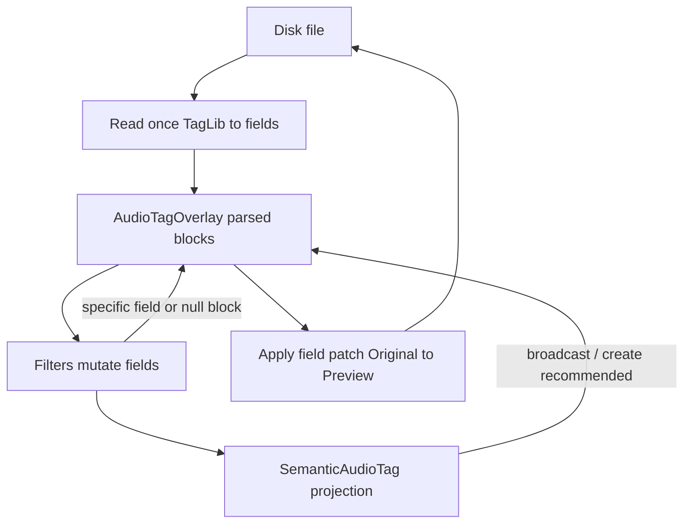

# Audio tag model

How Magic File Renamer represents, mutates, and persists embedded audio tags: parsed per–`TagTypes`
fields in memory, filter mutation of `AudioTagOverlay`, and Original→Preview field-patch Apply via
TagLibSharp.

Product/UI sketches and filter inventory live in [magic-file-renamer-design.md](magic-file-renamer-design.md)
(§9 and Group 6). Folder layering is in [mfr-folder-layering.md](mfr-folder-layering.md).

## Design principles

1. **In-memory model = parsed fields**, not binary tag blobs.
2. **No Extras bag.** Unmodeled content (APIC, unknown Xiph keys, unknown ASF descriptors) stays on disk;
   Apply never touches it unless the whole tag type is removed or emptied of modeled fields.
3. **Apply = field patch** (diff Original vs Preview). Never default to `tag.Clear()` + rebuild. Never
   `Clear()` ASF tags.
4. **No dual write** to the merged `file.Tag` façade once per-type writers are in use.
5. **Generic read** priority: Id3v2 → Id3v1 → Xiph → Ape → RiffInfo → Apple → Asf.
6. **Generic write:** update all **present** capable blocks; if **zero** blocks, create the container’s
   **recommended** block, then set fields. Do **not** invent sibling types (e.g. do not add Id3v1 because
   Id3v2 exists).
7. **Clear field:** empty / `""` / whitespace → **absent** (remove map entry). Numerics clear to `null`,
   never `0`.
8. **Clear tag type:** block property = `null`. Empty modeled block pruned to `null` before diff
   (intentional: also drops on-disk APIC on that type).
9. **Nuclear strip:** `TagRemover` with `options.all` + `StripAllEmbeddedTagsOnCommit` → `RemoveTags(AllTags)`.
10. **Id3v2 version:** create → **2.3** (`Version = 3`); patch → **preserve** read version;
    v2.4-only frame into v2.3 → **PreviewError** (no silent upgrade).
11. **Multi-instance frames** (`COMM` / `USLT` / `TXXX`): identity = FrameId + language/description as
    applicable. Never wholesale `RemoveFrames(id)` when clearing one instance. Generic Comment/Lyrics
    touch **primary** only (empty description + default language).
12. **Unsupported specific target** for container → PreviewError (no silent skip).
13. **Byte-identical round-trip is not a goal**; field/semantic fidelity is.

## Layer map

| Concern | Project / type |
|---|---|
| Overlay + block records | `Mfr.Models` — `AudioTagOverlay`, `Id3v1TagData`, `Id3v2TagData`, `XiphTagData`, … |
| Semantic projection / merge / field get-set | `Mfr.Models` — `SemanticAudioTag`, `AudioTagSemanticMerge`, `AudioTagOverlay.MergeSemantic`, `SemanticFields`, `AudioOverlayBlockFieldIo`, `AudioOverlayTargetIo`, capability `AudioTagContainerPolicy` |
| TagLib I/O and patch | `Mfr.Metadata` — `TagLibFileReader` (one preview open → tags + media), `AudioTagPersistence` (orchestration / Apply), `Mfr.Metadata.TagFields` (`*TagFields` per block, plus `TagFieldDiff`), `AudioTagContainerDetector` |
| Shared text rules | `Mfr.Utils` — `DelimitedText` (`;`-list split/join, trim), `OrdinalSequence` (value-array compare/equality), `StringExtensions.TrimmedOrNull` |
| Filters / targets | `Mfr.Filters` — `AudioTagSetter`, removers, `StringTargetFilter` + `EnsureTargetReady` then `FileMeta` get/set |
| Commit | `Mfr.Engine` — `CommitExecutor` (move → strip-all flag → Apply) |

The first TagLib preview open — tags via `EnsureEmbeddedTagsLoaded` or media via
`EnsureMediaPropertiesLoaded` — maps both caches from one `TagLibFileReader.Read`. The sibling
cache is filled only when that load flag is not already set, so seeded unit-test overlays are not
overwritten. Commit Apply / strip still opens again to write. Filters do not reopen the file
mid-chain.

Each block type owns one `*TagFields` class under `Mfr.Metadata/TagFields/` exposing `Read(file)` and
`Apply(file, original, preview)`, so its modeled keys, read rules, and patch rules sit together.
`AudioTagPersistence` only decides which blocks to visit; `TagFieldDiff` holds the shared key-diff loop.

Text normalization is shared with `Mfr.Models` through `Mfr.Utils`: `TrimmedOrNull()` for blank→absent,
`DelimitedText` for the `;`-delimited multi-value convention (`Split` / `Join` / `JoinOrNull`), and
`OrdinalSequence` for value-array ordering and equality.

## Overlay model

`AudioTagOverlay` holds optional blocks. A **non-null** block means that tag type is present in the logical
tag. `ContainerFormat` is stamped at Read and preserved across `Clone` / `ClearAllBlocks` (so strip-then-set
can still create the recommended block). It is **excluded** from equality (dirty checks compare tag content).

| Block | Shape |
|---|---|
| **Id3v1** | Scalars: Title, Artist, Album, Year, Comment, Track, Genre |
| **Id3v2** | `byte Version` + modeled text frames. Singletons keyed by FrameId; multi-instance by FrameId + language/description |
| **Xiph** | Known-key multimap (covers `SemanticAudioTag` fields). Unknown keys left on disk |
| **Ape** | Known text key map. Read folds alias spellings (`ALBUMARTIST` → `Album Artist`) and splits `number/total` pairs into `Track`/`TrackCount` and `Disc`/`DiscCount`; item lookup is case-insensitive |
| **RiffInfo** | INFO key → string map. Standard fourCCs (`INAM`, `IPRD`, `IART`, `IGNR`, `ICMT`, `ICOP`, `ICRD`, `ITRK`) read/written by key, not through TagLib's `InfoTag` façade properties (those map to non-standard ids such as `DIRC` for album) |
| **Apple** | Text atom rows (track/disc/BPM binary atoms not modeled yet) |
| **Asf** | Content Description fields + extended descriptors (see below) |

### Presence and pruning

| Action | In memory | Apply |
|---|---|---|
| Clear field | Remove entry / set null (no `""`) | Remove frame/key or write empty Id3v1 scalar |
| Clear all modeled fields on a block | Prune block → `null` | `RemoveTags(that type)` (APIC on that type goes too) |
| Remove tag type (filter) | Set block `null` | Same |
| Strip all | `ClearAllBlocks()` + strip flag | `RemoveTags(AllTags)` then write any recreated recommended block |

Id3v1: single-field clear writes an empty scalar; clearing **all** fields prunes/removes the trailer.

## Container policy

`Mfr.Models.Tags.AudioTagContainerPolicy` maps containers to supported blocks and a recommended create target
(capability API). TagLib-backed detection lives on `Mfr.Metadata.AudioTagContainerDetector` (`Detect` / `DetectFrom`):

| Container | Supported blocks | Recommended if empty |
|---|---|---|
| MPEG/MP3 | Id3v1, Id3v2 | Id3v2 v2.3 |
| FLAC | Xiph, Ape | Xiph |
| Ogg/Opus | Xiph | Xiph |
| MP4/M4A | Apple | Apple |
| WMA/ASF | Asf | Asf |
| WAV/RIFF | RiffInfo | RiffInfo |
| APE | Ape | Ape |

Format-specific filters/targets call `EnsureAudioTagBlockSupported` → PreviewError when unsupported.

## Semantic projection and writes

`SemanticAudioTag` is the cross-format common-field view (`Title`, `Album`, `Performers`, …,
`BeatsPerMinute`, `Conductor`, MusicBrainz/MusicIP/Amazon catalog IDs) in `Mfr.Models`.
Key maps for catalog IDs live in `AudioCatalogFieldMaps` (ID3v2 `TXXX` descriptions, Xiph/APE keys, ASF
descriptors). Apple freeform atoms and RIFF INFO are not mapped for catalog IDs.

- **Read:** `SemanticAudioTag.FromOverlay` / `overlay.Semantic()` using the priority above.
- **Write:** `AudioTagOverlay.MergeSemantic` broadcasts onto every present block (empty→absent,
  empty modeled blocks prune). If no blocks exist, creates the recommended empty block from
  `ContainerFormat` first.

## Format-specific targets

String-target filters (Formatter, Replacer, …) can address one native field via
`EnsureTargetReady` (load/capability) → `FileMeta.GetTargetString` / `SetTargetString` →
`AudioOverlayTargetIo`:

| `targetType` | Addresses |
|---|---|
| `SemanticAudioField` | Generic semantic field (broadcast write) |
| `Id3v1Field` | One Id3v1 scalar |
| `Id3v2Frame` | One modeled frame (`frameId`, optional `language` / `description`) |
| `XiphField` | One Xiph key |

Dedicated audio filters:

- `AudioTagSetter` — multi-field semantic set (no target)
- `Id3v2FieldSetter` — one modeled ID3v2 frame (`frameId`, `text`, optional `onlyIfEmpty` / `language` / `description`); no target. String filters with an `Id3v2Frame` target remain valid for transforms without `onlyIfEmpty`.
- `TagRemover` — null selected blocks (`options.blocks`), or clear all + strip on commit (`options.all`)
- `SetFromFreeDB` — still product-scoped separately

## ID3v2 rules

- **Create:** `Version = 3` (ID3v2.3).
- **Patch:** preserve on-disk version; do not upgrade or downgrade.
- **Modeled singleton text frames** (`Id3v2TagFields`): `TALB`, `TBPM`, `TCOM`, `TCON`, `TCOP`,
  `TDAT`, `TDEN`, `TDOR`, `TDRC`, `TDRL`, `TDTG`, `TENC`, `TEXT`, `TFLT`, `TIPL`, `TIT1`, `TIT2`,
  `TIT3`, `TKEY`, `TLAN`, `TLEN`, `TMED`, `TMOO`, `TOAL`, `TOFN`, `TOLY`, `TOPE`, `TORY`, `TOWN`,
  `TPE1`, `TPE2`, `TPE3`, `TPE4`, `TPOS`, `TPUB`, `TRCK`, `TRDA`, `TRSN`, `TRSO`, `TSIZ`, `TSOA`,
  `TSOP`, `TSSE`, `TSST`, `TYER`. Plus multi-instance `COMM` / `USLT` / `TXXX`. Unmodeled frames
  (e.g. `APIC`, `UFID`, `USER`, `W*`) stay on disk untouched by field-patch.
- **v2.4-only frames** (`TDRC`, `TMOO`, `TSST`, …): `Id3v2FrameVersionPolicy.EnsureCompatible` at
  `AudioOverlayBlockFieldIo.SetId3v2FrameString` → PreviewError on v2.3 tags.
- **Generic year:** writes `TYER` on v2.3, `TDRC` on v2.4.
- **COMM / USLT / TXXX:** remove-one by identity; primary = empty description (language defaults to `eng` on create).

## ASF rules

Overlay rows use TagLib-canonical names (`AsfDescriptorNames`):

| Semantic field | Overlay name | TagLib surface |
|---|---|---|
| Title | `Title` | Content Description Object |
| Performers | `Author` | Content Description Object |
| Copyright | `Copyright` | Content Description Object |
| Comment | `WM/Text` | Extended descriptor |
| Album, Genre, … | `WM/AlbumTitle`, … | Extended descriptors |
| TrackCount | `TrackTotal` | Extended descriptor |
| Disc / DiscCount | `WM/PartOfSet` (`disc` or `disc/count`) | Extended descriptor |
| BeatsPerMinute | `WM/BeatsPerMinute` | Extended descriptor |
| Conductor | `WM/Conductor` | Extended descriptor |

Write/patch routes Content Description fields through TagLib façade properties, never
`AddDescriptor("WM/Title")`-style non-canonical names.

## RIFF INFO rules

Read, write, and patch address INFO chunks by key (`InfoTag.GetValuesAsStrings` / `SetValue` / `RemoveValue`),
matching the Xiph and APE paths. TagLib's `InfoTag` façade properties are not used because they map several
common fields to non-standard ids (Album→`DIRC`, Performers→`ISTR`, Track→`IPRT`, TrackCount→`IFRM`), which
other taggers do not read.

| Semantic field | INFO key |
|---|---|
| Title | `INAM` |
| Album | `IPRD` |
| Performers | `IART` |
| Genre | `IGNR` |
| Comment | `ICMT` |
| Copyright | `ICOP` |
| Year | `ICRD` |
| Track | `ITRK` |

A chunk holds a single string, so multi-value semantics stay in that string verbatim (`Alice;Bob` round-trips
unchanged). Unknown INFO keys are left on disk.

## Apply algorithm

Inputs: destination path, **Original** overlay (session snapshot), **Preview** overlay.

1. Open TagLib file on destination (after path move).
2. If `StripAllEmbeddedTagsOnCommit`: `RemoveTags(AllTags)` first; Apply baseline becomes an empty overlay.
3. Per tag type:
   - Original present, Preview null → `RemoveTags(type)`
   - Original null, Preview present → `GetTag(type, create: true)` + write all Preview fields
   - Both present → diff modeled fields; set/add/remove **only** diffs
4. `Save()`. No merged `file.Tag` semantic coalesce.

`RenamePropertyChangeBuilder` emits field-level change rows from the same Original→Preview shape.

## Filters and commit order

1. Lazy load tags once (`EmbeddedTagsLoadAttempted`).
2. Preview filters mutate Preview overlay.
3. Commit: filesystem move → optional nuclear strip → `AudioTagPersistence.Apply(Original, Preview)`.
4. After commit, clear embedded-tag cache for re-preview.

`TagRemover` with `all: true` uses `ClearAllBlocks()` so `ContainerFormat` survives for a later generic write in the
same preview chain.

## Out of scope

- APIC / album-art editing or UI
- FreeDB population beyond the existing filter sketch
- GUI ID3 editor panel
- Explicit “upgrade tag to v2.4” filter (default is PreviewError)
- Cloning tags file A → B with binary fidelity
- Replacing TagLibSharp

## Known limitations

- **Art-only / modeled-empty tags:** block readers that find no modeled text may still surface a null
  block even when `TagTypesOnDisk` includes that type, which weakens selective remove for APIC-only tags.
- **Apple track/disc/BPM:** binary atoms (`trkn` / `disk` / `tmpo`) are not in the text-atom overlay;
  generic Track/Disc/BPM on M4A may not round-trip. Conductor uses the text `cond` atom.
- **WAV/RIFF:** TagLib may write an ID3v2 chunk on save that the overlay does not model; removing
  `riffInfo` alone can leave façade-readable title data.
- **Unknown keys** on Xiph/Ape survive title-only patches by omission; they are not editable in the overlay.

## Key entry points

| Area | Paths |
|---|---|
| Overlay | `Mfr.Models/Tags/AudioTagOverlay.cs`, block types under `Tags/{Id3v1,Id3v2,Xiph,…}` |
| Semantic / field I/O | `Mfr.Models/Tags/SemanticAudioTag.cs`, `AudioTagSemanticMerge.cs`, `SemanticFields.cs`, `AudioCatalogFieldMaps.cs`, `AudioOverlayBlockFieldIo.cs`, `AudioOverlayTargetIo.cs` |
| Persistence | `Mfr.Metadata/AudioTagPersistence.cs`, `Mfr.Metadata/TagFields/` (`*TagFields`, `TagFieldDiff`) |
| Shared text rules | `Mfr.Utils/DelimitedText.cs`, `Mfr.Utils/OrdinalSequence.cs`, `Mfr.Utils/StringExtensions.cs` |
| Policy | `Mfr.Models/Tags/AudioTagContainerPolicy.cs` (capability), `Mfr.Metadata/AudioTagContainerDetector.cs` (detect), `Id3v2FrameVersionPolicy.cs`, `AsfDescriptorNames.cs` |
| Filters | `Mfr.Filters/Audio/*`, `StringTargetFilter.cs`, `Mfr.Models/Filters/Targets.cs` |
| Engine | `Mfr.Engine/Commit/CommitExecutor.cs`, `Mfr.Engine/Preview/RenamePropertyChangeBuilder.cs` |
| Tests | `Mfr.Tests/Metadata/*`, `Mfr.Tests/Models/Filters/Audio/*`, `RenameListCommitTests` embedded-tag cases |
