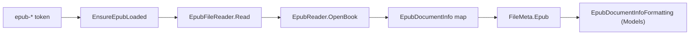

# EPUB metadata model

How Magic File Renamer reads EPUB package Dublin Core Info for `<epub-*>` formatter tokens: a lazy
VersOne.Epub `OpenBook`, a mapped `EpubDocumentInfo` snapshot on `FileMeta`, and empty vs
PreviewError rules.

Product/UI sketches live in [magic-file-renamer-design.md](magic-file-renamer-design.md). Folder
layering is in [mfr-folder-layering.md](mfr-folder-layering.md). This cache is read-only (no OPF
write / Apply path in v1). PDF Info, image/EXIF, and TagLib audio stay on separate caches.

## Design principles

1. **Read-only.** EPUB package metadata is never written on commit. There is no Apply / OPF rewrite
   path in this slice.
1. **Lazy, one open.** The first `<epub-*>` token on a file row in a Preview run opens the package
   once via `EpubReader.OpenBook` (default STRICT), maps Dublin Core fields to `EpubDocumentInfo`,
   and caches it. Later tokens in the same cycle reuse it. Commit clears the cache so the next
   preview reloads from disk. Do **not** use `ReadBook` (loads full content).
1. **DTO only.** Raw VersOne types are not stored on `FileMeta`. Mapping discards them after dispose.
1. **Original snapshot.** Tokens read `item.Original.Epub` (disk-backed facts), not Preview.
1. **Readable EPUBs only.** Empty tokens apply only after a successful open when a field is missing
   (`null`). Non-EPUB, corrupt, or DRM open failure → PreviewError (`EpubReaderException` family,
   `InvalidDataException` for non-ZIP, or IO). Missing DC on a successful open is an **empty**
   field, not PreviewError.
1. **First primary string.** Multi-value DC lists take the **first** non-blank entry after normalize
   (blank → null; collapse `\r`/`\n` to space; trim). Never join creators/subjects in v1.
1. **Literal Date.** `Date` is stored as `string?` (first `dc:date` text), not `DateTimeOffset?` —
   EPUB dates are often year-only / incomplete. Token and Grid both use optional-text formatting.
1. **Identifier preference.** If `Package.UniqueIdentifier` is set, prefer the `Identifiers` entry
   whose `Id` matches; else first non-blank `Identifiers[].Identifier`.

## Layer map

- **Snapshot record** — `Mfr.Models` — `EpubDocumentInfo` on `FileMeta.Epub`
- **Disk read / map** — `Mfr.Metadata` — `EpubFileReader`
- **Lazy load (formatter preview)** — `Mfr.Filters` — `RenameItemEpubExtensions.EnsureEpubLoaded`
- **Rename List grid** — eager-loads via `RenameList.EnsureMetadataLoaded`
  (`RenameListMetadataRequirement.Epub`); attempt/error state shares the
  `RenameItem` / `RenameListMetadataBuckets` single-flag API with TagLib, Image, and PDF
- **Shared field enum + display** — `Mfr.Models` — `EpubDocumentField` and
  `EpubDocumentInfoFormatting` under `RenameList/Fields/Epub/`;
  `Format(..., PropertyDisplayContext)` with tokens using `Token` and Rename List
  columns using `Grid` (`PropertyDisplayContext` at `RenameList/`). All fields are optional text
  (no PDF-style date fork).
- **Tokens** — `Mfr.Filters` — `EpubDocumentTokenBase` (`epub-*`), FormatEditor group
  `Document\Epub`
- **Commit cache clear** — `Mfr.Engine` — `RenameList.Commit` calls `ClearMetadataCaches` →
  `ClearEpubCache`

## Cache lifetime

`FileMeta.Epub` is `null` until the first EPUB token load. `RenameItem.SetEpubDocumentInfo` assigns
the same record reference to Original and Preview. `EpubLoadAttempted` / `EpubLoadError` track the
cycle. `ClearEpubCache` nulls the snapshot and resets load state.

`FilterTestHelpers.CreateRenameItem` marks EPUB load as already attempted on file rows so seeded unit
tests never hit disk. Integration-style tests construct an unmarked `RenameItem` pointing at a real
file.

## Empty vs PreviewError

- **Directory row** — `InvalidOperationException` from ensure → PreviewError
- **Missing / relative path** — `ArgumentException` from the reader → PreviewError
- **Non-EPUB / corrupt / DRM open failure** — Propagated VersOne `EpubReaderException` (or
  `InvalidDataException` when the file is not a ZIP/EPUB archive) → PreviewError
- **Successful open, missing DC field** — That `epub-*` token expands **empty**, not an error

## Mapped fields

| Field       | Source                                                                              |
| ----------- | ----------------------------------------------------------------------------------- |
| Title       | First non-blank `Metadata.Titles[].Title`                                           |
| Creator     | First non-blank `Metadata.Creators[].Creator` (display name / author, not `FileAs`) |
| Publisher   | First non-blank `Metadata.Publishers[].Publisher`                                   |
| Language    | First non-blank `Metadata.Languages[].Language`                                     |
| Date        | First non-blank `Metadata.Dates[].Date` (literal string)                            |
| Identifier  | `UniqueIdentifier` id match when set, else first non-blank identifier               |
| Subject     | First non-blank `Metadata.Subjects[].Subject`                                       |
| Description | First non-blank `Metadata.Descriptions[].Description`                               |

**Creator ≠ PDF Creator:** EPUB `Creator` is Dublin Core author (person/org). PDF Info Creator is the
creating application. Display formatting is shared via Models `EpubDocumentInfoFormatting` (optional
text for Token and Grid).
