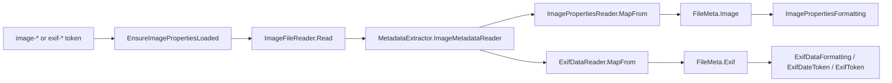

# Image metadata model

How Magic File Renamer reads raster image facts (dimensions, bit depth, DPI, frame count, format)
and EXIF (camera fields, DateTaken, flattened extended tags) for `<image-*>` and `<exif-*>`
formatter tokens: a lazy MetadataExtractor open, mapped `ImageProperties` and `ExifData`
snapshots on `FileMeta`, and empty vs PreviewError rules.

Product/UI sketches live in [magic-file-renamer-design.md](magic-file-renamer-design.md) (§7.7, §7.8).
Folder layering is in [mfr-folder-layering.md](mfr-folder-layering.md). TagLib photo fields
(`<media-photo-width>` / `<media-photo-height>`) are a separate cache; see media tokens in
[Formatter.md](../Mfr.Filters/docs/Formatting/Formatter.md). TagLib Image Tag (`<imagetag-*>`)
is a later slice and is not this cache.

## Design principles

1. **Read-only.** Image properties and EXIF are never written on commit. There is no Apply path in this slice.
1. **Lazy, one open.** The first `<image-*>` or `<exif-*>` token on a file row in a Preview run opens the
   file once, maps directories to `ImageProperties` **and** `ExifData`, and caches both records.
   Later tokens in the same cycle reuse them. Commit clears the cache so the next preview reloads from disk.
1. **DTO only.** Raw MetadataExtractor `Directory` lists are not stored on `FileMeta`. Mapping discards them.
   Extended EXIF is flattened into `ExifData.TagToDescription` (string dictionary) at map time.
1. **Original snapshot.** Tokens read `item.Original.Image` and `item.Original.Exif` (disk-backed facts), not Preview.
1. **Mapped rasters only.** Empty tokens apply only after a successful allowlist map when a field is
   missing (`0` / null). Anything that is not JPEG, PNG, GIF, BMP, TIFF, ICO, or WebP is PreviewError —
   including types MetadataExtractor will open (MP3, WAV, MP4, HEIF, RAW, …). Missing EXIF on a mapped
   raster is an **empty** snapshot, not PreviewError. PNG/TIFF/WebP with EXIF are supported (not JPEG-only).
1. **Separate from TagLib.** `<media-photo-*>` stays on the TagLib `FileMeta.Media` cache. `<image-*>`
   and `<exif-*>` values may differ from TagLib/GDI+.

## Layer map

- **Snapshot records** — `Mfr.Models` — `ImageProperties` on `FileMeta.Image`; `ExifData` on `FileMeta.Exif`
- **Disk read / raster + EXIF map** — `Mfr.Metadata` — `ImageFileReader`, `ImagePropertiesReader`, `ExifDataReader`
- **Lazy load (formatter preview)** — `Mfr.Filters` — `RenameItemImagePropertiesExtensions.EnsureImagePropertiesLoaded`
- **Rename List grid** — eager-loads image buckets for visible columns and Auto-Sort keys via `RenameList.EnsureMetadataLoaded`
- **Tokens**
  - `Mfr.Filters` — `ImagePropertyTokenBase` (`image-*`); `ExifPropertyTokenBase`, `ExifDateToken`, `ExifToken`
- **Commit cache clear** — `Mfr.Engine` — `RenameList.Commit` calls `ClearMetadataCaches`

## Cache lifetime

`FileMeta.Image` and `FileMeta.Exif` are `null` until the first image or EXIF token load.
`RenameItem.SetImageProperties` / `SetExifData` assign the same record reference to Original and Preview
(clone shares them the same way as `Media`). One load flag (`ImagePropertiesLoadAttempted`) covers both
caches. `ClearImagePropertiesCache` nulls both.

`FilterTestHelpers.CreateRenameItem` marks image load as already attempted on file rows so seeded unit
tests never hit disk. Integration-style tests construct an unmarked `RenameItem` pointing at a real file.

## Empty vs PreviewError

- **Directory row** — `InvalidOperationException` from ensure → PreviewError
- **Missing / relative path** — `ArgumentException` from the reader → PreviewError
- **Unknown format / ME processing or IO failure (e.g. `.txt`)** — Propagated ME exception → PreviewError
- **ME opens a non-allowlist type (MP3, WAV, MP4, …)** — `InvalidOperationException` naming the type → PreviewError
- **Mapped raster, missing image field (no DPI, WebP bit depth, `0` dims)**
  - That `image-*` token expands **empty**, not an error
- **Mapped raster, missing EXIF / missing EXIF field** — That `exif-*` token expands **empty**, not an error

## Mapped image fields (5a)

Format-native directories first. EXIF IFD is not used for width/height except TIFF (IFD0). DPI may use
JFIF, then EXIF IFD0, then PNG pHYs, then BMP pixels/metre, converted to dots per inch. Bit depth is
total bits per pixel where possible (typical JPEG `8×3 = 24`), not JPEG sample precision alone.

Frame count: GIF/ICO count per-image directories; TIFF counts dimension-bearing IFD0s (not thumbnails);
JPEG/PNG/BMP/WebP are `1` when width or height is known.

## Mapped EXIF fields (5b)

Text and camera fields use MetadataExtractor `GetDescription(tag)`, then `\n` → space and trim; blank
becomes null. That keeps display strings such as `1/60 sec`, `f/8.0`, `50 mm`.

- **DateTaken**
  - Directory: `ExifSubIfdDirectory`
  - Tag: `TagDateTimeOriginal` (36867) via `TryGetDateTime` only; `DateTimeKind.Unspecified`; no fallback to
    DateTimeDigitized or IFD0 DateTime
- **Make / Model / Artist / Description** — `ExifIfd0Directory`: Make / Model / Artist / Image Description
- **Title / Subject / Author / Keywords / Comments**
  - Directory: `ExifIfd0Directory`
  - Tag: Windows XP Title / Subject / Author / Keywords / Comment
- **Exposure / FNumber / Iso / FocalLength / FocalLength35mm / UserComment**
  - Directory: `ExifSubIfdDirectory`
  - Tag: Exposure Time / F-Number / ISO Speed Ratings / Focal Length / Focal Length 35 / User Comment

JPEG Tag extras (Title, Subject, Author, Keywords, Comments, Artist, UserComment, Description) are
stored for later columns and reachable via `<exif:Exif,…>` / `<exif:ExifSub,User Comment>`. There are
no dedicated `<exif-title>` tokens in this slice.

### Source aliases (`TagToDescription`)

Only directories that map to a source alias are flattened. For each tag with a non-blank description,
two keys are stored (existing keys are not overwritten): `{Alias}/{Tag.Name}` and `{Alias}/{Tag.Type}`
(decimal id, e.g. `Exif/271`). Alias table (case-insensitive):

| Alias      | Directory                                                      |
| ---------- | -------------------------------------------------------------- |
| `Exif`     | `ExifIfd0Directory`                                            |
| `ExifSub`  | `ExifSubIfdDirectory`                                          |
| `GPS`      | `GpsDirectory` (string descriptions only; typed lat/lon is 5c) |
| `IPTC`     | `IptcDirectory`                                                |
| `Canon`    | `CanonMakernoteDirectory`                                      |
| `Casio`    | Casio Type1/Type2 (first tag wins)                             |
| `FujiFilm` | `FujifilmMakernoteDirectory`                                   |
| `Nikon`    | Nikon Type1/Type2 (first tag wins)                             |
| `Olympus`  | `OlympusMakernoteDirectory`                                    |
| `Interop`  | `ExifInteropDirectory`                                         |
| `Thumb`    | `ExifThumbnailDirectory`                                       |

FileType, JPEG SOF, XMP, and anything else are skipped. Thumbnail DateTime is not copied into `DateTaken`.

Typed GPS lat/lon tokens (`<exif-gps-lat>` / `<exif-gps-lon>`) and GeoNames (`<geo-*>`) stay deferred.
