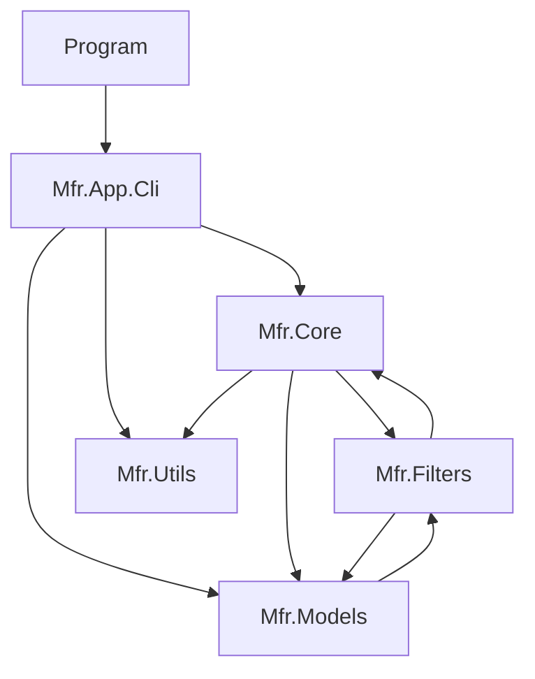
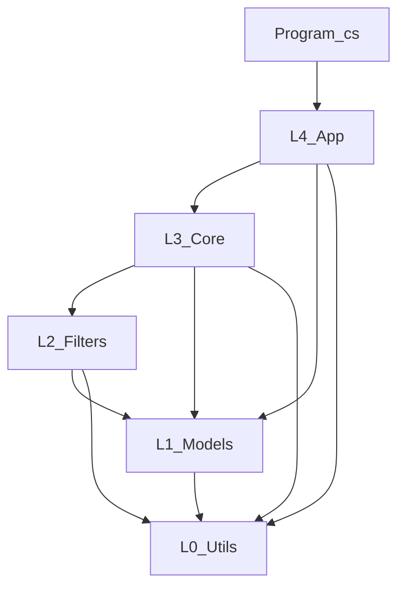
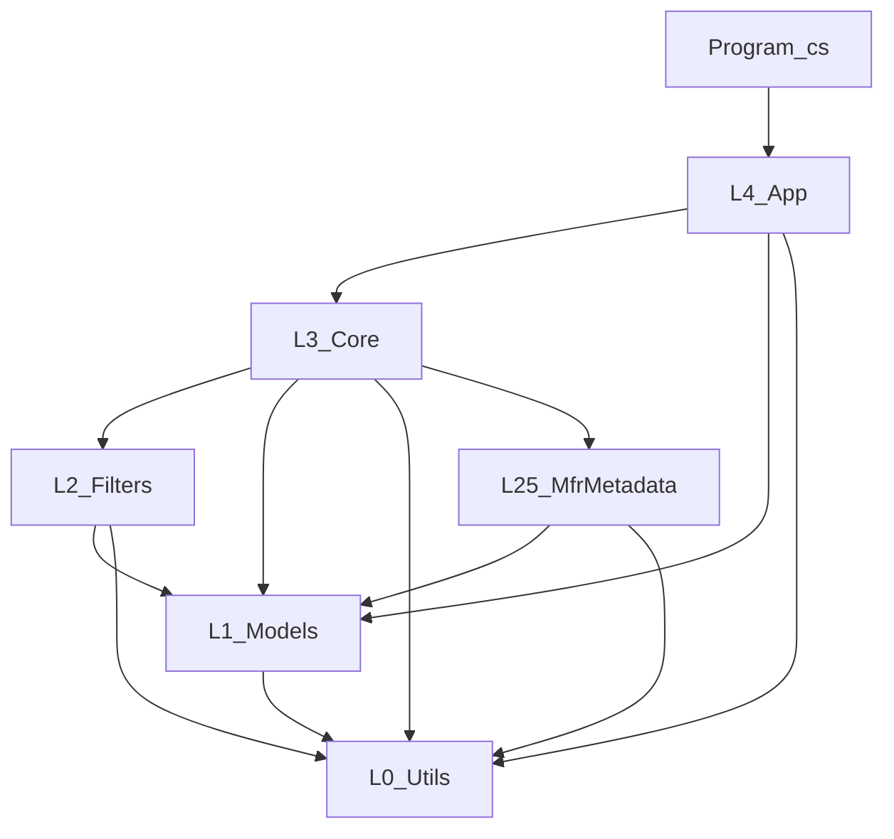

# MFR top-level folders as architectural layers

## Current topology

| Folder | Role (today) | Primary namespace |
|--------|----------------|---------------------|
| Root (`Program.cs`) | Composition root / entry | (default / implicit) |
| [Cli/](../Mfr.App.Cli) | Spectre.Console CLI, argument parsing, logging setup | `Mfr.App.Cli` |
| [Core/](../Mfr.Core) | Orchestration: rename pipeline (`RenameList`), presets I/O, source resolution, JSON source-gen for presets | `Mfr.Core` |
| [Filters/](../Mfr.Filters) | Polymorphic `BaseFilter` + concrete filters; filter extension points | `Mfr.Filters` (+ sub-namespaces) |
| [Models/](../Mfr.Models) | DTOs: `RenameItem`, targets, preset records, summaries | `Mfr.Models` |
| [Utils/](../Mfr.Utils) | Path/string helpers | `Mfr.Utils` |

There is **no** multi-project solution file in the repo root from search; layering is **namespace/folder convention** only unless you split projects or add analyzers.

## One folder per layer (layout rule)

**Rule:** Each **layer** maps to **exactly one root folder** in the source tree. **Subfolders inside that root** are allowed (e.g. `App/Cli/`, `Models/Serialization/`); **two top-level folders for the same layer** are not.

| Layer | Single root folder (target) | Notes |
|-------|-----------------------------|--------|
| L0 | `Utils/` | Already one folder under [`Mfr/`](../Mfr). |
| L1 | `Models/` | All portable domain types; optional subfolders by area. |
| L2 | `Filters/` | Concrete filters only; subfolders `Case/`, `Replace/`, … stay **inside** `Filters/`. |
| L2.5 | `Mfr.Metadata/` *(repo sibling or under solution root)* | One project folder; adapters only. |
| L3 | `Core/` | Application services; preset JSON context, pipeline. |
| L4 | **`App/`** | **One** layer folder; **`Cli/`** and **`Ui/`** move **under** `App/` (not separate top-level layers). |

**Entry (not a layer):** [`Program.cs`](../Mfr/Program.cs) stays at the **`Mfr/`** project root (next to [`Mfr.csproj`](../Mfr/Mfr.csproj)); it is a thin bootstrap into the **App** layer only — **no** separate **`Host/`** folder.

**Current status vs this rule:** CLI now lives under [`App/Cli/`](../Mfr.App.Cli), so L4 uses a single root folder (`App/`) with subfolders for app surfaces.

**Track A and this rule:** `BaseFilter` **behavior** lives under **`Models/`**; the **`[JsonPolymorphic]`** partial may live in **`Core/`** as **glue** (two folders, one logical type). Prefer keeping **all** `Models` layer **source files** under the **`Models/`** tree where possible; if the JSON partial must stay in `Core/`, treat it as **application-owned serialization metadata** for L1 types (documented exception to “all code for a type in one folder”).

## Dependency graph (imports / `using` today)



**Leaf with no inward Mfr deps:** `Mfr.Utils` (good candidate for the bottom of the stack).

**Expected downward edges (no surprises):**

- `Cli` → `Core`, `Models`, `Utils` ([CliApp.cs](../Mfr.App.Cli/CliApp.cs), [CliArgParser.cs](../Mfr.App.Cli/CliArgParser.cs), [CliLogging.cs](../Mfr.App.Cli/CliLogging.cs)).
- `Core` → `Filters`, `Models` ([RenameList.cs](../Mfr.Core/RenameList.cs), [RenameItemExtensions.cs](../Mfr.Core/RenameItemExtensions.cs)); `Core` → `Utils` ([PresetManager.cs](../Mfr.Core/PresetManager.cs)).
- Most of `Filters` → `Models` (concrete filters).

## Violations relative to strict “Models at bottom”

Two edges break a clean **acyclic** layer stack if you define **Models** as the lowest domain layer:

1. **`Models` → `Filters`** *(historical; now resolved)*  
   Previously, [Presets.cs](../Mfr.Models/Presets.cs) referenced a base type declared in `Filters`, which created a Models ↔ Filters cycle. This was resolved by moving [BaseFilter.cs](../Mfr.Models/BaseFilter.cs) into `Models` and keeping JSON derived-type wiring in [`Core/PresetJsonOptions.cs`](../Mfr.Core/PresetJsonOptions.cs).

2. **`Filters` → `Core`** *(historical; now resolved)*  
   Previously, [ReplaceListParser.cs](../Mfr.Filters/Replace/ReplaceListParser.cs) imported `Mfr.Core` to throw `UserException`. This was resolved by moving [UserException.cs](../Mfr.Models/UserException.cs) into `Models` and updating call sites.

## Target layers and new dependency graph (specification)

This is the **intended** layering after refactors: **acyclic**, **only downward** references (higher layer may import lower; never the reverse). **Folder alignment:** **one root folder per layer** (see [One folder per layer](#one-folder-per-layer-layout-rule)); each row below names that **single** folder (subfolders like `App/Cli` are **inside** L4, not separate layers).

| Layer | Id | Folder(s) | Role | Allowed `using Mfr.*` targets |
|-------|-----|-----------|------|--------------------------------|
| **L4 — App** | `App` | **Single folder** `App/` containing [Cli/](../Mfr.App.Cli) (target: `App/Cli/`) and future `App/Ui/` | CLI commands, args, console UX; later Avalonia | `Mfr.Core`, `Mfr.Models`, `Mfr.Utils` — **not** `Mfr.Filters` |
| **L3 — Application** | `Application` | [Core/](../Mfr.Core) | Use cases: `RenameList`, preset load/save, glob resolution, pipeline orchestration | `Mfr.Filters`, `Mfr.Models`, `Mfr.Utils` |
| **L2 — Domain rules** | `DomainRules` | [Filters/](../Mfr.Filters) | Polymorphic filters, `BaseFilter`, concrete filter types | `Mfr.Models`, `Mfr.Utils` — **not** `Mfr.Core` |
| **L1 — Domain model** | `DomainModel` | [Models/](../Mfr.Models) | Portable types: rename items, targets, summaries, **filter contract types if moved here** (e.g. `BaseFilter` base record) | `Mfr.Utils` only if needed — **not** `Mfr.Filters` or `Mfr.Core` |
| **L0 — Shared utilities** | `SharedKernel` | [Utils/](../Mfr.Utils) | Path/string helpers with no domain meaning | **None** (no `Mfr.*` imports) |

**Rule (single sentence):** Dependencies flow **App → Application → DomainRules → DomainModel → SharedKernel**; **Application** is the only layer that may aggregate **DomainRules** and **DomainModel** together.

**New dependency graph** (allowed edges only — this is the target, not today’s code). **Entry** [`Program.cs`](../Mfr/Program.cs) is **not** a layer; it only references the **App** layer (`Mfr.App.Cli`).



**Optional edges** (keep rare; justify in code review): `L2 → L0` and `L1 → L0` when a type truly belongs next to string/path helpers; omit both if you want **Filters** and **Models** free of `Utils` entirely.

**Edges explicitly forbidden in the target model:**

- `L1` → `L2` (Models → Filters): removed by moving `BaseFilter` contract to `L1` or preset DTOs next to filters.
- `L2` → `L3` (Filters → Core): removed by relocating `UserException` to `L1` or using result types + mapping in `Core`/`Cli`.

**Note:** [Program.cs](../Mfr/Program.cs) is a thin entry (`using Mfr.App.Cli` only) into **L4**; it stays at **`Mfr/`** root — see [One folder per layer](#one-folder-per-layer-layout-rule).

## Future layers (ordered, bottom → top)

This is the **full** intended stack after [magic-file-renamer-design.md](./magic-file-renamer-design.md) phases (tags, EXIF, Avalonia). **Dependency rule:** each layer may reference **only layers below it** (never upward). **Tests** (`Mfr.Tests`) are orthogonal: they reference production layers as needed.

| Order | Layer id | Folder / project (typical) | What belongs here |
|-------|-----------|----------------------------|-------------------|
| **1** | **L0 — Shared kernel** | [Utils/](../Mfr.Utils) | Generic helpers: path/string extensions; **no** MFR domain types. |
| **2** | **L1 — Domain model** | [Models/](../Mfr.Models) | Portable records: `RenameItem`, `FilterTarget` hierarchy, result/summary types, **`BaseFilter` base contract** (after Track A), `FilterPreset`, session/settings DTOs, **`UserException`** (after Track C). **No** `Mfr.Filters` imports. |
| **3** | **L2 — Domain rules** | [Filters/](../Mfr.Filters) | Concrete filter records, filter-specific parsers (e.g. replace-list), `FilterExtensions`; **implements** rename/tag/image **rules** against **L1** only — **no** `Mfr.Core`. |
| **4** | **L2.5 — Mfr.Metadata** *(future)* | Project/folder **`Mfr.Metadata`** | **Adapters** to the outside world: TagLibSharp + MetadataExtractor (audio/EXIF), `HttpClient` for FreeDB/GeoNames, OS icon providers, optional `FileSystemWatcher` for presets. **Depends on** **L1** (+ **L0**). **Referenced by** **L3** only; **L2** talks to capabilities via **interfaces or data** supplied by **L3** (see design §21.2). |
| **5** | **L3 — Application** | [Core/](../Mfr.Core) | **Use cases:** `RenameList`, preset load/save, glob resolution, undo journal, **`IRenamePipeline`** when introduced, JSON **serializer context** / **BaseFilter** serialization partial (Track A). **Composes** **L2**, **L1**, **L0**, and **L2.5** when present. |
| **6** | **L4 — App** | **Single folder** `App/` with **`App/Cli/`** (current location) and **`App/Ui/`** (Avalonia shell) | One **layer**; CLI and GUI are **subfolders**, not separate layer roots. Commands, binding, MVVM — **no** filter implementations. **May use** **L3**, **L1**, **L0** — **not** **L2** if the strict edge is kept. |

**Future dependency sketch** (single box per layer; **Cli** and **Ui** live **inside** `App/`; **`Program.cs`** at **`Mfr/`** root is entry, not a layer):



**Ordering summary (one line):** **`Program.cs` → App → Core → [Mfr.Metadata] → Filters → Models → Utils.** (Inside **App:** `Cli` then `Ui`.)

### Why `Mfr.Metadata` is a separate project *(optional)*

It does **not** have to be a separate assembly on day one — you can start with **`Core/Metadata/`** (or similar) **inside** the main `Mfr` project until tags/EXIF/HTTP land. The plan names **`Mfr.Metadata`** as its **own** project for **future** reasons:

- **Heavy, specialized dependencies** — TagLibSharp, MetadataExtractor, PDF/image stacks, and HTTP for FreeDB/GeoNames are **large and optional** (Phases 4–5+). Isolating them keeps **Core**’s dependency graph smaller and avoids pulling those packages into every build or test run that only needs rename rules.
- **Enforced boundaries** — **`Mfr.Filters`** must not call TagLib or `HttpClient` directly (design §21.2). A separate referenced assembly makes **wrong `using`s a compile error**, not just convention.
- **Tests** — Core and filters can be unit-tested with **fakes**; integration tests can target **`Mfr.Metadata`** + sample files without linking metadata code into **`Mfr.Filters`**.
- **Shipping** — You can version or trim the metadata stack independently (e.g. AOT, optional feature packs) if that ever matters.

**If you prefer one repo layout:** keep **`Mfr.Metadata`** as a **folder namespace** under **`Mfr/`** (e.g. `Mfr/Metadata/`) in the **same** `.csproj` until you split; the **layer** is still “infrastructure below Core, above raw domain.”

## Alignment with [magic-file-renamer-design.md](./magic-file-renamer-design.md)

The design doc is the source of truth for **product scope** and **long-term architecture**. Below is how it relates to the folder layers above and what changes when later phases ship.

### Principles that match the target layers

- **“UI depends on Core; Core has no UI dependency.”** (§2) — Same as this plan: **L4 App** may reference **L3 Core**; **Core** must not reference Avalonia, MVVM, or console-specific types. **One folder per layer:** Avalonia lives in **`App/Ui/`** (same **L4** root as **`App/Cli/`**), not a second top-level layer folder.
- **“Console mode and GUI share identical service classes.”** (§2) — **L3 Core** (`RenameList`, preset services, `IRenamePipeline` when introduced) is the shared surface; **CLI vs GUI** are thin **L4 App** adapters (`App/Cli` vs `App/Ui`).
- **Domain records and JSON** — The design’s `FilterPreset`/`BaseFilter`/`FilterTarget` (§2.1, §4) are **serializable domain data**. Treating **`BaseFilter` as L1 (Models)** matches the design (preset owns filter stack) and removes the **Models ↔ Filters** cycle described in this plan.
- **Filter definitions vs execution** — The design’s `IFilterStep<TFilterDefinition>` / `FilterContext` (§11.5) implies **filter definition records** stay in **L1**, **implementations** in **L2**, **orchestration** in **L3** — consistent with **Core** composing filters without **Filters** importing **Core** for app exceptions.

### Implementation phases vs folder growth (§3)

| Phase | Design focus | Layer impact |
|-------|----------------|--------------|
| **1 — CLI core** | Filename-only targets, hand-edited JSON presets | Initial shape: **`Cli` + `Core` + `Filters` + `Models` + `Utils`**; current shape: **`App/Cli` + `Core` + `Filters` + `Models` + `Utils`** (one folder per layer for L4) |
| **2 — Logging / undo** | `UndoSession`, journals, structured output | New types and I/O in **L3** + **L1**; still no UI |
| **3 — Advanced path filters** | Extended `FilterTarget`, conflicts | Mostly **L2** + **L1**; **L3** for conflict detection |
| **4–5 — Tags / EXIF** | TagLibSharp, MetadataExtractor, lazy `FileEntry` fields | Design’s **MetadataLayer** (§2 diagram): keep **behind interfaces** in **L3** or a dedicated **`Mfr.Metadata`** assembly (depends only on **L1** / contracts) so **L2** filters stay testable with fakes (§21.2) |
| **6 — Avalonia UI** | MVVM, explorer, editors | **`App/Ui/`** project (single **L4** root **`App/`**); **same dependency rule as `Cli`**: UI → Core, Models, Utils; **not** `Filters` directly if you keep the same strict edge as today’s CLI |

### Future dependency graph (with GUI)

When the GUI exists, **both** console and Avalonia live under the **single** **L4** folder **`App/`** (`App/Cli`, `App/Ui`). **`Program.cs`** (or a second executable’s entry) remains **non-layer** bootstrap into **App** → **Core**:


**Optional later:** `MetadataLayer` / HTTP clients (FreeDB, GeoNames) live in **`Mfr.Metadata`** (or **L0**-like thin wrappers if they only wrap external APIs) so **Core** stays the coordinator and **Filters** do not pull HTTP directly.

### Design choices that reinforce strict layering

- **Immutable filter definitions; edits produce new snapshots** (§2) — Keeps **L1** records as pure data and **L3** as the place that swaps preset stacks.
- **Error handling** (§22) — Per-file failures, **UserException**-style user-facing errors: placing **`UserException` in L1** (or a tiny shared contract) matches both the design and removing **Filters → Core**.

## Ways to enforce or strengthen this (optional follow-ups)

### Should each layer be a separate project?

**Short answer: no — not by default.** Layers can stay **folders inside one `Mfr` assembly** while you fix **imports** (Track A/C). Split into **multiple `.csproj` files** only when the **benefit** (compile-time boundaries, optional packages, reuse) outweighs the **cost** (more projects to maintain, slower inner loop for small changes).

| Strategy | When it makes sense |
|----------|---------------------|
| **One project, folder layers** (today) | Small codebase, solo/small team; use **grep**, **reviews**, optional **Roslyn analyzer** for allowed `using`s. |
| **Partial split** | After conformity: e.g. **`Mfr.Models`** + **`Mfr.Filters`** + **`Mfr.Core`** + thin **`Mfr`** exe referencing **`Mfr.App`** (CLI/UI surface) — **wrong project references fail at build** without needing an analyzer. |
| **Layer ≈ one project for every layer** | Large org, multiple consumers of the same **Models**/**Filters**, or heavy need for **independent** versioning — **overkill** for MFR until the repo and team grow. |

**Practical recommendation:** **Refactor namespaces and folders first** in the **single** executable project. **Then** split assemblies if: (1) someone keeps violating layer edges, (2) you add **optional** heavy deps (**metadata**), or (3) you ship **two entry assemblies** (CLI + GUI) sharing **`Mfr.Core`**. **`Mfr.Utils`** becomes its own project only if reused outside `Mfr` or you want a **dependency-free** utility DLL.

**Tests:** One **`Mfr.Tests`** project mirroring production folders is usually enough; split test projects only if build time forces it.

- **Split assemblies** along the same boundaries (e.g. `Mfr.Models`, `Mfr.Filters`, `Mfr.Core`, `Mfr.Metadata`, `Mfr.App` with **Cli** + **Ui** subprojects, `Mfr` executable with `Program.cs` at root) so wrong references fail at compile time.
- **Resolve the two cycles** without changing behavior much:
  - Move **`BaseFilter`** (and polymorphic JSON attributes) into **`Models`** or a small **`Mfr.Contracts`** project, with implementations staying in `Filters` — or keep DTO presets in `Filters` if they are truly “filter graph” not generic models.
  - Move **`UserException`** to **`Models`** (or a tiny `Mfr.Exceptions` shared layer) so `Filters` does not reference `Core`, *or* have `ReplaceListParser` return errors/results and let `Core`/`Cli` map to exceptions.
- **Roslyn analyzer** or **StyleCop-like** custom rules on `using` if you stay single-project.

## Implementation steps (to conform)

Do these in order. **Minimum bar for conformity:** complete **Track A or B** (Models↔Filters) and **Track C** (Filters→Core). Everything else is verification or optional hardening.

### Track A — BaseFilter contract in L1 (`Models`), JSON wiring in L3 (`Core`) **(preferred)**

**Goal:** [`FilterPreset`](../Mfr.Models/Presets.cs) and the rest of **`Mfr.Models`** never `using Mfr.Filters`, while [`BaseFilter`](../Mfr.Models/BaseFilter.cs) remains the single polymorphic **definition** type for presets and the rename pipeline. **Concrete filter records** stay in **`Filters/`** and inherit the base.

**Why not put `[JsonPolymorphic]` / `[JsonDerivedType]` on `BaseFilter` inside the `Models/` folder?**  
Those attributes use `typeof(LettersCaseFilter)`, etc. That would force **`Models`** to import **`Mfr.Filters.*`** — recreating **L1 → L2**. So Track A uses a **split declaration** (same assembly, same namespace, two folders).

#### A.1 — `partial` `BaseFilter` in `Mfr.Models`, serialization partial in `Core`

- **Keep one logical type:** `public abstract record BaseFilter` stays in namespace **`Mfr.Models`** (not `Mfr.Filters`), so `FilterPreset` references **`BaseFilter`** with **no** filter-namespace import.
- **Split across two source files** (both `partial`):
  1. **[Models/BaseFilter.cs](../Mfr.Models)** (new location; delete from `Filters/` when done): **behavior only** — constructor `(bool Enabled, FilterTarget Target)`, `Type`, `Setup`, `Apply`, `TransformSegment`, `_Setup`, `_TransformSegment`, and **no** `using` to `Mfr.Filters`. Keep **`using Mfr.Models`** only for types already in Models (e.g. `RenameItem`, `FilterTarget`, `FileNameTarget`). This file must compile **without** referencing concrete filter types.
  2. **`Core/PresetJsonOptions.cs`** centralizes polymorphic derived-type registration for `BaseFilter` in the application layer. This file **`using Mfr.Filters.Case`**, **`Trimming`**, etc., so concrete filter `typeof(...)` mappings resolve in **Core** without creating a **Models → Filters** reference.

**Layering check:** Any `.cs` under **`Models/`** has **no** `Mfr.Filters` imports. The serialization partial **lives under `Core/`** but **declares** `Mfr.Models.BaseFilter` — that is intentional (namespace ≠ folder).

#### A.2 — Concrete filter types

- Each concrete filter (e.g. `LettersCaseFilter`) stays in **`Mfr.Filters.*`** but inherits **`Mfr.Models.BaseFilter`** instead of **`Mfr.Filters.BaseFilter`**.
- Replace `namespace` / usings: typically **`using Mfr.Models`** for the base; remove obsolete **`Mfr.Filters`** self-reference for the base type.
- **[FilterExtensions.cs](../Mfr.Filters/FilterExtensions.cs)** and any **`BaseFilter`**-shaped APIs: update to **`Mfr.Models.BaseFilter`** if needed.

#### A.3 — JSON options and polymorphism wiring

- Polymorphism is configured in [PresetJsonOptions.cs](../Mfr.Core/PresetJsonOptions.cs) using `JsonPolymorphismOptions` and `JsonDerivedType` entries for concrete filters.
- After the move, **rebuild** and run tests; if **trim/AOT** or the source generator reports **missing metadata** for a concrete filter type, add **`[JsonSerializable(typeof(ConcreteFilter))]`** for each concrete type to the **same** `JsonSerializerContext` partial (or a second partial class merged into one context), per [System.Text.Json source generation](https://learn.microsoft.com/dotnet/standard/serialization/system-text-json/source-generation) for polymorphic graphs.
- **[PresetManager](../Mfr.Core/PresetManager.cs):** usually unchanged aside from namespace of `BaseFilter` if any fully-qualified name appeared (unlikely).

#### A.4 — `Presets.cs` and call sites

- **[Presets.cs](../Mfr.Models/Presets.cs):** remove `using Mfr.Filters`; **`FilterPreset.Filters`** remains `IReadOnlyList<BaseFilter>` with **`BaseFilter`** resolved in **`Mfr.Models`**.
- **Search** for `Mfr.Filters.BaseFilter` / `using Mfr.Filters` under **`Models/`** and fix.
- **[Core/RenameList.cs](../Mfr.Core/RenameList.cs)**, **[RenameItemExtensions.cs](../Mfr.Core/RenameItemExtensions.cs):** they already reference **`Mfr.Filters`** for extension methods / usings — ensure they import **`Mfr.Models`** for **`BaseFilter`** if the unqualified name moved.

#### A.5 — Suggested order of work

1. Add **`Models/BaseFilter.cs`** with **`namespace Mfr.Models`**, move **implementation** from current `Filters/BaseFilter.cs`, **omit** JSON attributes.
2. Add/maintain **`Core/PresetJsonOptions.cs`** with `BaseFilter` polymorphism registration and required **`using Mfr.Filters.…`** entries.
3. Delete old **`Filters/BaseFilter.cs`** (or strip to avoid duplicate type — prefer delete).
4. Update **all** concrete filters to inherit **`Mfr.Models.BaseFilter`** and fix namespaces.
5. Fix **`Presets.cs`** and run **`dotnet build`** / **`dotnet test`**; add **`[JsonSerializable]`** entries if the serializer context requires them.
6. Run **grep gate:** no `using Mfr.Filters` in **`Models/`**.

#### A.6 — Risk notes

- **`InternalsVisibleTo`:** If anything relied on **`BaseFilter`** being in the same **namespace** as before, behavior is unchanged; if tests referenced **`Mfr.Filters.BaseFilter`**, update test usings.
- **Future multi-assembly split:** `BaseFilter` in **`Mfr.Models` assembly**, JSON partial in **`Mfr.Core`** referencing **`Mfr.Filters`** forces **Core** to reference **Filters** — same as today’s orchestration role; **Models** assembly stays free of **Filters**.

### Track B — Move preset DTOs out of `Models` **(alternative to A)**

1. Move **`FilterPreset`** (and any types only needed for preset files) from [Models/](../Mfr.Models) to **`Mfr.Core`** or **`Mfr.Filters`** (your choice of “preset lives with orchestration” vs “preset lives with filter graph”).
2. Update [PresetManager.cs](../Mfr.Core/PresetManager.cs), [PresetJsonOptions.cs](../Mfr.Core/PresetJsonOptions.cs), CLI, and tests to the new namespace.
3. Confirm **`Mfr.Models` no longer references `Mfr.Filters`** (`rg "using Mfr.Filters" Models`).

### Track C — Remove `Filters` → `Core`

**Option C1 (smallest change):**

1. Move [UserException.cs](../Mfr.Models/UserException.cs) to [Models/](../Mfr.Models) (namespace `Mfr.Models`), with XML docs preserved.
2. Replace `using Mfr.Core` in [ReplaceListParser.cs](../Mfr.Filters/Replace/ReplaceListParser.cs) with `using Mfr.Models` (or the new namespace).
3. Update all other `UserException` sites ([Cli/](../Mfr.App.Cli), [Core/](../Mfr.Core), etc.) to the new type location.

**Option C2 (no shared exception in Filters):**

1. Change `ReplaceListParser` APIs to return **parse results** (success + errors / line numbers) instead of throwing.
2. Map to `UserException` in **Core** or **Cli** at call sites (e.g. [ReplaceListFilter](../Mfr.Filters/Replace/ReplaceListFilter.cs) or preset load path).

### Verification and tests

1. **Grep gate (local CI or manual):**
   - No `using Mfr.Filters` under [Models/](../Mfr.Models).
   - No `using Mfr.Core` under [Filters/](../Mfr.Filters) (except if you deliberately keep a file in Filters that is classified as Core — avoid).
   - No `using Mfr.Filters` under [Cli/](../Mfr.App.Cli).
2. **Tests:** Move/update files under [Mfr.Tests](../Mfr.Tests) to match new namespaces (presets, `BaseFilter` location).
3. **Run:** `dotnet test` on the solution / test project.

### Optional (later)

1. **Split assemblies** per layer and fix project references to match the allowed-edge matrix.
2. **Roslyn analyzer** or repo script enforcing the three greps above.

## Placeholder scaffolds (empty)

Reserve names and layout **before** implementation so the repo (or solution) can grow without renaming. These are **intentionally empty** shells: no TagLib, no Avalonia views, until the matching design phase lands. **Do not** reference them from `Mfr` until conformity work (Track A/C) and solution structure are decided.

### Projects to add (names fixed; **one folder per layer**)

| Placeholder | Layer | Assembly / folder | Initial contents |
|-------------|-------|-------------------|------------------|
| **`Mfr.Metadata`** | L2.5 | Repo root: `Mfr.Metadata/` + `Mfr.Metadata.csproj` | Class library targeting same TFM as `Mfr`; single stub type with XML doc “Reserved for TagLib/EXIF/HTTP adapters”; **no** reference from `Mfr` until **Core → Mfr.Metadata** is wired. |
| **`App/Ui/`** | L4 *(inside single **App** root)* | Under [`Mfr/`](../Mfr): **`Mfr/App/Ui/`** — **not** a second top-level layer folder next to **`App/`**. Optional `README` or empty `.csproj` fragment if using multi-target; namespace e.g. **`Mfr.App.Ui`** or **`Mfr.Ui`** per project choice. |

**`App/Cli/`** is the current home for CLI code (same **L4** root **`App/`**). **[`Program.cs`](../Mfr/Program.cs)** stays at **`Mfr/`** root — **no** **`Host/`** folder.

### Optional tree (documentation target)

```text
finebytes/
  Mfr/
    Program.cs            # entry — not a layer folder
    App/         # L4 — single layer folder
      Cli/                # current CLI location
      Ui/                 # empty shell → Phase 6 Avalonia
    Core/                 # L3
    Filters/              # L2
    Models/               # L1
    Utils/                # L0
    Mfr.csproj
  Mfr.Tests/
  Mfr.Metadata/           # L2.5 — repo sibling
    Mfr.Metadata.csproj
    Placeholder.cs
```

### Rules for placeholders

- **Do not** put domain logic in placeholders; only project metadata, TFMs aligned with `Mfr`, and a stub file so the project compiles.
- **One folder per layer:** **`App/`** is the **only** L4 root; **`Ui`** is not a parallel top-level sibling like `Cli` was — both **`Cli`** and **`Ui`** nest under **`App/`**.
- **Solution file:** when the repo adds a `.sln`, include `Mfr`, `Mfr.Tests`, `Mfr.Metadata` with correct build order; **no** project-reference edges until layers are wired per this plan.
- **Namespace:** `Mfr.Metadata` for the metadata assembly; CLI/UI code may stay **`Mfr.App.Cli`** / **`Mfr.Ui`** even when folders are under **`App/`** (namespace ≠ folder).

### Relation to conformity steps

Track A/C (layering inside `Mfr`) **does not require** **`Mfr.Metadata`** or **`App/Ui/`** stubs. Add them when you want visible structure or CI to compile future layers early. The **folder move** (`Cli` → `App/Cli`) has already been completed.

## Summary

- **Target model (current + strict):** **`Program.cs` → L4 App → L3 Core → L2 Filters → L1 Models → L0 Utils** — see [Target layers](#target-layers-and-new-dependency-graph-specification) (**`Program.cs`** is entry only, **not** a layer).
- **One folder per layer:** [One folder per layer (layout rule)](#one-folder-per-layer-layout-rule) — **`App/`** is a **single** L4 root (**`Cli`** and **`Ui`** are **subfolders**); **`Mfr.Metadata/`** for L2.5; **no** **`Host/`** folder.
- **Full future stack:** **`App/Ui`**, **`Mfr.Metadata`** — see **[Future layers (ordered)](#future-layers-ordered-bottom--top)**.
- **Design doc:** Phased delivery (CLI → undo → tags/EXIF → **Avalonia**) adds **`App/Ui`** under the **same** L4 folder as **`App/Cli`**; both depend on **Core** with **no UI in Core**; TagLib/GeoNames/FreeDB live in **`Mfr.Metadata`** (referenced by **Core**) per §2 and §21.
- **Current status vs target graph:** Track A and Track C are implemented (`BaseFilter` now in `Models`, `UserException` now in `Models`, and `Filters` no longer imports `Core`).
- **Remaining concrete work:** follow **[Implementation steps (to conform)](#implementation-steps-to-conform)** for verification/enforcement and optional Track B alternatives only if you intentionally change direction.
- Optional follow-up: **[Should each layer be a separate project?](#should-each-layer-be-a-separate-project)** — default **no**; **split csproj** or **analyzers** when you need mechanical enforcement.
- **Empty shells:** see **[Placeholder scaffolds (empty)](#placeholder-scaffolds-empty)** for **`Mfr.Metadata`** and **`App/Ui/`**.
