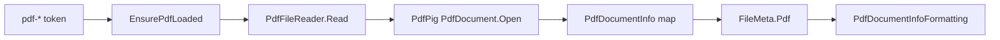

# PDF metadata model

How Magic File Renamer reads PDF Info dictionary fields and page count for `<pdf-*>` formatter
tokens: a lazy PdfPig open, a mapped `PdfDocumentInfo` snapshot on `FileMeta`, and empty vs
PreviewError rules.

Product/UI sketches live in [magic-file-renamer-design.md](magic-file-renamer-design.md). Folder
layering is in [mfr-folder-layering.md](mfr-folder-layering.md). This cache is read-only (no write /
Apply path in v1). Image/EXIF and TagLib audio stay on separate caches.

## Design principles

1. **Read-only.** PDF Info is never written on commit. There is no Apply path in this slice.
1. **Lazy, one open.** The first `<pdf-*>` token on a file row in a Preview run opens the file once,
   maps Info + page count to `PdfDocumentInfo`, and caches it. Later tokens in the same cycle reuse
   it. Commit clears the cache so the next preview reloads from disk.
1. **DTO only.** Raw PdfPig types are not stored on `FileMeta`. Mapping discards them.
1. **Original snapshot.** Tokens read `item.Original.Pdf` (disk-backed facts), not Preview.
1. **Readable PDFs only.** Empty tokens apply only after a successful open when a field is missing
   (`null` / `0`). Non-PDF or corrupt files → PreviewError (PdfPig `PdfDocumentFormatException` or
   similar). Missing Info on a successful open is an **empty** field, not PreviewError.
1. **No XMP fallback.** Only the classic Info dictionary and `NumberOfPages` are mapped.

## Layer map

- **Snapshot record** — `Mfr.Models` — `PdfDocumentInfo` on `FileMeta.Pdf`
- **Disk read / map** — `Mfr.Metadata` — `PdfFileReader`
- **Lazy load (formatter preview)** — `Mfr.Filters` — `RenameItemPdfExtensions.EnsurePdfLoaded`
- **Rename List grid** — eager-loads via `RenameList.EnsureMetadataLoaded`
  (`RenameListMetadataRequirement.Pdf`); attempt/error state shares the
  `RenameItem` / `RenameListMetadataBuckets` single-flag API with TagLib and Image
- **Tokens** — `Mfr.Filters` — `PdfDocumentTokenBase` (`pdf-*`)
- **Commit cache clear** — `Mfr.Engine` — `RenameList.Commit` calls `ClearMetadataCaches` →
  `ClearPdfCache`

## Cache lifetime

`FileMeta.Pdf` is `null` until the first PDF token load. `RenameItem.SetPdfDocumentInfo` assigns the
same record reference to Original and Preview. `PdfLoadAttempted` / `PdfLoadError` track the cycle.
`ClearPdfCache` nulls the snapshot and resets load state.

`FilterTestHelpers.CreateRenameItem` marks PDF load as already attempted on file rows so seeded unit
tests never hit disk. Integration-style tests construct an unmarked `RenameItem` pointing at a real
file.

## Empty vs PreviewError

- **Directory row** — `InvalidOperationException` from ensure → PreviewError
- **Missing / relative path** — `ArgumentException` from the reader → PreviewError
- **Non-PDF / corrupt / encrypted open failure** — Propagated PdfPig exception → PreviewError
- **Successful open, missing Info field / unparseable date / `0` page count** — That `pdf-*` token
  expands **empty**, not an error

## Mapped fields

| Field     | Source                                |
| --------- | ------------------------------------- |
| Title     | Info Title                            |
| Author    | Info Author                           |
| Subject   | Info Subject                          |
| Keywords  | Info Keywords                         |
| Creator   | Info Creator (creating app)           |
| Producer  | Info Producer                         |
| Created   | Info CreationDate → `DateTimeOffset?` |
| Modified  | Info ModDate → `DateTimeOffset?`      |
| PageCount | `PdfDocument.NumberOfPages`           |

Dates use PdfPig `GetCreatedDateTimeOffset` / `GetModifiedDateTimeOffset`. When the Info string is
absent or unparseable, the DTO stores `null` and tokens/columns expand empty.
