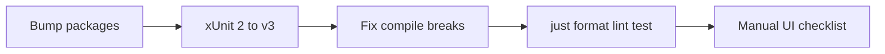

# Avalonia 12 upgrade

Decision: **upgrade now** from Avalonia **11.3.20** to **12.1.2**.

Official breaking changes: [Breaking changes in Avalonia 12](https://docs.avaloniaui.net/docs/avalonia12-breaking-changes).

## Target package versions

| Package                                                | From            | To                                                                                      |
| ------------------------------------------------------ | --------------- | --------------------------------------------------------------------------------------- |
| Avalonia, Desktop, Fluent, Fonts.Inter, Headless.XUnit | 11.3.20         | **12.1.2**                                                                              |
| Avalonia.Controls.DataGrid                             | 11.3.13         | **12.1.2**                                                                              |
| Avalonia.AvaloniaEdit                                  | 11.3.0          | **12.0.0** (latest AvaloniaEdit line; depends on Avalonia >= 12.0.0)                    |
| Avalonia.Diagnostics                                   | 11.3.20 (Debug) | **remove** → `AvaloniaUI.DiagnosticsSupport` **2.2.3**                                  |
| xunit                                                  | 2.9.3           | **xUnit v3** (required by Headless.XUnit 12; use matching `xunit.v3` + runner packages) |

Files: [`Mfr.App.Ui/Mfr.App.Ui.csproj`](Mfr.App.Ui/Mfr.App.Ui.csproj), [`Mfr.Tests/Mfr.Tests.csproj`](Mfr.Tests/Mfr.Tests.csproj).

## Implementation steps

### 1. Bump packages + DevTools

- Align all Avalonia first-party refs in Ui + Tests to **12.1.2**.
- Set AvaloniaEdit to **12.0.0** in both projects.
- Replace `Avalonia.Diagnostics` with `AvaloniaUI.DiagnosticsSupport` (Debug-only Condition unchanged).
- In [`App.axaml.cs`](Mfr.App.Ui/App.axaml.cs): `AttachDevTools()` → `AttachDeveloperTools()`; fix usings.

### 2. Migrate tests to xUnit v3

- Replace `xunit` 2.9.3 with xUnit v3 packages required by Headless.XUnit 12 (`xunit.v3` / runner as needed).
- Fix any 2.x → 3 API/attribute differences across `Mfr.Tests` (including `[AvaloniaFact]` suite).
- Keep [`TestAppBuilder`](Mfr.Tests/Ui/TestAppBuilder.cs) headless setup; adjust only if 12 APIs require it.

### 3. Fix known Avalonia 12 compile breaks

- **Focus:** `GotFocus` / `LostFocus` handlers → `FocusChangedEventArgs` where required (e.g. [`SpaceCharacterFilterEditorView.axaml.cs`](Mfr.App.Ui/Views/FilterEditors/Space/SpaceCharacterFilterEditorView.axaml.cs); Rename List / Format Editor / File List / DateTime handlers).
- **Clipboard:** update [`DesktopTextClipboard`](Mfr.App.Ui/Services/FileList/DesktopTextClipboard.cs) and dialog `SetTextAsync` call sites to Avalonia 12 clipboard extensions if `IClipboard.SetTextAsync` is no longer on the interface.
- **Bindings in tests:** any `new Binding(...)` → `ReflectionBinding` / `CompiledBinding` if the compiler complains.
- Fix remaining errors from `just build` until clean.

### 4. Docs touch-up

- Update Avalonia 11 wording in [`Mfr.App.Ui/README.md`](Mfr.App.Ui/README.md) and [`docs/mfr-folder-layering.md`](docs/mfr-folder-layering.md).

### 5. Automated gates

- `just format`
- `just lint`
- `just test` (0 failures; Windows-only skips OK)

Already paid / low concern: DnD `DataTransfer` stack, compiled bindings default, `UsePlatformDetect`, `TopLevel.GetTopLevel`, no custom chrome, desktop-only.

______________________________________________________________________

## Post-upgrade checks (do after green build/tests)

### A. Automated (must pass)

1. `just format` then `just lint` — no format/analyzer drift.
1. `just test` — full suite green (Skipped WindowsFacts OK on Linux).
1. Spot-check Headless UI suites still run: Rename List columns/DnD, File List drop, Format Editor, Applied Filters / Palette DnD, Preset Manager DnD.

### B. Manual smoke — `just run-ui` (Windows preferred)

**Startup / chrome**

1. App launches; main window restores size/position/session as before.
1. Debug build: DevTools opens via the usual gesture (`F12` / AttachDeveloperTools path) — confirm DiagnosticsSupport works (or note license prompt).

**Rename List (DataGrid heavy)**

3. Load files; columns show; row status / error styling OK.
1. Column resize, reorder, auto-fit (header double-click / existing autofit behavior).
1. Sort by clicking headers; glyphs match.
1. Multi-select, keyboard Ctrl+Up/Down / existing shortcuts still work.
1. Drag rows to reorder; drop mark; Alt modifiers if used.
1. Drag selected rows out to File List / Explorer path if that path exists.

**File List**

9. Browse folder; report DataGrid sort + selection.
1. Drop from Rename List back onto File List.
1. Copy path → clipboard contains expected paths.
1. Address bar / mask LostFocus commit still works.

**Format Editor (AvaloniaEdit)**

13. Open Format Editor; template text, token colors, yellow wash / selection sync.
01. Caret move, undo, context menu / token insert.
01. Focus watermark show/hide on GotFocus/LostFocus.

**Filters / presets DnD**

16. Drag filter from Palette → Applied; reorder Applied list.
01. Preset Manager list reorder DnD.
01. Field shuttle dialog DnD if used regularly.
01. Folder path drop onto Path Mover / Visual Trim helpers.

**Selection / editors**

20. ListBox multi-select in Applied Filters / Palette (mouse click + Ctrl/Shift).
01. Space Character “other character” box focus behavior.
01. Date/Time setter commit on LostFocus.

**Regression tripwires**

23. No startup exception about text shaping / HarfBuzz.
01. No clipboard “unavailable” on Copy path when window is focused.
01. Thumbnails / system icons still load in File List if enabled.

### C. Optional follow-ups (only if something fails)

- If AvaloniaEdit misbehaves on 12.1.2, pin Avalonia first-party packages to **12.0.x** temporarily and retest — unlikely given `>= 12.0.0`.
- If DevTools is license-gated and unused, drop DiagnosticsSupport rather than block the upgrade.
