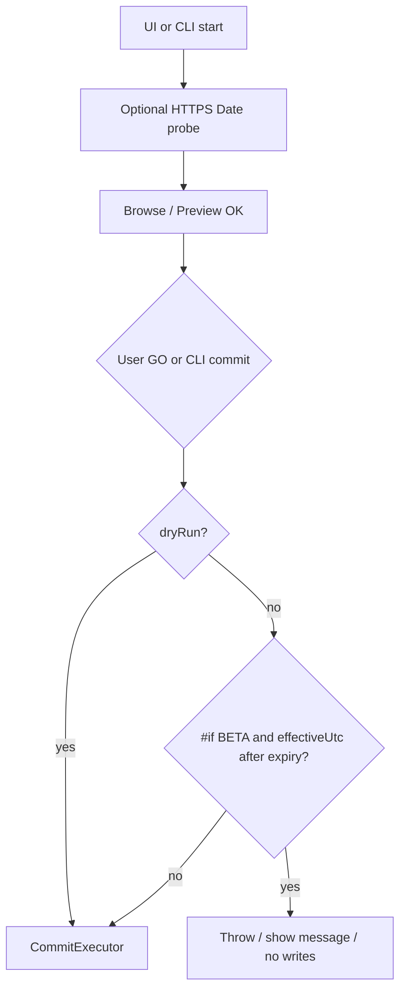

# Beta expiry gate plan

## Decisions (locked)

- **Expired behavior (1B):** App still starts. File List / Rename List browse, preview, and filter editing stay available. **Real rename commits are blocked** (UI GO, Undo-via-commit, CLI commit). Dry-run commit may still run (no disk writes).
- **Clock source (updated):** Prefer a **simple network UTC** when available; otherwise **local `DateTime.UtcNow`**. No NTP client, no clock-rollback persistence, no obfuscation. Honest limit: offline clock rollback or binary patch still works.
- **Release vs beta:** Gate exists only under `#if BETA`. Official/release builds define no `BETA` symbol → zero expiry code path.
- **Expiry value:** Hardcoded in source as **1 January 2027 00:00:00 UTC** (`new DateTime(2027, 1, 1, 0, 0, 0, DateTimeKind.Utc)`). Expired when effective UTC `>= ExpiresUtc` (last valid moment is end of 31 Dec 2026 UTC). Bump the constant in a later beta if you need a new window.
- **Single enforcement point:** [`RenameList.Commit`](Mfr.Engine/RenameList/RenameList.cs) refuses non-dry-run commits when expired (covers UI GO, Undo commit, CLI). UI additionally disables GO / Generate Rename Script via `_CanGo` and shows a clear status/message so users are not surprised. Preview is untouched.

## MFR7 reference brief

N/A — new MFR8 beta policy; not ported from MFR7.

## Non-goals

- Full NTP, multi-host consensus, or signed time tokens
- Requiring network to use the app (offline must still work via local clock)
- Tamper-proofing / obfuscation
- Blocking app launch or preview
- Migrating or reading legacy license files
- Auto-update / download of the next beta from inside the app

## Reality check

This is a **polite gate** for beta testers, not DRM. Network time only raises the bar against casual clock rollback while online. Document: expired → download a newer beta or the release.

## Design



**Effective UTC (keep it simple)**

1. Once per process (lazy or early warmup): `HEAD` (or lightweight `GET`) to one stable HTTPS URL with a **short timeout** (~2s), read the response **`Date`** header, parse as UTC.
1. On success: cache that network UTC (and optionally advance it with local elapsed time so later checks stay sane without re-fetching every GO).
1. On failure / timeout / bad header: mark network unavailable; use `DateTime.UtcNow`.
1. `IsExpired` ⇒ `GetEffectiveUtc() >= ExpiresUtc`.
1. No periodic re-probe required for v1; one attempt per process is enough. Commit may trigger the first probe if warmup has not finished (sync, same short timeout).

**Endpoint:** one hard-coded HTTPS host that reliably returns `Date` (e.g. product site from `AppProductInfo.WebSiteUrl` if it is HTTPS and stable, otherwise a well-known static host). Do not download a body; headers only.

**Core type** (new, under Engine), e.g. [`Mfr.Engine/Beta/BetaExpiryGate.cs`](Mfr.Engine/Beta/BetaExpiryGate.cs):

- `#if BETA`: hardcoded `ExpiresUtc`; `TryRefreshNetworkUtc` / cached effective clock; injectable clock + optional injectable “fetch Date header” for tests.
- `#else`: always not expired.

**Commit guard** at top of `RenameList.Commit` after null-check:

```csharp
#if BETA
if (!dryRun && BetaExpiryGate.IsExpired)
{
    throw new BetaExpiredException(BetaExpiryGate.ExpiresUtc);
}
#endif
```

Dedicated exception type keeps CLI/UI messaging clean (message includes **1 Jan 2027** + “download a newer beta or the release”).

**Build wiring**

- Optional `DefineConstants` when `-p:BETA=true`.
- Document cut command in `CONTRIBUTING.md`, e.g. `dotnet build -c Release -p:BETA=true`.

**UI** ([`MainWindowViewModel`](Mfr.App.Ui/ViewModels/MainWindow/MainWindowViewModel.cs))

- Fire-and-forget network probe early after startup (so `_CanGo` usually has a cached answer without blocking the UI thread on first GO).
- `_CanGo()` false when expired (under `#if BETA`).
- About / window title: show beta + expiry date when `BETA`.

**CLI** ([`CliApp`](Mfr.App.Cli/CliApp.cs))

- Optional probe before commit (or rely on first `IsExpired` inside Commit).
- Catch `BetaExpiredException`; print message; non-zero exit. Preview-only runs still succeed.

## Phases

### P1 — Engine gate + network probe + tests

- Scope: `BetaExpiryGate` with hardcoded **2027-01-01 UTC**, simple HTTPS `Date` fetch + cache + local fallback, `BetaExpiredException`, `RenameList.Commit` non-dry-run check; unit tests with injected clock and fake network (success / fail / slow).
- Exit: effective UTC on or after 2027-01-01 → Commit throws; offline uses local; dry-run and non-BETA builds unaffected.
- Tests: `Mfr.Tests` engine tests; no UI headless required.

### P2 — UI + CLI + build docs

- Scope: startup probe; `_CanGo` / GO messaging; About or title beta+expiry (1 Jan 2027); CLI catch; MSBuild `BETA` flag; brief CONTRIBUTING / help note.
- Exit: expired beta build opens UI but GO disabled with clear reason; CLI preview OK, commit fails with same reason; release build without `BETA` has no gate.

## Help

When P2 ships user-visible beta labeling: touch only what drifts (likely a short line in help intro/whatsnew if beta builds are mentioned). Skip filter HTML.
