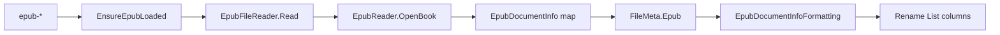

# EPUB document Info tokens

Parent: [`docs/plans/more-read-only-metadata-formats.plan.md`](docs/plans/more-read-only-metadata-formats.plan.md) **P2** (HEIF P1 already shipped). Sibling template: [`docs/plans/pdf-document-info-tokens.plan.md`](docs/plans/pdf-document-info-tokens.plan.md) + [`docs/pdf-metadata-model.md`](docs/pdf-metadata-model.md).

## Status

- [x] P1 — Reader + FileMeta bucket
- [x] P2 — Tokens + Rename List columns
- [x] P3 — Docs + help

## Decisions (locked)

- **Read-only only** — tokens + Rename List columns; no OPF write / Apply.
- **Library:** `VersOne.Epub` on [`Mfr.Metadata/Mfr.Metadata.csproj`](Mfr.Metadata/Mfr.Metadata.csproj) only (same layer as PdfPig).
- **Open path:** `EpubReader.OpenBook(path)` (default **STRICT**) → map from `EpubBookRef.Schema.Package` → dispose ref. Do **not** use `ReadBook` (loads full content).
- **DTO:** nullable `FileMeta.Epub` / `EpubDocumentInfo` in `Mfr.Models.Media` (mirror `PdfDocumentInfo`).
- **Bucket flag:** `RenameListMetadataRequirement.Epub = 8`; add to [`RenameListMetadataBuckets.All`](Mfr.Models/RenameList/RenameListMetadataBuckets.cs), [`RenameItem.MetadataBuckets`](Mfr.Models/Rename/RenameItem.MetadataBuckets.cs), [`RenameListMetadataLoader._BucketEnsures`](Mfr.Filters/RenameListMetadataLoader.cs), `ClearMetadataCaches` / `FileMeta.Clone`.
- **Empty vs error:** same as PDF — successful open + missing field → empty; non-EPUB / corrupt / DRM open failure (`EpubReaderException` family or IO) → PreviewError; directory → `InvalidOperationException`.
- **List fields → first primary string:** for each DC list, take the **first** entry whose text is non-blank after the same normalize as PDF (`IsBlank` → null; collapse `\r`/`\n` to space; trim). Never join multiple creators/subjects in v1.
- **Identifier:** if `Package.UniqueIdentifier` is set, prefer the `Identifiers` entry whose `Id` matches; else first non-blank `Identifiers[].Identifier`.
- **Date:** store as `string?` (literal first `Dates[].Date`), not `DateTimeOffset?` — EPUB dates are often year-only / incomplete; Token and Grid both use optional-text formatting (no PDF-style date fork). Sort uses string compare via base field compare.
- **Creator ≠ PDF Creator:** EPUB `Creator` is Dublin Core author (person/org). Token shortDescription + Rename List tip must say so (PDF Creator tip is “creating app”).
- **Token / group ids:** Rename List group `Epub` / label `EPUB Document`; tokens `epub-*` (kebab); catalog keys PascalCase matching PDF style.
- **FormatEditor nesting:** put PDF + EPUB under a shared **`Document\`** parent (same pattern as `Audio\Tag`, `Image\EXIF`):
  - Existing PDF tokens: change `[FormatTokenInfo]` group from `"Pdf"` → `"Document\\Pdf"` (token names `pdf-*` unchanged).
  - New EPUB tokens: `"Document\\Epub"`.
  - Later Office (parent P3/P4): `"Document\\Office"` — do not nest Rename List field groups; shuttle stays flat siblings (`PDF Document`, `EPUB Document`, `Office Document`).
- **No MFR7 names** — net-new product surface.

## Tokens (`Epub`)

| Token                | Field       | Source                                                      |
| -------------------- | ----------- | ----------------------------------------------------------- |
| `<epub-title>`       | Title       | `Metadata.Titles[0].Title`                                  |
| `<epub-creator>`     | Creator     | `Metadata.Creators[0].Creator` (display name, not `FileAs`) |
| `<epub-publisher>`   | Publisher   | `Metadata.Publishers[0].Publisher`                          |
| `<epub-language>`    | Language    | `Metadata.Languages[0].Language`                            |
| `<epub-date>`        | Date        | `Metadata.Dates[0].Date` (literal string)                   |
| `<epub-identifier>`  | Identifier  | unique-id resolve, else first identifier                    |
| `<epub-subject>`     | Subject     | `Metadata.Subjects[0].Subject`                              |
| `<epub-description>` | Description | `Metadata.Descriptions[0].Description`                      |

Tips: Creator (author vs PDF creating-app), Identifier (unique-id preference). Optional: Description (first `dc:description`).

## Architecture

Clone PDF file-for-file:

| Concern             | PDF template                                                                     | EPUB target                         |
| ------------------- | -------------------------------------------------------------------------------- | ----------------------------------- |
| Package             | PdfPig                                                                           | `VersOne.Epub`                      |
| DTO                 | [`PdfDocumentInfo`](Mfr.Models/Media/PdfDocumentInfo.cs)                         | `EpubDocumentInfo`                  |
| Reader              | [`PdfFileReader`](Mfr.Metadata/PdfFileReader.cs)                                 | `EpubFileReader`                    |
| Ensure              | [`RenameItemPdfExtensions`](Mfr.Filters/RenameItemPdfExtensions.cs)              | `RenameItemEpubExtensions`          |
| Field enum + format | [`Fields/Pdf/`](Mfr.Models/RenameList/Fields/Pdf/)                               | `Fields/Epub/`                      |
| Tokens              | [`PdfDocumentTokens.cs`](Mfr.Filters/Formatting/Tokens/Pdf/PdfDocumentTokens.cs) | `Tokens/Epub/EpubDocumentTokens.cs` |
| Flag                | `Pdf = 4`                                                                        | `Epub = 8`                          |
| Docs                | [`pdf-metadata-model.md`](docs/pdf-metadata-model.md)                            | `docs/epub-metadata-model.md`       |
| Help                | [`help/tokens/pdffp.html`](help/tokens/pdffp.html)                               | `help/tokens/epubfp.html`           |

## MFR7 reference brief

### Sources

- MFR7 Help / PropertyGroups / FormattingParams: **no** EPUB/ebook surface (confirmed: PropertyGroups = Audio/File/Image/Media only).
- finebytes PDF help as UX clone: `pdffp.html`, `fp.html`, `fields.html#pdf`, `features.html`, `whatsnew`, `credits.html`.

### Behavior

- MFR7 has **no** EPUB property group or tokens. Closest analogy none; follow finebytes PDF empty-vs-error style.

### UX

- No MFR7 token names or screenshots. Use `epub-*` parallel to `pdf-*`. Group label **EPUB Document**.

### Parity gaps

- Full intentional net-new (same class as PDF vs MFR7). No legacy aliases.

## Non-goals

- Write / Apply / OPF rewrite
- DRM unlock; spine / chapter text; cover image tokens
- Joining multi-value DC lists; `FileAs` / role / contributor / rights / meta refinement
- Parsing `Date` to `DateTimeOffset`
- Extension-only gate without opening (VersOne open is the type check)
- Office / HEIF (other parent phases)

## Phases

### P1 — Reader + FileMeta bucket

- **Scope / files:**
  - Add `VersOne.Epub` PackageReference to [`Mfr.Metadata.csproj`](Mfr.Metadata/Mfr.Metadata.csproj).
  - New [`Mfr.Models/Media/EpubDocumentInfo.cs`](Mfr.Models/Media/EpubDocumentInfo.cs) — eight `string?` props: Title, Creator, Publisher, Language, Date, Identifier, Subject, Description.
  - New [`Mfr.Metadata/EpubFileReader.cs`](Mfr.Metadata/EpubFileReader.cs) — `Read(absolutePath)` via `RequireExistingRegularFile`, `using var book = EpubReader.OpenBook(...)`, map + dispose; `_NormalizeText` copy from PDF.
  - Wire [`FileMeta.Epub`](Mfr.Models/Rename/FileMeta.cs) + `Clone`; [`RenameItem`](Mfr.Models/Rename/RenameItem.cs) `SetEpubDocumentInfo` / `ClearEpubCache` / load-attempted / load-error; extend [`RenameItem.MetadataBuckets`](Mfr.Models/Rename/RenameItem.MetadataBuckets.cs); `RenameListMetadataRequirement.Epub = 8`; update buckets + loader.
  - Soft grid errors: [`RenameListMetadataLoadErrors.DescribeUserMessage`](Mfr.Models/RenameList/RenameListMetadataLoadErrors.cs) arm for Epub (`"This file could not be read as EPUB document Info."`); extend [`RenameListMetadataLoader._IsMetadataReadFailure`](Mfr.Filters/RenameListMetadataLoader.cs) type-name list with VersOne concretes thrown by `OpenBook` (at least `EpubPackageException` / container/schema siblings observed on non-EPUB fixture — match by `GetType().Name` like PdfPig, no Filters PackageReference on VersOne).
  - [`RenameItemEpubExtensions.EnsureEpubLoaded`](Mfr.Filters/) (mirror PDF).
  - [`FilterTestHelpers`](Mfr.Tests/Models/Filters/FilterTestHelpers.cs) mark Epub load attempted on seeded file rows.
  - Architecture: add `VersOne.Epub` to forbidden media packages in [`PackageOwnershipArchitectureTests`](Mfr.Tests/Architecture/PackageOwnershipArchitectureTests.cs) (Metadata-only, same as PdfPig).
- **Exit criteria:** `EpubFileReader.Read` returns mapped DTO from fixture; non-EPUB throws; ensure caches on `Original`+`Preview`; clear resets flag + DTO; grid soft-load stores user message for Epub failures.
- **Tests:** Commit `Mfr.Tests/Fixtures/tiny-info.epub` + `tiny-empty-info.epub` (minimal ZIP: `mimetype`, `META-INF/container.xml`, OPF with/without DC). `EpubFileReaderTests` mirroring [`PdfFileReaderTests`](Mfr.Tests/Metadata/PdfFileReaderTests.cs). Extend loader / bucket / load-error tests like PDF (`RenameListMetadataLoaderTests`, `RenameItemMetadataBucketTests`, `RenameListMetadataLoadErrorsTests`).

### P2 — Tokens + Rename List columns

- **Scope / files:**
  - `Mfr.Models/RenameList/Fields/Epub/`: `EpubDocumentField`, `EpubDocumentInfoFormatting` (all optional-text arms), `EpubRenameListFields` (`Group = "Epub"`, `GroupLabel = "EPUB Document"`), `EpubRenameListField` / `EpubPropertyRenameListField`, tips.
  - Register in [`RenameListFieldCatalog`](Mfr.Models/RenameList/RenameListFieldCatalog.cs).
  - `Mfr.Filters/Formatting/Tokens/Epub/EpubDocumentTokens.cs` — `EpubDocumentTokenBase` + eight `[FormatTokenInfo]` tokens with group `"Document\\Epub"`; `EnsureEpubLoaded` + `PropertyDisplayContext.Token`.
  - Retarget existing PDF tokens: [`PdfDocumentTokens.cs`](Mfr.Filters/Formatting/Tokens/Pdf/PdfDocumentTokens.cs) `[FormatTokenInfo]` group `"Pdf"` → `"Document\\Pdf"` (picker nesting only; `pdf-*` names and Rename List `Group = "Pdf"` unchanged). Update any catalog tests that assert `"Pdf"` GroupPath.
  - Catalog/sort / token→column smoke in existing tests that cover PDF (`RenameListFieldCatalogTests`, `FilterRelevantRenameListColumnsTests`).
- **Exit criteria:** All eight `epub-*` expand from seeded DTO; fixture row expands from disk; non-EPUB PreviewError; columns resolve under group Epub with `RenameListMetadataRequirement.Epub`; FormatEditor nests PDF/EPUB under Document.
- **Tests:** `EpubDocumentTokenTests` mirroring PDF token tests (seeded + unmarked fixture + non-epub error). Assert `GroupPath == "Document\\Epub"` (and PDF `"Document\\Pdf"` after retarget). Catalog key / metadata-requirement / relevant-column asserts as needed.

### P3 — Docs + help

- **Scope / files:**
  - New [`docs/epub-metadata-model.md`](docs/epub-metadata-model.md) (clone PDF model doc; note OpenBook, first-list rule, string Date, Identifier unique-id); link from [`AGENTS.md`](AGENTS.md) References (beside pdf-metadata-model).
  - [`Mfr.Filters/docs/Formatting/Formatter.md`](Mfr.Filters/docs/Formatting/Formatter.md) — add EPUB section; mention `epub-*` in Original-facts contrast list.
  - Help: `help/tokens/epubfp.html`; link from `help/tokens/fp.html`; section in `help/reference/fields.html`; feature bullet in `help/intro/features.html`; `whatsnew` bullet; `help/about/credits.html` VersOne.Epub credit.
  - Mark parent plan P2 shipped when done.
- **Exit criteria:** Docs/help match shipped tokens; credits list VersOne.Epub; `just format` + targeted tests green.
- **Tests:** none beyond prior phases (docs only).

## Fixture notes

Minimal EPUB ZIP (store `mimetype` uncompressed first entry):

- `tiny-info.epub` — OPF metadata with all eight DC fields populated (known expected strings for asserts).
- `tiny-empty-info.epub` — valid EPUB 2/3 package with required structure but no optional DC (or empty titles list as VersOne allows) so all DTO fields null; open must succeed.

Build once under `.tmp/` if needed, then commit binaries under `Fixtures/` (already `Content CopyToOutputDirectory`).
