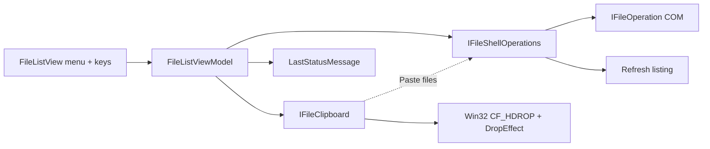

# File List Cut / Copy / Paste / Delete

Parent: [docs/debts.md](docs/debts.md) (File List context menu). Related shipped work: Rename List **14e** Properties / shell opener ([rename-list-ui.plan.md](docs/plans/rename-list-ui.plan.md)). **Not** Rename List **14f** drag-out FileDrop.

On approve, save this plan as [docs/plans/file-list-cut-copy-paste-delete.plan.md](docs/plans/file-list-cut-copy-paste-delete.plan.md) (kebab-case under `docs/plans/` only).

## Product call

Ship **Explorer-class File List clipboard/delete now**, independent of Undo. This is the right next feature: users already treat the pane as a folder browser (Open / Explorer / Properties); missing Cut/Copy/Paste/Delete is the gap that makes it feel incomplete.

| Call              | Verdict                                     | Why                                                                                                                          |
| ----------------- | ------------------------------------------- | ---------------------------------------------------------------------------------------------------------------------------- |
| Mechanism         | `IFileOperation` + Win32 file clipboard     | Round-trip with Explorer is the product; Avalonia-only clipboard would feel broken the first time someone pastes in Explorer |
| Undo              | Stay out                                    | Recycle Bin is the undo for delete; app Undo stays rename-only. Coupling would delay this feature for no user value          |
| Surfaces          | Context menu + keys only                    | Matches Properties / Copy path; power users have Ctrl+X/C/V/Del. Main-menu Edit items can wait                               |
| Shift+Delete      | **In v1**                                   | Explorer muscle memory; shell owns the permanent-delete confirm — do not hide behind Options                                 |
| Confirms          | Shell UI only                               | No second app dialog and no new `ConfirmationKind` — double prompts feel worse than Explorer                                 |
| Copy vs Copy path | Keep both                                   | Different jobs (files vs text for docs/scripts); rename nothing                                                              |
| Ghosting          | In v1 with Cut                              | Without dimmed cut rows, Cut is ambiguous and users will Paste twice or lose track                                           |
| Paste target      | Current folder only                         | Same as Explorer folder view; no “paste into selected subfolder” unless we later want it                                     |
| Status            | Failures + light success                    | Silent shell is fine for happy path; sticky error when cancel/fail matches Copy path                                         |
| Scope cut         | No RL clipboard, no full shell menu, no 14f | Ships the File List debt without boiling the ocean                                                                           |

**Do not** wait for Undo, Avalonia 12, or Options “Explorer shell integrate.” Those are orthogonal.

## Decisions (locked)

- **Explorer semantics, not GongShell:** MFR7 got these verbs from embedded `IShellView`. finebytes reimplements with **`IFileOperation`** (delete/copy/move + shell UI) and **Win32 file clipboard** (`CF_HDROP` / shell ID list + `Preferred DropEffect`) so Paste works with Explorer both ways.
- **Independent of Undo:** no rename-log / Undo Last integration (matches MFR7 separation; user requirement).
- **Surfaces:** File List **context menu** + **keyboard** only (same pattern as Properties / Copy path). No File List main-menu items in v1.
- **Keep “Copy path”:** text multiline paths stay; new **Copy** is file clipboard (Explorer-compatible). Distinct headers.
- **Delete:** `Del` → Recycle (`FOF_ALLOWUNDO` / `IFileOperation` undo-to-bin). **`Shift+Del` → permanent** (shell confirm). Confirmations are **shell dialogs**, not a new `ConfirmationKind`.
- **Paste target:** current navigated folder (`CurrentPath`). Disabled at Computer root / non-filesystem places where paste cannot land.
- **Cut ghosting:** dim/opacity style on entries whose paths are on the cut clipboard until clipboard changes, paste completes, or cut set is cleared.
- **Windows-only real ops:** `OperatingSystem.IsWindows()` implementations; null/no-op elsewhere (mirror [`IFileShellOpener`](Mfr.App.Ui/Services/Shell/IFileShellOpener.cs)). Linux CI: VM tests with fakes; `[WindowsFact]` only where OS clipboard/shell is required.
- **Focus-scoped keys:** File List handles Ctrl+X/C/V, Del, Shift+Del when that pane is focused; Rename List / Applied Filters **Del = remove rows/filters** unchanged.
- **After mutate:** refresh File List listing; publish sticky status on failure (and light success where useful), same channel as Copy path ([status-bar-outcomes](docs/plans/status-bar-outcomes.plan.md)).
- **Non-file clipboard:** Paste disabled (no text/image paste into folder).

## MFR7 reference brief

### Sources

- Help: `Help/fileexp.html` — right-click → **Windows Context Menu** (entry for Cut/Copy/Paste/Delete)
- Host: `D:\Devl\mfr7\Core\MFRGui\Forms\FileList\MFRExplorer.cs` (`ShellView` embed)
- Shell: GongShell `ShellView.cs` / `ShellContextMenu.cs` — verbs via `IContextMenu`; `InvokeDelete` only helper; **no** app `IFileOperation` / CF_HDROP writers
- Undo: `Main.UndoLast` / rename log only — **not** tied to File List clipboard/delete
- finebytes: deferred in debts; context menu lacks these items; [`ITextClipboard`](Mfr.App.Ui/Services/FileList/ITextClipboard.cs) is text-only; DnD uses Avalonia `DataFormat.File` ([`LocalFileDrop`](Mfr.App.Ui/Views/DragAndDrop/LocalFileDrop.cs), [`FileListView._BuildFileDataTransferAsync`](Mfr.App.Ui/Views/FileList/FileListView.axaml.cs))

### Behavior

- Purpose: Explorer-class file Cut/Copy/Paste/Delete inside the File List folder view
- MFR7 mechanism: native DefView — cut ghosting, Recycle vs permanent, confirms, multi-select all shell-owned
- GongShell quirk: `DeleteSelectedItems()` stubbed → **Del key often no-op**; context-menu Delete works. finebytes will **fix** Del (intentional better-than-MFR7)
- Shortcuts in MFR7 app menus: none; Explorer keys when DefView focused

### UX notes

- No MFR app menu items for these ops; documented path is the Windows context menu
- Multi-select true; Paste into current folder

### Parity gaps / intentional diffs

- Custom Avalonia list → must own clipboard + `IFileOperation` (cannot host GongShell)
- Working Del + Shift+Del
- Keep finebytes-only **Copy path** and **Add** items alongside shell-like Cut/Copy/Paste/Delete
- Optional status-bar outcomes (MFR7 silent)

## Non-goals

- Undo Last / `.mfrlog` / Options Undo & Log tab
- Rename List Cut/Copy/Paste/Delete or drag-out FileDrop (**14f**)
- Embedding full Explorer context menu / other shell verbs
- New `ConfirmationKind` / Options row for delete
- Avalonia-only clipboard that does **not** round-trip with Explorer
- Permanent delete without Shift (no “always permanent” mode)
- View-mode radios on context menu (still deferred debt)

## Architecture

- **New** [`IFileShellOperations`](Mfr.App.Ui/Services/Shell/) (name exact in implement): `Delete(paths, recycle)`, `Copy(paths, destDir)`, `Move(paths, destDir)` — Windows COM; null elsewhere; injectable recording fake for tests. Do **not** overload [`IFileShellOpener`](Mfr.App.Ui/Services/Shell/IFileShellOpener.cs) (open/reveal/properties stay separate).
- **New** [`IFileClipboard`](Mfr.App.Ui/Services/FileList/): `SetCopy` / `SetCut`, `TryGetPaste`, `HasPasteableFiles`, cut-path set for ghosting; keep [`ITextClipboard`](Mfr.App.Ui/Services/FileList/ITextClipboard.cs) for Copy path.
- VM owns commands + CanExecute; view wires gestures (same Alt+Enter tunnel pattern as Properties).

## Phases

### P1 — Shell file operations service

- **Scope:** `IFileShellOperations` + `WindowsFileShellOperations` (`IFileOperation`: delete with/without recycle, copy, move; owner HWND when available; shell UI/progress). Factory + `NullFileShellOperations`. Recording fake under tests.
- **Exit:** Windows implementation compiles; non-Windows null; unit tests assert fake call shapes (paths, recycle flag, dest).
- **Tests:** `Mfr.Tests/Ui/Services/Shell/` (or FileList) with recording fake — no real Recycle Bin in CI.

### P2 — Delete (Recycle + permanent)

- **Scope:** `FileListViewModel` Delete / DeletePermanent commands; context menu **Delete**; `Del` / `Shift+Del` when File List focused ([`AppShortcuts`](Mfr.App.Ui/Input/AppShortcuts.cs) + [`docs/keyboard-shortcuts.md`](docs/keyboard-shortcuts.md)); confirm via shell only; refresh; status on cancel/fail.
- **Exit:** Multi-select delete to bin; Shift+Del permanent; Computer root / empty selection disabled; RL/AF Del unchanged.
- **Tests:** VM CanExecute + fake ops; headless menu header + key tunnel smoke ([`mfr-ui-headless-tests`](.agents/skills/mfr-ui-headless-tests/SKILL.md)).

### P3 — Cut / Copy clipboard write + ghosting

- **Scope:** `IFileClipboard` Win32 write (files + `Preferred DropEffect` Copy vs Move); menu **Cut** / **Copy**; Ctrl+X / Ctrl+C; cut-mark collection + AXAML opacity/style on matching rows; clear marks when clipboard replaced or SetCopy.
- **Exit:** Cut/Copy enable with selection; Explorer can Paste a Copy from MFR (**manual QA** on Windows — not automated); cut rows look ghosted in current listing.
- **Tests:** fake clipboard; VM cut/copy; style/ghost unit or headless binding check. Explorer round-trip = manual QA note in phase exit.

### P4 — Paste into current folder

- **Scope:** Paste command + Ctrl+V; read clipboard files; Copy vs Move from DropEffect; `IFileShellOperations` copy/move into `CurrentPath`; refresh; clear cut marks after successful move-paste; disable when no file payload or non-pasteable location.
- **Exit:** Paste from MFR Cut/Copy and from Explorer into current folder; conflicts/progress use shell UI.
- **Tests:** fake clipboard + ops sequencing; CanPaste matrix; headless Paste enable/disable.

### P5 — Docs + debt clear

- **Scope:** Update [docs/debts.md](docs/debts.md) (remove Cut/Copy/Paste/Delete bullet); shortcuts doc already touched in P2 — verify; brief note in plan frontmatter todos completed.
- **Exit:** Debt gone; keyboard doc lists File List Cut/Copy/Paste/Delete/Shift+Delete.
- **Tests:** none beyond doc lint if edited.

## Manual QA (once on Windows)

1. Cut/Copy in File List → Paste in Explorer (and reverse).
1. Delete → Recycle; Shift+Delete → permanent confirm.
1. Cut ghosting clears after Paste or Copy.
1. Del in Rename List still removes rows, not files.
