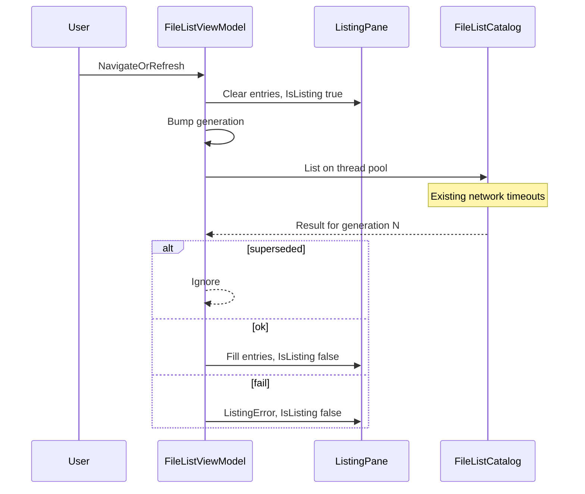

# File List loading indicator plan

## Decisions (locked)

- **UX:** In-pane overlay in the listing area (same host as `ListingError`) — centered “Loading…” text; no modal dialog, no wait cursor, no status-bar “Loading…” (status-bar plan keeps navigate silent).
- **Concurrency:** Path/breadcrumbs update immediately; list clears; background `List`; **latest navigate/refresh/mask reload wins** via generation token (cancel prior apply, not OS SMB).
- **Gating:** Do **not** add Rename List–style global `IsBusy` that blocks Cut/Copy/Paste/Delete. Selection is already empty during load. Navigate/Refresh/mask/exclude always allowed; they bump generation and restart. Shell ops that still run use current `CurrentPath` / empty selection as today.
- **When to show:** Set `IsListing` as soon as a reload starts; clear when that generation completes (success, failure → `ListingError`, or superseded). Fast local folders may flash briefly — acceptable; no delay threshold in v1 (YAGNI).
- **MFR7:** No parity requirement for busy chrome (shell view had none). This is a finebytes improvement for sync-UI freezes on network/large dirs.

## MFR7 reference brief

- **Sources:** Help `fileexp.html`; `hints.txt`; `MFRExplorer.cs` (GongSolutions `ShellView`); finebytes `_ReloadEntries` / status-bar plan.
- **Behavior:** No custom File List loading indicator; shell fills when ready; slow dirs can freeze with no busy chrome.
- **Parity gap:** finebytes sync list + `ListingError` only — same absence of busy UI; we intentionally add overlay beyond MFR7.

## Non-goals

- Rename List progress dialog reuse / modal Stop button for folder open.
- Sticky status-bar navigate/list messages (“Listed N…”).
- True cancel of OS network I/O (keep existing probe timeouts in [`FileListCatalog`](Mfr.App.Ui/Services/FileList/FileListCatalog.cs)).
- Streaming/partial list as items arrive.
- Thumbnail load busy (already async via `FileListThumbnailSession`).
- Wait cursor or address-bar spinner polish.

## Current gap

[`FileListViewModel._ReloadEntries`](Mfr.App.Ui/ViewModels/FileList/FileListViewModel.cs) clears entries then calls `FileListCatalog.List` on the UI thread. Network paths already use `Task.Run` + timeout **inside** catalog, but the VM still waits synchronously — UI freezes up to ~3–8s. [`FileListView.axaml`](Mfr.App.Ui/Views/FileList/FileListView.axaml) only overlays `HasListingError`.

## Phases

### P1 — Async reload + `IsListing` + overlay

- **Scope / files:**
  - [`FileListViewModel.cs`](Mfr.App.Ui/ViewModels/FileList/FileListViewModel.cs) — `IsListing` / `HasListingBusy` (or bind `IsListing`); `_listingGeneration`; replace sync `_ReloadEntries` with async start: clear UI state, capture path/mask/exclude snapshot + generation, `Task.Run(() => FileListCatalog.List(...))`, marshal apply via Avalonia UI thread / captured sync context; ignore stale generations; dispose/cancel pending on `Dispose`.
  - Call sites stay: `_Navigate`, `Refresh`, `OnMaskChanged`, `OnExcludeMasks*`, paste/delete refresh — all kick `_ReloadEntries` (sync signature OK if fire-and-forget with generation).
  - [`FileListView.axaml`](Mfr.App.Ui/Views/FileList/FileListView.axaml) — sibling `StackPanel` to listing-error overlay: `IsVisible="{Binding IsListing}"`, text “Loading…”, same centering/opacity as error panel; mutually exclusive with error (error only after load finishes).
- **Exit criteria:** Navigating to a slow/UNC path updates breadcrumbs immediately, shows overlay, UI stays responsive; result or `ListingError` replaces overlay; rapid navigate only applies last path; clean local refresh still works; no status bar on navigate.
- **Tests** ([`FileListViewModelTests.cs`](Mfr.Tests/Ui/FileList/FileListViewModelTests.cs)):
  - `IsListing` true while a controlled slow catalog (injectable list func or test hook) runs; false after complete.
  - Superseded generation ignored (start load A, navigate B before A completes → entries for B only).
  - Existing inaccessible-folder / navigate-clears-error tests still pass (await completion helper).
  - `Navigate_Does_Not_Set_LastStatusMessage` unchanged.
  - Optional headless: overlay visible when `IsListing` ([`FileListViewTests.cs`](Mfr.Tests/Ui/FileList/FileListViewTests.cs)) if cheap.

### P2 — Harden edges (same PR if small)

- **Scope:** Ensure mask/exclude/view-mode changes during an in-flight list either bump generation (mask/exclude already reload) or apply only to current generation’s items (sort/view mode on `_listedItems` after apply — avoid rebuilding from stale list). Document that SMB work may still finish in background after cancel (generation discard only).
- **Exit:** No double-apply races in tests; Dispose mid-load does not throw into UI.

## Parent / related

- Status bar: [status-bar-outcomes.plan.md](docs/plans/status-bar-outcomes.plan.md) — navigate remains out of scope for sticky text.
- Debt: none filed for this; improvement over MFR7 shell freeze.
