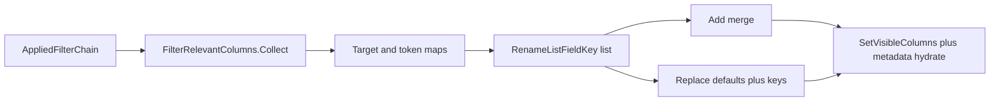

# Filter-relevant Rename List columns

Parent: [rename-list-ui.plan.md](rename-list-ui.plan.md) (block 5 columns / shuttle — complete).

## Status

- [x] P1 — Collect + map API
- [ ] P2 — Rename List Add / Replace commands
- [ ] P3 — Docs + tips/shortcuts + broaden token map coverage

## Decisions (locked)

- **Modes:** two commands — **Add** (merge missing relevant keys at end; keep existing order/widths) and **Replace** (set visible columns to catalog defaults, then append any relevant keys not already in defaults).
- **Menu labels:** **Add Fields by Applied Filters** / **Replace Fields by Applied Filters** (not “for”).
- **Scope:** always the **entire applied filter chain** (`AppliedFiltersViewModel` → `ToChain()` / all steps), not the Applied Filters selection.
- **Sources of relevance:** (1) write **Apply-To / setter fields**, (2) **format tokens** parsed from filter option templates.
- **Key sides:** write-mapped fields → Original + Preview when `SupportsPreview`; token-mapped fields → Original always, plus Preview when `SupportsPreview`.
- **Unmapped / empty:** skip unmapped targets/tokens silently; disable both commands when the chain is empty; if the chain is non-empty but nothing maps, Add is a no-op and Replace still applies defaults-only (same as Replace with empty relevant set).
- **Disabled steps:** still included (options/targets matter for “what this set cares about”).
- **Non-goal:** no auto-run on filter edit; no sort-key changes; no MFR7 parity claim (feature is new).

## MFR7 reference brief

- **Sources:** Help `fieldselector.html`, `renamelist.html#selectfields`; `FieldSelector.cs` / `RenameGrid.cs` / `Preset.cs`; hints `SelectShownFields` / `HideField`; filter help that only *advises* manual columns.
- **Behavior:** **No** auto-add/replace columns from selected filters. Columns change via Field Selector or optional preset `Headers`.
- **Parity gaps:** finebytes **invents** live chain→column inference; ports already done for shuttle / session / preset `visibleColumns`.

## Approach

### Inference (L3 `Mfr.Filters`)

New helper e.g. `FilterRelevantRenameListColumns`:

1. **Writes**

   - `StringTargetFilter` → `Target`; reverse-lookup `RenameListFieldCatalog.All` where `WriteTarget` equals (record equality). Skip Id3v1/Id3v2/Xiph / unmatched `AncestorFolder` levels with no catalog field.
   - `AudioTagSetter` → non-null semantic option slots → AudioTag fields.
   - `Id3v2FieldSetter` / other non-mapped writers → skip until a column exists (YAGNI).
   - `DateTimeSetter` / `TimeShifter` / `AttributesSetter` / `PathMover` / `TagRemover` → map only where a clear Extended/Basic column exists (explicit switch; skip otherwise).

1. **Reads (tokens)**

   - Per-filter template collector (switch on known option types): Formatter template, Inserter text, Name List prefix/suffix, AudioTagSetter field texts, Id3v2 text, PathMover templates, etc.
   - `FormatStringSyntax.TryValidate` → `CanonicalName` set.
   - Explicit **canonical name → `(groupId, propertyKey)`** table (static, unit-tested). Meta/session-only tokens (`counter`, `substring`, …) omit.

1. **Output:** ordered unique `RenameListFieldKey`s (stable: chain order, then write keys before token keys, Original before Preview).

### Apply (L5 UI)

Extend `RenameListViewModel` (already has `_appliedFilters`):

- `AddRelevantColumnsCommand` / `ReplaceWithRelevantColumnsCommand`
- Add: append keys not already visible (`Width = -1`)
- Replace: `CreateDefaults()` then append remaining relevant keys
- After change: same metadata hydrate path as field-shuttle apply

**UX entry points** (next to Select Visible Fields):

- Rename List menu in `MainWindow.axaml`
- Rename List header / grid context menus
- Labels: **Add Fields by Applied Filters** / **Replace Fields by Applied Filters**
- Tips in `AppTips`; note in `docs/keyboard-shortcuts.md` (no dedicated shortcut in v1)

## Non-goals

- Auto-update columns when filters change
- Changing Auto-Sort keys
- Mapping every Id3v2 frame / Xiph field to columns
- Selection-scoped inference
- Preset save/load changes

## Phases

### P1 — Collect + map API

- Scope: `Mfr.Filters` helper + token name table + unit tests (`Mfr.Tests`) for StringTarget, Formatter tokens, AudioTagSetter, empty/unmapped.
- Exit: `Collect(IEnumerable<BaseFilter>)` returns expected keys for fixtures; no UI yet.

### P2 — Rename List Add / Replace commands

- Scope: `RenameListViewModel` commands + metadata hydrate; wire menus; enable when chain non-empty.
- Exit: headless or VM tests cover Add merge, Replace defaults+relevant, empty-chain disabled, dedupe.

### P3 — Docs + tips/shortcuts + broaden token map

- Scope: keep this plan file current; update keyboard-shortcuts / tips; expand token map coverage for Media/Mpeg/Image/Exif groups already in catalog.
- Exit: docs match UI; table covers main token families used by sample filters.
