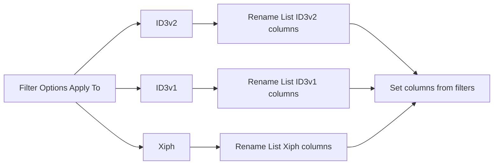

# Format-specific audio tag Rename List columns

## Why

Filter Options **Apply To** already offers block-specific targets (see Finebytes UI: File Name, Path, Audio Tag, **ID3v1**, **ID3v2**, **Xiph**). Set/Add columns from filters must follow those same write targets — not only semantic Audio Tag.

MFR7 had ID3v1/ID3v2 column groups; finebytes also ships **Xiph** Apply-To (`XiphFieldTarget` + known keys), so Xiph belongs in this plan even though MFR7 had no Xiph property group.

| Apply-To group (today) | FilterTarget | Rename List group | Phase |
| --- | --- | --- | --- |
| Audio Tag | `SemanticAudioField` | `MediaTag` (done) | — |
| **ID3v2** | `Id3v2Frame` (+ Field Setter) | `ID3v2` / MP3 ID3v2 | **P1** |
| **ID3v1** | `Id3v1Field` | `ID3v1` / MP3 ID3v1 | **P2** |
| **Xiph** | `XiphField` | `Xiph` | **P3** |
| (none yet) | Apple / ASF / APE / RIFF | — | Backlog until Apply-To exists |

**Rule of thumb:** if users can Apply To a block in Filter Options, that block gets a Rename List group and relevant-column wiring.

## Locked decisions (defaults chosen)

### Product defaults (former open calls)

1. **Shuttle duplication** — Accept MFR7-style overlap (Audio Tag + ID3v2 + Xiph can all show Title-like fields). No “common frames only” subset in v1.
2. **Relevant columns = block only** — Do **not** also add MediaTag when a format field is inferred.
3. **Xiph field set** — Full [`XiphKnownKeys.All`](Mfr.Models/Tags/Xiph/XiphKnownKeys.cs) (parity with Apply-To), including aliases (`DESCRIPTION`/`COMMENT`, `DATE`/`YEAR`, track/disc totals, …).
4. **Group naming** — MFR7 labels **MP3 ID3v1** / **MP3 ID3v2**; Xiph label **Xiph** (matches Apply-To).
5. **Ship** — Implement P1→P2→P3 in one feature track; do not market “done” until all three land (phased commits OK).
6. **Apple / ASF** — Leave asymmetric for now; docs note format columns track Apply-To groups.

### Shared

1. Format-specific columns show **that block only** (not semantic broadcast).
2. Relevant columns emit the **format-specific** catalog key — **not** also MediaTag Title.
3. `supportsPreview: true` + `WriteTarget` matching the Apply-To target type.
4. Resolve / F2 override via existing [`AudioOverlayBlockFieldIo`](Mfr.Models/Tags/AudioOverlayBlockFieldIo.cs) / block getters.

### P1 — ID3v2

1. Group `ID3v2`, label **MP3 ID3v2**; property keys = modeled frame ids ([`Id3v2ModeledFrame`](Mfr.Models/Tags/Id3v2/Id3v2ModeledFrame.cs)).
2. No MFR7 legacy `Title [ID3v2]` aliases — frame-id keys only.
3. Display names from [`Id3v2FrameLabels`](Mfr.Models/Tags/Id3v2/).
4. `WriteTarget = new Id3v2FrameTarget(frameId)` (primary `COMM` / `USLT` / `TXXX`).
5. RO **Version** column from overlay version.
6. Skip unmodeled web/UFID/APIC.
7. Explicit `_CollectWriteKeys` for **`Id3v2FieldSetterFilter`** (not a string target); string `Id3v2FrameTarget` falls out of catalog reverse-map.

### P2 — ID3v1

1. Group `ID3v1`, label **MP3 ID3v1**: Title, Artist, Album, Year, Comment, Track, Genre.
2. `WriteTarget = Id3v1FieldTarget`; relevant columns for that target.

### P3 — Xiph

1. Group `Xiph`, label **Xiph**.
2. Property keys = full `XiphKnownKeys.All` (modeled keys only; unknown on-disk keys stay omitted).
3. Display names / tips from [`XiphKeyLabels`](Mfr.Models/Tags/Xiph/XiphKeyLabels.cs).
4. `WriteTarget = new XiphFieldTarget(key)`.
5. No dedicated Field Setter — string filters with `XiphField` target suffice for relevant columns via WriteTarget map.

## Root cause

[`FilterRelevantRenameListColumns`](Mfr.Filters/FilterRelevantRenameListColumns.cs) reverse-maps catalog `WriteTarget`s. Format-specific Apply-To targets (`Id3v2Frame`, `Id3v1Field`, `XiphField`) currently miss the map → empty relevant columns. Field Setter is an extra miss for ID3v2 only.

## Implementation sketch

### P1 / P1b — ID3v2

- [`Mfr.Models/RenameList/Fields/Id3v2/`](Mfr.Models/RenameList/Fields/) + catalog register + docs.
- `_CollectWriteKeys` for `Id3v2FieldSetterFilter`.
- Tests: setter/Formatter TIT2; flip old “TIT2 = empty map” tests.

### P2 — ID3v1

- [`Mfr.Models/RenameList/Fields/Id3v1/`](Mfr.Models/RenameList/Fields/) + WriteTargets + relevant-column tests for `Id3v1FieldTarget`.

### P3 — Xiph

- [`Mfr.Models/RenameList/Fields/Xiph/`](Mfr.Models/RenameList/Fields/) from `XiphKnownKeys` + `XiphFieldTarget`.
- Confirm Formatter/Remove Spaces on `XiphFieldTarget("TITLE")` adds Xiph Title Original+Preview.
- Doc note in [`docs/audio-tag-model.md`](docs/audio-tag-model.md).

## Caveats (accepted with defaults)

- **Shuttle size** — ~70 ID3v2 + ~7 ID3v1 + ~34 Xiph fields alongside Audio Tag; labels disambiguate (`Title` vs `TIT2 (Title)` vs `TITLE`).
- **Primary-only multi-instance** — One COMM/USLT/TXXX column (primary instance). Extra language/description frames stay invisible as columns; relevant columns still add the single COMM row by frame id.
- **TRCK / TPOS** — One ID3v2 column with full text (`3/12`); Audio Tag still has separate Track / Track Count.
- **Wrong-container emptiness** — ID3v2 columns empty on FLAC; Xiph empty on MP3 — expected on mixed lists.
- **Semantic vs block drift** — Writing ID3v1 Title while ID3v2 Title exists: ID3v1 column updates; Audio Tag Title may still prefer ID3v2 (generic read order).
- **F2 / Edit as Name List** — WriteTargets make format columns editable like Audio Tag — intentional.
- **A/B Mode / Preview** — Each writable field can double as Original+Preview; large selections hurt horizontal space.
- **Persistence** — New group ids soft-load in prefs; no migration.
- **Hydration cost** — Same TagLib bucket as Audio Tag; little extra I/O if Audio Tag columns already visible.

## Non-goals (this plan)

- Apple / ASF / APE / RIFF INFO columns (no Apply-To group yet)
- Dual-adding MediaTag when a block field is inferred
- FreeDB group
- New Field Setters for Xiph/ID3v1
- Changing existing setter apply/commit behavior

## Save location

When locking for implementation, also copy to [`docs/plans/format-specific-tag-columns.plan.md`](docs/plans/format-specific-tag-columns.plan.md) per AGENTS.md.
