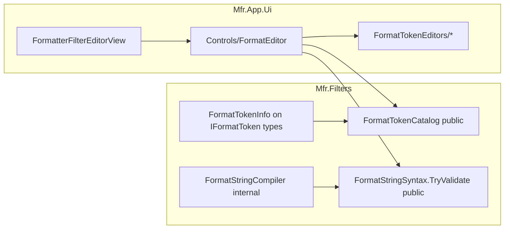

# F6 — Formatter FormatEditor UX

Canonical backlog entry: [applied-filter-editors.plan.md](docs/plans/applied-filter-editors.plan.md) § F6. This plan is the detailed sub-project; keep that backlog item in sync as phases complete.

## Current state

- Formatter Filter Configuration already has a live multiline `TextBox` bound to `FormatterFilter.Options.Template` ([FormatterFilterEditorView.axaml](Mfr.App.Ui/Views/FilterEditors/Formatting/FormatterFilterEditorView.axaml) / [FormatterFilterEditorViewModel.cs](Mfr.App.Ui/ViewModels/FilterEditors/Formatting/FormatterFilterEditorViewModel.cs)).
- Token engine is solid but **UI-opaque**: `IFormatToken` + `FormatStringCompiler` are `internal`; only `Mfr.Tests` has `InternalsVisibleTo`. Invalid templates throw at `_Setup()` and mark all Rename List rows `PreviewError` ([RenameList.cs](Mfr.Engine/RenameList/RenameList.cs)).
- No shared format-string control; PathMover / Inserter / Audio Tag Setter still use plain text boxes (reuse later).

## UX stance: MFR7 chrome + targeted upgrades

**Keep MFR7’s interaction model** (muscle memory for MFR7 users; KISS; no second inventing of format-string UX):

- Text box + **▶ Insert** + **Edit** buttons on the right
- Insert **defaults at caret**; customize afterward via Edit / right-click (no modal on every insert)
- Param dialogs with live “resulting format string” preview
- Click error affordance → details + select bad span
- Double-click selects whole token when on a span

**Improve where MFR7 is weak** (small, high-value; not a redesign):

| Upgrade                         | Why                                                                                                                                                                                                       |
| ------------------------------- | --------------------------------------------------------------------------------------------------------------------------------------------------------------------------------------------------------- |
| **Searchable token picker**     | Cascading-only menus are painful with 50+ tokens (deep Audio/Image trees). ▶ opens a flyout: filter box at top + grouped list (or filtered flat results). Nested groups remain for browse-without-search. |
| **Inline error text**           | Show the parse message under the box immediately (truncated). Click still jumps/selects and can open full details. MFR7 hid everything behind a “details” link.                                           |
| **Tooltips on catalog rows**    | Short description on the item itself; status-bar hint is optional secondary (MFR7 status-only was easy to miss).                                                                                          |
| **No red/blue highlight in F6** | Expensive without AvaloniaEdit; error jump covers the failure case. Debt for later.                                                                                                                       |

**Explicitly not doing** (overkill / low ROI for F6): `<`-triggered autocomplete chips, redesigning param dialogs into inline expanders, opening a param dialog on every parameterized insert.

## Goals (F6 done when)

1. **Token catalog** — searchable + grouped insert UI from finebytes tokens + metadata.
1. **Insert at caret** — pick inserts default `<token…>` at caret / selection.
1. **Parse-error feedback** — inline error text; click → select bad span (`JumpToError`); optional full-message dialog.
1. **Customize token** — Edit / right-click opens a parameter dialog when the token takes args; replaces the span in place.
1. **Shareable control** — one Avalonia `FormatEditor`; **only Formatter ships it in F6**.

## Non-goals (explicit cuts)

- **No syntax highlighting** (MFR7 red/blue RichTextBox). No AvaloniaEdit dependency. Add a short debt bullet in [docs/debts.md](docs/debts.md).
- **Do not** swap PathMover / Inserter / Audio / ID3v2 fields to FormatEditor in F6 (API + control must allow it later).
- **Do not** port missing MFR7 tokens (clipboard, NameList FP, etc.).
- **Do not** build HTML help (`fp.html`); catalog tooltips (+ optional status hints) cover short desc. Per-filter `?` help stays F9.
- **Do not** change rename preview wiring or disable the filter on parse error beyond what engine already does.
- **Do not** open a parameter dialog on every insert (keep MFR7 two-step).

## Architecture



**Layering rule:** UI never gets `InternalsVisibleTo` on Filters. Expose a small **public** surface for catalog + validation + token spans.

______________________________________________________________________

## Phase 1 — Engine: catalog + validate-with-spans

### 1a. Token UI metadata

Add `[FormatTokenInfo(DisplayName, Group, ShortDescription, Initial)]` (MFR7 `FormattingParameterInfo` shape) on every concrete `IFormatToken` type under [Mfr.Filters/Formatting/Tokens/](Mfr.Filters/Formatting/Tokens/).

- `Group`: path with `\` for nesting (`File Name`, `File Properties`, `General`, `Audio\…`, `Image\…`, `Mpeg\…`, etc.) — mirror MFR7 groups from [formatter-tokens.md](.agents/skills/mfr7-reference/formatter-tokens.md) / install Help.
- `Initial`: inner text for default insert (no angle brackets), e.g. `file-name`, or full default args for parameterized tokens (`counter:initial=1,step=1,padding=none,length=2,resetScope=global`).
- Multi-class files (`SemanticAudioFieldTokens`, `ImagePropertyTokens`, …): one attribute per sealed token class.

### 1b. Public catalog

```csharp
// Mfr.Filters/Formatting/FormatTokenCatalog.cs (public)
public sealed record FormatTokenCatalogEntry(
    string DisplayName,
    string GroupPath,
    string ShortDescription,
    string InsertText,      // "<" + Initial + ">"
    string CanonicalName);  // Names[0]

public static class FormatTokenCatalog
{
    public static IReadOnlyList<FormatTokenCatalogEntry> Entries { get; }
}
```

Discover via the same assembly scan as `FormatStringCompiler`; require attribute (startup / test failure if missing). Sort for menu: group path then display name (MFR7 alpha sort).

### 1c. Public validation + spans

Refactor scan logic so compile and UI share one parser path:

```csharp
public sealed record FormatTokenSpan(int Start, int Length, string CanonicalName, string Args);
public sealed record FormatStringParseResult(
    bool Success,
    string? ErrorMessage,
    int ErrorPosition,   // -1 when OK
    int ErrorLength,
    IReadOnlyList<FormatTokenSpan> Tokens);

public static class FormatStringSyntax
{
    public static FormatStringParseResult TryValidate(string template);
}
```

Behavior:

- Walk balanced `<…>` spans (reuse `_FindMatchingClose`).
- Unknown name / `Compile`/`ArgumentException` → `Success=false` with **span of that token** (position/length).
- Unclosed `<` that looks like a token name → error at that open (today compiler treats many as literals; UI should surface likely-token failures consistently — prefer validating only spans that pass `_LooksLikeFormatterTokenName`, matching `ContainsLikelyFormatTokens`).
- Keep `FormatStringCompiler.Compile` throwing as today (engine behavior unchanged); implement `Compile` on top of the shared scan or call `TryValidate` then compile.

### 1d. Engine tests

- Catalog: every discovered `IFormatToken` has metadata; `InsertText` parses; no duplicate display entries for aliases (catalog lists **canonical** only; aliases still compile).
- `TryValidate`: unknown token, bad `counter`/`substr` args, good mixed template, empty template.
- Existing `FormatStringCompilerTests` still pass.

______________________________________________________________________

## Phase 2 — Shared `FormatEditor` + Formatter host

### 2a. Control layout (MFR7 chrome + upgrades)

New folder: [Mfr.App.Ui/Views/Controls/FormatEditor/](Mfr.App.Ui/Views/Controls/) (and matching VM if needed under `ViewModels/Controls/FormatEditor/`).

| Piece                             | Behavior                                                                                                                                                                                                                                              |
| --------------------------------- | ----------------------------------------------------------------------------------------------------------------------------------------------------------------------------------------------------------------------------------------------------- |
| Multiline / single-line `TextBox` | `Text` DP or two-way bindable property; reuse `filter-editor-field-wrap` / field styles; double-click on a validated span selects that token                                                                                                          |
| **Insert** button (`▶`)           | Opens picker flyout: **search box** + grouped catalog (`GroupPath`). Typing filters by display name / canonical name / short desc. Choosing a row inserts `InsertText` at caret / replaces selection. Each row has a `ToolTip` with short description |
| **Edit** button                   | Resolve token under caret from last `TryValidate` spans → open param editor (Phase 3). If none: warning dialog (MFR7 copy)                                                                                                                            |
| Error row                         | When fail: show truncated **inline** `ErrorMessage` (link/button styling). Click → focus + select `ErrorPosition`/`ErrorLength`; long messages may also open a details dialog                                                                         |
| Right-click                       | Context menu: Edit token under pointer (Phase 3)                                                                                                                                                                                                      |

Caret / selection mutation lives in **control code-behind** (Avalonia `TextBox.CaretIndex` / `SelectionStart`); VM owns the string and error state only.

Validate on text change (debounce lightly if needed). Do **not** call `Setup()` from the control.

### 2b. Wire Formatter

Replace `TemplateBox` in [FormatterFilterEditorView.axaml](Mfr.App.Ui/Views/FilterEditors/Formatting/FormatterFilterEditorView.axaml) with `FormatEditor` bound to `Template`. Keep live `ApplyIfChanged` path in the existing VM.

Styles: add only what’s needed in [FilterEditor.axaml](Mfr.App.Ui/Themes/FilterEditor.axaml) (compact insert/edit buttons, error link) — no one-off chrome elsewhere.

### 2c. UI tests

- VM: template still updates `FormatterOptions`.
- Headless: open Insert menu (or invoke insert API on control), assert text contains inserted token; set bad template, assert error visible; invoke jump, assert selection (where headless allows — follow `mfr-ui-headless-tests`).
- Extend [FormatterFilterEditorViewTests.cs](Mfr.Tests/Ui/FilterEditors/Formatting/FormatterFilterEditorViewTests.cs); add `FormatEditor` control tests under `Mfr.Tests/Ui/Controls/FormatEditor/`.

**Phase 2 exit:** Formatter users can browse tokens, insert defaults, see and jump to parse errors. Edit button may show “not yet” / literal warning until Phase 3.

______________________________________________________________________

## Phase 3 — Token parameter editors

### 3a. Registry

UI registry maps `CanonicalName` → editor factory (VM + dialog). Tokens **without** args: Edit shows the MFR7-style “cursor must be on a parameter” / “no options” message (no dialog).

### 3b. Ship editors for every arg-bearing token

| Token               | Dialog fields (from token docs / MFR7 FP editors)                            |
| ------------------- | ---------------------------------------------------------------------------- |
| `counter`           | initial, step, padding, length, resetScope + live resulting token preview    |
| `substr`            | start, end, source (nested format string — plain `FormatEditor` or text box) |
| `token`             | delimiter, index, source (same)                                              |
| `file-date`         | which date + format string                                                   |
| `file-size`         | unit / format options per token                                              |
| `now` / `exif-date` | format string                                                                |
| `parent-folder`     | level                                                                        |
| `random-char`       | low/high chars                                                               |
| `id3v2`             | frame id (+ language/description if modeled)                                 |
| `exif`              | tag / options per token                                                      |

Pattern: modal `Window` like [FilterOptionsDialog](Mfr.App.Ui/Views/AppliedFilters/FilterOptionsDialog.axaml); OK returns new inner text; FormatEditor replaces the span. Live “Resulting format string” preview of `<name:…>` inside the dialog (MFR7 `FpEditor`).

Shared helpers for named `key=value` tokens to avoid copy-paste.

### 3c. Insert path for parameterized tokens

Menu insert uses catalog `InsertText` (defaults). Customize after insert via Edit / right-click (same as MFR7). No modal on every insert.

### 3d. Tests

Per-editor VM tests (defaults → `InsertText` / round-trip parse); at least one headless FormatEditor “edit under caret” fact for `counter`.

______________________________________________________________________

## How to implement (recommended)

Ship as **three mergeable PRs** that each leave `main` usable. Prefer engine completeness before UI chrome; prefer one vertical FormatEditor slice before farming out every param dialog.

### PR A — Engine foundation (Phase 1)

1. Add `FormatTokenInfoAttribute` + public catalog/parse types first (empty/partial catalog is fine briefly).
1. Annotate **all** token classes in one pass (use MFR7 attrs + [formatter-tokens.md](.agents/skills/mfr7-reference/formatter-tokens.md) + [Formatter.md](Mfr.Filters/docs/Formatting/Formatter.md) for Group/Initial/ShortDesc). Enforce with a test: every `IFormatToken` has exactly one catalog entry.
1. Extract shared span scan from `FormatStringCompiler` into an internal helper; implement `FormatStringSyntax.TryValidate` on top; keep `Compile` throw behavior identical (re-run existing compiler tests).
1. Stop when: catalog lists every canonical token, `TryValidate` has solid unit tests, no UI changes yet.

Do **not** start UI until PR A is green — FormatEditor depends on catalog + spans.

### PR B — FormatEditor + Formatter host (Phase 2)

Build the control **outside** the filter editor first, then swap the TextBox:

1. Scaffold `Views/Controls/FormatEditor/` (+ thin VM): Text + Insert + Edit + error row; styles in `FilterEditor.axaml`.
1. Wire Insert → searchable picker (filter `FormatTokenCatalog.Entries`; grouped when filter empty). Implement caret insert in code-behind; expose a testable `InsertTextAtCaret(string)` / `JumpToError()` on the control.
1. Hook `TryValidate` on text change; show inline error; click jumps.
1. Replace Formatter’s `TemplateBox` with `FormatEditor`; keep existing live `ApplyIfChanged`.
1. Edit button: for now, if no param registry entry, show MFR7-style warning (param dialogs land in PR C).
1. Tests: catalog-driven insert + bad-token error jump (VM + headless). Manually smoke in `just run-ui` with Auto-Preview on.

Exit criteria: Formatter is already better than today (browse/search/insert/errors) even before param dialogs.

### PR C — Param editors (Phase 3), incremental inside the PR or as follow-ups

Do **not** build all dialogs in parallel from scratch. Order by reuse:

1. **Shared shell first**: `FormatTokenEditorDialog` host (title, resulting-string preview, OK/Cancel) + registry `CanonicalName → factory`.
1. **`counter` first** — richest options; proves parse ↔ UI ↔ `InsertText` round-trip; one headless “edit under caret” test.
1. **Simple numeric/string** next: `parent-folder`, `now`, `exif-date`, `random-char`.
1. **Named key=value** batch: `substr`, `token`, `file-date`, `file-size` (share option-grid helper).
1. **Specialized last**: `id3v2`, `exif` (reuse choices from Audio/Exif filter editors where they already exist, e.g. frame id lists).

Each editor: VM unit tests for defaults + round-trip; only `counter` needs a headless FormatEditor integration fact unless something is gesture-heavy.

### Agent-wise execution

Treat F6 as **implementer + separate reviewer per PR**, not one endless chat that self-reviews. The implementer must **not** be the same agent turn that runs `mfr-code-review` for sign-off — spawn a **fresh reviewer Task/subagent** (or new chat) with findings-capable review skill, then the implementer applies only high-confidence fixes and re-runs a short verify. **Do not push** a PR until that reviewer gate passes.

| Session            | Prompt focus                                                                 | Skills to load                                                  | Parallelize?                                             |
| ------------------ | ---------------------------------------------------------------------------- | --------------------------------------------------------------- | -------------------------------------------------------- |
| **A**              | Public catalog + `TryValidate`; annotate every token; Filters tests          | `mfr7-reference`; **not** filter-editor skill                   | Explore may draft Group/Initial tables; parent owns APIs |
| **A-review**       | Review PR A diff only                                                        | `mfr-code-review` (**separate** agent)                          | Never same agent as implementer                          |
| **B**              | Shared `FormatEditor` + Formatter; Edit stub OK                              | `mfr-ui-headless-tests`; `mfr7-reference` skim                  | Sequential; no parallel on new control                   |
| **B-review**       | Review PR B diff only                                                        | `mfr-code-review` (**separate** agent)                          | —                                                        |
| **C1**             | Dialog shell + registry + **`counter` only**                                 | `mfr7-reference`; `mfr-ui-headless-tests`                       | One implementer                                          |
| **C1-review**      | Review C1 diff                                                               | `mfr-code-review` (**separate** agent)                          | —                                                        |
| **C2+**            | Remaining param editors in batches                                           | `mfr7-reference` per token                                      | Parallel OK on disjoint files after C1                   |
| **C2-review**      | Review full C / remaining editors diff                                       | `mfr-code-review` (**separate** agent)                          | —                                                        |
| **Deep-refactors** | After all PRs merged/pushed: aggregate deferred deep refactor/dedup findings | `mfr-code-review` (findings + cost-to-value; write summary doc) | One final reviewer session over whole F6 branch/range    |

**Per-PR gate (mandatory before push)**

1. Implementer finishes phase; `just format` + tests/lint green.
1. Orchestrator launches a **separate** reviewer agent with `mfr-code-review` scoped to that PR’s diff (not the whole repo history).
1. Reviewer: apply high-confidence cleanups per skill; list deeper refactors ranked by cost-to-value — **do not** implement large refactors in the review pass unless trivial.
1. Implementer addresses blocking findings; re-verify.
1. Only then: commit (if requested) / open PR / **push**.
1. Append the reviewer’s “deeper refactors” bullets to a running list (for the final summary).

**Final deep-refactor summary (after last PR)**

- One reviewer (or orchestrator+review skill) reads the running list + full F6 diff.
- Write `docs/plans/f6-formateditor-deep-refactors.md`: ranked backlog (cost-to-value), what was already auto-fixed, what to defer past F6.
- Do not silently expand F6 scope to implement those unless the user asks.

**Session kickoff checklist (paste into the agent prompt):**

1. Plan: `docs/plans/formatter-formateditor-ux.plan.md` — execute **PR X only** (or **PR X review only**).
1. Exit criteria: mergeable row for that PR; for review sessions: sign-off or blocking list.
1. Constraints: no `InternalsVisibleTo` for UI; no AvaloniaEdit; no PathMover/Audio adoption; no F7/F8/F9.
1. Verify: `just format` then relevant tests / `just lint` before handoff / push.
1. Update plan todos + `applied-filter-editors.plan.md` F6 notes when the PR exits.
1. **Push only after the matching `*-review` todo is completed.**

**Context hygiene**

- Start a **new chat per PR** (or hard handoff summary) so Phase 1 compiler details don’t bloat Phase 3 dialog work.
- Reviewer chats stay short: plan path + “review uncommitted / this branch’s PR X files” + `mfr-code-review` skill — no re-implementation brief.
- Prefer `@` the plan + the few files in scope over dumping the whole Filters token tree every turn.
- For C batches: give each agent the **shell API contract** from C1 so parallels don’t invent divergent patterns.

**Do not**

- Launch parallel agents on PR B (merge conflicts on the new control).
- Run `mfr-implement-filter-editor`.
- Let the implementer “self-review” instead of a separate reviewer agent.
- Push before the reviewer gate.
- Ask Bugbot/security on every tiny annotation commit; optional on B/C UI surface if review skill triggers it.

### Day-to-day agent workflow

- One phase / PR at a time; do not mix F7 presets or F9 help into the branch.
- After each PR implement: format/lint/tests → **separate** `mfr-code-review` agent → fix → then push.
- Keep a running “deep refactors” list from each review; consolidate at the end into `docs/plans/f6-formateditor-deep-refactors.md`.
- Copy/sync this plan to [docs/plans/formatter-formateditor-ux.plan.md](docs/plans/formatter-formateditor-ux.plan.md) when work starts.
- Use `mfr7-reference` for token metadata/param dialogs; `mfr-ui-headless-tests` for gestures; **never** `mfr-implement-filter-editor`.

### What not to do

- No `InternalsVisibleTo` for `Mfr.App.Ui` — public Filters APIs only.
- No AvaloniaEdit / highlight in these PRs.
- No adopting FormatEditor in PathMover/Audio until F6 is done and stable.
- No mega-PR that mixes engine + all param dialogs.
- No single agent session that attempts A+B+C end-to-end without merge/review checkpoints.
- No push without a separate reviewer-agent gate for that PR.

### Master orchestrator prompt (copy-paste)

Paste the block below into a **new Agent-mode chat** (not Plan mode). It drives implement → **separate reviewer** → push-ready per PR, then a final deep-refactor summary.

```text
You are the F6 FormatEditor orchestrator for the finebytes repo.

## Source of truth
- Read and follow: docs/plans/formatter-formateditor-ux.plan.md
  - If missing, copy the approved Cursor plan into that path first, then continue.
- Keep docs/plans/applied-filter-editors.plan.md F6 notes/todos in sync.
- UX stance in the plan wins (MFR7 chrome + searchable picker + inline errors + tooltips;
  no syntax highlight; Formatter only).

## Hard constraints
- Do NOT use mfr-implement-filter-editor.
- DO use mfr7-reference (metadata/param dialogs), mfr-ui-headless-tests (UI gestures),
  and mfr-code-review via a SEPARATE reviewer agent at every PR gate.
- No InternalsVisibleTo for Mfr.App.Ui. No AvaloniaEdit. No F7/F8/F9.
- Do not commit/push unless I ask to commit/push — but treat “ready to push” as requiring
  a passed reviewer gate. Never push without that gate.
- After each implement chunk: just format + relevant tests/lint; tree green before review.

## Reviewer gate protocol (mandatory after each PR implement)
1. Spawn a SEPARATE Task/subagent (or clearly hand off) whose ONLY job is mfr-code-review
   on that PR’s diff. Do not self-review in the implementer turn.
2. Reviewer prompt must include: skill mfr-code-review; scope = this PR’s files/diff only;
   apply high-confidence cleanups; list deeper refactors ranked by cost-to-value;
   do not implement large deferred refactors in the review pass.
3. You (orchestrator/implementer) apply remaining blocking fixes; re-verify tests.
4. Append reviewer “deeper refactor” bullets to a running list (in the plan todos notes or a
   scratch section you will later turn into docs/plans/f6-formateditor-deep-refactors.md).
5. Mark the matching f6-p*-review todo completed. Only then is the PR allowed to be pushed
   when I ask.

## Execution order (strict)

### Step 0 — Plan sync
Ensure docs/plans/formatter-formateditor-ux.plan.md exists. Mark f6-p1-engine in progress.

### Step 1 — PR A implement (engine only)
FormatTokenInfo on every IFormatToken; FormatTokenCatalog; FormatStringSyntax.TryValidate;
shared scan with FormatStringCompiler; engine tests; NO UI.
Exit green → mark f6-p1-engine completed.

### Step 1R — PR A reviewer gate
Separate reviewer agent + mfr-code-review on PR A diff → fix → mark f6-p1-review completed.
Stop and report “PR A ready to push” before starting B (push only if I ask).

### Step 2 — PR B implement (FormatEditor + Formatter)
Shared FormatEditor (searchable picker, caret insert, inline error+jump, Edit stub);
wire Formatter; VM+headless tests. No parallel agents on the new control.
Exit green → mark f6-p2-control completed.

### Step 2R — PR B reviewer gate
Separate reviewer + mfr-code-review → fix → mark f6-p2-review completed.
Report “PR B ready to push.”

### Step 3 — PR C1 implement (shell + counter only)
Dialog shell + registry + counter editor + headless edit-under-caret.
Exit green.

### Step 3R — C1 reviewer gate
Separate reviewer + mfr-code-review → fix → update f6-p3-review progress.
Report “C1 ready to push” (or fold C1 into one C PR per your branching choice — still gate before push).

### Step 4 — PR C2+ implement
Batches: simple → named key=value → specialized (id3v2/exif last).
Parallel Task subagents OK only for disjoint files; pass C1 shell API contract.
Exit green → mark f6-p3-param-editors completed.

### Step 4R — C2+ reviewer gate
Separate reviewer + mfr-code-review on remaining/full C diff → fix → mark f6-p3-review completed.
Report “PR C ready to push.”

### Step 5 — Docs hygiene
Mark F6 done in applied-filter-editors.plan.md; debts.md highlight deferral;
mark f6-p4-docs completed.

### Step 6 — Deep refactors summary (separate reviewer)
Spawn a SEPARATE reviewer agent with mfr-code-review over the full F6 change range.
Task: consolidate all deferred deep refactor/dedup findings from prior reviews + any new ones;
write docs/plans/f6-formateditor-deep-refactors.md ranked by cost-to-value;
do NOT implement those refactors unless I explicitly ask.
Mark f6-deep-refactors completed. Final summary to me.

## Reporting
After each implement and each reviewer gate: files touched, tests run, gate status, next step.
If blocked, stop at the phase boundary — do not skip review gates.
```

### Standalone reviewer kickoff (optional, per PR)

If you prefer a second human-started chat instead of a Task subagent:

```text
You are the F6 PR reviewer (not the implementer).
Load and follow .agents/skills/mfr-code-review/SKILL.md.
Scope: only the current PR’s diff / files for [PR A | PR B | C1 | C2+] of
docs/plans/formatter-formateditor-ux.plan.md.
Apply high-confidence cleanups. List deeper refactors ranked by cost-to-value;
do not implement large deferred refactors.
End with: PASS (ready to push) or BLOCKED (bullet list). Append deep-refactor bullets
for the eventual docs/plans/f6-formateditor-deep-refactors.md summary.
```

______________________________________________________________________

## Implementation order and PR slicing

| PR  | Scope                            | Mergeable meaning                                          |
| --- | -------------------------------- | ---------------------------------------------------------- |
| A   | Phase 1 engine                   | Catalog + `TryValidate`; Filters tests green; UI unchanged |
| B   | Phase 2 FormatEditor + Formatter | Users can search/insert/see errors; Edit stub OK           |
| C   | Phase 3 param editors            | Edit/right-click works for all arg-bearing tokens          |

Do not start F7/F8 until **PR B** is mergeable; PR C can follow immediately after.

### Docs (with last PR)

- Sync this plan to [docs/plans/formatter-formateditor-ux.plan.md](docs/plans/formatter-formateditor-ux.plan.md).
- Mark F6 done in [applied-filter-editors.plan.md](docs/plans/applied-filter-editors.plan.md); note FormatEditor path + reuse targets.
- Add debt: “FormatEditor syntax highlight (MFR7 red/blue)” in [docs/debts.md](docs/debts.md).
- Write [docs/plans/f6-formateditor-deep-refactors.md](docs/plans/f6-formateditor-deep-refactors.md) from the final reviewer pass (cost-to-value ranked; not auto-implemented).

## Key references

- MFR7: `D:\Devl\mfr7\Core\FiltersBase\Format\FormatEditor.cs`, `FormatTextBox.cs`, `FpEditor.cs`; Help `formateditor.html` / `formateditor.gif`
- Token map: [.agents/skills/mfr7-reference/formatter-tokens.md](.agents/skills/mfr7-reference/formatter-tokens.md)
- Skill: FormatEditor is **out of scope** for `mfr-implement-filter-editor` — follow this plan instead

______________________________________________________________________

## Scratch: deferred deep refactors (accumulate per PR review)

Turn into [f6-formateditor-deep-refactors.md](f6-formateditor-deep-refactors.md) at Step 6. Do not implement unless asked.

### From PR A review

1. **One template-walk owner for Compile + TryValidate** (high) — shared internal scan yielding spans/errors; Compile builds from it. Closes future drift.
1. **Nested token spans in TryValidate** (high for C) — optional nested spans / caret hit-test for Edit inside `source=`. Defer until param editors.
1. **Consistent name trimming in Compile** (medium) — trim both or neither; product call.
1. **Inserter/Audio “likely-token” validation mode** (low until reuse) — FormatEditor policy flag when hosts don’t always-Compile.
1. Keep attribute-per-token reflection catalog (do not replace with hand registry).

### From PR B review

1. **Grouped insert picker when search empty** (done) — nest by `GroupPath`; flat when filtering.
1. **Flyout UX: focus search + Enter-to-insert** (medium).
1. **Shared OK-only message dialog** (done) — `OkMessageDialog`; FormatEditor host uses it.
1. **Theme-aware error link color** (done).
