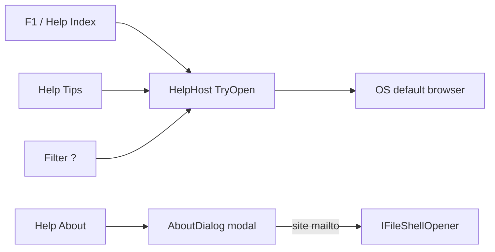

# In-app Help (F1) + About plan

Parent: product completeness item “Help menu, index.html / F1 / About”. No prior `docs/plans/` parent.

Save as [`docs/plans/in-app-help-about.plan.md`](docs/plans/in-app-help-about.plan.md) when implementing (CreatePlan preview first).

## Existing stubs (finebytes)

- Per-filter Help live: repo-root [`help/`](help/) (`{Type}.html` + [`filters.html`](help/filters.html) + [`help.css`](help/help.css)); copied to output by [`Mfr.App.Ui.csproj`](Mfr.App.Ui/Mfr.App.Ui.csproj).
- Open path: [`FilterHelpHost`](Mfr.App.Ui/Services/Help/FilterHelpHost.cs) → `IFileShellOpener.OpenWithDefaultApp` (OS browser). Filter Configuration `?` already uses this.
- **No** `index.html`, shell/UI/intro/reference hubs, Tips menu, F1, or About dialog.
- Help menu stub only: disabled About in [`MainWindow.axaml`](Mfr.App.Ui/Views/MainWindow/MainWindow.axaml).
- Version string already in window title via `_GetDisplayVersion()` in [`MainWindowViewModel`](Mfr.App.Ui/ViewModels/MainWindow/MainWindowViewModel.cs); logo at [`Assets/mfr.png`](Mfr.App.Ui/Assets/mfr.png).
- [`docs/keyboard-shortcuts.md`](docs/keyboard-shortcuts.md): F1 listed under “not implemented yet”; no `AppShortcuts` Help gesture.

## Decisions (locked)

- **Content scope:** Full MFR7-style user Help tree rewritten for **current MFR8** UI and features.
- **Skip:** FreeDB, Register/shareware, Google site-search on Index, dead Search menu item, Pro/Standard edition labels.
- **Delivery:** Same as MFR7 — local HTML opened in the **default OS app** (no WebView / CHM). Extend the existing host; do not embed a browser.
- **Style:** Keep [`help/help.css`](help/help.css) chrome (Verdana, brand bar, breadcrumb, `.quote` `#b00b0b`, CODE examples). Pages are **end-user** copy describing today’s product — not `Mfr.Filters/docs` developer notes; strip “screenshot optional / capture to…” meta from shipped prose where practical (screenshots remain optional assets per [`help/SCREENSHOTS.md`](help/SCREENSHOTS.md)).
- **Naming:** finebytes basenames stay (`SpaceCharacter.html`, not MFR7 `spacecharfilter.html`). New shell pages use MFR7-like short names (`index.html`, `ui.html`, `fileexp.html`, …) so the Index tree stays familiar.
- **Help menu:** **Index** (F1), **Tips**, separator, **About**. No Search, no Register.
- **About:** Modal dialog (CenterOwner, not in taskbar) with logo (`mfr.png`), product name, display version, assembly copyright, OK. Links: Web Site + Support e-mail opened via shell (`https://www.finebytes.com/mfr`, `mailto:support@finebytes.com`) — same idea as MFR7 Splash.
- **Host API:** Generalize [`FilterHelpHost`](Mfr.App.Ui/Services/Help/FilterHelpHost.cs) to open any relative help file (`index.html`, `tips.html`, filter pages) from `DefaultHelpRoots`; keep filter `?` on the same path.
- **Accuracy:** Shell/operation pages describe **shipped** MFR8 panes/commands; omit or mark “not in this build” only when a MFR7 topic has no counterpart (prefer rewriting around what exists). Formatter-token help covers tokens that exist under `Mfr.Filters/Formatting/Tokens/` (see [`formatter-tokens.md`](.agents/skills/mfr7-reference/formatter-tokens.md)); unported tokens get no orphan pages.
- **License text:** Ship a current EULA/`license.txt` suitable for MFR8/finebytes (adapt from MFR7 Help license; do not claim 1999–2013 FineBytes shareware terms unchanged).

## MFR7 reference brief

### Sources

- Help: `Help/index.html`, `tips.html`, `ui.html`, `parts.html`, shell panes, `filters.html`, `fp.html`, `*fp.html`, `mfrhelp.css`, `license.txt`, Images
- Code: `D:\Devl\mfr7\Core\MFRGui\Forms\Main\Main.cs` (Help menu, F1), `Splash.cs` (About + `NavigateUrl`), `FilterTitle.cs` (filter `?`)
- finebytes status: **partial** — filter HTML + shell-open; menu/F1/About/shell topics missing

### Behavior

- F1 / Help → Index → `Help\index.html` via `Process.Start`
- Tips → `tips.html`; filter `?` → same mechanism
- About → modal Splash (logo, version, copyright, site, email)

### UX notes

- Menu labels: Index (not Contents); Tips; About
- No in-app HTML control

### Parity gaps / intentional diffs

- No Register / edition / Google search
- Rewrite content for MFR8; keep open-via-shell + Verdana help chrome

## Non-goals

- Embedded WebView / CHM / HHCTRL
- Porting FreeDB, registration UI, or live Google help search
- Capturing every option-dialog PNG in v1 (optional; checkerboard placeholder OK)
- Changing filter engine behavior or `Mfr.Filters/docs` as the user Help source of truth
- Startup splash reuse of the About dialog (About-only unless a later request)

## Topic inventory (author all except skipped)

**Already FB:** `filters.html` + ~36 `{Type}.html` filter pages + `help.css`.

**Author (full tree):**

| Bucket            | Pages                                                                                                                                                                                                                                                                                                                                                                                                                                                                                                                                                                                                                             |
| ----------------- | --------------------------------------------------------------------------------------------------------------------------------------------------------------------------------------------------------------------------------------------------------------------------------------------------------------------------------------------------------------------------------------------------------------------------------------------------------------------------------------------------------------------------------------------------------------------------------------------------------------------------------- |
| Home / intro      | `index.html`, `overview.html`, `whatsnew.html`, `sysreqs.html`, `features.html`                                                                                                                                                                                                                                                                                                                                                                                                                                                                                                                                                   |
| Operation / shell | `tutorial.html`, `ui.html`, `parts.html`, `fileexp.html`, `renamelist.html`, `availfilterlist.html`, `appliedfilterlist.html`, `filterconfigpanel.html`, `filteropts.html`, `statusbar.html`, `presetmanager.html`, `optionswin.html`, `log.html`, `fieldselector.html`, `sorteditor.html`, `formateditor.html`, `visualtrimmer.html`, `howto.html`, `tips.html`, `faqs.html` (+ tech FAQ only if still useful), `applychanges.html`, `undolast.html`, `savepreset.html`, `cml.html`, `console.html` (CLI as shipped), and other howto leaves that still apply (`batchfile`, `resetconfig`, …) — drop leaves with no MFR8 feature |
| Reference hubs    | `fp.html`, `fields.html`, `regex.html`, `dateformat.html` + formatter group pages for **ported** tokens (`filenamefp`, `filepropsfp`, `generalfp`, audio/image/exif/media/mpeg as applicable; skip unported e.g. clipboard / namelist-fp if unused)                                                                                                                                                                                                                                                                                                                                                                               |
| General           | `license.txt`, `site.html`, `contact.html`, `finebytes.html`, `credits.html`                                                                                                                                                                                                                                                                                                                                                                                                                                                                                                                                                      |
| Assets            | Copy/adapt logo into `help/images/` for HTML brand if desired; shell hotspot image optional                                                                                                                                                                                                                                                                                                                                                                                                                                                                                                                                       |

**Explicitly omit:** `search.html` menu wiring, `reg.html`, FreeDB filter help, Google Index widget.

## Phases

### P1 — Help menu, F1, About, host open for Index/Tips

- **Scope / files:** Rename/generalize `FilterHelpHost` → shared help open (`TryOpen("index.html")` etc.); `AppShortcuts.ShowHelp` = F1; MainWindow KeyBinding + Help menu Index / Tips / About; `AboutDialog` (+ VM) wired like Options (`ShowDialog`); extract shared display version/copyright helper used by title + About; update [`docs/keyboard-shortcuts.md`](docs/keyboard-shortcuts.md); remove “not implemented” F1 row.
- **Exit criteria:** F1 and Help → Index open `help/index.html` when present (missing → same style dialog as filter help); Tips opens `tips.html`; About shows logo/version/copyright/links and closes on OK.
- **Tests:** Host resolve/open unit tests; `AppShortcuts` F1; About VM version/copyright; optional headless menu enablement if cheap ([`mfr-ui-headless-tests`](.agents/skills/mfr-ui-headless-tests/SKILL.md)).
- **Note:** Until P2, Index/Tips may be minimal stubs so wiring is testable — replace with full pages in content phases.

### P2 — Index + introduction + Tips skeleton

- **Scope:** Full `index.html` TOC (MFR7 section structure, MFR8 links only); `overview`, `features`, `sysreqs`, `whatsnew` (honest for v8); `tips.html` with tip cards (reuse `.note` / add tip style in `help.css` if needed). Breadcrumbs → Index.
- **Exit:** F1 lands on a complete Index; intro + tips readable and linked.
- **Tests:** Optional link-integrity test: every `href` under `help/*.html` resolves to an existing file or `#` fragment on an existing file (allow growing set as later phases add targets — start with P2 closure graph, expand each phase).

### P3 — Operation / shell / howto pages

- **Scope:** All Operation pages for panes and workflows that exist (File List, Rename List, Available Filters, Filter Chain, Filter Configuration/Options, Presets, Options, Log, Format Editor, Visual Trim, field selector, sort, Apply/GO, Undo, status bar, tutorial/howto hub). Rewrite from MFR7 Help against current Avalonia UI (`Mfr.App.Ui/README.md`, design docs). Update Index links.
- **Exit:** User can learn the shell from Help without opening filter pages.
- **Tests:** Extend link-integrity; spot-check breadcrumbs.

### P4 — Reference: fields, regex, date formats, formatter tokens

- **Scope:** `fields.html`, `regex.html`, `dateformat.html`, `fp.html` + per-group `*fp.html` for **ported** tokens only; cross-link from `Formatter.html` and Format Editor page. Align token names with live formatter catalog.
- **Exit:** Formatter help matches product tokens; no dead links to unported MFR7 params.
- **Tests:** Link-integrity; optional assert every public format token help id/page is linked from `fp.html`.

### P5 — General information + FAQs + CLI

- **Scope:** `license.txt`, `site`, `contact`, `finebytes`, `credits`, `faqs` (user FAQs for MFR8), `cml.html` / `console.html` from current CLI (`Mfr.App.Cli`). Wire Index General + Operation entries.
- **Exit:** Full Index tree has no intentional TBD placeholders for in-scope topics.
- **Tests:** Link-integrity green for entire `help/` tree.

### P6 — Polish + filter page breadcrumbs + docs/skills touch-up

- **Scope:** Point filter breadcrumbs Index → Filters → …; soften meta figcaptions; ensure `filters.html` links up to Index; update [`.agents/skills/mfr-implement-filter`](.agents/skills/mfr-implement-filter/SKILL.md) if Index/filters conventions change; layering note if host type renamed; [`docs/mfr-folder-layering.md`](docs/mfr-folder-layering.md) Help service name.
- **Exit:** Help feels one product; filter `?` and F1 share chrome and navigation.
- **Tests:** Existing `FilterCatalogHelpTests` still pass; link-integrity still green.

## Implementation notes

- Prefer adapting MFR7 HTML prose over inventing tone from scratch; fix facts for MFR8.
- Put scratch/WIP under `.tmp/` only; ship pages under `help/`.
- Do not add persistence/session for Help or About.
- After plan lock: implement via `mfr-impl-plan` phase machine or phase-by-phase as requested.
