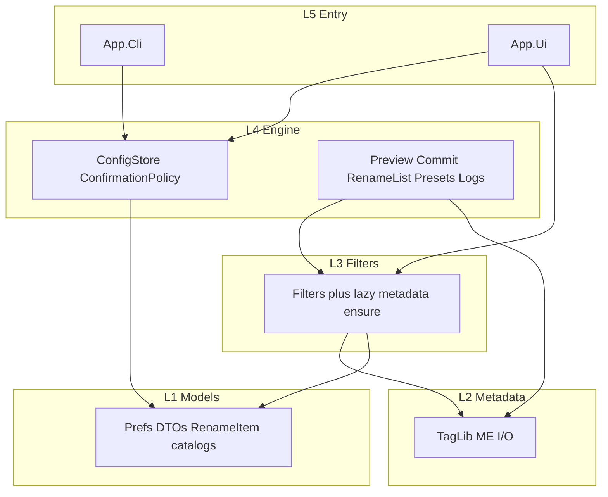

# Layering ownership cleanup plan

## Decisions (locked)

- **No new projects.** Keep L0–L5. Do not add `App.Core`, split Engine, or extract Persistence.
- **P1:** Move [`ConfigStore`](../../Mfr.Engine/Config/ConfigStore.cs) and [`ConfirmationPolicy`](../../Mfr.Engine/Config/ConfirmationPolicy.cs) to [`Mfr.Engine/Config/`](../../Mfr.Engine/Config) (`namespace Mfr.Engine.Config`). Prefs **DTOs** stay in Models (`OptionsConfig`, `LogConfig`, `RenameLogConfig`, session records, `ConfirmationKind`).
- **Keep** [`PersistedConfigurationReset`](../../Mfr.Engine/Config/PersistedConfigurationReset.cs) as the named Reset Configuration API (still calls `ConfigStore.DeleteDefaultFile`).
- **UI Services may import `Mfr.Engine.Config`.** Session/File List already read the static store; that matches the documented Services→Engine edge. Do not inject `OptionsConfig` through every catalog call.
- **Do not move** `RenameListMetadataLoader` / `EnsureTagLibLoaded` out of Filters. Filters know *when* to load; Metadata knows *how*.
- **Do not publicize** `RenameItem` internals. Models `InternalsVisibleTo` Engine/Filters is a friend API, not a leak.
- **Test-folder rename** (`Mfr.Tests/Models/Filters/` → `Mfr.Tests/Filters/`) is out of default scope (~84 files, namespaces). Optional later.

## Priority

1. **P1 ConfigStore move** — real layering fix (L1 currently owns process I/O + a singleton).
1. **P2 Docs + InternalsVisibleTo hygiene** — cheap, prevents the next feature from putting more I/O in Models.
1. **Skip** metadata hydration move and test-tree rename (cost > value).

## MFR7 reference brief

Not an MFR7 feature. Reset Configuration already exists (`PersistedConfigurationReset`). This is ownership only: same `config.json` soft-load, same CLI `--set` hard-fail, same UI session DTOs. No Help/GIF crawl.

## Non-goals

- New assemblies or adjacent-only (onion) refs
- Behavior/schema changes to `config.json`
- Injecting prefs instead of the static store
- Moving File List / JPEG thumbnail reader into Metadata
- Rewriting old completed plans that mention `ConfigStore` by type name

## Target graph

## Phases

### P1 — Move ConfigStore I/O to Engine

- **Move files:** [`ConfigStore.cs`](../../Mfr.Engine/Config/ConfigStore.cs), [`ConfirmationPolicy.cs`](../../Mfr.Engine/Config/ConfirmationPolicy.cs) from Models → [`Mfr.Engine/Config/`](../../Mfr.Engine/Config), namespace `Mfr.Engine.Config`. Folder + namespace together.
- **Stay in Models:** [`AppConfigSections.cs`](../../Mfr.Models/Config/AppConfigSections.cs), [`UiSessionSections.cs`](../../Mfr.Models/Config/UiSessionSections.cs), [`ConfirmationKind.cs`](../../Mfr.Models/Config/ConfirmationKind.cs), add-mode/view-mode enums.
- **Usings:** add `Mfr.Engine.Config` where `ConfigStore` / `ConfirmationPolicy` are used; keep `Mfr.Models.Config` for DTOs. Update [`Mfr.App.Cli/GlobalUsings.cs`](../../Mfr.App.Cli/GlobalUsings.cs) and [`Mfr.Tests/GlobalUsings.cs`](../../Mfr.Tests/GlobalUsings.cs) (both globals).
- **Call sites stay API-identical:** CLI [`CliApp.Run`](../../Mfr.App.Cli/CliApp.cs) `Load`/`EnsureDefaultFile`/`ApplyCliOverrides`; UI [`Program.Main`](../../Mfr.App.Ui/Program.cs); session services; Options/File List; [`RenameLogStore`](../../Mfr.Engine/RenameLog/RenameLogStore.cs); [`FilterDefaultsStore`](../../Mfr.Engine/Presets/FilterDefaultsStore.cs).
- **Tests:** move store tests to `Mfr.Tests/Engine/`:
  - `ConfigStoreCliOverridesTests`, `ConfigStoreEnsureDefaultFileTests`, `ConfigStorePrefsTests`, `ConfigStoreDeleteDefaultFileTests`, `ConfigStoreSaveTests`, `ConfirmationPolicyTests`
  - Leave DTO-focused tests under `Mfr.Tests/Models/` (`PrefsBindingTests`, `RenameListPrefsTests`, `SessionPreferenceTests` still load via `ConfigStore` — that is fine).
- **Docs in-repo:** [`AGENTS.md`](../../AGENTS.md) ConfigStore remarks (still “see type remarks”; note Engine owns the store). Type remarks on the moved class stay the source of truth.
- **Guardrail:** architecture test that `ConfigStore` / `ConfirmationPolicy` live in assembly `Mfr.Engine` (namespace `Mfr.Engine.Config`); prefs DTOs stay in `Mfr.Models.Config`.
- **Exit:** `just format` then `just lint`; existing ConfigStore/ConfirmationPolicy/session tests pass; UI still compiles with Services using Engine.Config.
- **No behavior change:** same singleton, same soft-load/hard-fail rules.
- **Status:** done

### P2 — Layering doc + friend-assembly note

- Update [`docs/mfr-folder-layering.md`](../mfr-folder-layering.md):
  - L4 Engine owns prefs **store** (load/save/delete) and ConfirmationPolicy; L1 owns prefs **shape**.
  - UI spine: Views → ViewModels → Services; ViewModels use Engine + Filters + Models; Services may use Engine.Config / Models (not Filters/Metadata). Views→Services glue table stays.
  - Models `InternalsVisibleTo` Engine/Filters is intentional (`RenameItem` mutation, field catalog types, `BaseFilter.Setup`/`Apply`). Do not make those public for UI.
  - Drop unused `InternalsVisibleTo` **Metadata** from [`Mfr.Models.csproj`](../../Mfr.Models/Mfr.Models.csproj) after confirm Metadata does not touch Models internals (current readers only use public tag/media DTOs).
- **Exit:** doc matches code; Models still builds Metadata without friend access; `just lint`.
- **Status:** pending

### P3 — Optional later (not default)

- Relocate `Mfr.Filters` implementation tests from [`Mfr.Tests/Models/Filters/`](../../Mfr.Tests/Models/Filters) to `Mfr.Tests/Filters/`, keep true Models filter tests (`BaseFilter`, `FilterChain`, targets, `StringApplyScopeTransform`) under Models.
- Only if someone is actually lost in that tree. High churn, zero runtime value.
- **Status:** skipped

## Suggested execution

Implement P1 then P2 via `mfr-impl-plan` (review + commit after each).
