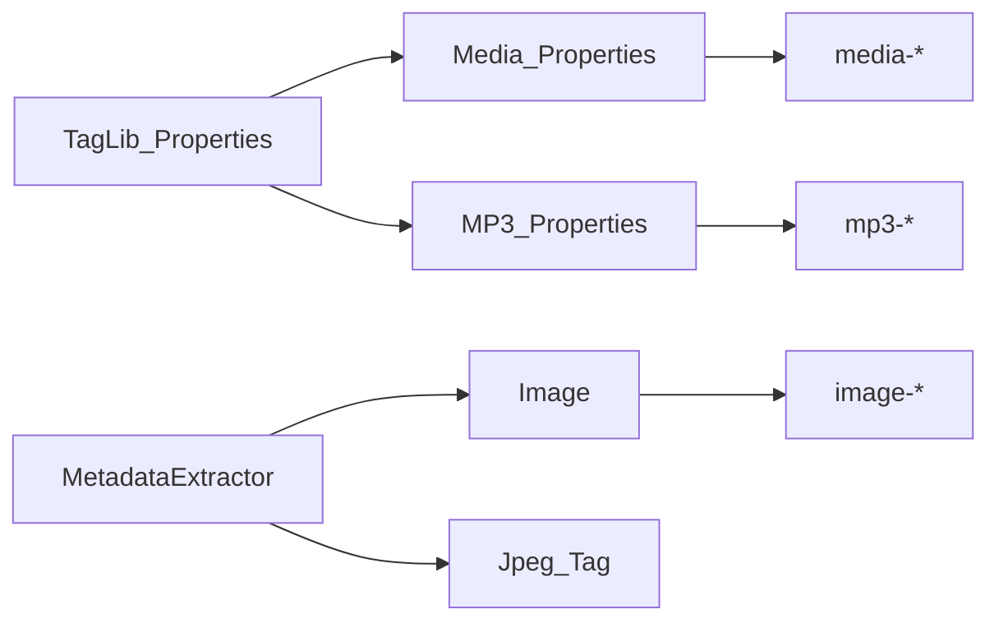

# Media / MP3 catalog order and consistency

## At a glance

- **Media** = TagLib streams (audio + video + duration). Keep the name. Not Video.
- **Image** = MetadataExtractor rasters. Use this for photo size (`image-width` / `image-height`).
- **MP3 Properties** = MPEG audio header on MP3, not MP4.
- **Delete:** Media photo width / height / quality (shuttle + `media-photo-*` tokens).
- **Rename:** `mpeg-*` → `mp3-*` (no aliases). Group id `MPEG` → `MP3`.
- **Labels:** picker `Media` → `Media Properties`; help `Audio MP3 / MPEG` → `MP3 Properties`.
- **Keep:** video width/height, Media audio stream fields, picker nest `Audio\MP3`.

## Current code (post-unify)

Shipped and **done** (do not redo):
[`unify-token-rename-list-property-enums.plan.md`](unify-token-rename-list-property-enums.plan.md),
[`unify-media-mpeg-property-enums.plan.md`](unify-media-mpeg-property-enums.plan.md).

Media/MPEG now share one Models-owned field enum + `PropertyDisplayContext` formatter each (Image/PDF pattern):

| Domain | Enum + formatter (Models)                                                                                                                                                                                   | Tokens (Filters)                                                                                                                  | Catalog                                                                                                                                                |
| ------ | ----------------------------------------------------------------------------------------------------------------------------------------------------------------------------------------------------------- | --------------------------------------------------------------------------------------------------------------------------------- | ------------------------------------------------------------------------------------------------------------------------------------------------------ |
| Media  | [`MediaPropertyField`](../../Mfr.Models/RenameList/Fields/Media/MediaPropertyField.cs) + [`MediaPropertiesFormatting`](../../Mfr.Models/RenameList/Fields/Media/MediaPropertiesFormatting.cs)               | [`MediaPropertyTokens.cs`](../../Mfr.Filters/Formatting/Tokens/Media/MediaPropertyTokens.cs)                                      | [`MediaRenameListFields`](../../Mfr.Models/RenameList/Fields/Media/MediaRenameListFields.cs) (`Group` = `MediaProperties`, label **Media Properties**) |
| MPEG   | [`MpegAudioPropertyField`](../../Mfr.Models/RenameList/Fields/Mpeg/MpegAudioPropertyField.cs) + [`MpegAudioPropertiesFormatting`](../../Mfr.Models/RenameList/Fields/Mpeg/MpegAudioPropertiesFormatting.cs) | [`MpegAudioPropertyTokens.cs`](../../Mfr.Filters/Formatting/Tokens/Mpeg/MpegAudioPropertyTokens.cs) (`mp3-*`, picker `Audio\MP3`) | [`MpegRenameListFields`](../../Mfr.Models/RenameList/Fields/Mpeg/MpegRenameListFields.cs) (`Group` = **`MPEG`**, label **MP3 Properties**)             |

Tokens call `*Formatting.Format(..., PropertyDisplayContext.Token)` and `*RenameListField.CatalogPropertyKey` for shuttle mapping. Media photo width/height/quality fields and `media-photo-*` tokens are removed (P1 done).

Image vs TagLib split: [`docs/image-metadata-model.md`](../image-metadata-model.md).

## Decisions (locked)

- **Keep Media as Media.** Do not rename the group to Video. TagLib `MediaProperties` stays the stream bag (MIME, duration, audio stream, video frame size). Image/EXIF stay on MetadataExtractor.
- **Delete photo overlap.** Remove Photo Width / Height / Quality from the Media shuttle catalog **and** delete `<media-photo-width>` / `<media-photo-height>` / `<media-photo-quality>`. Raster size is Image (`<image-width>` / `<image-height>`). Drop the three `Photo*` members from [`MediaPropertyField`](../../Mfr.Models/RenameList/Fields/Media/MediaPropertyField.cs), [`MediaProperties`](../../Mfr.Models/Media/MediaProperties.cs), formatting/sort/key map, and [`MediaPropertiesReader`](../../Mfr.Metadata/MediaPropertiesReader.cs). Keep `VideoWidth` / `VideoHeight`.
- **Token names `mpeg-*` → `mp3-*`.** One current schema, **no aliases**. Prefix-only rename (keep `mp3-encoding`, `mp3-ver`, `mp3-copyright` — do not restore MFR7 `mp3-vbr` / `mp3-vbrq` / `mp3-tag-versions` / `mp3-copyrighted`).
- **Persist group id `MPEG` → `MP3`.** [`MpegRenameListFields.Group`](../../Mfr.Models/RenameList/Fields/Mpeg/MpegRenameListFields.cs) becomes `"MP3"`. `GroupLabel` stays `"MP3 Properties"`. Old saved `config.json` / preset column keys with group `MPEG` are skipped (soft-load prefs; presets hard-fail — update shipped samples if any).
- **Picker labels.** Media tokens: `FormatTokenInfo` group `"Media"` → `"Media Properties"` (match shuttle). MP3 tokens stay `"Audio\\MP3"` (MFR7 picker nest). Help title **Audio MP3 / MPEG** → **MP3 Properties**; rename `help/tokens/mpegfp.html` → `mp3fp.html`.
- **Code names.** Rename public `Mpeg*` catalog/token/snapshot symbols to `Mp3*` (`MediaProperties.Mpeg` → `.Mp3`, token folder `Tokens/Mpeg` → `Tokens/Mp3`, field folder `Fields/Mpeg` → `Fields/Mp3`, including `MpegAudioPropertyField` → `Mp3AudioPropertyField` etc.). Leave TagLib `TagLib.Mpeg.AudioHeader` in the reader.

## MFR7 reference brief

### Sources

- Help: `D:\Devl\mfr7\Site\finebytes\mfr\Help\fields.html` (`#mediaproperties`, `#MP3MPEG`); `id3fp.html` (legacy `mp3-*` table); formatter classes `Core/MfrFilters/FormattingParams/Audio/MpegFP.cs`
- Code: `PropertyGroups/Media/MediaPropertiesPgInfo.cs` (includes Photo Width + Video Width); `PropertyGroups/Audio/Mp3PGInfo.cs` (`mName = "MP3 Properties"`); tokens registered under `"Audio\\MP3"` with names `mp3-bitrate`, `mp3-duration`, …
- finebytes status: Media + MP3 catalogs ported; token/RL property enums unified in Models; tokens use `mp3-*` (P2); shuttle already uses **MP3 Properties**; persist group id still `MPEG` until P3

### Behavior

- Media Properties: read-only TagLib stream facts for image, audio, and video (same field list as today minus our photo deletion).
- MP3 Properties: MPEG **audio header** for MP3-style files, not MP4. MFR7 token picker group is `Audio\MP3`; shuttle group name is **MP3 Properties**.
- MFR7 tokens used `mp3-*`. finebytes `mpeg-*` was an intentional rewrite rename; this plan reverts the **prefix** to MFR7.

### UX notes

- Shuttle: Media Properties then MP3 Properties (keep this sibling order).
- Format picker: Audio → MP3 (keep nest). Media picker currently a flat **Media** folder — align label to **Media Properties**.

### Parity gaps / intentional diffs

- Drop MFR7 Media photo columns (overlap with Image / MetadataExtractor).
- Do not port unused MFR7 tokens (`mp3-tag-versions`, `mp3-vbrq`).
- Keep finebytes `mp3-encoding` / `mp3-duration-sec` / `mp3-original` / `mp3-protection` (not all had MFR7 names).

## Non-goals

- Renaming Media → Video, or deleting video width/height
- Merging Image/EXIF into TagLib, or deleting `image-*`
- Token aliases / JSON converters for old `mpeg-*` or group `"MPEG"`
- Re-doing Media/MPEG property-enum unify (already shipped)
- TagLib Image Tag (`imagetag-*`)

## Target surface

Media catalog after P1: MIME, Possibly Corrupt, Duration, Duration (Seconds), Media Types, Description, Audio Bitrate / Channels / Sample Rate / Bits Per Sample, Video Width / Height.

## Phases

### P1 — Drop Media photo fields and tokens

- **Status:** done
- **Scope / files:** Remove `PhotoWidth` / `PhotoHeight` / `PhotoQuality` from [`MediaPropertyField`](../../Mfr.Models/RenameList/Fields/Media/MediaPropertyField.cs), [`MediaPropertiesFormatting`](../../Mfr.Models/RenameList/Fields/Media/MediaPropertiesFormatting.cs), [`MediaRenameListField`](../../Mfr.Models/RenameList/Fields/Media/MediaRenameListField.cs) (key map + sort), [`MediaRenameListFields`](../../Mfr.Models/RenameList/Fields/Media/MediaRenameListFields.cs), tips; delete photo token classes in [`MediaPropertyTokens.cs`](../../Mfr.Filters/Formatting/Tokens/Media/MediaPropertyTokens.cs); strip DTO props from [`MediaProperties.cs`](../../Mfr.Models/Media/MediaProperties.cs) + mapping in [`MediaPropertiesReader.cs`](../../Mfr.Metadata/MediaPropertiesReader.cs); tests (`MediaPropertyTokenTests`, `RenameListFieldCatalogTests`, reader tests); [`Formatter.md`](../../Mfr.Filters/docs/Formatting/Formatter.md), [`image-metadata-model.md`](../image-metadata-model.md), [`help/tokens/mediafp.html`](../../help/tokens/mediafp.html), [`help/reference/fields.html`](../../help/reference/fields.html).
- **Exit criteria:** Shuttle Media group has no photo columns; those three tokens gone; Image still covers raster size; Help/docs no longer mention `media-photo-*`.
- **Tests:** Catalog count/order; token compile list; reader no longer asserts photo mapping; `CatalogPropertyKey` / formatting switches stay exhaustive without photo arms.

### P2 — `mpeg-*` → `mp3-*` tokens and Help

- **Status:** done
- **Scope / files:** [`MpegAudioPropertyTokens.cs`](../../Mfr.Filters/Formatting/Tokens/Mpeg/MpegAudioPropertyTokens.cs) names + `[FormatTokenInfo]`; token tests; [`FilterRelevantRenameListColumnsTests.cs`](../../Mfr.Tests/Models/Filters/FilterRelevantRenameListColumnsTests.cs); [`Formatter.md`](../../Mfr.Filters/docs/Formatting/Formatter.md); move/rewrite [`help/tokens/mpegfp.html`](../../help/tokens/mpegfp.html) → `mp3fp.html`; [`help/tokens/fp.html`](../../help/tokens/fp.html), fields.html, whatsnew if token names are listed; comments on `FileMeta` / [`image-tag-editing.plan.md`](image-tag-editing.plan.md) that say `mpeg-*`.
- **Exit criteria:** Catalog insert text is `<mp3-bitrate>` etc.; unknown `mpeg-*` fails compile (no alias). Help hub links **MP3 Properties**.
- **Tests:** Existing MPEG token tests renamed to `mp3-*`; picker search still finds `Audio\\MP3`.

### P3 — Persist id, picker label, `Mpeg*` → `Mp3*` types

- **Status:** pending
- **Scope / files:** `MpegRenameListFields.Group = "MP3"`; Media token group path `"Media Properties"`; rename folders/namespaces `Fields/Mpeg` → `Fields/Mp3`, `Tokens/Mpeg` → `Tokens/Mp3` (includes Models enum/formatter files from the unify); `MediaProperties.Mpeg` → `.Mp3`; update all usings/tests. Keep TagLib type names in the reader.
- **Exit criteria:** Saved column keys use group `MP3`; Format Editor shows **Media Properties**; user-facing strings say MP3 not MPEG (code/docs that mean the bitstream may still say “MPEG audio header”).
- **Tests:** Catalog group id assertions; `FormatTokenCatalog` group paths; architecture/namespace tests if any.

Execute with `mfr-impl-plan` after lock.
