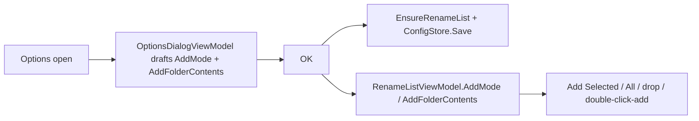

# Options add-mode UI

Parent: [options-dialog.plan.md](options-dialog.plan.md) (explicitly skipped add-mode; this supersedes that skip). Prefs already exist on [`RenameListPrefs`](../../Mfr.Models/Config/SessionPrefs.cs) (`addMode`, `addFolderContents`) and [`RenameListViewModel`](../../Mfr.App.Ui/ViewModels/RenameList/RenameListViewModel.Add.cs).

## Decisions (locked)

- **Placement:** Options dialog only (no Rename List toolbar / menu / on-the-fly heuristics).
- **Controls:** Radio trio bound to `RenameListAddMode` — **Files** / **Folders** / **Files and folders** — plus checkbox **Add folder contents** (not MFR7’s two coupled “Add files/Add folders” checks).
- **Persist:** `renameList.addMode` + `renameList.addFolderContents` via `ConfigStore.EnsureRenameList()` on OK; existing `ConfigStore.Save()` path unchanged.
- **Live apply:** On OK, also set `RenameListViewModel.AddMode` / `AddFolderContents` so same-session Add Selected/All/drop/double-click-add pick up the change. (Double-click flag can stay ConfigStore-only because File List reads it at tap time; add policy is VM-owned and `CaptureSession` would otherwise overwrite ConfigStore on close.)
- **Contents checkbox:** Always enabled (still meaningful in Files-only mode when a folder source is expanded).

## MFR7 reference brief

- **Sources:** Help `optionswin.html` / `optionswin1.gif`; `Core/MFRGui/Forms/Main/Options.cs` (`cbAddFiles` / `cbAddFolders` / `cbAddFolderContents`); add path reads `OptionsForm` from `RenameList.cs`.
- **Behavior:** Three General-tab checks; defaults files=on, folders=off, contents=on; unchecking folders forces files on and disables the files checkbox. Values gate include-files / include-folders / recurse when adding.
- **finebytes parity gap:** Same capability, clearer UX (enum radios + contents). Defaults already match (`Files` + `addFolderContents: true`).

## Non-goals

- Rename List toolbar toggles or duplicate controls elsewhere
- On-the-fly / heuristic add policy
- CLI `/F` `/D` `/R` switches (MFR7 `ProcessCML`)
- Changing engine add semantics or `RenameListAddMode` shape

## Flow

## Phases

### P1 — Options draft + UI + Commit store

- **Scope:** [`OptionsDialogViewModel.cs`](../../Mfr.App.Ui/ViewModels/Options/OptionsDialogViewModel.cs) — load/commit `AddMode` + `AddFolderContents` from/to `ConfigStore.EnsureRenameList()`. [`OptionsDialog.axaml`](../../Mfr.App.Ui/Views/Options/OptionsDialog.axaml) — label row + three `CompactRadioButton`s (`EnumToBooleanConverter` like Confirmation prompts) + `CompactCheckBox` for contents. [`AppTips.cs`](../../Mfr.App.Ui/Resources/AppTips.cs) tips for each control.
- **Exit:** Dialog shows and round-trips prefs in memory via `Commit()`.
- **Tests:** Extend [`OptionsDialogViewModelTests`](../../Mfr.Tests/Ui/Options/OptionsDialogViewModelTests.cs); headless label/tip asserts in [`OptionsDialogTests`](../../Mfr.Tests/Ui/Options/OptionsDialogTests.cs).
- **Status:** Completed (`f6b72177`).

### P2 — Live Rename List sync + docs

- **Scope:** After successful `dialogVm.Commit()` in [`MainWindow.axaml.cs`](../../Mfr.App.Ui/Views/MainWindow/MainWindow.axaml.cs) `_ShowOptionsAsync`, push `AddMode` / `AddFolderContents` onto `viewModel.RenameListViewModel` (before or after `ConfigStore.Save`; order does not matter for correctness). Amend [options-dialog.plan.md](options-dialog.plan.md) skip row to point at this plan. Write this plan under `docs/plans/`.
- **Exit:** Changing Options and adding in the same session uses the new policy without restart; close-save keeps the values (`CaptureSession` already includes them).
- **Tests:** Headless host test: Options OK updates `RenameListViewModel` add fields (extend Options OK persist pattern in [`OptionsDialogTests`](../../Mfr.Tests/Ui/Options/OptionsDialogTests.cs)).
- **Status:** Completed (`64a49a9d`).

## Key reuse

- `EnumToBooleanConverter` + `CompactRadioButton` / `CompactCheckBox` patterns already in Options.
- No new persisted schema — only UI + live sync.
