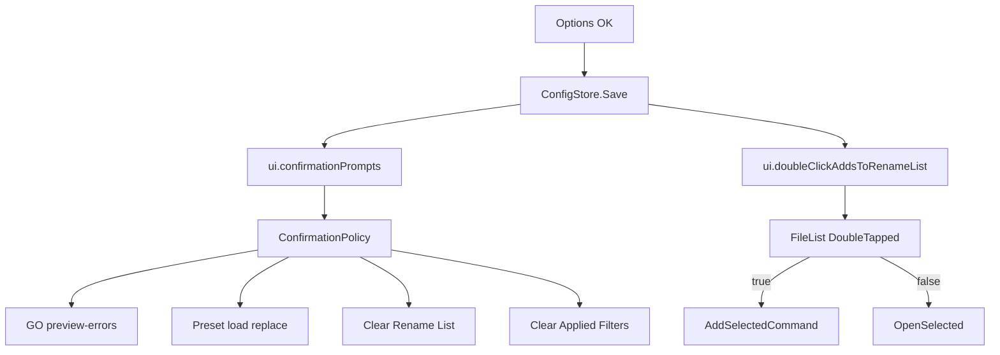

# Options: confirmation 3-state + double-click-to-add

Parent: [docs/plans/options-dialog.plan.md](docs/plans/options-dialog.plan.md) (v1 shipped).

## Decisions (locked)

- **Confirmation prompts** enum on `config.json` (`ui.confirmationPrompts`), default **`Normal`**. Replaces `ui.presets.confirmReplaceAppliedFiltersOnLoad` (delete `PresetsUiConfig`; no migration — unknown old key ignored; missing enum → Normal).
- **Semantics:**

| Level                | Go with preview errors | Replace Applied Filters on preset load | Clear Rename List / Remove All Filters | Reset / delete preset / overwrite preset |
| -------------------- | ---------------------- | -------------------------------------- | -------------------------------------- | ---------------------------------------- |
| **Fewer**            | skip (proceed)         | no                                     | no                                     | **always**                               |
| **Normal** (default) | confirm                | no                                     | no                                     | **always**                               |
| **More**             | confirm                | confirm                                | confirm                                | **always**                               |

- **Fewer skips Go-preview-errors** so the 3-state is meaningful; irreversible actions never follow Fewer.
- **Double-click adds to Rename List** — `ui.doubleClickAddsToRenameList` bool, default **`false`** (MFR7 `DoubleClickToAddItem`). OFF → current `OpenSelected` (folder navigate / file default app). ON → run existing `AddSelectedCommand` (same as toolbar; respects add-mode / folder-contents). Affects **DoubleTapped only**; context-menu Open unchanged.
- **Options UI:** keep single pane. Replace confirm checkbox with labeled radios (or compact combo) **Confirmation prompts: Fewer | Normal | More**; add checkbox **Double click in file list adds to Rename List**. Keep the two remember checkboxes.
- **Policy helper:** small `ConfirmationPolicy` (Models or App.Ui) with `ShouldConfirm(ConfirmationKind)` reading `ConfigStore.Config.Ui.ConfirmationPrompts` — call sites do not switch on enum inline.
- **Clear confirms:** gate only when list non-empty; messages short (“Clear the Rename List?” / “Remove all Applied Filters?”). Async confirm via view hooks (same style as Go preview-errors), not a second dialog framework.

## MFR7 reference brief

### Sources

- Help: `optionswin.html` (+ GIFs) — **stale** (no dbl-click row); `whatsnew.html` 7.2.4 documents the toggle
- Code: `D:\Devl\mfr7\Core\MFRGui\Forms\Main\Options.cs`; File List `MFRExplorer.executeItem` → `Main` → `RenameList.AddSelected`
- finebytes: Options v1 shipped; File List `_OnEntriesDoubleTapped` → `OpenSelected` ([FileListView.axaml.cs](Mfr.App.Ui/Views/FileList/FileListView.axaml.cs)); confirm-replace in [AppliedFiltersView.Presets.cs](Mfr.App.Ui/Views/AppliedFilters/AppliedFiltersView.Presets.cs)

### Behavior

- Label: `Double click in file list adds to Rename List`; default off; off = `Process.Start`, on = add selected
- No MFR7 confirmation-level Options UI (`ConfirmRenames` dead — do not port). finebytes 3-state is intentional new UX, not parity

### Parity gaps / intentional diffs

- 3-state confirmations: finebytes-only
- Add-mode stays on Rename List (not Options)
- Explorer shell / Undo & Log still deferred

## Non-goals

- Explorer shell integrate
- Undo / `.mfrlog` retention tab
- Per-item commit confirm (CLI only)
- Moving add-mode into Options
- Migrating old `confirmReplaceAppliedFiltersOnLoad` values
- Enter-key open/add (finebytes File List Enter is not an open path today)

## Architecture

## Phases

### P1 — Config model + policy

- **Scope:** In [MfrConfig.cs](Mfr.Models/Config/MfrConfig.cs): add `ConfirmationPrompts` enum (`Fewer`, `Normal`, `More`); on `UiConfig` add `ConfirmationPrompts ConfirmationPrompts = Normal` and `bool DoubleClickAddsToRenameList`; remove `Presets` / `PresetsUiConfig`. Add `ConfirmationKind` + `ConfirmationPolicy.ShouldConfirm`. Update ConfigStore remarks / EnsureDefaultFile expectations / save round-trip tests that referenced confirm-replace.
- **Exit:** Load/Save round-trip enum + bool; unknown old preset key does not break load; policy unit tests for all three levels × kinds (always-true kinds not in policy).
- **Tests:** ConfigStore save/load; `ConfirmationPolicy` table tests.

### P2 — Wire confirmation call sites

- **Scope:** Preset load uses `ShouldConfirm(ReplaceAppliedFiltersOnLoad)` instead of bool flag ([AppliedFiltersView.Presets.cs](Mfr.App.Ui/Views/AppliedFilters/AppliedFiltersView.Presets.cs) / `NeedsConfirmReplaceOnLoad`). GO preview-errors: skip dialog when Fewer ([RenameListViewModel.Commit.cs](Mfr.App.Ui/ViewModels/RenameList/RenameListViewModel.Commit.cs) + view hook). Clear Rename List + Clear Applied Filters: async confirm when More and non-empty (hooks on Rename List / Applied Filters views; keep Reset / preset delete / overwrite unconditional).
- **Exit:** Fewer → Go with errors proceeds without dialog; Normal → same as today; More → replace-on-load + both clears confirm.
- **Tests:** VM/unit where possible; update AppliedFilters confirm tests; MainWindowGoTests for Fewer skip; clear-confirm coverage (VM + hook or headless).

### P3 — Options dialog UI

- **Scope:** [OptionsDialogViewModel](Mfr.App.Ui/ViewModels/Options/OptionsDialogViewModel.cs) + [OptionsDialog.axaml](Mfr.App.Ui/Views/Options/OptionsDialog.axaml): drop confirm checkbox; bind ConfirmationPrompts + DoubleClickAddsToRenameList; Commit writes both; still Save on OK via existing host. Update Options tests/labels.
- **Exit:** Cancel discards; OK persists both leaves; dialog shows remember ×2 + prompts + double-click.
- **Tests:** existing Options VM/headless tests updated.

### P4 — File List double-click behavior

- **Scope:** [FileListView.axaml.cs](Mfr.App.Ui/Views/FileList/FileListView.axaml.cs) `_OnEntriesDoubleTapped`: if `DoubleClickAddsToRenameList` and `AddSelectedCommand` can execute → execute it; else `OpenSelected`. Prefer a small testable method on the view or VM helper that takes the flag + commands.
- **Exit:** flag false → open/navigate; true → add selected (multi-select honored via existing AddSelected).
- **Tests:** headless double-tap with flag on/off ([FileListViewTests](Mfr.Tests/Ui/FileList/FileListViewTests.cs) pattern).

### P5 — Docs hygiene

- **Scope:** Amend [options-dialog.plan.md](docs/plans/options-dialog.plan.md) deferred/non-goals (double-click + confirm checkbox superseded). Update [docs/debts.md](docs/debts.md) Options bullet (drop double-click; keep shell + Undo/Log). Touch MfrConfig remarks. No keyboard-shortcuts change unless Options wording needs it.
- **Exit:** debts/plan text match shipped behavior.

## Key files

- [Mfr.Models/Config/MfrConfig.cs](Mfr.Models/Config/MfrConfig.cs)
- [Mfr.App.Ui/ViewModels/Options/OptionsDialogViewModel.cs](Mfr.App.Ui/ViewModels/Options/OptionsDialogViewModel.cs)
- [Mfr.App.Ui/Views/Options/OptionsDialog.axaml](Mfr.App.Ui/Views/Options/OptionsDialog.axaml)
- [Mfr.App.Ui/Views/FileList/FileListView.axaml.cs](Mfr.App.Ui/Views/FileList/FileListView.axaml.cs)
- [Mfr.App.Ui/Views/AppliedFilters/AppliedFiltersView.Presets.cs](Mfr.App.Ui/Views/AppliedFilters/AppliedFiltersView.Presets.cs)
- [Mfr.App.Ui/ViewModels/RenameList/RenameListViewModel.Commit.cs](Mfr.App.Ui/ViewModels/RenameList/RenameListViewModel.Commit.cs)
- Clear paths: [RenameListViewModel.List.cs](Mfr.App.Ui/ViewModels/RenameList/RenameListViewModel.List.cs), [AppliedFiltersViewModel.Clear](Mfr.App.Ui/ViewModels/AppliedFilters/AppliedFiltersViewModel.cs)
