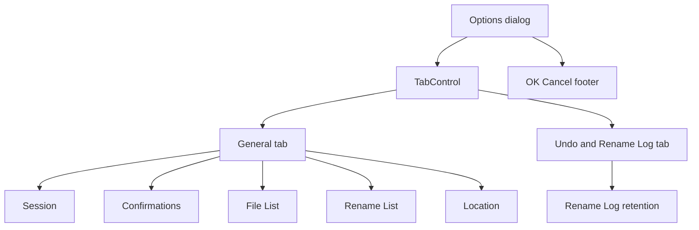

# Options dialog tabs

## Approach

Use a **two-tab** `TabControl` like MFR7 (`General` / `Undo & Log`), adapted to current section names:

| Tab                   | Fieldsets (unchanged content)                            |
| --------------------- | -------------------------------------------------------- |
| **General**           | Session, Confirmations, File List, Rename List, Location |
| **Undo & Rename Log** | Undo & Rename Log retention radios                       |

Do **not** add a ScrollViewer, split into three sparse tabs, or persist the selected tab. ViewModel draft/Commit path stays as-is — this is layout-only.

## UI changes

Primary file: [`Mfr.App.Ui/Views/Options/OptionsDialog.axaml`](../../Mfr.App.Ui/Views/Options/OptionsDialog.axaml)

- Replace the single tall `StackPanel` of six fieldsets with a `TabControl` (two `TabItem`s) above the existing `ModalOkCancelFooter`.
- Move each `FieldsetGroup` into the matching tab; keep bindings, names (`GeoNamesUsernameBox`, `RenameLogLimitSpinner`, etc.), and tips unchanged.
- **Sizing:** drop `SizeToContent="Height"`. Use a fixed `Height` (and keep `Width="480"`, `CanResize="False"`) sized for the taller **General** tab so switching tabs does not resize the window. Precedent for fixed tabbed dialog height: [`RenameListFieldShuttleDialog.axaml`](../../Mfr.App.Ui/Views/RenameList/RenameListFieldShuttleDialog.axaml).
- Light tab chrome: reuse the same idea as `field-shuttle-tabs` (app chrome font/size) via a local `options-tabs` class — no shared theme extraction unless it stays trivial.

No changes needed in [`OptionsDialogViewModel.cs`](../../Mfr.App.Ui/ViewModels/Options/OptionsDialogViewModel.cs) for load/commit; optional `SelectedTabIndex` only if headless tests need a clean bind (otherwise set `TabControl.SelectedIndex` in the test).

## Tests

[`Mfr.Tests/Ui/Options/OptionsDialogTests.cs`](../../Mfr.Tests/Ui/Options/OptionsDialogTests.cs):

- Assert tab headers **General** and **Undo & Rename Log** exist.
- Keep General-tab assertions as today (Session / Confirmations / File List / Rename List; add Location header coverage while touching this).
- Select the Undo tab before asserting Rename Log radios / spinner (inactive Avalonia tab content is not reliably in the visual tree).
- OK/Cancel and MainWindow ShowOptions flows stay the same.

VM unit tests need no change.

## Help

- Update [`help/ui/optionswin.html`](../../help/ui/optionswin.html): note the two tabs; keep `#additems` / `#log` anchors; mention Location/GeoNames under General (currently missing from help).
- Recapture [`help/images/ui/options.png`](../../help/images/ui/options.png) via `just capture-help` (or the existing screenshot test path) showing the **General** tab as the representative shot; adjust `width`/`height` on the `` to match.

## Out of scope

- New options, Explorer integration, log-level UI, or prefs schema changes.
- Persisting last-selected Options tab.
