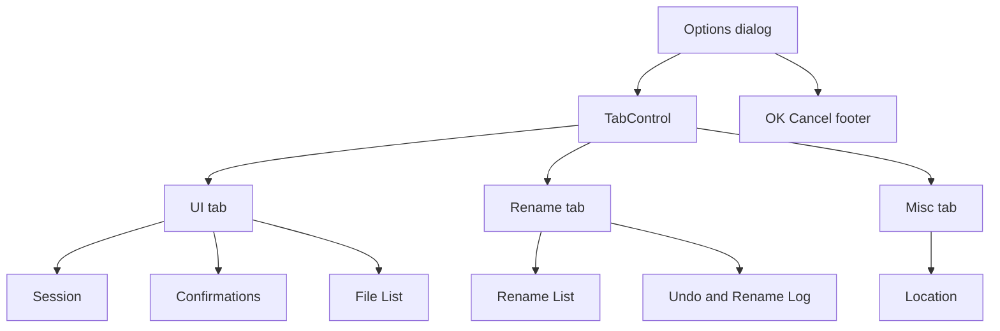

# Options dialog tabs

## Approach

Three tabs grouped by concern (not MFR7’s General / Undo split):

| Tab | Fieldsets |
| --- | --- |
| **UI** | Session, Confirmations, File List (folder/hidden) |
| **Rename** | Rename List (including File List double-click), Undo & Rename Log |
| **Misc** | Location |

Tab captions use 11px (slightly under body chrome) via `TextBlock` headers — Fluent TabItem typography otherwise renders large.

Do **not** add a ScrollViewer or persist the selected tab. ViewModel draft/Commit path stays as-is — layout-only.

## Files

- [`Mfr.App.Ui/Views/Options/OptionsDialog.axaml`](../../Mfr.App.Ui/Views/Options/OptionsDialog.axaml) — tabs, fixed height, `options-tabs` / `TabItem` font styles
- [`Mfr.Tests/Ui/Options/OptionsDialogTests.cs`](../../Mfr.Tests/Ui/Options/OptionsDialogTests.cs)
- [`help/ui/optionswin.html`](../../help/ui/optionswin.html) — anchors `#additems` (UI), `#rename`, `#log`, `#misc`
- [`help/images/ui/options.png`](../../help/images/ui/options.png) — UI tab representative shot

## Out of scope

- New options, Explorer integration, log-level UI, or prefs schema changes.
- Persisting last-selected Options tab.
