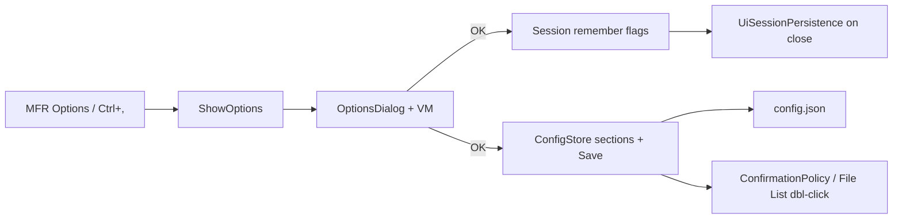

# Options dialog plan

Parent: [presets-ui.plan.md](presets-ui.plan.md) (confirm flag was out of scope until Options UI); shortcut listed in [keyboard-shortcuts.md](../keyboard-shortcuts.md).

## Decisions (locked)

- **v1 controls** (shipped; remember flags unchanged):
  1. **Save File List last position** → `SessionState.FileList.RememberLastFolder` (MFR7 `SaveFileListPos`)
  1. **Remember window size and position** → `SessionState.MainWindow.RememberWindowState` (finebytes-only; no MFR7 twin)
  1. **Confirm before replacing Applied Filters on preset load** → was `MfrConfig.Ui.Presets.ConfirmReplaceAppliedFiltersOnLoad` — then `ui.confirmationPrompts` — now **`ui.suppressedConfirmations`** ([per-dialog-confirmations.plan.md](per-dialog-confirmations.plan.md); historical [options-confirmations-and-double-click.plan.md](options-confirmations-and-double-click.plan.md))
- **Single-pane dialog** — remember ×2 + Reset confirmations (suppress list) + double-click + add-mode + Undo & Log retention + OK/Cancel (v1 was three checkboxes; follow-ons amended). Undo & Log is a FieldsetGroup section (not a second tab) — see [undo.plan.md](undo.plan.md) P4.
- **Add-mode** lives in Options only — see [options-add-mode.plan.md](options-add-mode.plan.md) (supersedes the earlier “do not duplicate / skip” decision).
- **Persist on OK**: mutate live session prefs + `ConfigStore` sections (`Ui` / `FileList` / `RenameList` / `RenameLog` as applicable), then **write `config.json`**. Session flags ride the existing close-save path (`UiSessionPersistence`).
- **Shortcut stays Ctrl+,** (finebytes); MFR7 Ctrl+T is not ported.

## MFR7 reference brief

### Sources

- Help: `Help/optionswin.html` (+ `optionswin1.gif` / `optionswin2.gif`); related `resetconfig.html`, `log.html`
- Code: `D:\Devl\mfr7\Core\MFRGui\Forms\Main\Options.cs` (+ `.resx`); open from `Main.cs` (`mniOptions` / `btnOptions`); persist `OptionsForm.LoadConfig`/`SaveConfig` → `mfrconfig.xml`
- finebytes status: **Options UI shipped** (this plan P1–P4) — remember flags in **session**; confirmations via **`ui.suppressedConfirmations`** + Keep showing checkbox ([per-dialog-confirmations.plan.md](per-dialog-confirmations.plan.md); double-click-to-add still from [options-confirmations-and-double-click.plan.md](options-confirmations-and-double-click.plan.md)); **Undo & Log** retention shipped in [undo.plan.md](undo.plan.md) P4 (`renameLog.limit`)

### Behavior

- Purpose: app-wide prefs (add-from-File-List, restore File List path, optional shell integrate, double-click-to-add, rename-log retention). Not Filter Options.
- MFR7 tabs:
  - **General:** Add files / Add folders / Add folder contents; Save File List last position; Integrate Explorer (registry, admin); Double-click adds to Rename List
  - **Undo & Log:** LogLimit radios (0 / N / unlimited) for `.mfrlog` undo history (default limited to 10)
- Apply: in-memory on OK; XML on exit. Shell checkbox applies immediately. No Apply button.

### UX notes

- Title **Options**; MFR → Options + toolbar; OK/Cancel; Escape = Cancel; ~fixed dialog, center parent.

### Parity gaps / intentional diffs (v1)

| MFR7                         | finebytes v1                                                                                                                                                               |
| ---------------------------- | -------------------------------------------------------------------------------------------------------------------------------------------------------------------------- |
| Add files/folders/contents   | **Shipped** in [options-add-mode.plan.md](options-add-mode.plan.md) (`renameList.addMode` + `addFolderContents`)                                                           |
| Save File List last position | **Ship** as Remember last folder                                                                                                                                           |
| Explorer shell integrate     | **Defer** (admin/registry)                                                                                                                                                 |
| Double-click to add          | **Shipped** in [options-confirmations-and-double-click.plan.md](options-confirmations-and-double-click.plan.md) (`fileList.doubleClickAddsToRenameList`)                   |
| Undo & Log tab               | **Shipped** as Undo & Log section in [undo.plan.md](undo.plan.md) P4 (`renameLog.limit`)                                                                                   |
| —                            | **Ship** Remember window state; confirm-replace checkbox **superseded** by per-dialog suppress list ([per-dialog-confirmations.plan.md](per-dialog-confirmations.plan.md)) |

## Non-goals

- Explorer context-menu integration
- Double-click-to-add preference — **done** in [options-confirmations-and-double-click.plan.md](options-confirmations-and-double-click.plan.md) (no longer deferred here)
- Confirm-replace checkbox as a standalone Options control — **superseded** by per-dialog confirmations ([per-dialog-confirmations.plan.md](per-dialog-confirmations.plan.md))
- Undo & Log retention UI / renaming `.mfrlog` model — **done** in [undo.plan.md](undo.plan.md) (no longer deferred here)
- Exposing `log.*` templates (hand-edit / CLI `--set` remains)
- Add-mode Options UI — **done** in [options-add-mode.plan.md](options-add-mode.plan.md) (no longer “moving out of Rename List”)
- Changing Reset Configuration (already Tools → Reset)

## Architecture

Pattern: modal Avalonia `Window` like [ExcludeMasksDialog](../../Mfr.App.Ui/Views/FileList/ExcludeMasksDialog.axaml) / Filter Options — `ShowInTaskbar=False`, `CenterOwner`, `ModalDialogKeyboard`, `ShowDialog<bool?>`, apply draft only on `true`.

Wire via event/hooks from [MainWindowViewModel](../../Mfr.App.Ui/ViewModels/MainWindow/MainWindowViewModel.cs) (same style as `ResetConfigurationRequested`) so Views host the dialog.

> **Follow-ons:** double-click-to-add — [options-confirmations-and-double-click.plan.md](options-confirmations-and-double-click.plan.md); confirmations — [per-dialog-confirmations.plan.md](per-dialog-confirmations.plan.md) (3-state removed).

## Phases

### P1 — `ConfigStore.Save`

- **Scope:** [`ConfigStore.cs`](../../Mfr.Models/Config/ConfigStore.cs) — add `Save(string? path = null)` that always writes current `Config` via existing `ConfigJsonWriter` (overwrite; create dir). Keep `EnsureDefaultFile` as write-if-missing for startup. Update XML remarks (Options UI can persist).
- **Exit:** unit test round-trips a mutated `ConfirmReplace…` (and optionally another leaf) through Save → Load.
- **Tests:** `Mfr.Tests` ConfigStore / binding area.

### P2 — Options dialog UI + VM

- **Scope:**
  - `Mfr.App.Ui/ViewModels/Options/OptionsDialogViewModel.cs` — draft bools from session + `ConfigStore.Config`; OK commits.
  - `Mfr.App.Ui/Views/Options/OptionsDialog.axaml` (+ code-behind) — three `CompactCheckBox`es, OK/Cancel footer.
  - Labels (MFR7-ish): “Save File List last position”, “Remember window size and position”, “Confirm before replacing Applied Filters when loading a preset”.
- **Exit:** dialog builds; Cancel discards; OK updates memory correctly in VM tests.

### P3 — Wire `ShowOptions`

- **Scope:** Enable `ShowOptionsCommand` (drop `_CanExecuteUnimplemented` for Options only). Host open in `MainWindow.axaml.cs` (or small hooks type). On OK: set session nested flags; set v1 `Config.Ui.Presets.ConfirmReplaceAppliedFiltersOnLoad` (later removed — see [options-confirmations-and-double-click.plan.md](options-confirmations-and-double-click.plan.md)); call `ConfigStore.Save()`. Update [`docs/keyboard-shortcuts.md`](../keyboard-shortcuts.md) (Options no longer stub). Touch [`MfrConfig`](../../Mfr.Models/Config/MfrConfig.cs) remarks (“Options dialog”). Amend presets-ui out-of-scope bullet / link this plan. Optional one-liner in [`docs/debts.md`](../debts.md) for deferred Options items (shell; Undo/Log later shipped in [undo.plan.md](undo.plan.md); double-click later shipped in follow-on).
- **Exit:** menu/toolbar/Ctrl+, opens dialog; confirm flag affects preset load without hand-editing JSON; remember flags survive restart via session save.

### P4 — Tests

- **Scope:** VM tests for load/commit/cancel; headless smoke that Options command is enabled and dialog can open (follow `mfr-ui-headless-tests` / existing MainWindow smoke). Session persistence coverage for the two remember flags if gaps exist.
- **Exit:** `just test` green (shortcuts stub wording already cleared in P3).

## Key files

| Area            | Path                                                               |
| --------------- | ------------------------------------------------------------------ |
| Options host    | `MainWindowViewModel.ShowOptions`, `MainWindow.axaml` menu/toolbar |
| Config          | `MfrConfig` / `ConfigStore` / `ConfigJsonWriter`                   |
| Session         | `SessionState`, `UiSessionPersistence`                             |
| Consumer        | `AppliedFiltersView.Presets.cs` (`NeedsConfirmReplaceOnLoad`)      |
| Sibling pattern | `ExcludeMasksDialog*`, `FilterOptionsDialog*`                      |
