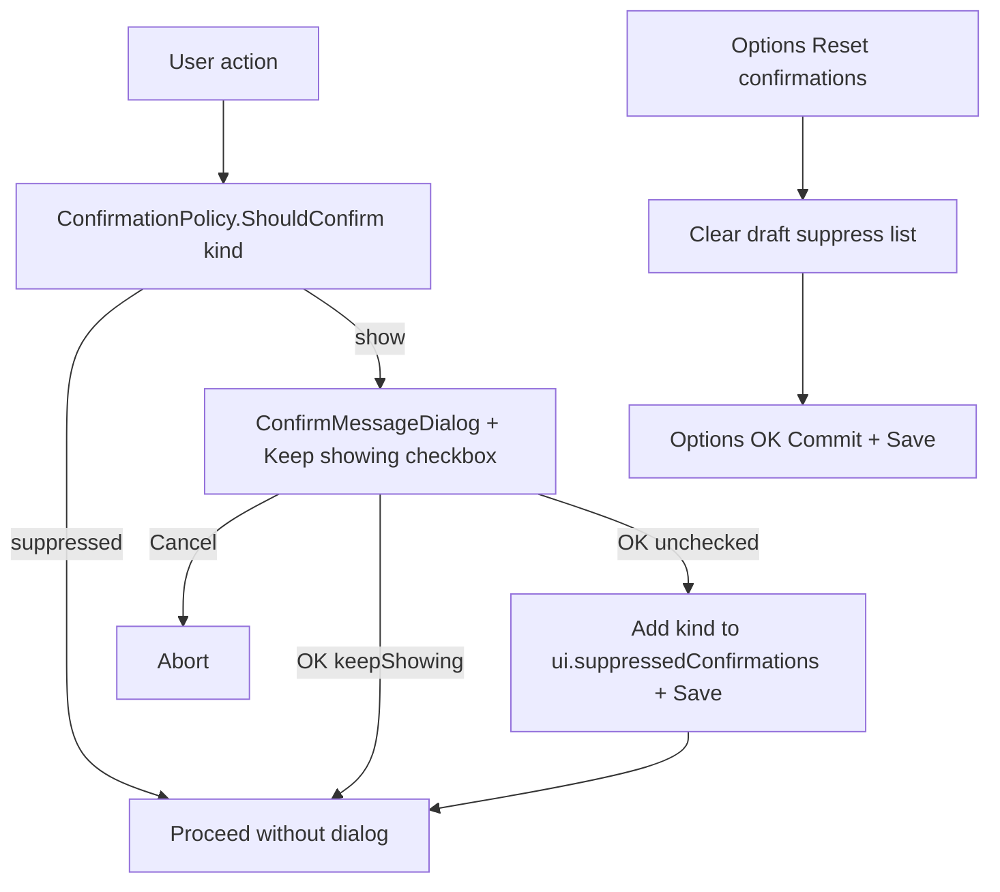

# Per-dialog confirmations plan

Parent: [options-confirmations-and-double-click.plan.md](options-confirmations-and-double-click.plan.md) (3-state shipped; **this plan replaces** the confirmation half).

## Status

Implemented (P1–P5).

## Decisions (locked)

- **Replace** `ui.confirmationPrompts` (Fewer / Normal / More) with a suppress list. No migration; old key ignored on soft-load.
- **Default:** every suppressible confirm **shows** until the user opts out (behavior change vs former Normal, which skipped Clear / Replace-on-load).
- **Dialog checkbox** label: **Keep showing this confirmation in the future** — default **checked**. Uncheck + **OK** → suppress that kind and persist immediately (`ConfigStore` + `Save`). **Cancel / Escape** → do not change prefs.
- **When suppressed:** skip dialog and **proceed**.
- **Scope:** checkbox on all confirms **except Reset Configuration**.
  - Suppressible kinds: `GoWithPreviewErrors`, `UndoRename`, `ReplaceAppliedFiltersOnLoad`, `ClearRenameList`, `ClearAppliedFilters`, `OverwritePreset`, `DeletePreset`.
  - **Reset Configuration:** always shows; no checkbox; not in `ConfirmationKind`.
- **Options:** one button **Reset confirmations** (clears suppress list in the Options draft; persists on Options OK). No per-kind list UI.
- **CLI** `--confirm` / per-item rename confirm unchanged. Generic `--set ui.…` uses `ui.suppressedConfirmations` (enum-list leaf is not CLI-settable as a comma string today).

## MFR7 reference brief

- MFR7 has no confirmation-level Options UI (`ConfirmRenames` dead — do not port). Prior finebytes 3-state and this per-dialog model are intentional finebytes-only UX.
- Sources already captured in [options-confirmations-and-double-click.plan.md](options-confirmations-and-double-click.plan.md); no new MFR7 crawl.

## Non-goals

- Per-kind Options toggles / individual selection UI
- Suppressing Reset Configuration
- Migrating old `confirmationPrompts` values into the suppress list
- Changing CLI per-item confirm
- Centralized dialog service rewrite (keep view + UiHooks pattern; extend shared `ConfirmMessageDialog`)

## Architecture



**Persist schema** (`config.json`):

```json
"ui": { "suppressedConfirmations": ["clearRenameList", "deletePreset"] }
```

- Type: `List<ConfirmationKind>` on [`UiConfig`](../../Mfr.Models/Config/PrefsSections.cs); default empty.
- STJ camelCase enum names; unknown members skipped on soft-load.
- `ConfirmationPrompts` removed.

**Policy** ([`ConfirmationPolicy`](../../Mfr.Models/Config/ConfirmationPolicy.cs)):

- `ShouldConfirm(kind)` → `true` iff kind is **not** in `ConfigStore.Ui.SuppressedConfirmations`.
- `Suppress(kind)` / `ClearSuppressions()` mutate the in-memory list (Save is caller’s job for dialog path; Options uses Commit).

**Dialog** ([`ConfirmMessageDialog`](../../Mfr.App.Ui/Views/ConfirmMessageDialog.axaml)):

- Optional `ConfirmationKind?`. When set: show checkbox. When null (reset config): no checkbox.
- On OK: if kind set and checkbox unchecked → `Suppress` + `ConfigStore.Save()` (`SaveConfig` hookable for tests).
- Keep `ShowDialog<bool>` result meaning confirmed / cancelled.

**Call sites** — gate with `ShouldConfirm` then show dialog **with kind**:

| Kind                                   | Site                                                                                           |
| -------------------------------------- | ---------------------------------------------------------------------------------------------- |
| Go / Clear RL / Undo                   | [`RenameListView`](../../Mfr.App.Ui/Views/RenameList/RenameListView.axaml.cs) / VM hooks       |
| Clear AF / Replace on load / Overwrite | [`AppliedFiltersView`](../../Mfr.App.Ui/Views/AppliedFilters/)                                 |
| Delete preset(s)                       | [`PresetManagerDialog`](../../Mfr.App.Ui/Views/Presets/PresetManagerDialog.axaml.cs)           |
| Reset config                           | [`MainWindow`](../../Mfr.App.Ui/Views/MainWindow/MainWindow.axaml.cs) — **no** kind / checkbox |

## Phases

### P1 — Config + policy — done

- Removed `ConfirmationPrompts`; added `UiConfig.SuppressedConfirmations`; extended `ConfirmationKind` with `OverwritePreset`, `DeletePreset`; rewrote `ConfirmationPolicy`.
- Soft-load ignores obsolete `confirmationPrompts`.

### P2 — ConfirmMessageDialog checkbox — done

- Optional kind + Keep showing checkbox; OK unchecked suppresses + saves; Cancel does not.

### P3 — Wire call sites — done

- All suppressible confirms pass kind; Overwrite/Delete gated by policy; Reset unchanged.

### P4 — Options UI — done

- Confirmations blurb + **Reset confirmations** (draft clear; Commit on OK); AppTips updated.

### P5 — Docs — done

- This file; parent plans amended to point here for confirmation prefs.
