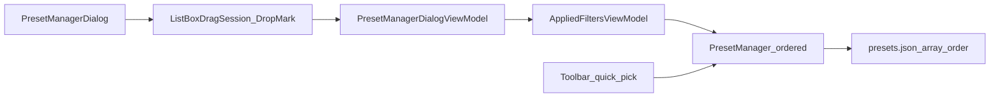

# Preset Manager reorder / multi-select

Parent: [presets-ui.plan.md](docs/plans/presets-ui.plan.md) (F7 done). Canonical write path when implementing: `docs/plans/preset-manager-reorder.plan.md`.

## Decisions (locked)

- **Custom order** replaces alphabetical sort for **Preset Manager** and toolbar **▾**. Save name suggestions and any other `PresetNameOrder.ByName` call sites switch to the same stored order (trivial once the engine exposes an ordered list). Sample import checklist may keep catalog name sort.
- **Move Up / Move Down** buttons in the Manager footer, plus **drag-drop** reorder (same interaction model as Applied Filters).
- **Multi-select:** Delete applies to all selected (one confirm). Load and Rename require exactly one selection. Description pane shows text only when exactly one is selected.
- **Persistence:** JSON `presets[]` array order is the source of truth. Stop sorting on save. Load preserves array order. New Save / Import append; overwrite keeps existing index. Existing name-sorted files become the user’s starting order (no migration).
- **Non-goals:** “Sort by name” command; MFR7 parity (MFR7 had neither reorder nor multi-select); soft-load / `.mps`.

## MFR7 reference brief

Help + `PresetManager.cs`: alphabetical single-select list; Load / Delete / Edit Description / Close only. No DnD, multi-select, or move buttons. This feature is **new**, not parity.

## Reuse / refactor (locked)

**Verdict:** Reuse the shared ListBox DnD + `ListReorder` stack as-is. Copy the **Applied Filters** wiring shape into Preset Manager. Do **not** extract a new selection/DnD host, and do **not** use `OrderedDraft`.

| Piece                                                                                                                                                                                                                                                                                | Decision                            | Why                                                                                                                                                                                                                                                                                    |
| ------------------------------------------------------------------------------------------------------------------------------------------------------------------------------------------------------------------------------------------------------------------------------------ | ----------------------------------- | -------------------------------------------------------------------------------------------------------------------------------------------------------------------------------------------------------------------------------------------------------------------------------------- |
| [`ListBoxDragSession`](Mfr.App.Ui/Views/DragAndDrop/ListBoxDragSession.cs), [`ListBoxDropMark`](Mfr.App.Ui/Views/DragAndDrop/ListBoxDropMark.cs), [`ListBoxDrag`](Mfr.App.Ui/Views/DragAndDrop/ListBoxDrag.cs), [`JsonDragPayload`](Mfr.App.Ui/Views/DragAndDrop/JsonDragPayload.cs) | **Reuse as-is**                     | Already shared by Applied Filters, Field Shuttle, Palette                                                                                                                                                                                                                              |
| [`ListReorder`](Mfr.Utils/ListReorder.cs)                                                                                                                                                                                                                                            | **Reuse as-is**                     | Up/Down + DnD block moves (AF + OrderedDraft already call it)                                                                                                                                                                                                                          |
| [`AppliedFilterDragPayload`](Mfr.App.Ui/Views/AppliedFilters/AppliedFilterDragPayload.cs) pattern                                                                                                                                                                                    | **Copy twin** (`PresetDragPayload`) | Same JSON-index payload; ~50 LOC, not worth a generic                                                                                                                                                                                                                                  |
| Applied Filters [`.DragDrop.cs`](Mfr.App.Ui/Views/AppliedFilters/AppliedFiltersView.DragDrop.cs) / [`.Selection.cs`](Mfr.App.Ui/Views/AppliedFilters/AppliedFiltersView.Selection.cs)                                                                                                | **Copy pattern**                    | Best single-list live-reorder template (~100–120 LOC DnD + selection glue)                                                                                                                                                                                                             |
| Field Shuttle / [`OrderedDraft`](Mfr.App.Ui/ViewModels/RenameList/OrderedDraft.cs)                                                                                                                                                                                                   | **Do not use**                      | Draft-until-OK + multi-list shuttle; presets live-persist like Applied Filters steps                                                                                                                                                                                                   |
| Extract `ListBoxReorderHost` / selection bridge                                                                                                                                                                                                                                      | **Defer**                           | Hard parts already shared; extracting view glue saves ~30–50 LOC here at cost of a frameworky API. Revisit only at a 4th identical single-list consumer ([whole-codebase-review](docs/plans/whole-codebase-review.plan.md) already skipped DataGrid session merge for the same reason) |
| Shared CanExecute helpers                                                                                                                                                                                                                                                            | **Defer / never**                   | `_HasSelection` / `_HasSingleSelection` / `ListReorder.CanMove…` are 2–4 lines per VM                                                                                                                                                                                                  |
| Generic “ordered named store”                                                                                                                                                                                                                                                        | **None exists**                     | Order lives in `PresetManager` list + `SavePresets`; no extra store type                                                                                                                                                                                                               |
| [`PresetNameOrder`](Mfr.App.Ui/ViewModels/Presets/PresetNameOrder.cs)                                                                                                                                                                                                                | **Remove when unused**              | Alphabetical helper superseded by stored order (was “done” in [applied-filters-deeper-refactors](docs/plans/applied-filters-deeper-refactors.md); this plan replaces it)                                                                                                               |
| Preset Manager mutation façade (#11 in deeper-refactors)                                                                                                                                                                                                                             | **Still skip**                      | Keep thin code-behind; mutations stay on `AppliedFiltersViewModel` / `PresetManager`                                                                                                                                                                                                   |

## Approach

- **Engine:** Ordered list as display/save source of truth; keep O(1) name lookup. Mutation APIs: upsert (replace-in-place or append), remove, rename, `TryMoveIndicesTo` via `ListReorder`. Remove sort in [`SavePresets`](Mfr.Engine/Presets/PresetManager.cs).
- **UI:** AF-shaped copy — session + drop mark + VM-owned selection list (drop sole two-way `SelectedItem`); footer gates: Up/Down via `ListReorder.CanMove…`, Delete any selection, Load/Rename/description exactly one.
- **Display consumers:** Manager `Refresh`, ▾ in [`AppliedFiltersView.Presets.cs`](Mfr.App.Ui/Views/AppliedFilters/AppliedFiltersView.Presets.cs), Save suggestions — iterate ordered `Presets`; delete `PresetNameOrder` if unused.

## Phases

### P1 — Ordered preset store

- Scope / files: [`PresetManager.cs`](Mfr.Engine/Presets/PresetManager.cs); call sites in [`AppliedFiltersViewModel.cs`](Mfr.App.Ui/ViewModels/AppliedFilters/AppliedFiltersViewModel.cs) that mutate `NameToPreset` (Save/Delete/Rename/Import); [`PresetManagerTests.cs`](Mfr.Tests/Engine/PresetManagerTests.cs).
- Behavior: load preserves order; save writes current order; upsert/append/remove/rename maintain list + lookup; expose reorder helper used by later phases (`ListReorder` inside engine or AF API).
- Exit: engine tests prove order round-trip; tests that required name-sorted save updated; no UI reorder yet.
- Tests: engine order preserve / append / replace-in-place / move.

### P2 — Manager multi-select + Up/Down

- Scope / files: [`PresetManagerDialog.axaml`](Mfr.App.Ui/Views/Presets/PresetManagerDialog.axaml) (+ code-behind / selection partial), [`PresetManagerDialogViewModel.cs`](Mfr.App.Ui/ViewModels/Presets/PresetManagerDialogViewModel.cs); AF delete/reorder APIs as needed; VM tests.
- Behavior: copy AF selection ownership (`SelectedPresets` + restore); `SelectionMode="Multiple"`; Load/Rename iff count == 1; Delete for count >= 1; Up/Down → reorder + `SavePresets`; description when single.
- Also switch Manager + ▾ (+ Save suggestions) to ordered `Presets`; remove `PresetNameOrder` if dead.
- Exit: batch delete and Up/Down persist; ▾ order matches Manager.
- Tests: VM selection gates + reorder; replace alphabetical assertions with order-sensitive ones.

### P3 — Manager drag-drop reorder

- Scope / files: `PresetManagerDialog.DragDrop.cs` (+ selection helpers), `PresetDragPayload` twin of Applied Filter payload; drop-mark styles; headless tests per `mfr-ui-headless-tests` (mirror [`AppliedFiltersDragDropTests`](Mfr.Tests/Ui/AppliedFilters/AppliedFiltersDragDropTests.cs)).
- Behavior: reuse shared session/drop-mark; AF press/threshold/multi-collapse pattern; drop → move indices → save → restore selection. **No** new shared DnD host in this phase.
- Exit: DnD reorder matches Up/Down persistence; drop mark while dragging.
- Tests: headless drag reorder + multi-drag block move.

## Non-goals

- Sort-by-name reset action
- Reordering inside Import Sample checklist
- Extracting a shared ListBox reorder/selection host (defer)
- Using `OrderedDraft` for presets
- DataGrid / Behaviors packages
- Changing Load to apply multiple presets
