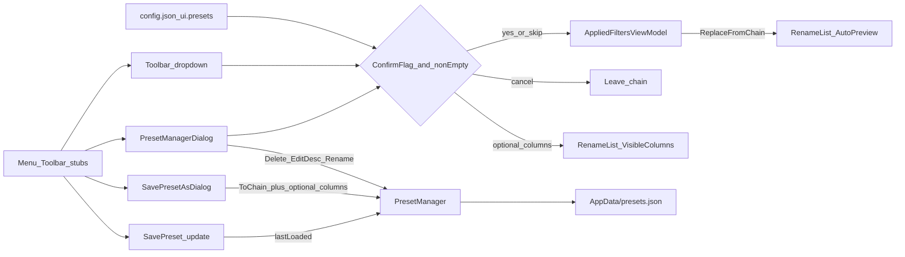

# F7 Presets UI

Canonical product backlog: [applied-filter-editors.plan.md](applied-filter-editors.plan.md) (F7 next). This file is the detailed implementation plan for that slice only. **Do not** fold in F8 session chain, F9c help, or F10 polish.

**Phased:** yes — four PR-sized phases below. Ship each phase with its tests before starting the next.

## Product decisions (locked)

| Topic                  | Choice                                                                                                                                                                                                                                                                                               |
| ---------------------- | ---------------------------------------------------------------------------------------------------------------------------------------------------------------------------------------------------------------------------------------------------------------------------------------------------- |
| Load semantics         | **Always replace** Applied Filters (clear + rebuild). No merge.                                                                                                                                                                                                                                      |
| Confirm before replace | **Optional via config.** When `ConfirmReplaceAppliedFiltersOnLoad` is `true` and `Steps.Count > 0`, show `ConfirmMessageDialog` before replace (Cancel leaves chain unchanged). When `false` (default), replace immediately (MFR7 parity). Applies to Manager **Load** and toolbar **▾** quick-pick. |
| **Save vs Save As**    | **Save Preset** updates the **last-loaded** preset in place (same name + `Id`, no name dialog, no overwrite confirm). **Save Preset As** opens the name/description/columns dialog (overwrite confirm if name exists).                                                                               |
| Save enabled           | **Save** enabled only when last-loaded name is still present in `NameToPreset` (cleared if that preset was deleted; updated if renamed). If none → Save disabled; use Save As.                                                                                                                       |
| Save payload           | **Chain always** (`ToChain()`). Columns: **Save** keeps prior policy (if last-loaded had `visibleColumns`, re-capture; if it was `null`, stay `null`). **Save As** uses the checkbox. Description: **Save** keeps existing description; **Save As** uses dialog field.                               |
| RL columns on load     | If preset has `visibleColumns`, apply via `ApplyVisibleColumnsFromSession`. If omitted/`null`, leave current columns unchanged.                                                                                                                                                                      |
| Description            | Optional on Save As + read-only pane + **Edit Description** in Manager.                                                                                                                                                                                                                              |
| Rename preset          | **In Manager** — keep `Id`; refuse if another preset already has that exact name; update last-loaded name if it matched.                                                                                                                                                                             |
| Overwrite / delete     | Overwrite confirm only on **Save As** when name exists; **confirm delete**. **Save** (update) is silent.                                                                                                                                                                                             |
| Quick load             | Toolbar **Presets** + **▾**; Filters menu: Presets / Save Preset / Save Preset As.                                                                                                                                                                                                                   |
| First-run file         | `OpenDefault()` creates empty file when missing; corrupt hard-fails.                                                                                                                                                                                                                                 |
| Display names          | Catalog-synthesized on load; custom Filter Options names do not round-trip.                                                                                                                                                                                                                          |
| `.mps` / migration     | None.                                                                                                                                                                                                                                                                                                |
| Shortcuts              | None. `AppTips` only.                                                                                                                                                                                                                                                                                |



______________________________________________________________________

## Phases

### P1 — Foundation (no Presets UI yet)

Engine / models / Applied Filters plumbing. Menu/toolbar stay disabled.

1. **`PresetManager.OpenDefault()` / `CreateEmpty()`** — missing file → write empty container then load; corrupt → still throw. Tests for both.
1. **`FilterPreset.VisibleColumns`** — optional `IReadOnlyList<SessionStateRenameListColumn>?` (`key` + `width`). Docs in [Mfr.Filters/docs/README.md](../../Mfr.Filters/docs/README.md); JSON probe with columns present/absent.
1. **`MfrConfig.Ui.Presets.ConfirmReplaceAppliedFiltersOnLoad`** — default `false`; JSON string `"true"`/`"false"`; hand-edit only (Options UI stubbed). Binding coverage.
1. **`AppliedFiltersViewModel.ReplaceFromChain`** — one `ChainChanged`; catalog display names; `Enabled` from steps; select first step if any. Inject `PresetManager` (+ **`LastLoaded` / `CanSavePreset`**). Wire `PresetManager.OpenDefault()` in [`App.axaml.cs`](../../Mfr.App.Ui/App.axaml.cs) → `MainWindowViewModel`.

**Exit:** unit/engine tests green; UI still stubs.

### P2 — Save Preset + Save Preset As

Replace the single stub with **two** actions (menu + toolbar).

1. **`SavePresetDialog`** + VM (`Views/Presets/` ↔ `ViewModels/Presets/`): used only for **Save As** — name, description, checkbox **Save Rename List columns**, overwrite confirm when name exists.
1. Prefill Save As from last-loaded when present (name/description/checkbox).
1. Upsert on Save As: keep `Id` on overwrite else `Guid.NewGuid()`; `Chain = ToChain()`; columns from capture when checked else `null`; set last-loaded to the saved preset.
1. **Save** (in place): resolve last-loaded in `NameToPreset`; write `existing with { Chain = ToChain(), VisibleColumns = prior was null ? null : Capture… }` (same `Id`/`Name`/`Description`); `SavePresets()`; brief success optional via status/tip — no dialog. If last-loaded missing mid-click → disable / no-op.
1. Enable **Save Preset** (`CanSavePreset`) and **Save Preset As** on Filters menu + Applied Filters toolbar (layout: after Presets, e.g. `Save` then `Save As`).

**Exit:** can create (Save As) and update (Save) presets from the UI; load still Manager/▾ (P3/P4) or tests.

### P3 — Preset Manager (Load / Delete / Edit Description / Rename)

1. **`PresetManagerDialog`** + VM: sorted list, read-only description, **Load**, **Delete**, **Edit Description**, **Rename**, **Close**.
1. **Load** (double-click / Enter / button): confirm-replace gate → `ReplaceFromChain` → optional columns apply → set last-loaded (enables Save) → close OK.
1. **Delete**: confirm → remove → `SavePresets` → if deleted was last-loaded, clear last-loaded (`CanSavePreset` false) → refresh.
1. **Edit Description**: multiline prompt → save.
1. **Rename**: name prompt; blank invalid; same name no-op; name taken by another → error (no overwrite); success keeps `Id`/chain/description/columns, updates key + last-loaded name if needed.
1. Enable **Presets** menu + toolbar → open Manager.
1. Corrupt open → `OkMessageDialog`; leave chain unchanged.

**Exit:** full named-preset lifecycle except ▾ quick-pick.

### P4 — Quick-pick + polish

1. Toolbar **▾** next to Presets: sorted names; disabled “No presets”; same load path as Manager Load (sets last-loaded).
1. `AppTips` for Presets / Save / Save As / ▾; bind tooltips.
1. Headless tests; mark F7 done in [applied-filter-editors.plan.md](applied-filter-editors.plan.md).

**Exit:** F7 complete.

______________________________________________________________________

## Shared design detail (all phases)

### Preset schema: optional RL columns

```csharp
[JsonPropertyName("visibleColumns")]
public IReadOnlyList<SessionStateRenameListColumn>? VisibleColumns { get; init; }
```

Reuse [`SessionStateRenameListColumn`](../../Mfr.Models/Config/SessionState.cs). No `sortFields` on presets. Invalid keys: reuse existing `ApplyVisibleColumns` filtering.

### Config flag

```json
{ "ui": { "presets": { "confirmReplaceAppliedFiltersOnLoad": "false" } } }
```

Shared host helper `_TryConfirmReplaceAsync` for Load and ▾.

### Engine

No Delete/Rename/Save APIs on `PresetManager` — UI mutates `NameToPreset` then `SavePresets()`.

### Dialogs / chrome

Reuse `ConfirmMessageDialog`, `OkMessageDialog`, `TextInputDialog`, `ModalDialogKeyboard`, `Themes/MessageDialog.axaml`. Save As uses dedicated dialog; in-place Save does not.

### Host wiring

Open Manager / Save / Save As from Applied Filters code-behind + MainWindow Filters menu → pane (Filter Options pattern). Empty chain save allowed for both Save and Save As.

## Tests by phase

| Phase | Coverage                                                                                                                                                                                          |
| ----- | ------------------------------------------------------------------------------------------------------------------------------------------------------------------------------------------------- |
| P1    | `OpenDefault` missing vs corrupt; `visibleColumns` JSON; config bool bind; `ReplaceFromChain` + `ChainChanged` + display names; `CanSavePreset` false initially                                   |
| P2    | Save As upsert / overwrite keeps Id; columns checkbox; **Save** updates chain in place and keeps Id/name/description; Save disabled without last-loaded; Save As sets last-loaded so Save enables |
| P3    | Load sets last-loaded; delete clears it; rename updates it; confirm-replace cancel; edit description                                                                                              |
| P4    | ▾ load sets last-loaded; tips smoke; mark F7 done                                                                                                                                                 |

Do **not** retest JSON polymorphism (`PresetJsonPolymorphismTests`).

## Out of scope (explicit)

- F8 session persistence of working Applied Filters chain
- Shipping default seed presets
- Import MFR7 `.mps`
- Packing Rename List **sort** (or other session fields) into presets
- Soft-load of corrupt `presets.json`
- Options dialog checkbox for the confirm flag (config.json only until Options UI exists)
- Changing description via in-place **Save** (use Edit Description or Save As)
