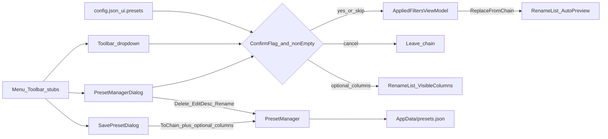

# F7 Presets UI

Canonical product backlog: [applied-filter-editors.plan.md](applied-filter-editors.plan.md) (F7 next). This file is the detailed implementation plan for that slice only. **Do not** fold in F8 session chain, F9c help, or F10 polish.

**Phased:** yes — four PR-sized phases below. Ship each phase with its tests before starting the next.

## Product decisions (locked)

| Topic | Choice |
| --- | --- |
| Load semantics | **Always replace** Applied Filters (clear + rebuild). No merge. |
| Confirm before replace | **Optional via config.** When `ConfirmReplaceAppliedFiltersOnLoad` is `true` and `Steps.Count > 0`, show `ConfirmMessageDialog` before replace (Cancel leaves chain unchanged). When `false` (default), replace immediately (MFR7 parity). Applies to Manager **Load** and toolbar **▾** quick-pick. |
| Save payload | **Chain always** (`ToChain()`). **Optional** Rename List **visible columns + widths** (checkbox on Save). **Not** sort keys, add-mode, font, or preview — those stay session-owned. |
| RL columns on load | If preset has `visibleColumns`, apply via existing `RenameListViewModel.ApplyVisibleColumnsFromSession`. If omitted/`null`, **leave current columns unchanged** (filter-only presets). |
| Description | Optional on save + read-only pane + **Edit Description** in Manager. |
| Rename preset | **In Manager** — name prompt; keep `Id`; refuse if another preset already has that exact name (no silent overwrite via Rename); update last-loaded name if it matched the old name. |
| Overwrite / delete | Confirm overwrite on **Save**; **confirm delete**. |
| Quick load | Toolbar **Presets** opens Manager; small **▾** one-click load (P4). Filters menu: Presets / Save Preset only. |
| First-run file | `PresetManager.OpenDefault()` creates empty `{ "presets": [] }` when missing; corrupt still hard-fails. |
| Display names | Synthesize from `FilterCatalog` on load; custom Filter Options names do not round-trip. |
| `.mps` / migration | None. |
| Shortcuts | None. `AppTips` only. |



______________________________________________________________________

## Phases

### P1 — Foundation (no Presets UI yet)

Engine / models / Applied Filters plumbing. Menu/toolbar stay disabled.

1. **`PresetManager.OpenDefault()` / `CreateEmpty()`** — missing file → write empty container then load; corrupt → still throw. Tests for both.
1. **`FilterPreset.VisibleColumns`** — optional `IReadOnlyList<SessionStateRenameListColumn>?` (`key` + `width`). Docs in [Mfr.Filters/docs/README.md](../../Mfr.Filters/docs/README.md); JSON probe with columns present/absent.
1. **`MfrConfig.Ui.Presets.ConfirmReplaceAppliedFiltersOnLoad`** — default `false`; JSON string `"true"`/`"false"`; hand-edit only (Options UI stubbed). Binding coverage.
1. **`AppliedFiltersViewModel.ReplaceFromChain`** — one `ChainChanged`; catalog display names; `Enabled` from steps; select first step if any. Inject `PresetManager` (+ last-loaded fields). Wire `PresetManager.OpenDefault()` in [`App.axaml.cs`](../../Mfr.App.Ui/App.axaml.cs) → `MainWindowViewModel`.

**Exit:** unit/engine tests green; UI still stubs.

### P2 — Save Preset

1. **`SavePresetDialog`** + VM under `Views/Presets/` ↔ `ViewModels/Presets/`: name, description, checkbox **Save Rename List columns**, overwrite confirm.
1. Prefill from last-loaded (name/description/checkbox when last had columns).
1. Upsert: keep `Id` on overwrite else `Guid.NewGuid()`; `Chain = ToChain()`; columns from `CaptureVisibleColumnsForSession()` when checked else `null`.
1. Enable **Save Preset** on Filters menu + Applied Filters toolbar; host opens dialog (same owner pattern as Filter Options / Reset).

**Exit:** can persist a named preset from the UI; load still via engine/tests only (or Manager not yet).

### P3 — Preset Manager (Load / Delete / Edit Description / Rename)

1. **`PresetManagerDialog`** + VM: sorted list, read-only description, **Load**, **Delete**, **Edit Description**, **Rename**, **Close**.
1. **Load** (double-click / Enter / button): confirm-replace gate → `ReplaceFromChain` → optional `ApplyVisibleColumnsFromSession` → update last-loaded → close OK.
1. **Delete**: confirm → remove key → `SavePresets` → refresh list.
1. **Edit Description**: multiline prompt → `with { Description }` → save.
1. **Rename**: `TextInputDialog` (or equivalent) for new name.
   - Blank → stay with validation.
   - Exact same name → no-op.
   - Name taken by **another** preset → error (`OkMessageDialog`), do **not** overwrite via Rename (Save is the overwrite path).
   - Success: remove old key; insert `preset with { Name = newName }` (same `Id`, chain, description, columns); `SavePresets`; refresh; if last-loaded name was old, update it.
1. Enable **Presets** menu + toolbar button → open Manager.
1. Corrupt open → `OkMessageDialog`; leave chain unchanged.

**Exit:** full named-preset lifecycle except ▾ quick-pick.

### P4 — Quick-pick + polish

1. Toolbar **▾** next to Presets: sorted names; disabled “No presets”; same load path as Manager Load (confirm gate + columns).
1. `AppTips.Presets` / `SavePreset` / ▾ tip; bind tooltips.
1. Headless tests for dialogs/buttons/▾/confirm-replace/columns checkbox; mark F7 done in [applied-filter-editors.plan.md](applied-filter-editors.plan.md).

**Exit:** F7 complete.

______________________________________________________________________

## Shared design detail (all phases)

### Preset schema: optional RL columns

```csharp
[JsonPropertyName("visibleColumns")]
public IReadOnlyList<SessionStateRenameListColumn>? VisibleColumns { get; init; }
```

Reuse [`SessionStateRenameListColumn`](../../Mfr.Models/Config/SessionState.cs). No `sortFields` on presets. Invalid keys: reuse existing `ApplyVisibleColumns` filtering.

### Config flag

```json
{ "ui": { "presets": { "confirmReplaceAppliedFiltersOnLoad": "false" } } }
```

Shared host helper `_TryConfirmReplaceAsync` for Load and ▾.

### Engine

No Delete/Rename APIs on `PresetManager` — UI mutates `NameToPreset` then `SavePresets()`.

### Dialogs / chrome

Reuse `ConfirmMessageDialog`, `OkMessageDialog`, `TextInputDialog`, `ModalDialogKeyboard`, `Themes/MessageDialog.axaml`. Prefer dedicated Save dialog over stacked name-only prompts.

### Host wiring

Open Manager / Save from Applied Filters code-behind + MainWindow Filters menu → pane (Filter Options pattern). Empty chain save allowed.

## Tests by phase

| Phase | Coverage |
| --- | --- |
| P1 | `OpenDefault` missing vs corrupt; `visibleColumns` JSON; config bool bind; `ReplaceFromChain` + `ChainChanged` + display names |
| P2 | Save upsert / overwrite keeps Id; columns null vs captured; Save button enables / dialog OK path |
| P3 | Load replaces chain ± columns; delete confirm; edit description; rename success / conflict refuse; confirm-replace cancel |
| P4 | ▾ load; tips smoke; mark F7 done |

Do **not** retest JSON polymorphism (`PresetJsonPolymorphismTests`).

## Out of scope (explicit)

- F8 session persistence of working Applied Filters chain
- Shipping default seed presets
- Import MFR7 `.mps`
- Packing Rename List **sort** (or other session fields) into presets
- Soft-load of corrupt `presets.json`
- Options dialog checkbox for the confirm flag (config.json only until Options UI exists)
