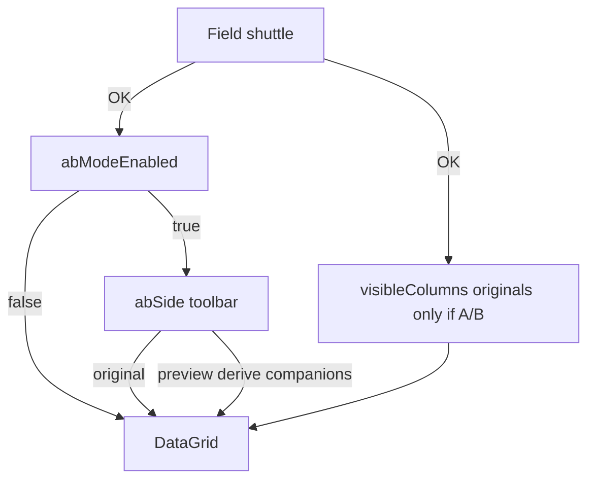

# Rename List preview-columns A/B toggle

Parent: Rename List UI block 5 columns / shuttle (shipped).

## Is this an additional mode?

**Yes — A/B Mode is an opt-in layout policy**, configured in the **field shuttle**, plus a **toolbar side control** used only while that mode is on.

It does **not** replace Select Fields, Auto-Preview, or File List view modes.

Mental model:

| Control                 | Where                         | Question it answers                                                         |
| ----------------------- | ----------------------------- | --------------------------------------------------------------------------- |
| **A/B Mode**            | Field shuttle (Columns tab)   | Is my column layout originals-only, with preview derived for compare?       |
| **Select Fields**       | Same shuttle                  | Which **original** fields are in the layout? (preview not choosable in A/B) |
| **Original \| Preview** | RL toolbar (only when A/B on) | Which side am I viewing right now?                                          |
| **Auto-Preview**        | RL toolbar                    | Recalculate preview when filters/list change?                               |

## UX

### A/B Mode — lives in the shuttle

On the **Columns** tab of [RenameListFieldShuttleDialog](../../Mfr.App.Ui/Views/RenameList/RenameListFieldShuttleDialog.axaml), add a checkbox **A/B Mode** (near the Original Fields / Preview Fields subtabs or above the panels).

**When unchecked (default):** today’s shuttle — Original Fields + Preview Fields subtabs; selected list may mix original and preview keys; OK writes that full list. Grid shows the full list. Toolbar Original|Preview control is **hidden/disabled**.

**When checked (on OK / applied):**

- **Preview Fields** subtab is **hidden** (not merely disabled with a tease).
- Force **Original Fields** subtab.
- **Normalize** the selected (right-hand) list to originals-only (shared helper — see below): each preview key → matching original; dedupe; no stash of preview entries.
- Available list / Add / Add All / DnD **cannot** introduce preview keys (guards in VM + drag filter).
- Hint under the checkbox: e.g. “Original fields only. Use the Rename List Original/Preview control to switch views.”

Enabling A/B does **not** invent fields and does **not** drop field identity: Title (Preview) becomes Title (original). Preview *columns* leave the stored layout (they come back as derived companions on the toolbar Preview side). No confirm in v1 (KISS; hint text is enough).

**When turning A/B off in the shuttle:** Preview Fields subtab returns; selected list stays as the current originals; user may add preview keys again as today.

`abModeEnabled` is committed with the rest of the shuttle on **OK** (same as column order). Cancel discards a mid-dialog toggle. Also persist so the next shuttle open and the toolbar side control reflect session state after OK / session restore.

`ApplyFieldShuttleAsync` must accept/apply the draft `abModeEnabled` (extend signature or pass via a small result DTO). Today it only takes `(columns, sortKeys)`.

### Original | Preview — toolbar side (only when A/B on)

```text
[ Select Fields ] … [ Auto-Preview ✓ ] [ Original | Preview ]
                                         ^ visible/enabled only if abModeEnabled
```

- **Original:** grid columns = configured originals (`visibleColumns`, all `IsPreview == false`).
- **Preview:** grid columns = for each visible original, emit Original then (if `SupportsPreview`) a **derived** Preview companion with catalog default width (v1; no width cache). Derived companions are **not** written into `visibleColumns` while A/B is on.
- Instant rebuild; no dialog. Menu radios mirror the control (File List radio pattern); disabled when A/B off.
- **Side flip hydrate:** if flipping to Preview grows the metadata requirement (derived keys), run the same hydrate path as column apply before rebuild.

### Data model while A/B is on

- `visibleColumns` / shuttle selected list = **originals only**.
- Preview side is a **display projection** (`ProjectedColumns`), not a second stored layout.
- **Do not name this `DisplayedColumns`** — `RenameListGridColumns.GetDisplayedFieldKeys` already means “keys currently on the DataGrid.”
- **Capture / preset save:** always persisted `_visibleColumns` (originals-only when A/B on) — never write derived companions.
- **Export:** on-screen `ProjectedColumns` (Preview side includes derived preview columns).
- **Add / Replace Fields by Applied Filters** while A/B on: merge/replace **Original** keys only (normalize inferred Preview keys at **RL call sites** / shuttle). Do **not** change `FilterRelevantRenameListColumns` globally — that helper still returns original + preview when supported.
- **Normalize helper (A/B-on apply everywhere):** walk the column list left→right; map each `IsPreview` key to its matching original (`group`/`property`, `IsPreview: false`); keep originals as-is; **dedupe** by original key preserving first-seen order. **Width:** if an original column for that key exists in the input, keep that width; else carry the preview column’s width onto the new original; else catalog default. Used by shuttle mid-dialog check, OK apply, session restore, preset apply while A/B on, Replace/defaults under A/B. Preview-only lists become originals-only (never empty solely because everything was preview).
- **Defaults / replace-defaults:** `CreateDefaults()` includes FullName preview today. Every A/B-on apply path must run the normalize helper so defaults cannot leave preview keys in `_visibleColumns`.
- **Hide Field:** only for keys present in `visibleColumns` (omit/disable on derived preview headers).
- **Reorder:**
  - Original side: reorder updates stored list as today.
  - Preview side: `ReorderVisibleColumns` must receive an **originals-only** key sequence. Map grid display order → drop derived preview keys (or treat derived-header drag as no-op), then reorder stored originals. After rebuild, each derived preview always sits immediately after its original.
- **Width sync:** `UpdateVisibleColumnWidth` no-ops for keys not in `_visibleColumns` (derived companions keep catalog default; do not invent phantom persisted widths).
- **Presets:** may still contain preview keys. On apply: if A/B on, normalize to originals-only after load; if A/B off, apply as today. Preset payload does not store `abModeEnabled`.
- **Header menus on derived preview:** Hide Field omitted; **Remove Unchanged**, Manual Override / Cancel Override remain (key is real `IsPreview: true`). Sort stays non-sortable.

### Manual overrides in A/B mode

Existing model (14d) already has **two slots per `(group, property)`** on each item — `_originalOverrides` vs `_previewOverrides` — selected by `RenameListFieldKey.IsPreview`. A/B does **not** change storage or the PreviewStart/PreviewEnd pipeline; it only changes which column keys are on screen.

| Side (toolbar) | Columns shown                         | Override edit / Cancel / blue                                                                                                                                                                                                          |
| -------------- | ------------------------------------- | -------------------------------------------------------------------------------------------------------------------------------------------------------------------------------------------------------------------------------------- |
| **Original**   | Original keys only                    | Targets **original** slot only. Blue (`rename-list-manual-override`) on that cell. Prompt: initial value (before filters).                                                                                                             |
| **Preview**    | Original + derived Preview companions | Same as today’s mixed grid: original columns → original slot; derived preview columns use `Preview(...)` keys → **preview** slot. Blue on the edited cell; red “changed” still suppressed when overridden. Prompt follows `IsPreview`. |

**Persistence across side flips:** overrides stay on the item. Flip Original → Preview and any preview-slot override reappears as blue on the derived preview column; original-slot blue stays on the original column. Flip back and preview-column blue is simply not displayed (slot still active).

**Engine while viewing Original side:** preview-slot overrides still apply at PreviewEnd even though preview columns are hidden — GO / Auto-Preview behavior unchanged. User edits preview overrides only when the Preview side (or A/B-off mixed columns) shows a preview column.

**Derived columns:** Manual Override / Cancel / header Cancel use the column’s full key from `GetFieldKey` (derived preview → `IsPreview: true`). No new override API.

**F5 / clear:** still `ClearAllOverrides()` both sides — independent of A/B.

**A/B off:** override UX unchanged (whichever original/preview columns are in the layout).

### Persistence

- `renameList.abModeEnabled` (`bool`, default **`false`**). Missing → `false`.
- `renameList.abSide` (`"original"` | `"preview"`, default **`"preview"`**) — remembered while mode off so re-enabling restores side. Invalid/unknown string → `"preview"`.
- Soft-load defaults; no legacy migration.
- On session restore with `abModeEnabled` and any leftover preview keys in `visibleColumns` (hand-edited JSON): **normalize** to originals-only on apply (same helper as enabling A/B).

## Decisions (locked)

- **A/B Mode chrome:** checkbox in field shuttle Columns tab; applied on OK with columns.
- **When A/B on:** selected list **normalized** to originals-only (preview→matching original + dedupe); preview keys **cannot be selected**; Preview Fields subtab **hidden**.
- **When A/B off:** shuttle and grid behave as today (mixed original/preview columns allowed).
- **Side control:** toolbar (+ menu) Original|Preview, enabled only when `abModeEnabled`; Preview side **derives** companions, does not persist them.
- **No restore stash** of old preview column entries when enabling A/B (normalize keeps field identity as originals; derived previews are projection-only).
- **Normalize (not hard-delete, not invent):** preview→original + first-seen dedupe; width prefers existing original, else preview’s width, else catalog default. Preview-only layouts become originals-only without refusing A/B or injecting an unrelated fallback field.
- **Auto-Preview** remains orthogonal.
- **Source of truth with A/B on:** originals-only `visibleColumns` + `ProjectedColumns` projection for the grid/export.
- **Overrides:** no new storage; column key’s `IsPreview` selects slot. Side flip only shows/hides blue; preview overrides remain effective when Original side is showing. Derived preview columns participate in Manual Override / Cancel / Remove Unchanged like real preview columns.
- **Projection name:** `ProjectedColumns` (not `DisplayedColumns`).
- **Capture vs export:** capture/preset = persisted columns; export = projection.
- **Relevant columns:** normalize at RL/shuttle call sites; leave `FilterRelevantRenameListColumns` unchanged.
- **Defaults:** shared normalize helper on every A/B-on apply path (including `CreateDefaults()` consumers).
- **Reorder / width:** Preview-side reorder maps to originals-only; width updates no-op for derived keys.
- **Hydrate:** side flip to Preview hydrates when requirement grows.
- **Shuttle OK:** commits `abModeEnabled` with columns/sort; Cancel discards draft checkbox.

## Flow



## Non-goals

- Stashing/restoring preview keys across A/B enable
- Preview-only side (hide all originals)
- Dual persisted layouts
- A/B Mode checkbox on the toolbar (master lives in shuttle only)
- MFR7 Auto-Preview cell blanking
- Dumping entire catalog into the grid
- Persisting derived companion widths in v1

## Phases

### P1 — Prefs + ProjectedColumns

- `AbModeEnabled` + `AbSide` on `RenameListPrefs`; session apply/capture; invalid `abSide` → preview; normalize to originals-only when applying A/B-on state (shared helper).
- `ProjectedColumns`: full list if A/B off; originals if side=Original; originals+derived previews if side=Preview.
- Normalize on defaults / relevant / preset / session paths when A/B on (call-site for relevant).
- Width-update no-op for unknown keys; reorder API / mapping stub so Preview-side key supersets don’t throw.
- VM tests: normalize (preview-only → originals, dedupe, width prefer-original), derive, side, session, defaults-under-A/B.

**Exit:** prefs round-trip; A/B-on never persists preview keys; projection matches side.

### P2 — Shuttle

- Checkbox on Columns tab; bind to dialog VM draft flag; OK commits via extended `ApplyFieldShuttleAsync`.
- Hide Preview subtab; normalize selected list when checking A/B in-dialog; block Add/DnD of preview.
- Tests: shuttle VM + headless dialog behavior (including preview-only → originals on check).

**Exit:** OK/Cancel correct for columns + `abModeEnabled`; cannot add preview while A/B draft on.

### P3 — Grid chrome + docs

- Rebuild from `ProjectedColumns`; export from projection; capture stays on persisted columns.
- Toolbar Original|Preview when mode on; menu radios; hydrate on side flip; tips; shortcuts doc.
- Header menus: Hide only persisted keys; Remove Unchanged + override Cancel on derived preview.
- Override coverage: blue + Manual Override/Cancel on derived preview keys; original-side edit leaves preview slot intact across flips.

**Exit:** A/B off ≡ today; A/B on ≡ originals in shuttle, side flips grid without reorder/width crashes.

## Key files

- [`RenameListFieldShuttleDialog.axaml`](../../Mfr.App.Ui/Views/RenameList/RenameListFieldShuttleDialog.axaml) + [`RenameListFieldShuttleDialogViewModel.cs`](../../Mfr.App.Ui/ViewModels/RenameList/RenameListFieldShuttleDialogViewModel.cs)
- [`RenameListViewModel.Columns.cs`](../../Mfr.App.Ui/ViewModels/RenameList/RenameListViewModel.Columns.cs) — apply shuttle flag, `ProjectedColumns`, normalize, derive
- [`RenameListViewModel.Metadata.cs`](../../Mfr.App.Ui/ViewModels/RenameList/RenameListViewModel.Metadata.cs) — `ApplyFieldShuttleAsync` + hydrate on side flip
- [`SessionPrefs.cs`](../../Mfr.Models/Config/SessionPrefs.cs) / session apply-capture wiring
- [`RenameListView.axaml`](../../Mfr.App.Ui/Views/RenameList/RenameListView.axaml) / [`MainWindow.axaml`](../../Mfr.App.Ui/Views/MainWindow/MainWindow.axaml) — side control only
- [`RenameListView.Columns.cs`](../../Mfr.App.Ui/Views/RenameList/RenameListView.Columns.cs) — rebuild from projection; reorder map; width no-op
- RL call sites for relevant columns (not `FilterRelevantRenameListColumns` itself)
- Tests: shuttle + Columns + session + headless chrome
