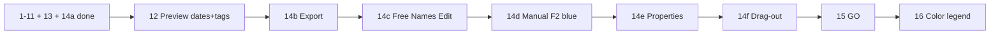

# Rename List UI (phased to MFR 7.4)

Workspace copy of the Cursor plan (synced 2026-08-29). Canonical Cursor copy:
`C:\Users\david\.cursor\plans\rename_list_ui_63d0c474.plan.md`.

Source of truth: [mfr7 help](d:/Devl/mfr7/Site/finebytes/mfr/Help/renamelist.html), [FieldSelector.cs](d:/Devl/mfr7/Core/MFRGui/Forms/RenameList/FieldSelector.cs), [SortFieldSelector.cs](d:/Devl/mfr7/Core/MFRGui/Forms/RenameList/SortFieldSelector.cs), and the engine in [Mfr.Engine/RenameList/RenameList.cs](Mfr.Engine/RenameList/RenameList.cs).

**Phase numbers = execution order** (renumbered 2026-08-29; color legend moved to **16** after 14/15 on 2026-09-04). Old labels in parentheses where helpful.

**No legacy migrations:** session and config use current shapes only; unknown or old JSON → MFR7 defaults (`AGENTS.md` refactoring policy). `SessionStateRenameListSortFieldJsonConverter` is gone; `sortFields` is field-key JSON only.

______________________________________________________________________

## Remaining phase order

| Phase                           | What                                                                  | Was              |
| ------------------------------- | --------------------------------------------------------------------- | ---------------- |
| **12** Preview metadata columns | Extended dates/attrs + ID3/audio preview cols after filters           | 9 / 7b           |
| **14b** Export Name List        | Column → UTF-8 text file; save dialog; optional open in editor        | 11 / 8           |
| **14c** Free Names Edit         | Embed generated names in `NameListFilter` targeted at writable column | 11 / 8           |
| **14d** Manual Rename (F2)      | Force original/preview value; blue cells; Cancel; F5 clears overrides | 11 / 8           |
| **14e** Properties              | Alt+Enter / row menu → Windows shell property sheet                   | 11 / 8           |
| **14f** Drag-out                | Selected rows as `FileDrop` to Explorer (cell→filter drag deferred)   | 11 / 8           |
| **15** GO                       | `Ctrl+G` → Commit                                                     | 12 / 9           |
| **16** Color legend             | Toolbar toggle + side panel (MFR7); needs **14d** blue + GO plum      | 10 / 7c (legend) |

______________________________________________________________________

## Already shipped (1–11, 13, 14a)

**Status (2026-09-04):** Phases **1–11**, **13**, and **14a** done. **Next: 12** → 14b–14f → 15 → 16.

| Block                       | Shipped highlights                                                                                                                                |
| --------------------------- | ------------------------------------------------------------------------------------------------------------------------------------------------- |
| **1–7**                     | Working list, Del/F4/hints, row menu, manual order + DnD, field shuttle, dynamic columns, session, extended original catalog, field-key Auto-Sort |
| **8** Load errors           | Gray cells, Show Load Errors, TagLib flag, `ErrorsLast` — see [rename-list-phase6b-followups.md](../../docs/rename-list-phase6b-followups.md)     |
| **9** Original Refresh      | F5 `RefreshOriginals`, missing-on-disk gray, shuttle OrderedDraft + DnD                                                                           |
| **10a–10d** Preview core    | `ToChain()` → `Preview()` always-on + Auto-Preview toggle; re-preview on membership / F5; status counts                                           |
| **11** Preview highlighting | Red changed cells, lavender preview-error rows, Show Preview Error                                                                                |
| **13** Hygiene              | Glyph styles in Themes; `RenameListUiTestContext`                                                                                                 |
| **14a** Remove Unchanged    | Preview-column header menu → `RemoveUnchanged`; clear selection; `MembershipChanged` only when rows dropped                                       |

______________________________________________________________________

## Phase 12 — preview metadata columns

*(Was 9 / 7b.)*

After **10a–10d**. Enable **preview** column variants for catalog fields that filters can mutate on `Preview` (MFR7 Preview Fields tab: any non-`ReadOnly` prop). Phase 6 shipped Extended / AudioTag / Image / Jpeg as **original-only**; this phase flips `SupportsPreview` where MFR7 allows preview.

### Scope (MFR7 parity)

| Group                          | Preview columns                                                              | Why                                                                                                                                                                                                                                       |
| ------------------------------ | ---------------------------------------------------------------------------- | ----------------------------------------------------------------------------------------------------------------------------------------------------------------------------------------------------------------------------------------- |
| **Extended** (File Properties) | **Creation Date**, **Last Write Date**, **Last Access Date**, **Attributes** | MFR7 `PropertyType.ReadWrite`. `DateTimeSetter` / `TimeShifter` write `item.Preview.CreationTime` / `LastWriteTime` / `LastAccessTime`; attributes filters write preview attrs. Size / Folder File Count stay original-only (`ReadOnly`). |
| **AudioTag** (ID3 etc.)        | Writable tag fields                                                          | MFR7 `ReadWriteApply` — preview when tag-setter filters change tags.                                                                                                                                                                      |
| **Image / Jpeg**               | None in this phase                                                           | MFR7 EXIF incl. Date/Time Taken is `ReadOnly` — originals only (Phase 6).                                                                                                                                                                 |

Shuttle **Preview** tab lists every field with `SupportsPreview` that is not already visible as a preview column (same rule as today for Basic).

### Work

- **Catalog:** stop treating Extended dates/attrs (and AudioTag writable fields) as `OriginalOnlyRenameListField` / `supportsPreview: false`. Preview key resolve uses **preview** `FileMeta` (dates via existing `FormatFileDate`); original columns keep original meta.
- **Grid / red cells:** Phase 11 highlighting already compares original vs preview text — once preview cols exist, Date/Time Setter changes show red on the matching date preview column.
- **Tests:** DateTimeSetter (and/or TimeShifter) → Creation/LastWrite/LastAccess preview text differs from original; unchanged dates do not highlight; Attributes preview when an attributes filter mutates; AudioTag smoke for one writable tag; Size / Jpeg DateTaken remain non-previewable in shuttle.
- **14c/14d note:** MFR7 Free Names / Manual Rename require `ReadWriteApply` — Extended dates are `ReadWrite` only (preview yes, Free-Edit / F2 no). Do not invent `SupportsWrite` for dates here; tag fields that are `ReadWriteApply` get write when 14c ships.

### Exit

Shuttle Preview tab offers Extended date/attrs + AudioTag preview fields; live preview + red changed cells work for Date/Time Setter against those date columns; Image/Jpeg stay original-only.

______________________________________________________________________

## Phase 14 — advanced menus (14a–14f)

*(Was 11 / 8.)* After **12** (preview metadata cols useful for Free Names / Manual Rename on tags). Letter grain like 10a–10d. **14a done** (see table above).

MFR7 sources: [renamelist.html](d:/Devl/mfr7/Site/finebytes/mfr/Help/renamelist.html) (`#removeunchanged`, `#export`, `#freeedit`, `#manualrename`, `#morefeats`), [RenameList.cs](d:/Devl/mfr7/Core/MFRGui/Forms/RenameList/RenameList.cs) header/body menus, [RenameItemList.GenerateNameList](d:/Devl/mfr7/Core/MfrLib/Items/RenameItemList.cs).

**Do not conflate Free Names Edit with F2.** They are different features:

| Feature             | Entry                        | Effect                                                                       |
| ------------------- | ---------------------------- | ---------------------------------------------------------------------------- |
| Free Names Edit     | Header menu (writable col)   | Embed names in **Name List** filter targeting that field                     |
| Manual Rename Field | F2 / row menu (writable col) | Dialog forces original **or** preview value; **blue** text until Cancel / F5 |

Header menu builder ([RenameListView.HeaderMenu.cs](../../Mfr.App.Ui/Views/RenameList/RenameListView.HeaderMenu.cs) `_BuildColumnHeaderContextMenu`): title → Hide Field → *(preview only)* Remove Unchanged → *(14b)* Export Name List → *(14c writable)* Free Names Edit → Select Visible Fields → Select Sort Fields. Insert 14b/14c in that method only. Keep Select Sort Fields; do not regress Hide / Select.

### 14b — Export Name List

Write one line per rename-list row = display text of the clicked column (original or preview).

- **Engine:** `GenerateNameList(path, RenameListFieldKey)` — UTF-8, `GetFieldText` / catalog resolve (MFR7 `GetDisplayText(Preview)`). Shared helper for 14c.
- **UI:** SaveFileDialog from header menu (any column). On success, ask “Edit?” and open with default editor (`UseShellExecute`) — same as MFR7.
- **Tests:** file contents match row order and preview vs original values; dialog cancel leaves disk alone (VM/engine unit + light UI if needed).
- **Not in scope:** Name List Filter creation (that is 14c).

### 14c — Free Names Edit

Header command on **writable** columns only (MFR7 `PropertyType.ReadWriteApply`).

- **Catalog:** add `SupportsWrite` (or equivalent) on `RenameListField` — true for fields that map to a `FilterTarget` filters can write (start with Basic path/name fields that already have targets; extend when Phase 12 preview tag cols ship). `SupportsPreview` alone is not enough (read-only originals use `supportsPreview: false` but are not Free-Edit targets).
- **Flow:** generate name-list lines (same content as 14b export) → construct `NameListFilter` with `Target` from field→`FilterTarget` map, `Options.Entries` = those lines, display name `"{Field} List"` (unique with `*` suffix like MFR7) → `AppliedFiltersViewModel.Add` + select the step so Filter Configuration shows the embedded list.
- **Filter editor:** F5 Name List already edits embedded one-name-per-line text (plus prefix/suffix). No external file / Edit-in-notepad action.
- **Tests:** writable Basic preview/original creates filter with correct target + file lines; non-writable column omits menu item; unique instance names.
- **Not in scope:** blue manual cells (14d); does not mutate Original/Preview directly.

### 14d — Manual Rename Field (F2)

Largest substep — model + blue highlight (required before Phase 16).

- **Behavior (MFR7):** focused writable column + selection → InputBox “Set the original|preview value of field …” with first non-error cell as default → same string applied to all selected rows (skip error cells). Multi-select sets **identical** values. Changes apply on **GO** (Phase 15), not immediately to disk.
- **Model:** per-item forced value for `(fieldKey)` on original and/or preview (MFR7 `PropStatus.ForceValue`). Catalog resolve must prefer forced text; `IsPreviewChanged` / red styling still correct when forced preview ≠ original (or forced original). Track `IsManuallyRenamed(key)` for blue.
- **UI:** F2 + row context **Manual Rename Field**; **Cancel Manual Rename** when that cell is forced. Enable only for `SupportsWrite` and non-error focused cell. Disabled F2 in [keyboard-shortcuts.md](../../docs/keyboard-shortcuts.md) becomes live.
- **Styling:** `rename-list-manual-rename` blue foreground (MFR7 manual-rename blue). Precedence vs red/gray: blue wins for manually forced cells (document in Themes).
- **Refresh:** Phase 9 `RefreshOriginals` / F5 clears **all** manual overrides (MFR7 refresh resets manually changed fields). Hook in existing refresh path; tests prove F5 wipes blue.
- **Tests:** force original vs preview; multi-select same value; Cancel one cell; F5 clears; non-writable / error cells no-op; blue class applied.
- **Out of scope here:** commit of forced values (Phase 15 must honor overrides when planning apply).

### 14e — Properties

Windows property sheet for the focused/selected item (MFR7 Alt+Enter / row **Properties**).

- **UI:** row context menu + `Alt+Enter` when Rename List focused and selection non-empty (single item like MFR7 `DisplayProperties` on focused row).
- **Impl:** shell “properties” for `FullPath` (Windows). Distinct from File List Properties debt (dialog) in [debts.md](../../docs/debts.md) — do not block on that.
- **Tests:** command enabled/disabled with selection; opener invoked with path (fake opener in VM tests). Headless: menu item present.

### 14f — Drag-out to Explorer

Selected Rename List rows drag as filesystem paths for Explorer / apps that accept files.

- **UI:** start drag from row(s) with `DataFormats.File` / platform file-list payload of selected `FullPath`s (MFR7 `DataFormats.FileDrop`). Coexist with existing internal reorder DnD (4d) — outbound FileDrop when dragging **outside** the grid; keep internal reorder when dropping on the grid.
- **Defer:** cell-text / rename-item payload drops onto filter editors (Formatter format string, ID3 setter drop zone) — note in [debts.md](../../docs/debts.md) if not shipping here.
- **Tests:** drag payload contains selected paths; empty selection does not start file drag.

### Phase 14 exit criteria

Header menu matches MFR7 feature set for Remove Unchanged / Export / Free Names Edit; F2 manual rename + blue; Properties; Explorer drag-out. Then **15** (GO + plum) → **16** (legend documents red / gray / lavender / blue / plum).

______________________________________________________________________

## Phase 15 — GO

*(Was 12 / 9.)*

`Ctrl+G` → `Commit`; Refresh clears last apply-error highlighting. Apply-error menu is **Show Rename Error** — reuse [RenameListRowErrorDialog](../../Mfr.App.Ui/Views/RenameList/RenameListRowErrorDialog.axaml) (not a third dialog clone). Distinct from Phase 8 **Show Load Errors**. Introduces **plum** apply-error highlighting (needed before the color legend). **Must apply 14d manual overrides** when building the commit plan.

______________________________________________________________________

## Phase 16 — color legend

*(Was part of 10 / 7c.)* After **14d** and **15** so the panel can document the full set: red changed preview, gray missing/load error, lavender preview error, blue manual rename, plum apply/rename error.

MFR7 toolbar toggle + side panel ([renamelist.html](d:/Devl/mfr7/Site/finebytes/mfr/Help/renamelist.html) Highlighting; [Legend.cs](d:/Devl/mfr7/Core/MFRGui/Forms/RenameList/Legend.cs)).

______________________________________________________________________

## What to implement next

**12 Preview metadata columns** — Extended date/attrs + ID3/audio preview cols + shuttle Preview tab (Date/Time Setter red cells); then **14b → 14f → 15 → 16**.
