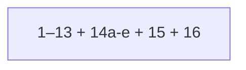

# Rename List UI (phased to MFR 7.4)

Canonical plan: this file under `docs/plans/`. Sources: [mfr7 help](d:/Devl/mfr7/Site/finebytes/mfr/Help/renamelist.html), [FieldSelector.cs](d:/Devl/mfr7/Core/MFRGui/Forms/RenameList/FieldSelector.cs), [SortFieldSelector.cs](d:/Devl/mfr7/Core/MFRGui/Forms/RenameList/SortFieldSelector.cs), [RenameList.cs](d:/Devl/mfr7/Core/MFRGui/Forms/RenameList/RenameList.cs) (UI), engine [Mfr.Engine/RenameList/RenameList.cs](../../Mfr.Engine/RenameList/RenameList.cs).

**Phase numbers = execution order.** Color legend is **16** (done — [rename-list-color-legend.plan.md](rename-list-color-legend.plan.md)).

**No legacy migrations:** session/config use current shapes only; unknown JSON → defaults (`AGENTS.md`). `sortFields` is field-key JSON only.

______________________________________________________________________

## Status (2026-09-13)

|                |                                                              |
| -------------- | ------------------------------------------------------------ |
| **Shipped**    | Phases **1–13**, **14a–14e**, **15**, **16**                 |
| **Next**       | — (plan complete)                                            |
| **Cut**        | **14f** Drag-out FileDrop (see [debts.md](../debts.md))      |
| **Blocked on** | —                                                            |

______________________________________________________________________

## Shipped (1–13, 14a–14e, 15, 16) — consolidated

Working Rename List end-to-end for add/remove/order, columns, sort, load errors, refresh, live preview, Remove Unchanged, Export (header submenu txt/csv + main-menu CSV), Edit as Name List, Manual Override (F2), Properties / Show in Explorer, GO commit, and color legend. Detail below is reference only; do not re-open unless a regression.

| Block                     | What shipped                                                                                                                                                                           |
| ------------------------- | -------------------------------------------------------------------------------------------------------------------------------------------------------------------------------------- |
| **1–4** Shell + order     | Multi-select File List → Add Selected/All; Del/F4/status hint; row menu; move up/down; insert-at-selection; File List/Explorer drop marker; internal reorder DnD                       |
| **5** Columns             | `RenameListFieldKey` catalog, dynamic DataGrid columns, unified field shuttle (Visible \| Sort), session `visibleColumns` + widths, field-key cell hints                               |
| **6** Catalog (original)  | Extended, AudioTag, Image, Jpeg, Media Properties, Mpeg — originals in shuttle                                                                                                         |
| **7** Auto-Sort           | Field-key sort on all non-preview catalog fields; header click / Shift+click                                                                                                           |
| **8** Load errors         | Gray load-error cells, missing-on-disk gray, Show Load Errors, TagLib / image error surfacing                                                                                          |
| **9** Refresh             | F5 `RefreshOriginals`, missing-on-disk gray, shuttle OrderedDraft + DnD                                                                                                                |
| **10** Preview core       | Always-on `ToChain()` → `Preview()`; Auto-Preview toggle + persist; re-preview on membership / F5; status counts                                                                       |
| **11** Preview highlight  | Red changed cells (`rename-list-preview-changed`), lavender preview-error rows, Show Preview Error via shared error dialog                                                             |
| **12** Preview metadata   | Extended dates/attrs + AudioTag semantic (`ReadWriteApply`) preview cols; First\* / Tag Types / Image / Jpeg / Media / Mpeg stay original-only; Size / Folder File Count original-only |
| **13** Hygiene            | Glyph styles in Themes; `RenameListUiTestContext`                                                                                                                                      |
| **14a** Remove Unchanged  | Preview-column header menu → `RenameList.RemoveUnchanged`; clear selection; `MembershipChanged` only when rows dropped                                                                 |
| **14b** Export            | Header **Export** → This Column (UTF-8 `.txt`) / Visible Columns (UTF-8 CSV); reveal in Explorer (no Edit? prompt)                                                                     |
| **14c** Edit as Name List | `SupportsWrite` + `WriteTarget`; `CollectNameList`; header Edit as Name List → embedded `NameListFilter` via `AddAndSelect` (no file I/O); F5 Name List editor                         |
| **14e** Properties        | Alt+Enter + row **Properties** → shell property sheet; **Show in Explorer** on Rename List; same Properties on File List (clears debts.md dialog bullet)                               |
| **14d** Manual Override   | F2 dual-side overrides; PreviewStart/End; blue cells; Cancel (selection + header column-wide); F5 clears                                                                               |
| **15** GO                 | Ctrl+G / menu / toolbar → `Commit`; plum apply-error rows; Show Rename Error                                                                                                           |
| **16** Color legend       | Toolbar toggle + right-dock swatches (black/red/blue/gray/lavender/plum)                                                                                                               |

**Write vs preview (catalog):**

| MFR7 type        | Examples                                           | Preview col | Edit as Name List / F2    |
| ---------------- | -------------------------------------------------- | ----------- | ------------------------- |
| `ReadWriteApply` | Basic name/path fields; AudioTag semantic          | yes         | **yes** (`SupportsWrite`) |
| `ReadWrite`      | Extended dates/attrs                               | yes (12)    | **no**                    |
| `ReadOnly`       | Size, Image, Jpeg, Media, Mpeg, First\*, Tag Types | no          | **no**                    |

**Focused-cell chrome (done, MFR7 parity):** amber `DataGridCell:current` fill (`RenameListFocusedCellBrush`) so the current column is visible inside the selected row. Not a full-column wash; omit from Phase 16 legend (MFR7 Legend omits focus too).

______________________________________________________________________

## Phase 14 — advanced menus (14a–14e)

MFR7: [renamelist.html](d:/Devl/mfr7/Site/finebytes/mfr/Help/renamelist.html) (`#export`, `#freeedit`, `#manualrename`, `#removeunchanged`, `#morefeats`), UI `RenameList.cs`, `RenameItemList.GenerateNameList`.

**Do not conflate** Export (file) ≠ Edit as Name List (filter) ≠ Manual Override (F2 override/blue).

Header menu order ([`_BuildColumnHeaderContextMenu`](../../Mfr.App.Ui/Views/RenameList/RenameListView.HeaderMenu.cs)):

`(title)` → Hide Field → *(preview)* Remove Unchanged → Select Visible Fields → Select Sort Fields → **(14c writable) Edit as Name List** → **(14d) Cancel Manual Override** (when any row overridden for that column) → **Export** (This Column / Visible Columns).

### 14b — Export (This Column `.txt` / Visible Columns CSV)

Header **Export** submenu. **Edit as Name List** still uses in-memory `CollectNameList` only.

**Current behavior**

- **Export This Column** — `ExportNameList` UTF-8 `.txt` (one display line per row, no header); save dialog `Save Name List as` / `*.txt`.
- **Export Visible Columns** — `ExportCsv` UTF-8 CSV (header = field display names; RFC 4180 quoting); empty list → header only; save dialog `Export as CSV` / `*.csv`.
- **Rename List → Export Rename List (csv)...** — same as Export Visible Columns (`ExportVisibleColumnsCommand`).
- On success, reveal the file in Explorer (`RevealInFileManager`). No Edit? prompt.

**Not in scope:** creating a Name List filter (14c — shipped).

### 14c — Edit as Name List (done)

Header command on **writable** columns only (`SupportsWrite` / MFR7 `ReadWriteApply`). **No file I/O** — embeds lines in `NameListOptions.Entries`.

**Work completed**

- Catalog `SupportsWrite` + `WriteTarget` on Basic Name/Extension/FullName/Folder/FullPath + AudioTag semantic.
- `RenameList.CollectNameList` + `AppliedFiltersViewModel.AddAndSelect` (`*` unique names) + `EditAsNameList` → select step for F5 Name List editor.
- Header menu item on writable columns only.

**Not in scope:** blue manual cells (14d); does not mutate Original/Preview directly.

### 14d — Manual Override Field (F2) (done)

Largest substep — model + blue highlight (required before Phase 16). Prefer **override** in UI/APIs/docs (MFR7 still says “Manual Rename”).

**Behavior (MFR7 + finebytes)**

- Focused writable column + selection → InputBox “Set the original|preview value of field …” with first non-error cell as default → same string on all selected non-error rows.
- Changes apply on **GO** (15), not immediately to disk.
- **Cancel Manual Override:** enabled if any selected row is overridden on the focused field; clears that side on **all selected** rows (vs MFR7 focused-row-only). Header menu clears that column on **all** rows when any row is overridden.
- F5 `RefreshOriginals` clears **all** manual overrides (and later apply errors). Overrides survive preview cycles and commit until Cancel/F5 (MFR7 `PropStatus` until Reload).

**Work completed**

- **Model:** per-item override for `(fieldKey)` on original and/or preview (MFR7 `PropStatus.ForceValue`). Catalog / `GetFieldText` prefer overridden text; `IsPreviewChanged` / red still correct when overridden preview ≠ original; `IsOverridden` for blue.
- **Pipeline (MFR7):** overridden **original** before filters (`FilterChain.ApplyFilters` PreviewStart); overridden **preview** after filters (`RenameList` PreviewEnd). Phase 15 commit must see the same.
- **UI:** F2 (`AppShortcuts.ManualOverride`; [keyboard-shortcuts.md](../../docs/keyboard-shortcuts.md)); row menu **Manual Override Field** + **Cancel Manual Override** before Locate (F4) / Refresh (F5) so F-key items stay in F2→F4→F5 order; header **Cancel Manual Override** clears the column on all rows; enable only for `SupportsWrite` and non-error default cell.
- **Styling:** `rename-list-manual-override` blue foreground; blue wins over red for overridden cells (document precedence in Themes / view styles).
- **Tests:** override original vs preview; multi-select identical value; multi-select Cancel; column Cancel; F5 clears; non-writable / error no-op; blue class / menu order.

**Out of scope here:** disk commit UI (15).

### 14e — Properties (done)

Windows property sheet for the focused item (MFR7 Alt+Enter / row **Properties**; single selection). Also shipped: File List Properties (same shell verb) and Rename List **Show in Explorer**.

**Work completed**

- Row context menu + `Alt+Enter` when Rename List focused and selection is exactly one row.
- Shell `"properties"` verb on `FullPath` via `IFileShellOpener.ShowProperties` (Windows `ShellExecuteEx`); null opener elsewhere; recording opener in VM tests.
- File List: same Properties command + Alt+Enter when listing focused.
- Rename List: **Show in Explorer** (reveal focused row) alongside Locate.
- Cleared File List Properties debt in [debts.md](../../docs/debts.md).

**Tests:** enabled/disabled with selection; opener called with path; headless menu items present.

### 14f — Drag-out to Explorer (cut)

**Cancelled.** Outbound FileDrop of selected rows to Explorer is not in scope. Noted under Rename List in [debts.md](../debts.md) if revisited later. Inbound drop + internal reorder (4c/4d) stay as shipped.

### Phase 14 exit

**Done** (14a–14e). 14f cut. (**15** / **16** shipped.)

______________________________________________________________________

## Phase 15 — GO

Wire UI to existing engine commit.

**Status:** done.

**MFR7 flow:** clear apply errors → ensure preview if needed → warn on preview-error count → apply with progress → plum rows for apply/rename errors → status-bar outcome → row menu **Show Rename Error**.

**Work**

- Implement `MainWindowViewModel.GoAsync()`: Preview → `Commit` → update grid statuses.
- Progress: reuse Rename List progress patterns from preview/refresh.
- **Plum** row highlighting for `CommitError` / rename failure (`rename-list-commit-error` or similar).
- Row menu **Show Rename Error** → reuse `RenameListRowErrorDialog` (not Show Load Errors / Show Preview Error copy).
- F5 refresh clears apply-error highlight (with manual overrides from 14d).
- **Must apply 14d forced original/preview** when building the commit plan.
- Update [keyboard-shortcuts.md](../../docs/keyboard-shortcuts.md): GO leaves the “stubs” note.

**Already done:** `RenameList.Commit`, `CommitExecutor`, audio-tag Apply path, commit unit tests.

**Exit:** Ctrl+G / menu / toolbar commit real renames; plum + Show Rename Error work; preview-error rows skipped on apply like MFR7.

______________________________________________________________________

## Phase 16 — color legend

**Status:** done — [rename-list-color-legend.plan.md](rename-list-color-legend.plan.md).

After **14d** and **15** so the panel documents the full set.

MFR7: toolbar CheckOnClick + right-dock legend (~132px) — [Legend.cs](d:/Devl/mfr7/Core/MFRGui/Forms/RenameList/Legend.cs), help Highlighting section.

| Swatch      | Meaning                  | Finebytes status |
| ----------- | ------------------------ | ---------------- |
| Black       | Original / unchanged     | default          |
| Red fg      | Value changed            | shipped (11)     |
| Blue fg     | Forced / manual override | **14d**          |
| Gray fg     | Load / missing error     | shipped (8/9)    |
| Lavender bg | Preview error            | shipped (11)     |
| Plum bg     | Rename / apply error     | shipped (15)     |

Footer hint: right-click cell/row for error details. Toggle shrinks grid width (mirror other `rename-list-action` toggles). Default off; not session-persisted (MFR7). Blue label: **Manual Override**.

**Exit:** legend matches shipped colors; toolbar toggle shows/hides panel.

______________________________________________________________________

## What to implement next

Nothing — this plan is complete.
