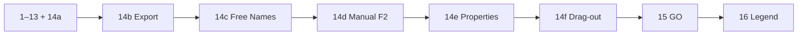

# Rename List UI (phased to MFR 7.4)

Canonical plan: this file under `docs/plans/`. Sources: [mfr7 help](d:/Devl/mfr7/Site/finebytes/mfr/Help/renamelist.html), [FieldSelector.cs](d:/Devl/mfr7/Core/MFRGui/Forms/RenameList/FieldSelector.cs), [SortFieldSelector.cs](d:/Devl/mfr7/Core/MFRGui/Forms/RenameList/SortFieldSelector.cs), [RenameList.cs](d:/Devl/mfr7/Core/MFRGui/Forms/RenameList/RenameList.cs) (UI), engine [Mfr.Engine/RenameList/RenameList.cs](../../Mfr.Engine/RenameList/RenameList.cs).

**Phase numbers = execution order.** Color legend is **16** (needs 14d blue + 15 plum).

**No legacy migrations:** session/config use current shapes only; unknown JSON → defaults (`AGENTS.md`). `sortFields` is field-key JSON only.

______________________________________________________________________

## Status (2026-09-06)

| | |
| --- | --- |
| **Shipped** | Phases **1–13** and **14a** |
| **Next** | **14b** Export Name List |
| **Then** | 14c → 14d → 14e → 14f → **15** GO → **16** color legend |
| **Blocked on** | 16 needs 14d (blue) + 15 (plum); 15 must honor 14d overrides |

______________________________________________________________________

## Shipped (1–13, 14a) — consolidated

Working Rename List end-to-end for add/remove/order, columns, sort, load errors, refresh, live preview, and Remove Unchanged. Detail below is reference only; do not re-open unless a regression.

| Block | What shipped |
| --- | --- |
| **1–4** Shell + order | Multi-select File List → Add Selected/All; Del/F4/status hint; row menu; move up/down; insert-at-selection; File List/Explorer drop marker; internal reorder DnD |
| **5** Columns | `RenameListFieldKey` catalog, dynamic DataGrid columns, unified field shuttle (Visible \| Sort), session `visibleColumns` + widths, field-key cell hints |
| **6** Catalog (original) | Extended, AudioTag, Image, Jpeg, Media Properties, Mpeg — originals in shuttle |
| **7** Auto-Sort | Field-key sort on all non-preview catalog fields; header click / Shift+click |
| **8** Load errors | Gray load-error cells, missing-on-disk gray, Show Load Errors, TagLib / image error surfacing |
| **9** Refresh | F5 `RefreshOriginals`, missing-on-disk gray, shuttle OrderedDraft + DnD |
| **10** Preview core | Always-on `ToChain()` → `Preview()`; Auto-Preview toggle + persist; re-preview on membership / F5; status counts |
| **11** Preview highlight | Red changed cells (`rename-list-preview-changed`), lavender preview-error rows, Show Preview Error via shared error dialog |
| **12** Preview metadata | Extended dates/attrs + AudioTag semantic (`ReadWriteApply`) preview cols; First\* / Tag Types / Image / Jpeg / Media / Mpeg stay original-only; Size / Folder File Count original-only |
| **13** Hygiene | Glyph styles in Themes; `RenameListUiTestContext` |
| **14a** Remove Unchanged | Preview-column header menu → `RenameList.RemoveUnchanged`; clear selection; `MembershipChanged` only when rows dropped |

**Already reusable for remaining work (do not rebuild):**

- `NameListFilter` + embedded `NameListOptions.Entries` + F5 Name List editor (one name per line) — ready for **14c**
- Engine `RenameList.Preview` / `Commit` / `CommitExecutor` + `RenameItem.CommitError` + `RenameListCommitTests` — ready for **15** UI wiring
- `RenameListRowErrorDialog` — reuse for Show Rename Error (**15**), not a third dialog
- Header menu hook in [`RenameListView.HeaderMenu.cs`](../../Mfr.App.Ui/Views/RenameList/RenameListView.HeaderMenu.cs) — insert 14b/14c after Remove Unchanged
- Cell/row classes: red / gray / lavender in `RenameListView.axaml`; **blue** and **plum** still missing
- `MainWindowViewModel.Go()` + `AppShortcuts.Go` / menu / toolbar — **stubs**; Ctrl+G labeled but no-op ([keyboard-shortcuts.md](../../docs/keyboard-shortcuts.md))

**Write vs preview (important for 14c/14d):**

| MFR7 type | Examples | Preview col | Free Names / F2 |
| --- | --- | --- | --- |
| `ReadWriteApply` | Basic name/path fields; AudioTag semantic | yes | **yes** → need `SupportsWrite` |
| `ReadWrite` | Extended dates/attrs | yes (12) | **no** |
| `ReadOnly` | Size, Image, Jpeg, Media, Mpeg, First\*, Tag Types | no | **no** |

______________________________________________________________________

## Remaining — execution order

| Phase | What | Depends on |
| --- | --- | --- |
| **14b** Export Name List | Column → UTF-8 `.txt`; save dialog; optional open in editor | — |
| **14c** Free Names Edit | Same lines → `NameListFilter` on Applied Filters | 14b helper + `SupportsWrite` |
| **14d** Manual Rename (F2) | Force original/preview; blue cells; Cancel; F5 clears | `SupportsWrite` |
| **14e** Properties | Alt+Enter / row menu → Windows property sheet | — (parallel-safe after 14d) |
| **14f** Drag-out | Selected rows as FileDrop to Explorer | coexist with 4d reorder |
| **15** GO | `Ctrl+G` → Commit; plum apply errors; Show Rename Error | 14d overrides in commit path |
| **16** Color legend | Toolbar toggle + side panel | 14d blue + 15 plum |

______________________________________________________________________

## Phase 14 — advanced menus (14b–14f)

MFR7: [renamelist.html](d:/Devl/mfr7/Site/finebytes/mfr/Help/renamelist.html) (`#export`, `#freeedit`, `#manualrename`, `#removeunchanged`, `#morefeats`), UI `RenameList.cs`, `RenameItemList.GenerateNameList`.

**Do not conflate** Export (file) ≠ Free Names (filter) ≠ Manual Rename (F2 force/blue).

Header menu order ([`_BuildColumnHeaderContextMenu`](../../Mfr.App.Ui/Views/RenameList/RenameListView.HeaderMenu.cs)):

`(title)` → Hide Field → *(preview)* Remove Unchanged → **(14b) Export Name List** → **(14c writable) Free Names Edit** → Select Visible Fields → Select Sort Fields.

### 14b — Export Name List

One line per rename-list row = display text of the clicked column (original or preview).

**Work**

- **Engine:** `GenerateNameList(path, RenameListFieldKey)` — UTF-8, one `WriteLine` per row via `GetFieldText` / catalog resolve (MFR7 `GetDisplayText(Preview)`). Shared with 14c (in-memory lines helper + file writer).
- **UI:** Header menu on **any** column. Avalonia save dialog (`Save Name List as`, `*.txt`). On success: `"Name list saved to {path}. Edit?"` → Yes opens with default editor (`UseShellExecute`). Cancel = no write.
- **Tests:** contents match row order and original vs preview values; cancel leaves disk alone.

**Not in scope:** creating a Name List filter (14c).

### 14c — Free Names Edit

Header command on **writable** columns only (`SupportsWrite` / MFR7 `ReadWriteApply`).

**Work**

- **Catalog:** add `SupportsWrite` on `RenameListField` (or equivalent). True for fields that map to a `FilterTarget` filters can write:
  - Start: Basic path/name (Name, Extension, FullName, Folder, FullPath) + AudioTag semantic fields that already preview.
  - False for Extended dates/attrs (`ReadWrite` only) even though they have preview cols.
- **Field → target map:** field key → `FilterTarget` (File Prefix / Extension / FullName / Parent Folder / Full Path / audio targets).
- **Flow:** generate lines (same as 14b) → `NameListFilter` with that `Target`, `Options.Entries` = lines, display name `"{Field} List"` with `*` suffix while name exists (MFR7) → add + **select** on Applied Filters so Filter Configuration shows the list.
- **AppliedFilters API:** today only `Add`/`Append` from catalog entries — need add-concrete-instance + select (or equivalent).
- **Editor:** existing F5 Name List editor is enough (no temp file / notepad Edit link — intentional finebytes diff from MFR7 file-backed flow).
- **Tests:** writable Basic/Audio creates filter with correct target + lines; non-writable omits menu; unique instance names.

**Not in scope:** blue manual cells (14d); does not mutate Original/Preview directly.

### 14d — Manual Rename Field (F2)

Largest substep — model + blue highlight (required before Phase 16).

**Behavior (MFR7)**

- Focused writable column + selection → InputBox “Set the original|preview value of field …” with first non-error cell as default → same string on all selected non-error rows.
- Changes apply on **GO** (15), not immediately to disk.
- **Cancel Manual Rename** clears force on focused cell only.
- F5 `RefreshOriginals` clears **all** manual overrides (and later apply errors).

**Work**

- **Model:** per-item forced value for `(fieldKey)` on original and/or preview (MFR7 `PropStatus.ForceValue`). Catalog / `GetFieldText` prefer forced text; `IsPreviewChanged` / red still correct when forced preview ≠ original; `IsManuallyRenamed` for blue.
- **Pipeline (MFR7):** forced **original** before filters; forced **preview** after filters. Phase 15 commit must see the same.
- **UI:** enable F2 ([keyboard-shortcuts.md](../../docs/keyboard-shortcuts.md) still lists it under “not implemented”); row menu Manual Rename Field + Cancel; enable only for `SupportsWrite` and non-error focused cell.
- **Styling:** `rename-list-manual-rename` blue foreground; blue wins over red for forced cells (document precedence in Themes / view styles).
- **Tests:** force original vs preview; multi-select identical value; Cancel one cell; F5 clears; non-writable / error no-op; blue class applied.

**Out of scope here:** disk commit (15).

### 14e — Properties

Windows property sheet for the focused item (MFR7 Alt+Enter / row **Properties**; single selection).

**Work**

- Row context menu + `Alt+Enter` when Rename List focused and selection non-empty.
- Shell `"properties"` verb on `FullPath` (Windows). Thin helper; fake opener in VM tests.
- Distinct from File List Properties debt in [debts.md](../../docs/debts.md) — do not block on that.

**Tests:** enabled/disabled with selection; opener called with path; headless menu item present.

### 14f — Drag-out to Explorer

Selected Rename List rows drag as filesystem paths.

**Work**

- Start drag with Avalonia file-list / `DataFormats.Files` of selected `FullPath`s (MFR7 `FileDrop`).
- Coexist with internal reorder (4d): outbound FileDrop when dragging **outside** the grid; keep reorder when dropping on the grid.
- **Defer:** cell-text / rename-item drops onto filter editors — note in [debts.md](../../docs/debts.md) if skipped.

**Tests:** payload has selected paths; empty selection does not start file drag.

### Phase 14 exit

Header menu has Export + Free Names Edit; F2 manual rename + blue; Properties; Explorer drag-out. Then **15** → **16**.

______________________________________________________________________

## Phase 15 — GO

Wire UI to existing engine commit.

**MFR7 flow:** clear apply errors → ensure preview if needed → warn on preview-error count → apply with progress → plum rows for apply/rename errors → row menu **Show Rename Error**.

**Work**

- Implement `MainWindowViewModel.Go()` (today empty): Preview if stale / needed → `Commit` → update grid statuses.
- Progress: reuse Rename List progress patterns from preview/refresh.
- **Plum** row highlighting for `CommitError` / rename failure (`rename-list-commit-error` or similar).
- Row menu **Show Rename Error** → reuse `RenameListRowErrorDialog` (not Show Load Errors / Show Preview Error copy).
- F5 refresh clears apply-error highlight (with manual overrides from 14d).
- **Must apply 14d forced original/preview** when building the commit plan.
- Update [keyboard-shortcuts.md](../../docs/keyboard-shortcuts.md): GO leaves the “stubs” note.

**Already done:** `RenameList.Commit`, `CommitExecutor`, audio-tag Apply path, commit unit tests.

**Exit:** Ctrl+G / menu / toolbar commit real renames; plum + Show Rename Error work; preview-error rows skipped on apply like MFR7.

______________________________________________________________________

## Phase 16 — color legend

After **14d** and **15** so the panel documents the full set.

MFR7: toolbar CheckOnClick + right-dock legend (~112–120px) — [Legend.cs](d:/Devl/mfr7/Core/MFRGui/Forms/RenameList/Legend.cs), help Highlighting section.

| Swatch | Meaning | Finebytes status |
| --- | --- | --- |
| Black | Original / unchanged | default |
| Red fg | Value changed | shipped (11) |
| Blue fg | Forced / manual rename | **14d** |
| Gray fg | Load / missing error | shipped (8/9) |
| Lavender bg | Preview error | shipped (11) |
| Plum bg | Rename / apply error | **15** |

Footer hint: right-click cell/row for error details. Toggle shrinks grid width (mirror other `rename-list-action` toggles). Persist toggle in session if cheap; otherwise default off like MFR7.

**Exit:** legend matches shipped colors; toolbar toggle shows/hides panel. Update [debts.md](../../docs/debts.md) to drop the legend bullet when done.

______________________________________________________________________

## What to implement next

1. **14b** — `GenerateNameList` + header Export + save/Edit?
2. **14c** — `SupportsWrite` + field→`FilterTarget` + add named `NameListFilter`
3. **14d** — force model + F2/Cancel + blue + F5 clear
4. **14e** Properties → **14f** drag-out
5. **15** GO UI + plum → **16** legend
