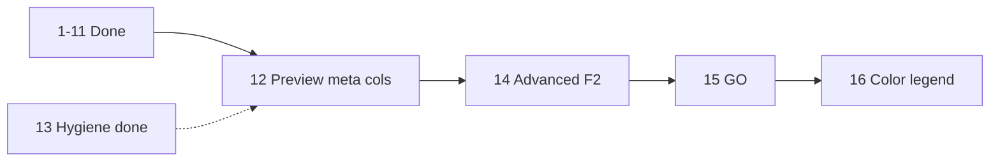

# Rename List UI (phased to MFR 7.4)

Workspace copy of the Cursor plan (synced 2026-08-29). Canonical Cursor copy:
`C:\Users\david\.cursor\plans\rename_list_ui_63d0c474.plan.md`.

Source of truth: [mfr7 help](d:/Devl/mfr7/Site/finebytes/mfr/Help/renamelist.html), [FieldSelector.cs](d:/Devl/mfr7/Core/MFRGui/Forms/RenameList/FieldSelector.cs), [SortFieldSelector.cs](d:/Devl/mfr7/Core/MFRGui/Forms/RenameList/SortFieldSelector.cs), and the engine in [Mfr.Engine/RenameList/RenameList.cs](Mfr.Engine/RenameList/RenameList.cs).

**Phase numbers = execution order** (renumbered 2026-08-29; color legend moved to **16** after 14/15 on 2026-09-04). Old labels in parentheses where helpful.

**No legacy migrations:** session and config use current shapes only; unknown or old JSON → MFR7 defaults (`AGENTS.md` refactoring policy). `SessionStateRenameListSortFieldJsonConverter` is gone; `sortFields` is field-key JSON only.

______________________________________________________________________

## Sequential phase order

| Phase                               | Status  | What                                                                                | Was               |
| ----------------------------------- | ------- | ----------------------------------------------------------------------------------- | ----------------- |
| **1** Working list                  | Done    | Add/remove, grid, progress, external drag-drop                                      | 1                 |
| **2** Quick interactions            | Done    | Del, F4, cell hint                                                                  | 2                 |
| **3** Row context menu              | Done    | Locate, Move, Remove, Clear                                                         | 3                 |
| **4** Sort / manual order           | Done    | 4a–4e (4e superseded by Phase 7)                                                    | 4                 |
| **5** Field shuttle + columns       | Done    | 5a–5g: catalog, dynamic grid, dialog, session                                       | 5                 |
| **6** Extended **original** catalog | Done    | Dates, size, ID3, image/JPEG — no Preview()                                         | 6 / 7a            |
| **7** Full Auto-Sort                | Done    | Field-key sort for all non-preview fields                                           | 7 / 7d            |
| **8** Original field-load errors    | Done    | Load-error cells, Show Load Errors, TagLib flag, structured gray, LoadErrors naming | 6b–6e             |
| **9** Original Refresh              | Done    | F5, re-read disk, menus/toolbar; missing-on-disk gray; shuttle OrderedDraft + DnD   | 8a (+ part of 10) |
| **10a** Filter-edit preview         | Done    | Live `ToChain()` → `Preview()` → grid + status counts (always on)                   | 8b                |
| **10b** List membership             | Done    | Re-preview on Rename List add/remove/clear                                          | 8b                |
| **10c** Auto-Preview toggle         | Done    | Menu/toolbar, persist; cancel disables                                              | 8b                |
| **10d** F5 re-preview               | Done    | After original refresh, re-run preview when Auto-Preview on                         | 8b                |
| **11** Preview highlighting         | Done    | Red changed preview cells, preview-error rows, Show Preview Error                   | 8c                |
| **12** Preview metadata columns     | Pending | ID3/image preview cols after filters                                                | 9 / 7b            |
| **13** Hygiene                      | Done    | Glyph styles + `RenameListUiTestContext`; entry convenience props kept              | 10 / 7c (part)    |
| **14** Advanced menus               | Pending | F2, export, Properties, drag-out                                                    | 11 / 8            |
| **15** GO                           | Pending | `Ctrl+G` → Commit                                                                   | 12 / 9            |
| **16** Color legend                 | Pending | Toolbar toggle + side panel (MFR7); needs F2 blue + GO plum                         | 10 / 7c (legend)  |

______________________________________________________________________

## Current status (2026-08-29)

### Phases 1–7 — done

Working list, interactions, context menu, manual order, unified field shuttle, dynamic columns, session persist, extended original catalog, field-key Auto-Sort.

### Phase 8 — original field-load errors — done

*(Was 6b–6e.)* See [rename-list-phase6b-followups.md](../../docs/rename-list-phase6b-followups.md).

| Area                       | Location                                                                                                                                                                                                           |
| -------------------------- | ------------------------------------------------------------------------------------------------------------------------------------------------------------------------------------------------------------------ |
| Load-error text + styling  | `LoadErrorText` (`—`), `rename-list-load-error` class in [RenameListView.Columns.cs](../../Mfr.App.Ui/Views/RenameList/RenameListView.Columns.cs)                                                                  |
| Show Load Errors           | [RenameListViewModel.LoadErrors.cs](../../Mfr.App.Ui/ViewModels/RenameList/RenameListViewModel.LoadErrors.cs), shared [RenameListRowErrorDialog](../../Mfr.App.Ui/Views/RenameList/RenameListRowErrorDialog.axaml) |
| Row error indicator        | [RenameListRowErrorGlyph.cs](../../Mfr.App.Ui/Views/RenameList/RenameListRowErrorGlyph.cs) + `HasRowError` on [RenameListEntry](../../Mfr.App.Ui/ViewModels/RenameList/RenameListEntry.cs)                         |
| TagLib single-attempt flag | `TagLibLoadAttempted` on [RenameItem](../../Mfr.Models/Rename/RenameItem.cs)                                                                                                                                       |
| Sort tie-break             | `ErrorsLast` in [RenameListFieldSortCompare.cs](../../Mfr.Models/RenameList/RenameListFieldSortCompare.cs)                                                                                                         |

**Not preview errors:** distinct from **Phase 11 Show Preview Error** and Phase 15 apply/GO errors.

### Phase 9 — Original Refresh — done

*(Was 8a; missing-on-disk gray and shuttle hygiene pulled forward from old Phase 10.)*

| Area            | Location                                                                                                                                                                                                                                                                    |
| --------------- | --------------------------------------------------------------------------------------------------------------------------------------------------------------------------------------------------------------------------------------------------------------------------- |
| Engine re-read  | `RenameList.RefreshOriginals` in [RenameList.cs](../../Mfr.Engine/RenameList/RenameList.cs)                                                                                                                                                                                 |
| VM command      | [RenameListViewModel.Refresh.cs](../../Mfr.App.Ui/ViewModels/RenameList/RenameListViewModel.Refresh.cs)                                                                                                                                                                     |
| F5 routing      | [MainWindowViewModel.RefreshFocusedPaneAsync](../../Mfr.App.Ui/ViewModels/MainWindowViewModel.cs)                                                                                                                                                                           |
| Missing-on-disk | [RenameListDiskPaths.cs](../../Mfr.Models/RenameList/RenameListDiskPaths.cs), `rename-list-missing-on-disk` styling                                                                                                                                                         |
| Shuttle hygiene | [OrderedDraft.cs](../../Mfr.App.Ui/ViewModels/RenameList/OrderedDraft.cs), [ShuttleDragPayload.cs](../../Mfr.App.Ui/Views/RenameList/ShuttleDragPayload.cs)                                                                                                                 |
| Tests           | [RenameListRefreshTests.cs](../../Mfr.Tests/Engine/RenameListRefreshTests.cs), [RenameListViewModelRefreshTests.cs](../../Mfr.Tests/Ui/RenameList/RenameListViewModelRefreshTests.cs), [MainWindowRefreshTests.cs](../../Mfr.Tests/Ui/MainWindow/MainWindowRefreshTests.cs) |

**Does not call `Preview()`** — preview columns stay identity/stale until **10a**.

F5 on-disk casing walk: per-pass `OnDiskCasingCache` in `RefreshOriginals` (shared parent
listings + resolved paths; not reused across F5 calls).

______________________________________________________________________

## Phase 10 — Preview core (10a–10d)

*(Was 8b.)* Engine has `RenameList.Preview(FilterChain)`. Grid preview columns already resolve `item.Preview` via the catalog. Applied Filters F1–F4 shipped (live `ToChain()`, Filter Options, Space Character / Letters Case). Remaining filter option UIs are F5 — group only when options/UI are shared; see [applied-filter-editors.plan.md](applied-filter-editors.plan.md) (next: Count L/R).

Letter grain matches 1a–1f. Do not micro-split 10a (engine `Preview(FilterChain)` is a few lines and cannot ship without the UI hook).

### 10a — Filter-edit preview — done

Filter stack/options → `ToChain()` → `Preview()` → grid. Always on (toggle is 10c).

- `Preview(FilterChain)`; `SetupFilters()` inside. `BaseFilter` `with` copies do not inherit `_isSetupComplete`.
- `ChainChanged` on [AppliedFiltersViewModel](../../Mfr.App.Ui/ViewModels/AppliedFilters/AppliedFiltersViewModel.cs): add/remove/clear/reorder, Enabled, `SetFilter` (editors + Filter Options OK). Not display-name or selection.
- [RenameListViewModel.Preview.cs](../../Mfr.App.Ui/ViewModels/RenameList/RenameListViewModel.Preview.cs) → engine → `_RefreshFieldDisplay()`. [MainWindowViewModel](../../Mfr.App.Ui/ViewModels/MainWindowViewModel.cs) subscribes to `ChainChanged`.
- Status-bar `ChangeCount` / `PreviewErrorCount`.

### 10b — List membership — done

Re-preview after Rename List add/remove/clear using the current chain. Row sort/reorder does not change preview values.

- `MembershipChanged` after add/remove/clear when membership actually changed (not sort/reorder, not no-op add).
- [MainWindowViewModel](../../Mfr.App.Ui/ViewModels/MainWindowViewModel.cs) shares `_RequestPreview()` for chain and membership.
- Tests: add-after-filters, remove/clear counts, move/duplicate-add do not raise membership; one MainWindow wiring fact.

### 10c — Auto-Preview toggle — done

Menu + toolbar toggle (`IsAutoPreview`, default on), session `previewEnabled`. When off, skip automatic preview. Turning on re-previews. Long preview uses cancelable progress; cancel calls `DisableAutoPreview`.

### 10d — F5 re-preview — done

After Phase 9 `RefreshOriginals`, re-run preview when Auto-Preview is on (full MFR7 refresh).

- `OriginalsRefreshed` after successful `RefreshAsync` (not on cancel).
- [MainWindowViewModel](../../Mfr.App.Ui/ViewModels/MainWindowViewModel.cs) shares `_RequestPreview()` (already gated on `IsAutoPreview`).

______________________________________________________________________

## Phase 11 — Preview highlighting — done

*(Was 8c.)*

| Area                   | Location                                                                                                                                                                                                                 |
| ---------------------- | ------------------------------------------------------------------------------------------------------------------------------------------------------------------------------------------------------------------------ |
| Changed-cell detection | `RenameListFieldCatalog.IsPreviewChanged` + `RenameListEntry.IsPreviewChanged`                                                                                                                                           |
| Red preview text       | `rename-list-preview-changed` in [RenameListView.Columns.cs](../../Mfr.App.Ui/Views/RenameList/RenameListView.Columns.cs) / [RenameListView.axaml](../../Mfr.App.Ui/Views/RenameList/RenameListView.axaml)               |
| Preview-error row bg   | `rename-list-preview-error` (LavenderBlush / dark muted) on [DataGridRow](../../Mfr.App.Ui/Views/RenameList/RenameListView.axaml.cs)                                                                                     |
| Show Preview Error     | [RenameListViewModel.PreviewErrors.cs](../../Mfr.App.Ui/ViewModels/RenameList/RenameListViewModel.PreviewErrors.cs), shared [RenameListRowErrorDialog](../../Mfr.App.Ui/Views/RenameList/RenameListRowErrorDialog.axaml) |
| Status-bar marker      | `RenameListCellHint.PreviewErrorMarker` (`[Item Preview Error]`) prepended to `FormatParts`                                                                                                                              |

Highlighting is the last preview result (not gated on Auto-Preview). **Show Preview Error** stays available while a row still has `PreviewError`.

**Not apply/rename errors:** plum **Show Rename Error** is Phase 15. Sort-by-preview-column (one-shot) still deferred.

______________________________________________________________________

## Phase 12 — preview metadata columns

*(Was 9 / 7b.)*

After **10a–10d**. ID3/image **preview** columns when filters modify tags; shuttle Preview tab entries for `SupportsPreview` metadata fields.

______________________________________________________________________

## Phase 13 — hygiene — done

*(Was 10 / 7c minus color legend.)* Missing-on-disk, OrderedDraft, and shuttle DnD shipped earlier in Phase 9.

| Area              | Location                                                                                                                                               |
| ----------------- | ------------------------------------------------------------------------------------------------------------------------------------------------------ |
| Glyph styles      | Preview + sort badge styles in [Themes/RenameList.axaml](../../Mfr.App.Ui/Themes/RenameList.axaml) (app `StyleInclude`)                                |
| Test fixture      | [RenameListUiTestContext](../../Mfr.Tests/Ui/RenameList/RenameListTestHelpers.cs) — ViewModel + Drop tests migrated                                    |
| Entry convenience | Kept: `FullPath` / `FullFileName` / etc. remain cheap wrappers; grid path is `GetFieldText(key)`                                                       |

Color legend was split out to **Phase 16** (needs F2 blue + GO plum).

______________________________________________________________________

## Phase 14 — advanced menus

*(Was 11 / 8.)*

F2 free edit, export, Properties, drag-out to Explorer; Refresh reset of manual renames when F2 exists. Introduces **blue** manual-rename highlighting (needed before the color legend).

______________________________________________________________________

## Phase 15 — GO

*(Was 12 / 9.)*

`Ctrl+G` → `Commit`; Refresh clears last apply-error highlighting. Apply-error menu is **Show Rename Error** — reuse [RenameListRowErrorDialog](../../Mfr.App.Ui/Views/RenameList/RenameListRowErrorDialog.axaml) (not a third dialog clone). Distinct from Phase 8 **Show Load Errors**. Introduces **plum** apply-error highlighting (needed before the color legend).

______________________________________________________________________

## Phase 16 — color legend

*(Was part of 10 / 7c.)* After **14** and **15** so the panel can document the full set: red changed preview, gray missing/load error, lavender preview error, blue manual rename, plum apply/rename error.

MFR7 toolbar toggle + side panel ([renamelist.html](d:/Devl/mfr7/Site/finebytes/mfr/Help/renamelist.html) Highlighting; [Legend.cs](d:/Devl/mfr7/Core/MFRGui/Forms/RenameList/Legend.cs)).

______________________________________________________________________

## What to implement next

**12 Preview metadata columns** — ID3/image preview cols + shuttle Preview tab; then **14 → 15 → 16**.
