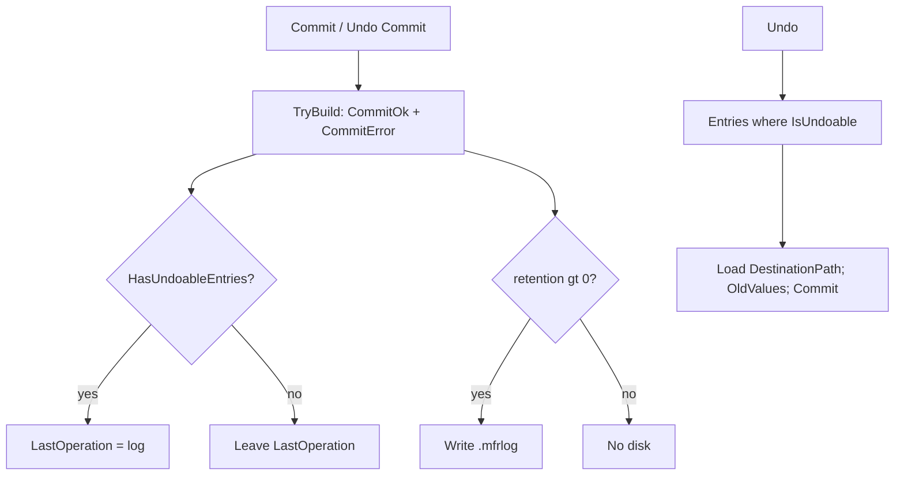

# Rename log errors plan

Parent: [docs/plans/undo.plan.md](docs/plans/undo.plan.md) (capture is CommitOk + CommitError); related debt [docs/debts.md](docs/debts.md) “Show Last Rename Errors”.

## Decisions (locked)

- **Log `CommitError` for info** — include failed commit rows in `.mfrlog` / built logs with `Error` set; omit `CommitSkipped` and `PreviewError` (never applied).
- **Undo unchanged** — keep `RenameLogEntry.IsUndoable` / `HasUndoableEntries` (error rows skipped). No Undo UX change beyond richer details text.
- **`LastOperation` guard** — set `LastOperation` only when the new log has at least one undoable entry. Errors-only GO/Undo must not clobber a prior undoable last op.
- **Errors-only disk** — when retention `> 0` and the built log has only error entries, still write `.mfrlog` for audit; memory last op left alone. Retention `0` → no disk, no memory update (same as today for empty/no-OK).
- **Details path** — for entries with `Error`, `FormatDetails` shows `OriginalPath` as `Item:` (file still there); OK rows keep `DestinationPath` (MFR7 `FullFilePath` after apply ≈ post path for successes).

## MFR7 reference brief

- **Sources:** `Core/MfrLib/Items/Log.cs` (`LogDataEntry.Error`, `GetText` prints `Error: …`); `RenameItem.ApplyProperties` always `Log.AddEntry` with `lde.Error = ApplyError` (including “File not found” early return).
- **Behavior:** Failed applies are logged with error text; detail pane shows them. Undo walks all entries (finebytes is stricter: skips error rows — intentional).
- **Parity:** finebytes gains error-in-log + details; keeps safer undo filter. Still not “Show Last Rename Errors” (dedicated list-wide history).

## Non-goals

- Show Last Rename Errors UI / debt closure
- Logging skipped or preview-error rows
- Changing Undo Last confirm, progress, or status-bar copy
- Migrating old `.mfrlog` files (schema already has optional `error`)

## Architecture

## Phases

### P1 — Capture + details + tests

- **Scope / files:**
  - [`Mfr.Engine/RenameLog/RenameLogStore.cs`](Mfr.Engine/RenameLog/RenameLogStore.cs) — `TryBuildFromCommitResults`: emit `CommitOk` (require non-blank destination) and `CommitError` (`Error` from result; `DestinationPath` = result destination or fall back to original; `Changes` as returned). `CaptureFromCommit`: assign `LastOperation` only if `log.HasUndoableEntries`; still `_SaveAndTrim` when retention `> 0` for any non-null log (including errors-only).
  - [`Mfr.Models/Rename/RenameLog.cs`](Mfr.Models/Rename/RenameLog.cs) — `FormatDetails`: `Item:` uses `OriginalPath` when `entry.Error is not null`, else `DestinationPath`. Doc comments: entries are CommitOk and CommitError, not CommitOk-only.
- **Exit criteria:** Mixed GO → log has OK + error rows; Undo Last undoes OK only; all-error GO leaves prior `LastOperation`, writes disk when limit `> 0`; details show original path + `Error:` for failures.
- **Tests:** [`Mfr.Tests/Engine/RenameLogStoreTests.cs`](Mfr.Tests/Engine/RenameLogStoreTests.cs) — update `TryBuildFromCommitResults_Skips_NonCommitOk` (still skip skipped; **include** CommitError); add Capture mixed / errors-only LastOperation + disk; FormatDetails Item path for error entry. Light undo smoke if needed: error-only entries in a hand-built log do not clear the list / return empty (existing `IsUndoable` path).

### P2 — Docs cross-links

- **Scope / files:** note in [`docs/plans/undo.plan.md`](docs/plans/undo.plan.md) capture line (CommitOk + CommitError); [`docs/debts.md`](docs/debts.md) — Show Last Rename Errors still deferred, but rename-log details now include commit errors.
- **Exit criteria:** plans/debts match behavior; no new Options/UI.
