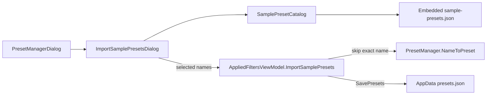

# Sample presets import

Parent: [presets-ui.plan.md](presets-ui.plan.md) (F7 done; seed presets were out of scope — this plan reopens that slice only).

## Decisions (locked)

- **UX:** Checklist dialog from Preset Manager (**Import samples…**). User picks which samples to add, then imports.
- **Name conflicts:** Exact-name match → **skip** (keep user’s preset). Dialog copy must state that presets with the same name will be skipped.
- **First run:** Still empty `presets.json`. No auto-seed.
- **Format:** Hand-authored finebytes JSON only. **No** `.mps` reader / MFR7 migration.
- **Catalog size:** **13** curated samples — 7 MFR7-derived + 6 finebytes additions (folders, swap, safe names, brackets, year-title). Still not a full MFR7 dump; trivial one-filter demos stay out.
- **Sample display names:** Clear/concise finebytes names (not MFR7 filenames). Skip-on-conflict uses these exact strings.
- **Skip feedback:** After import, brief result (e.g. “Added N. Skipped M (name already exists).”) when anything was skipped or when selection was all collisions.
- **Path Mover roots:** Folder samples use editable placeholder roots (`C:\Photos`, `C:\Music`); user changes root before commit.

## MFR7 reference brief

### Sources

- Shipped `.mps`: `D:\Devl\mfr7\Core\MFR\Presets\` (also `%ProgramData%\FineBytes\MFR\Presets\`)
- Help: `Help/presetmanager.html` (“MFR comes with a number of default presets”)
- finebytes status: Preset Manager Load/Delete/Rename only; empty AppData file on first open

### Sample catalog (name, description, what it does)

**Locked set** (13).

**From MFR7** (filename → finebytes name):

| MFR7             | finebytes name         |
| ---------------- | ---------------------- |
| Counter          | Counter Prefix         |
| ID3 from Name    | Tags from Filename     |
| JPEG Date        | Date Taken Prefix      |
| Name from ID3 #2 | Artist - Track - Title |
| Name from Image  | Name from Image        |
| Name from Path   | Flatten Path           |
| Pretty Names     | Beautify Names         |

**finebytes additions** (not in MFR7 sample pack):

| finebytes name         |
| ---------------------- |
| Date Taken Folders     |
| Artist Album Folders   |
| Swap Around Hyphen     |
| Safe Filename          |
| Strip Bracket Junk     |
| Year - Title from Tags |

Descriptions for MFR7-derived samples are copied from MFR7 where present. Addition descriptions are authored below.

#### Beautify Names

- **Description:** `Beautify file names by fixing casing and spaces`
- **Purpose:** Space/underscore cleanup, then title-ish casing and a small embedded casing-word list (MFR7 pointed at missing `MFRCaser.txt`).
- **Chain:** `SpaceCharacter` → `SpaceAround` → `SpaceAfter` → `ShrinkSpaces` → `StripSpacesRight` → `StripSpacesLeft` → `LettersCase` Capitalize → `CapitalizeAfter` → `UppercaseInitials` → `CasingList` (`uppercaseSentenceInitial: true` + embedded common words).

#### Counter Prefix

- **Description:** `Adds a number before each item in Rename List.`
- **Purpose:** Prefix each name with a padded running counter, e.g. `01 - original-name`.
- **Chain:** `Counter` (or equivalent Formatter) with MFR7 format `<counter:1,1,1,2,0> - <file-name>` on `FilePrefix`.

#### Tags from Filename

- **Description:** `Set ID3 tags for MP3 files according to filenames.\nFilename format should be: Track - Title.mp3\nParent folder name format should be: Artist - Album`
- **Purpose:** Wipe existing tags, then fill artist/album from parent folder tokens and title/track from the file name; set ID3v2 track count to list length.
- **Chain:** `TagRemover` (id3v1 + id3v2) → `AudioTagSetter` (named `<token:…>` / `<parent-folder:1>` templates) → formatter/`Id3v2FieldSetter` with `<item-count>` for track count.

#### Artist - Track - Title

- **Description:** `Set track titles for MP3 files from ID3 tag.\nFormat: Artist - Track Number - Track Title.mp3`
- **Purpose:** Build `Artist - NN - Title` from embedded audio tags (covers the simpler Track - Title case).
- **Chain:** `Formatter` `<audio-track>` → `FixLeadingZeros` (width 2) → `Inserter` ` - <audio-title>` from end → `Inserter` `<audio-artist> - ` from beginning.

#### Date Taken Prefix

- **Description:** `Rename JPEG digital images according to date picture taken.`
- **Purpose:** Prefix the current name with EXIF DateTaken (`yyyy-MM-dd HH-mm-ss`).
- **Chain:** `Formatter` `<exif-date:yyyy-MM-dd HH-mm-ss> - <file-name>` on `FilePrefix` (MFR7 `file-date` mode 3 → `<exif-date>`).

#### Name from Image

- **Description:** `Set filename according to basic image properties`
- **Purpose:** Replace the name with counter + width×height + format + bit depth + DPI.
- **Chain:** `Formatter` `<counter:…>.<image-width>x<image-height>.<image-format>.<image-bit-depth>bpp.<image-horz-res>dpi`.

#### Flatten Path

- **Description:** `Use path name as file name.\nPath hierarchies (\) are separated by periods (.)\nE.g: c:\pictures\David\sep04\pic1.jpg -->\npictures.David.sep04.pic1.jpg`
- **Purpose:** Flatten up to three parent folder names into the file name; optional move step left disabled.
- **Chain:** `Formatter` `<parent-folder:3>.<parent-folder:2>.<parent-folder:1>.<file-name>` + disabled `PathMover` (`C:\` / `Renamed Files`).

#### Date Taken Folders

- **Description:** `Move photos into folders by date taken (year\month\day).\nEdit the Path Mover root (default C:\Photos) before Apply.`
- **Purpose:** Organize images under `yyyy\MM\dd` from EXIF DateTaken; keep the current file name.
- **Chain:** enabled `PathMover` — `rootFolder` `C:\Photos`, `subFolder` `<exif-date:yyyy>\<exif-date:MM>\<exif-date:dd>`.

#### Artist Album Folders

- **Description:** `Move audio files into Artist\Album folders from tags.\nEdit the Path Mover root (default C:\Music) before Apply.`
- **Purpose:** Library layout from embedded tags; file name unchanged.
- **Chain:** enabled `PathMover` — `rootFolder` `C:\Music`, `subFolder` `<audio-artist>\<audio-album>`.

#### Swap Around Hyphen

- **Description:** `Swap the two parts of a name separated by " - ".\nE.g: Title - Artist --> Artist - Title`
- **Purpose:** Fix reversed artist/title (or similar) around a spaced hyphen.
- **Chain:** `TokenMover` on `FilePrefix` — `delimiter` `-`, `tokenNumber` `2`, `moveBy` `-1`.

#### Safe Filename

- **Description:** `Replace Windows-illegal filename characters \ / : * ? " < > | with a hyphen.`
- **Purpose:** Make names safe to commit on Windows.
- **Chain:** `Replacer` regex `[\/:*?"<>|]` → `-` on `FilePrefix` (and optionally `FileExtension` only if needed; name is enough).

#### Strip Bracket Junk

- **Description:** `Remove (…) and […] segments from the name, then shrink leftover spaces.\nE.g: Song (Official Video) [HD] --> Song`
- **Purpose:** Drop common trailer junk without the full Beautify Names chain.
- **Chain:** `StripParentheses` Round `removeContents: true` → `StripParentheses` Square `removeContents: true` → `ShrinkSpaces` on `FilePrefix`.

#### Year - Title from Tags

- **Description:** `Set the name from audio tags as Year - Title.`
- **Purpose:** Short tag→name companion to Artist - Track - Title.
- **Chain:** `Formatter` `<audio-year> - <audio-title>` on `FilePrefix`.

### Omitted (not shipped)

**Unsupported in finebytes today**

- **FreeDB** — needs FreeDB filter.
- **Uppercase Text Files** — no file-contents target.

**Dropped as trivial / low value / duplicate (from MFR7 pack)**

- **Hyphen After Number** (Add -) — single narrow regex.
- **Set Extension** (Change Extension) — placeholder template `new`; user must edit immediately.
- **Modified Date Prefix** (Last Update Date) — same pattern as Date Taken Prefix with a weaker token story.
- **Track - Title** (Name from ID3 #1) — subset of Artist - Track - Title.
- **Random Letters** (Random Names) — novelty rename; weak teaching value.
- **Strip Digits** (Remove All Numbers) — one-line regex.
- **Uppercase First Token** (Uppercase First Part) — single scoped Letters Case.

### UX notes

- Manager gains **Import samples…** (always enabled).
- Child dialog: checked list (name + description), Select all / none optional, static note about skip-on-same-name, Import / Cancel.
- Does not load into Applied Filters; only upserts into `presets.json` via existing save path.

### Parity gaps / intentional diffs

- Curated set of **13** samples (7 MFR7-derived + 6 finebytes additions), not a full MFR7 dump.
- No FreeDB / contents-uppercase samples.
- No `.mps` import.
- Casing list words embedded (not external file).
- Every sample ships `visibleColumns`: Basic defaults plus domain fields (`MediaTag`, `Jpeg`, `Image`, Folder/FullPath preview for movers); widths sized for typical content (MFR7-inspired); sort fields omitted (presets never store sort).
- Folder samples ship with placeholder Path Mover roots the user is expected to edit.

## Non-goals

- Auto-seed on first launch
- Import/export arbitrary user `presets.json` or MFR7 `.mps`
- Implementing FreeDB or file-contents targets
- Overwrite / merge-on-conflict
- Packing RL sort into samples
- Shipping every MFR7 default preset

## Architecture

- Embed one container JSON under [`Mfr.Engine`](../../Mfr.Engine/) (e.g. `Presets/Samples/sample-presets.json` as `EmbeddedResource`) so UI and tests share one catalog without Avalonia.
- [`SamplePresetCatalog`](../../Mfr.Engine/Presets/) loads once, exposes sorted `IReadOnlyList<FilterPreset>` (or name/description DTOs + lookup).
- Import API on [`AppliedFiltersViewModel`](../../Mfr.App.Ui/ViewModels/AppliedFilters/AppliedFiltersViewModel.cs): for each selected name, if absent → add (keep sample `Id` from JSON) and `SavePresets()` once; return `(addedCount, skippedCount)`.

## Phases

### P1 — Sample catalog + JSON assets

- Author [`Mfr.Engine/Presets/Samples/sample-presets.json`](../../Mfr.Engine/Presets/Samples/sample-presets.json) with the **13** presets (stable GUIDs, descriptions per **Sample catalog** above, chains as listed).
- Add `SamplePresetCatalog` (+ embed in [`Mfr.Engine.csproj`](../../Mfr.Engine/Mfr.Engine.csproj)).
- Tests: deserialize container; every sample name unique; every filter type known; spot-check several chains (Beautify Names, Date Taken Folders, Swap Around Hyphen, Safe Filename, Tags from Filename).

**Exit:** Catalog loads in tests; no UI yet.

### P2 — Import API + Manager dialog

- `AppliedFiltersViewModel.ImportSamplePresets(IReadOnlyList<string> names)` → skip exact names, save once, return counts. Refresh Manager list after success.
- New `ImportSamplePresetsDialog` + VM under `Views/Presets/` ↔ `ViewModels/Presets/`: checklist bound to catalog; footer note: *Presets that already exist under the same name will be skipped.*; Import disabled when nothing checked.
- Wire button on [`PresetManagerDialog.axaml`](../../Mfr.App.Ui/Views/Presets/PresetManagerDialog.axaml); show result via existing message dialog pattern.
- Tests: VM import skip/add; headless Manager opens import dialog / Import enabled rules (per [`mfr-ui-headless-tests`](../../.agents/skills/mfr-ui-headless-tests/SKILL.md)).
- Amend [presets-ui.plan.md](presets-ui.plan.md) out-of-scope note: seed presets now covered by this plan.

**Exit:** User can open Presets → Import samples…, pick items, get skip messaging, see new names in Manager / ▾.

## Key files

- [`PresetManager.cs`](../../Mfr.Engine/Presets/PresetManager.cs) — reuse `SavePresets` / `NameToPreset`
- [`PresetJsonOptions.cs`](../../Mfr.Engine/Presets/PresetJsonOptions.cs) — deserialize samples
- [`PresetManagerDialog.axaml`](../../Mfr.App.Ui/Views/Presets/PresetManagerDialog.axaml) (+ code-behind)
- [`AppliedFiltersViewModel.cs`](../../Mfr.App.Ui/ViewModels/AppliedFilters/AppliedFiltersViewModel.cs) — import entry point
- New: `SamplePresetCatalog`, `ImportSamplePresetsDialog` (+ VM), `sample-presets.json`
