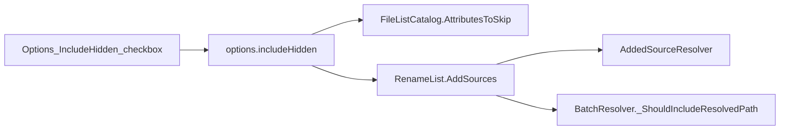

# Show Hidden / System Files plan

## Decisions (locked)

- **Scope:** small UI enablement on existing engine/CLI `includeHidden` — not a new domain feature.
- **One shared pref:** `options.includeHidden` (`bool`, default `false`) on [`OptionsConfig`](Mfr.Models/Config/AppConfigSections.cs), sibling of `addFolderContents`. Soft-load via existing `ConfigStore` (missing → false).
- **One UI control:** Options dialog checkbox next to **Add folder contents** (same add-policy fieldset). That one control does both:
  - show/hide Hidden|System in File List listing (`FileListCatalog` `AttributesToSkip`)
  - include/exclude them when adding to Rename List (`AddSources(..., includeHidden: …)`)
- **No File List / Rename List menu items** — remove the disabled File List stub `Show hidden/system files` from [`MainWindow.axaml`](Mfr.App.Ui/Views/MainWindow/MainWindow.axaml).
- **Apply path:** saving Options writes the pref; if `includeHidden` changed, refresh the current File List folder so visibility updates without restart.
- **No Explorer coupling** (Avalonia listing is app-owned).
- **Non-goals:** UNC `$` admin shares, attribute *setter* filters, CLI flag rename, legacy config migration, menu toggles.

## MFR7 reference brief

### Sources
- Help: `fileexp.html`, `renamelist.html`, `cml.html`, `console.html`
- Code: `Main.cs` (`mniAddHiddenItems`), `RenameList.cs` (`AddHiddenItems`), `Adder.cs` (`IncHidden` / `IsHidden`)
- finebytes: partial — CLI `--include-hidden`, `AddSources(includeHidden:)`, File List stub `IsEnabled=False`

### Behavior
- Live UX: **Rename List → Add Hidden/System Files** checkable; default off; persisted `AddHiddenItems`.
- Gates recursive add of Hidden|System children (`Hidden | System`); topmost explicit path not filtered the same way.
- File List visibility followed Explorer “Show hidden files”; stale help/hints still mention a File List Show Hidden menu that is not live.

### Parity gaps / intentional diffs
- finebytes: **one Options checkbox** drives both File List visibility and Rename List add include (MFR7 used Rename List menu + Explorer for show).

## Current stubs / APIs

```259:259:Mfr.App.Ui/Views/MainWindow/MainWindow.axaml
        <MenuItem Header="Show hidden/system files" IsEnabled="False" />
```

- Listing always skips: [`FileListCatalog._ListingOptions`](Mfr.App.Ui/Services/FileList/FileListCatalog.cs) `AttributesToSkip = Hidden | System`
- UI add never passes flag: [`RenameListViewModel.Add.cs`](Mfr.App.Ui/ViewModels/RenameList/RenameListViewModel.Add.cs) → `AddSources(...)` default `includeHidden: false`
- Engine filter exists: [`RenameListBatchResolver._ShouldIncludeResolvedPath`](Mfr.Engine/RenameList/RenameListBatchResolver.cs)
- **Gap:** [`AddedSourceResolver`](Mfr.Engine/RenameList/AddedSourceResolver.cs) builds `EnumerationOptions` without clearing `AttributesToSkip` (runtime default is `Hidden|System`), so folder walks never yield hidden children even when `includeHidden: true` / CLI `--include-hidden`
- Options add-policy UI already hosts `AddFolderContents` in [`OptionsDialog.axaml`](Mfr.App.Ui/Views/Options/OptionsDialog.axaml) (~lines 108–114)



## Phases

### P1 — Engine: honor `includeHidden` during directory walks
- [x] Thread `includeHidden` into `AddedSourceResolver.ResolveToPaths` / `_ResolveDirectory`; when true set `AttributesToSkip = 0` (or none); when false keep default Hidden|System skip (or set explicitly).
- Keep `_ShouldIncludeResolvedPath` as the attribute gate for resolved paths.
- **Tests:** extend [`RenameListTests`](Mfr.Tests/Engine/RenameListTests.cs) so recursive folder add with a hidden child is excluded by default and included when `includeHidden: true`. Add CLI parse smoke for `--include-hidden` in [`CliArgParserTests`](Mfr.Tests/Cli/CliArgParserTests.cs) if missing.
- **Exit:** CLI/engine recursive include-hidden works for Hidden|System children.

### P2 — Pref + Options checkbox + listing/add wiring
- [ ] Add `OptionsConfig.IncludeHidden` (`JsonPropertyName("includeHidden")`, default false).
- Wire [`OptionsDialogViewModel`](Mfr.App.Ui/ViewModels/Options/OptionsDialogViewModel.cs) load/save + checkbox in [`OptionsDialog.axaml`](Mfr.App.Ui/Views/Options/OptionsDialog.axaml) under the Add fieldset (after **Add folder contents**), with tip text (show in File List + include when adding).
- [`FileListCatalog`](Mfr.App.Ui/Services/FileList/FileListCatalog.cs): listing options depend on `ConfigStore.Options.IncludeHidden` (or passed flag); refresh current folder when Options apply changes the value.
- [`RenameListViewModel.Add.cs`](Mfr.App.Ui/ViewModels/RenameList/RenameListViewModel.Add.cs): pass `includeHidden: ConfigStore.Options.IncludeHidden`.
- Remove the disabled File List menu stub from [`MainWindow.axaml`](Mfr.App.Ui/Views/MainWindow/MainWindow.axaml) (and its separator if it becomes orphaned).
- **Tests:** update `Skips_Hidden_Items` / add show-when-enabled case in [`FileListViewModelTests`](Mfr.Tests/Ui/FileList/FileListViewModelTests.cs); Options VM round-trip; add-path uses pref when on.
- **Exit:** Options checkbox toggles both show and add; default off; no menu item.

## Residual risks (after full plan)

- Turning the option off does not purge hidden/system rows already on the Rename List.
- Hidden and System are one switch — can surface junk/`desktop.ini`-class items; commit may still fail on ACL/locked files.
- Admin UNC `$` shares stay hidden by design.
