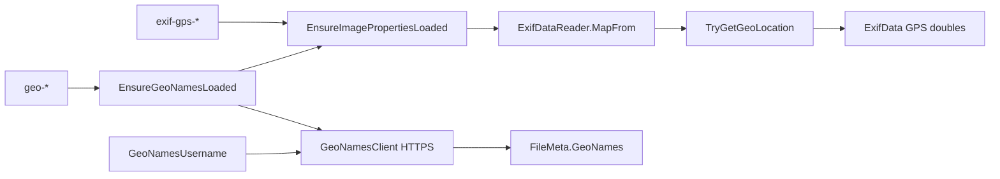

# Typed GPS + GeoNames plan

Parent: deferred **5c** in [`docs/image-metadata-model.md`](../image-metadata-model.md). Sibling help: [`help/tokens/eximagefp.html`](../../help/tokens/eximagefp.html). Not part of [`more-read-only-metadata-formats.plan.md`](more-read-only-metadata-formats.plan.md).

## Decisions (locked)

- **Modernize over MFR7 parity** — do not copy `username=demo`, HTTP `ws.geonames.org`, regex DMS string parse, or placeholder strings like "No Location" / "N/A".
- **Typed GPS** — `GpsDirectory.TryGetGeoLocation()` maps to `double? GpsLatitude` / `GpsLongitude` on [`ExifData`](../../Mfr.Models/Media/ExifData.cs) during the existing ME open in [`ExifDataReader.MapFrom`](../../Mfr.Metadata/ExifDataReader.cs). Still flatten GPS IFD strings into `TagToDescription`.
- **Display format** — invariant culture, up to 6 decimal places, trim trailing zeros (`0.######`). Same for tokens and Rename List columns.
- **Tokens** — `<exif-gps-lat>` / `<exif-gps-lon>`; GeoNames `<geo-place>` / `<geo-region>` / `<geo-country>` (not MFR7 `image-nearby-*`).
- **Empty rules** — missing GPS → empty; blank GeoNames username → empty; successful lookup with blank field → empty. Network/API/XML failure when a `geo-*` token or geo column is used → **PreviewError**.
- **GeoNames auth** — `OptionsConfig.GeoNamesUsername` (default blank). HTTPS `https://api.geonames.org/findNearby` with `style=FULL`. No vendored 3rdParty GeoNames lib — thin `HttpClient` + XML parse in `Mfr.Metadata`.
- **Username plumbing** — Filters must not reference `ConfigStore`. Persist on `OptionsConfig`; Engine syncs a small Models accessor / `Func<string?>` when prefs load and when Options OK. Client takes username as a parameter.
- **Caching** — process-wide dictionary keyed by lat/lon rounded to 4 decimals → place/region/country; clear when username changes. Per-row `GeoNamesInfo` on `FileMeta`; commit `ClearMetadataCaches` clears the row snapshot.
- **Rename List** — Latitude/Longitude under Jpeg group (`ImageProperties`). Nearby Country/Region/Place use new `RenameListMetadataRequirement.GeoNames` so the grid only hits the network when those columns are visible.
- **Read-only** — no GPS write / Apply.
- **Libraries (locked)** — see below; no new geocoding NuGet.

## Libraries (locked)

| Concern | Library | Why |
| --- | --- | --- |
| Typed GPS | **MetadataExtractor 2.9.3** (already in [`Mfr.Metadata.csproj`](../../Mfr.Metadata/Mfr.Metadata.csproj)) | `GpsDirectory.TryGetGeoLocation()` / `GeoLocation` — no DMS regex, no extra package |
| GeoNames HTTP | **BCL `HttpClient`** only | HTTPS `api.geonames.org/findNearby`; no vendored MFR7 `3rdParty/GeoNames`, no GeoNames NuGet |
| GeoNames XML | **BCL `System.Xml.Linq`** (`XDocument`) | Parse first `geoname` node → `name`, `adminName1`, `countryName` |
| UI | Existing Avalonia Options / FormatEditor / Rename List | No new UI framework |

Explicitly **not** used: BenjaminSchroeter.GeoNames, RestSharp, any offline gazetteer NuGet, TagLib for GPS.

Shared static `HttpClient` (or one owned by `GeoNamesClient`) with ~10s timeout; tests inject `HttpMessageHandler`.

### Why not BenjaminSchroeter.GeoNames

MFR7 vendors this under `3rdParty/GeoNames/` (not a maintained NuGet). Skip it because:

1. **Obsolete HTTP stack** — uses `WebClient` and hard-coded `http://ws.geonames.org/...` (no HTTPS, no username parameter in the shared helper; MFR7’s `JpegGeoPG` already bypassed `FindNearby(...)` and inlined `username=demo` itself).
2. **Wrong surface area** — ships weather / Wikipedia / elevation / hierarchy APIs we will never call; we need one `findNearby` + three XML fields.
3. **Not modern .NET** — Framework-era code; bringing it forward means patching URLs, auth, and `HttpClient` anyway — at that point the wrapper is the product and the old types add no value.
4. **MFR7 already abandoned the clean call path** — the live app path is ad-hoc XML download + `new Geoname(element)`, not the library’s high-level API. Recreating that thin path with BCL is smaller and testable via `HttpMessageHandler`.

If GeoNames ever grows (feature-class filters, retries, etc.), still prefer a small `GeoNamesClient` in `Mfr.Metadata` over resurrecting the vendored tree.

### Offline alternatives (considered)

Yes — reverse geocoding does **not** require the live API. Realistic options:

| Approach | Works offline? | Cost | Place quality |
| --- | --- | --- | --- |
| **A. HTTPS findNearby (current lock)** | No (needs net + username) | Tiny code; free GeoNames account; ~0 install data | Best match to MFR7; nearest feature from server |
| **B. Bundle a GeoNames dump** (e.g. `cities15000` / `cities5000`) + local nearest-neighbor | Yes after install | Zip sizes below; uncompressed ~2–3×; plus RAM for KD-tree | Nearest *city in dump*, not full gazetteer; weak for remote photos |
| **C. Download dump once to AppData** (same as B, not embedded) | Yes after first fetch | Same data sizes; update story + disk; still need a fetch path | Same as B |
| **D. GPS tokens only** (`exif-gps-*`); defer `<geo-*>` | Yes | No geo UX | No place/region/country names |

**GeoNames dump zip sizes** (from [download.geonames.org/export/dump](https://download.geonames.org/export/dump/), Sep 2026):

| File | Zip | Rows (approx) | Notes |
| --- | --- | --- | --- |
| `cities15000.zip` | **3.2 MB** | ~25k | Cities pop > 15k + capitals — best bundle candidate |
| `cities5000.zip` | **5.4 MB** | ~50k | pop > 5k |
| `cities1000.zip` | **10 MB** | ~130k | pop > 1k |
| `cities500.zip` | **13 MB** | ~185k | pop > 500 |
| `allCountries.zip` | **402 MB** | everything | Not practical to ship |
| `admin1CodesASCII.txt` | **148 KB** | — | Needed to resolve admin1 → region *name* if dump only has codes |
| `countryInfo.txt` | **31 KB** | — | Country names from ISO codes |

Uncompressed text is larger (often ~2–3× zip). In-memory KD-tree is larger still (tens of MB for cities15000 is plausible). Online API stays ~0 extra install size.

Libraries that do B/C (not locked): NuGet **ReverseGeocoder** / **GeoSharp**-style loaders, or **NGeoNames**, all feeding official [GeoNames dump](https://download.geonames.org/export/dump/) text — still CC-BY attribution in help/About. None remove the need to ship or download data.

**Still locked: A** until the user picks otherwise. Typed GPS (P1) is offline either way; only P2 place names need A/B/C.

## UX

### Options (P2)

Add a **Location** fieldset to [`OptionsDialog.axaml`](../../Mfr.App.Ui/Views/Options/OptionsDialog.axaml) (after Session or before Confirmations — keep it short):

- Label: **GeoNames username**
- Single-line `TextBox` bound to `OptionsConfig.GeoNamesUsername`
- Tip: free account at geonames.org is required for nearby-place tokens/columns; leave blank to disable reverse geocoding (tokens expand empty)
- No password field (GeoNames web API is username-only for free tier)
- No “Test connection” button in v1 (YAGNI)
- Changing username on OK clears the process GeoNames cache so the next preview re-fetches

### Format Editor / tokens

Tokens register via existing `[FormatTokenInfo]` → FormatEditor catalog (no custom picker dialog).

| Token | Catalog path | User-facing name | When empty |
| --- | --- | --- | --- |
| `<exif-gps-lat>` | `Image\EXIF` | GPS Latitude | No GPS in file |
| `<exif-gps-lon>` | `Image\EXIF` | GPS Longitude | No GPS in file |
| `<geo-country>` | `Image\Nearby` | Nearby Country | No GPS, blank username, or blank API field |
| `<geo-region>` | `Image\Nearby` | Nearby Region | same |
| `<geo-place>` | `Image\Nearby` | Nearby Place | same |

- GPS tokens sit with other EXIF shortcuts on [`eximagefp.html`](../../help/tokens/eximagefp.html).
- Nearby tokens get [`help/tokens/geofp.html`](../../help/tokens/geofp.html) + link from [`fp.html`](../../help/tokens/fp.html) (mirrors MFR7 “Nearby Location Group”).
- Example rename pattern in help: `<geo-place> - <exif-date:yyyy-MM-dd>` → `Haifa - 2024-06-01`.
- Values are plain text suitable for filenames (no `/` injection from GeoNames; if a name ever contains path-illegal chars, leave as-is — same as other metadata tokens; Path Illegal filter remains the user’s tool).

### Rename List columns

| Column | Group | Metadata load |
| --- | --- | --- |
| Latitude | Jpeg Tag (with Make/Model/…) | `ImageProperties` only |
| Longitude | Jpeg Tag | `ImageProperties` only |
| Nearby Country | Jpeg Tag (same group; display order after Lon) | `GeoNames` |
| Nearby Region | Jpeg Tag | `GeoNames` |
| Nearby Place | Jpeg Tag | `GeoNames` |

- Showing only Lat/Lon never triggers network.
- Showing any Nearby column (or Auto-Sort by it) loads GeoNames for visible rows; slow/failed lookups surface via existing Rename List metadata error messaging (`RenameListMetadataLoadErrors`), not a separate progress dialog.
- Preview of Formatter filters: sync lookup on the preview path (same as MFR7 `DownloadString`); timeout → PreviewError for that row’s token expansion.

### Empty vs error (user-visible)

| Situation | Token / cell |
| --- | --- |
| Raster with no GPS | empty |
| GeoNames username blank | `geo-*` empty (Lat/Lon still work) |
| Username set, GPS present, API OK | place / region / country text |
| Username set, network/HTTP/XML/status failure | **PreviewError** (geo token) / column error affordance |
| Non-image / unmapped type | existing image/EXIF PreviewError path |

No `"No Location"` / `"N/A"` strings in cells or expanded names.

### Help / migrations

- P1: document GPS tokens on eximagefp + fields; keep whatsnew “GeoNames … not shipped” until P2.
- P2: geofp.html; clear whatsnew/migrations rows for GeoNames / `<geo-*>`.

## MFR7 reference brief

### Sources

- Help: `Help/fp.html` (Nearby Location Group), `Help/fields.html#jpeg-geo`, `Help/eximagefp.html` (EXIF escape only)
- Code: `JpegGeoPG.cs`, `NearbyPlaceFP.cs`, `3rdParty/GeoNames/`
- finebytes status: GPS strings via `<exif:GPS,…>` only; typed GPS + geo deferred

### Behavior

- Lat/lon from concatenated GpsDirectory descriptions + regex DMS parse
- GeoNames HTTP + hard-coded `username=demo`; instance cache
- Tokens: `image-nearby-country` → CountryName; `image-nearby-region` → AdminName1; `image-nearby-place` → Name
- Missing: placeholder strings instead of empty

### Parity gaps / intentional diffs

- ME typed `GeoLocation`; HTTPS + user username; `exif-gps-*` / `geo-*` names; empty not placeholders; no weather/Wikipedia endpoints

## Non-goals

- Writing GPS; TagLib Image Tag GPS ([`image-tag-editing.plan.md`](image-tag-editing.plan.md))
- Offline geocoding DB; weather/Wikipedia/elevation APIs
- MFR7 `image-nearby-*` token aliases
- Format-editor picker beyond catalog registration

## Architecture

## Phases

### P1 — Typed GPS lat/lon

- **Scope:** `ExifData` doubles; `ExifDataReader` via `TryGetGeoLocation` (treat `IsZero` as absent); shared `GpsCoordinateFormatting`; tokens; Jpeg Latitude/Longitude columns; update image-metadata-model / Formatter.md / eximagefp.html / fields.html
- **Exit:** tokens expand invariant 6-dp decimals from GPS fixture; missing GPS → empty; no network
- **Tests:** reader map + formatting (null, negative hemispheres)

### P2 — GeoNames geo-* + Options username

- **Scope:** `OptionsConfig.GeoNamesUsername` + Options Location fieldset; `GeoNamesClient`; `GeoNamesInfo` + `EnsureGeoNamesLoaded`; `RenameListMetadataRequirement.GeoNames`; tokens + Nearby columns; help `geofp.html` + whatsnew/migrations; mark 5c done
- **Exit:** username + GPS → place/region/country; blank username → empty; mocked failure → PreviewError; columns only when GeoNames requirement set
- **Tests:** XML parse fixtures (no live network); Ensure with stub handler; Options username round-trip

## Implementation notes

- One shared format helper in Models for Token + Grid
- GPS test fixture or synthesized directories in reader tests
- `HttpClient` only inside Metadata for this feature
