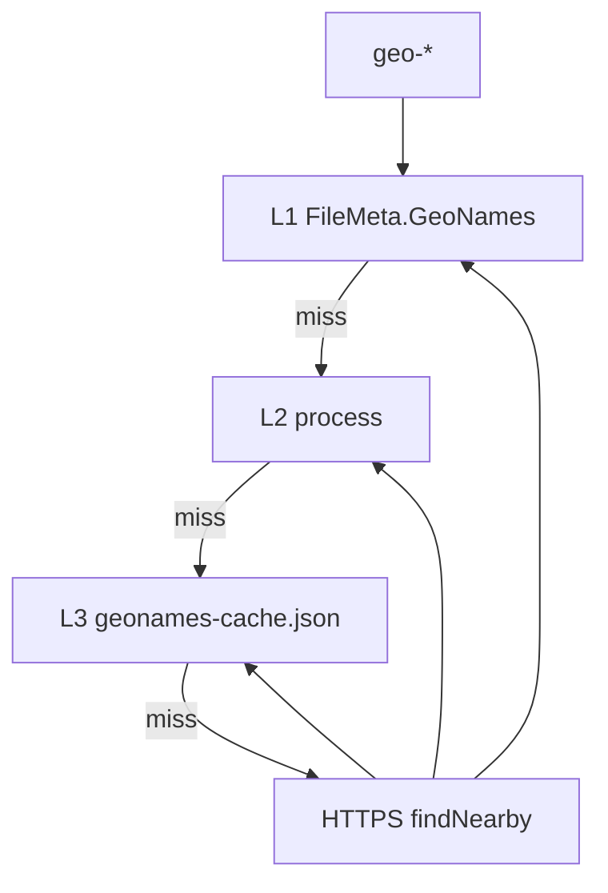
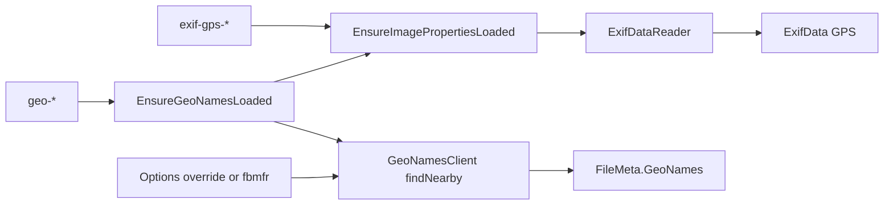

# Typed GPS + GeoNames plan

Parent: deferred **5c** in [`docs/image-metadata-model.md`](../image-metadata-model.md). Sibling help: [`help/tokens/eximagefp.html`](../../help/tokens/eximagefp.html).

## Decisions (locked)

- **Modernize over MFR7** — no `username=demo`, no regex DMS parse, no `"No Location"` / `"N/A"`.
- **Typed GPS** — `GpsDirectory.TryGetGeoLocation()` → `double? GpsLatitude` / `GpsLongitude` on [`ExifData`](../../Mfr.Models/Media/ExifData.cs) in [`ExifDataReader.MapFrom`](../../Mfr.Metadata/ExifDataReader.cs). Still flatten GPS IFD strings into `TagToDescription`.
- **Display format (lat/lon)** — invariant culture, up to 6 decimal places, trim trailing zeros (`0.######`).
- **Tokens** — `<exif-gps-lat>` / `<exif-gps-lon>`; `<geo-place>` / `<geo-region>` / `<geo-country>` (not MFR7 `image-nearby-*`).
- **Geo backend = online `findNearby` only** — HTTPS `https://api.geonames.org/findNearby?lat=&lng=&style=FULL&username=`. Server-side full gazetteer (not a cities\* dump). **No** offline zip download / Tools dump dialog / in-memory KD-tree from TSV.
- **App username** — bundled default **`fbmfr`** (FineBytes-registered GeoNames account; free web services enabled). Shared daily credit pool across installs (~10k credits/day; `findNearby` = 4 credits → ~2 500 lookups/day before cache).
- **Options override** — `OptionsConfig.GeoNamesUsername` (string, default **empty** = use bundled `fbmfr`). Non-blank override wins. Soft-load prefs.
- **Help** — Options shows a link to an in-app help page with register / enable free web services / paste username instructions (for users who want their own quota). Also CC-BY attribution note.
- **Empty rules** — no GPS → empty; successful API with blank field → empty. Network/HTTP/XML/rate-limit failure when `geo-*` or Nearby column is used → **PreviewError**.
- **Caching** — **L1 row + L2 process + L3 disk** (`geonames-cache.json` under LocalRoot): key `(round4(lat), round4(lon), effectiveUsername)`; soft cap ~5 000; failures not persisted; clear L2 on username override change; L3 not wiped by Reset Configuration. Protects shared `fbmfr` credits.
- **Rename List** — Lat/Lon: `ImageProperties`. Nearby: `RenameListMetadataRequirement.GeoNames` (may hit network on cache miss).
- **Read-only** — no GPS write / Apply.
- **No language picker** — API returns preferred names; no `lang=` in v1 unless trivial later.
- **Deferred** — offline cities dump / Tools download dialog (superseded for now); FineBytes proxy; `allCountries` local file.

## Libraries (locked)

| Concern | Library | Why |
| --- | --- | --- |
| Typed GPS | **MetadataExtractor 2.9.3** | `TryGetGeoLocation` |
| GeoNames HTTP | **BCL `HttpClient`** | HTTPS `findNearby` |
| GeoNames XML | **BCL `XDocument`** | First `geoname` → `name`, `adminName1`, `countryName` |
| UI | Avalonia Options / FormatEditor / Rename List | |

**Not used:** BenjaminSchroeter.GeoNames, offline dump/KD-tree, zip download UI.

Bundled username constant e.g. `GeoNamesClient.DefaultUsername = "fbmfr"` in Metadata (or Models). Effective username = override if non-blank, else default.

## UX

### Options — Location

Fieldset in [`OptionsDialog.axaml`](../../Mfr.App.Ui/Views/Options/OptionsDialog.axaml):

1. **GeoNames username** — TextBox bound to `GeoNamesUsername`. Placeholder / tip: leave blank to use the built-in MFR account; enter your own for a private quota.
2. **Help link** — “How to get a GeoNames username” → opens in-app help (e.g. `help/guide/geonames.html` or under Options/help) with steps:
   - Create account at geonames.org
   - Manage account → **Enable free web services**
   - Copy username into this field
   - Attribution / credit limits summary
3. No password field. Changing override on OK clears L2 process cache (L3 keys include username).

### Format Editor / tokens

| Token | Catalog | Name |
| --- | --- | --- |
| `<exif-gps-lat>` / `<exif-gps-lon>` | `Image\EXIF` | GPS Latitude / Longitude |
| `<geo-country>` / `<geo-region>` / `<geo-place>` | `Image\Nearby` | Nearby Country / Region / Place |

Help: `eximagefp.html` for GPS; `geofp.html` for geo + link to GeoNames username help. Example: `<geo-place> - <exif-date:yyyy-MM-dd>`.

### Rename List

Lat/Lon under Jpeg (`ImageProperties`). Nearby Country/Region/Place after Lon (`GeoNames` requirement — network on cache miss).

### Empty vs error

| Situation | Result |
| --- | --- |
| No GPS | empty |
| GPS + cache/API hit | place / region / country |
| Network / API / XML / rate limit | **PreviewError** |
| Non-image | existing image/EXIF PreviewError |

## Caching (locked)

Effective username in every cache key. Sync lookup on preview path (~10s HttpClient timeout).

## MFR7 reference brief

- Sources: `JpegGeoPG.cs`, `NearbyPlaceFP.cs`, Help Nearby / jpeg-geo
- MFR7: HTTP + `username=demo`, DMS string lat/lon, `image-nearby-*`
- Diffs: ME typed GPS; HTTPS + `fbmfr` / override; `exif-gps-*` / `geo-*`; empty not placeholders; L3 disk cache

## Non-goals

- Offline cities\* / allCountries dump download UI
- BenjaminSchroeter lib; language picker; weather/Wikipedia
- Writing GPS; MFR7 `image-nearby-*` aliases
- FineBytes-hosted proxy (later optional)

## Architecture

### Code placement

| Project | What |
| --- | --- |
| `Mfr.Models` | GPS fields; `GeoNamesInfo`; `OptionsConfig.GeoNamesUsername`; Nearby Rename List fields; formatting helper |
| `Mfr.Metadata` | `ExifDataReader` GPS; **`GeoNamesClient`** (HttpClient + XML); L3 cache IO |
| `Mfr.Filters` | Ensure geo; `exif-gps-*` / `geo-*` tokens; metadata loader arm |
| `Mfr.Engine` | Clear row geo on commit; sync effective username accessor for Filters if needed |
| `Mfr.App.Ui` | Options Location TextBox + help link; no Tools dump dialog |
| `help/` | `geofp.html` + **GeoNames username instructions** page; whatsnew/migrations |
| `Mfr.Tests` | GPS; client XML fixtures + stub handler; Options round-trip; cache keys |

Suggested: `Mfr.Metadata/GeoNames/GeoNamesClient.cs`, `GeoNamesResponseCache.cs`; `Mfr.Filters/Formatting/Tokens/Geo/GeoNearbyTokens.cs`; `help/guide/geonames-username.html` (name TBD).

## Phases

### P1 — Typed GPS lat/lon

- **Scope:** `ExifData` doubles; reader; formatting; `<exif-gps-*>`; Jpeg Lat/Lon columns; docs/help
- **Exit:** invariant 6-dp decimals; missing → empty; no network
- **Tests:** reader + formatting

### P2 — Online geo + Options override

- **Scope:** `GeoNamesClient` (`fbmfr` default); `OptionsConfig.GeoNamesUsername` + Options UI + help link/page; L1/L2/L3 cache; `GeoNamesInfo` + Ensure; `RenameListMetadataRequirement.GeoNames`; `geo-*` tokens + Nearby columns; geofp + username help; clear whatsnew/migrations; mark 5c done
- **Exit:** blank override uses `fbmfr`; override used when set; cache hit skips HTTP in tests; failure → PreviewError; help page documents registration steps
- **Tests:** XML parse fixture; stub `HttpMessageHandler`; Options soft-load; cache hit/miss + username isolation

## Implementation notes

- Shared lat/lon format helper in Models
- `HttpClient` only inside Metadata; injectable handler for tests
- Do not log full URLs with username in user-facing errors if avoidable
- Document shared-quota behavior for built-in account in help
