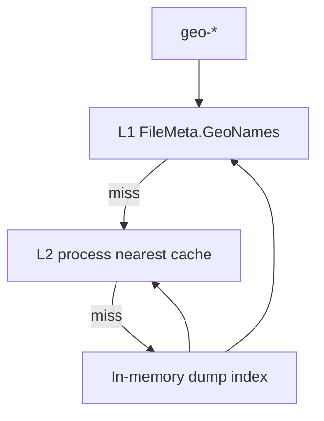
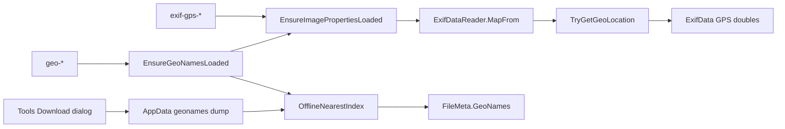

# Typed GPS + GeoNames plan

Parent: deferred **5c** in [`docs/image-metadata-model.md`](../image-metadata-model.md). Sibling help: [`help/tokens/eximagefp.html`](../../help/tokens/eximagefp.html). Not part of [`more-read-only-metadata-formats.plan.md`](more-read-only-metadata-formats.plan.md).

## Decisions (locked)

- **Modernize over MFR7 parity** — no `username=demo`, no live `findNearby`, no regex DMS string parse, no `"No Location"` / `"N/A"`.
- **Typed GPS** — `GpsDirectory.TryGetGeoLocation()` → `double? GpsLatitude` / `GpsLongitude` on [`ExifData`](../../Mfr.Models/Media/ExifData.cs) in [`ExifDataReader.MapFrom`](../../Mfr.Metadata/ExifDataReader.cs). Still flatten GPS IFD strings into `TagToDescription`.
- **Display format (lat/lon)** — invariant culture, up to 6 decimal places, trim trailing zeros (`0.######`).
- **Tokens** — `<exif-gps-lat>` / `<exif-gps-lon>`; `<geo-place>` / `<geo-region>` / `<geo-country>` (not MFR7 `image-nearby-*`).
- **Geo backend = offline dump only (C)** — nearest city from a GeoNames cities dump on disk. **No** HTTPS `api.geonames.org/findNearby`. **No** GeoNames username.
- **No automatic download** — dump is fetched only when the user runs **Tools → Download Location Database…** (or the same dialog from the first-use confirm / Options). Preview never silently downloads.
- **Precision (dump size)** — chosen in the Tools dialog. Default **Cities15000**. Also Cities5000 / 1000 / 500 only. Changing precision = re-download (replace + rebuild). Last-used precision persisted (`OptionsConfig` and/or `geonames/manifest.json`).
- **Empty rules** — no GPS → empty; **DB not installed** → `geo-*` empty (Lat/Lon still work); installed + no nearest / blank field → empty. Corrupt/unloadable DB when geo is requested → **PreviewError**. Download failure stays in Options UI (message), not PreviewError spam.
- **Caching** — **L1 row + L2 process only** (no L3 `geonames-cache.json`; local lookups are cheap). Dump files on disk are the durable store.
- **Rename List** — Latitude/Longitude: `ImageProperties`. Nearby columns: `RenameListMetadataRequirement.GeoNames` (local index only — no network unless user is mid-download in Options).
- **Read-only** — no GPS write / Apply.
- **Attribution** — GeoNames CC-BY in help/About.
- **No language picker in v1** — see **Place-name language** below.

## Libraries (locked)

| Concern | Library | Why |
| --- | --- | --- |
| Typed GPS | **MetadataExtractor 2.9.3** (already referenced) | `TryGetGeoLocation` / `GeoLocation` |
| Dump download | **BCL `HttpClient`** | GET zip/txt from `download.geonames.org` only when user starts Download |
| Dump parse + nearest | **Thin custom** in `Mfr.Metadata` (TSV parse + KD-tree or equivalent) | Spike in P2; avoid unmaintained NuGets unless spike fails |
| Zip | **BCL** (`ZipFile` / `System.IO.Compression`) | Unpack `cities*.zip` |
| UI | Existing Avalonia Options / FormatEditor / Rename List | |

**Not used:** BenjaminSchroeter.GeoNames, live GeoNames web API, RestSharp, TagLib for GPS, bundling the dump in the installer.

### Why not live API / BenjaminSchroeter

MFR7’s online path needs a username, shared credits, and fragile HTTP. Offline dump matches “modernize”: batch rename stays offline after one explicit download, no credentials in the binary. BenjaminSchroeter is Framework-era `WebClient` + unused surface area — skip.

### Dump files (precision)

From [download.geonames.org/export/dump](https://download.geonames.org/export/dump/) (Sep 2026 zip sizes):

| Options precision | Zip | ~Rows | Label (UI) |
| --- | --- | --- | --- |
| `Cities15000` (default) | **3.2 MB** | ~25k | Major cities (pop > 15k) |
| `Cities5000` | **5.4 MB** | ~50k | Cities pop > 5k |
| `Cities1000` | **10 MB** | ~130k | Cities pop > 1k |
| `Cities500` | **13 MB** | ~185k | Cities pop > 500 |

Always also fetch (small): `admin1CodesASCII.txt` (~148 KB), `countryInfo.txt` (~31 KB) for region/country **names**. Store under AppData LocalRoot e.g. `geonames/` (precision subfolder or stamped files). **Not** deleted by Reset Configuration (or document if we add “Remove location database”).

**`allCountries` (~402 MB zip, huge RAM)** — **not allowed in v1** (revisit later if needed).

### Place-name language

| Source | Languages? |
| --- | --- |
| `cities*.txt` `name` | One preferred UTF-8 name (often local) — **what v1 uses for place** |
| `asciiname` | ASCII transliteration of that name (optional future toggle, not v1) |
| `alternatenames` column | Comma list without language tags — not enough for a language combo |
| `alternateNamesV2.zip` | Real per-language names — **~195 MB** zip; out of scope for Tools download |
| `admin1CodesASCII.txt` | English/ASCII admin1 labels — **v1 region** |
| `countryInfo.txt` | Default country names (not a full lang matrix offline) — **v1 country** |
| Live API `lang=` | Would need online query — ditched |

**Locked:** Tools dialog has **precision only**, not language. No `alternateNames` download in v1. Document that place names follow GeoNames preferred names (may be non-English).

## UX

### Tools — Download Location Database dialog (P2)

Primary UI. Menu: **Tools → Download Location Database…** (exact label TBD; match app menu style).

Dialog contents:

1. Short blurb: one-time GeoNames city database for `<geo-*>` / Nearby columns; CC-BY; offline after install.
2. **Version / precision** — radio list with size hints (table below). **Current install** is indicated by:
   - Status line at top (always visible): `Not installed` **or** `Installed: Major cities (pop > 15k) · ~3.2 MB · downloaded yyyy-MM-dd`
   - The matching radio shows a trailing **(installed)** (or is pre-selected + bold) so the user sees which version is live when switching
3. **Download** / **Remove** / **Close** — see progress subsection.

| Choice | UI label (example) |
| --- | --- |
| Cities15000 | Major cities, pop > 15k (~3.2 MB) — default selection when nothing installed |
| Cities5000 | Cities pop > 5k (~5.4 MB) |
| Cities1000 | Cities pop > 1k (~10 MB) |
| Cities500 | Cities pop > 500 (~13 MB) |

Persist installed precision + download UTC date in a small sidecar (e.g. `geonames/manifest.json`) so status survives restarts (not only `OptionsConfig`).

#### Download progress (locked)

Yes — a **ProgressBar** in the dialog while work runs. Phases:

| Phase | Bar | Caption example |
| --- | --- | --- |
| 1. Download cities zip | **Determinate** 0–100% when `Content-Length` is present; else indeterminate | `Downloading cities15000.zip… 1.2 / 3.2 MB` |
| 2. Download admin1 + countryInfo | Determinate per file or brief indeterminate | `Downloading admin data…` |
| 3. Unpack zip | Indeterminate (or entry count if cheap) | `Extracting…` |
| 4. Build nearest index | Indeterminate | `Building index…` |

- Disable radios / Download / Remove while busy; **Cancel** aborts `CancellationToken` (leave previous DB intact if replace not committed).
- Implementation: `HttpClient` + `ReadAsStreamAsync` + copy loop reporting bytes; reuse patterns from any existing progress UI (e.g. Rename List progress dialog) for Avalonia `ProgressBar` binding.
- After success: update status line + **(installed)** marker; clear busy state.

#### Download & unpack mechanics (locked)

No external unzip tool, no “open zip in Explorer,” no browser download.

1. **URLs** (HTTPS GET), e.g.  
   `https://download.geonames.org/export/dump/cities15000.zip`  
   (+ `admin1CodesASCII.txt`, `countryInfo.txt` as plain GETs).
2. **Download** — `HttpClient` streams the response body to a **temp file** under LocalRoot (e.g. `geonames/.tmp/…`). Progress = bytes written / `Content-Length` when present.
3. **Open zip** — BCL `System.IO.Compression.ZipFile` / `ZipArchive` reads that temp file in-process; extract `cities*.txt` into a staging folder (not the live `geonames/` tree yet).
4. **Commit** — after admin/country files are also staged and the nearest index builds successfully from staging, **atomic-ish swap**: replace live dump files + write `manifest.json`, then delete temp. On any failure before commit, delete staging/temp and keep the previous live DB.
5. **Runtime** — lookups read the extracted `.txt` (and in-memory index), never the `.zip` again (zip can be deleted after extract to save disk).

**No on-disk format conversion in v1:** we do **not** rewrite the GeoNames TSV into SQLite, binary KD-tree files, MessagePack, etc. Disk stays official-ish text (`cities*.txt` + admin1 + countryInfo + `manifest.json`). The only “conversion” is **in-memory** when building the nearest index (parse TSV → points + names in RAM). Cold start re-parses the same `.txt` each time the process first needs geo.

User-Agent: identify MFR (e.g. `MagicFileRenamer/{version}`) — polite for GeoNames download servers.

Same dialog instance opened from:

- Tools menu (always)
- First-use confirm **Download…**
- Options Location **Download…** / **Manage…** (thin status row only — do not duplicate the version picker in Options)

#### Re-download / switch precision

Only **one** dump is installed at a time (no side-by-side Cities15000 + Cities500).

1. User opens **Tools → Download Location Database…** again.
2. Selects a **different** (or same) precision radio.
3. Clicks **Download**:
   - If a DB is already installed → confirm: “Replace the installed {old} database with {new} (~X MB)?”
   - On Yes: delete/replace files under `geonames/`, rebuild in-memory index, clear L1/L2 geo caches, persist new `GeoNamesPrecision`.
   - Same precision re-download = refresh from GeoNames (overwrite) — same confirm.
4. **Remove** uninstalls without installing another; `geo-*` go empty until a new Download.

Failed download leaves the previous DB intact (replace only after successful unpack + index build — stage to temp then swap).

### Options — Location (thin)

Fieldset shows install status + last precision + button opening the Tools dialog. No second copy of the version radio list. Persist `GeoNamesPrecision` when the user downloads successfully (and when they change selection before download if we save prefs on OK — prefer save precision when Download succeeds).

### First use without DB (confirm, not auto)

When a `geo-*` token or Nearby column needs the DB and it is **not** installed:

- **Do not** download automatically.
- Suppressible confirmation (`ConfirmationKind` e.g. `DownloadGeoNamesDatabase`): nearby names need a location database → **Download…** opens the Tools dialog / **Cancel**.
- Cancel / suppressed → `geo-*` **empty** until installed.
- Lat/Lon never triggers this.

### Format Editor / tokens

| Token | Catalog path | User-facing name | When empty |
| --- | --- | --- | --- |
| `<exif-gps-lat>` | `Image\EXIF` | GPS Latitude | No GPS |
| `<exif-gps-lon>` | `Image\EXIF` | GPS Longitude | No GPS |
| `<geo-country>` | `Image\Nearby` | Nearby Country | No GPS, no DB, or blank |
| `<geo-region>` | `Image\Nearby` | Nearby Region | same |
| `<geo-place>` | `Image\Nearby` | Nearby Place | same |

Help: GPS on `eximagefp.html`; Nearby on `geofp.html` + `fp.html` link. Document **Tools → Download Location Database** + precision choices. Example: `<geo-place> - <exif-date:yyyy-MM-dd>`.

### Rename List columns

| Column | Group | Metadata load |
| --- | --- | --- |
| Latitude / Longitude | Jpeg Tag | `ImageProperties` |
| Nearby Country / Region / Place | Jpeg Tag (after Lon) | `GeoNames` (local index) |

No network from the grid path except if the user accepts the first-use download confirm.

### Empty vs error

| Situation | Token / cell |
| --- | --- |
| No GPS | empty |
| DB not installed (after cancel/suppress) | `geo-*` empty |
| DB installed, GPS present | nearest place / region / country |
| DB corrupt / index load failure | **PreviewError** |
| Non-image | existing image/EXIF PreviewError |

### Help / migrations

- P1: GPS tokens; keep whatsnew geo “not shipped” until P2.
- P2: geofp + Tools download dialog; clear whatsnew/migrations for `<geo-*>`; note offline dump + CC-BY.

## Caching (locked)

| Layer | Purpose |
| --- | --- |
| **Dump on disk** | Extracted `.txt` + `manifest.json` under AppData (durable) |
| **In-memory index** | Built once per process when first needed (or right after Download) |
| **L1 row** | Per `RenameItem` until commit clear |
| **L2 process** | `(round4(lat), round4(lon))` → place/region/country |

### How the dump is loaded (locked)

**Yes — the working index is all in memory for v1** (simple + fast nearest lookup). Disk holds the source files; we do **not** query the `.txt` on every token.

| Step | Behavior |
| --- | --- |
| After Download | Extract to disk → build index in RAM → ready |
| App start (DB already installed) | **Lazy:** first `geo-*` / Nearby column / Tools dialog status that needs the index → read TSV from disk once → build KD-tree (or equivalent) in RAM → keep for process lifetime |
| Per lookup | Pure in-memory nearest; L2 cache avoids repeat searches for same rounded coords |
| Not in v1 | Memory-mapped file, SQLite, paging, keeping the zip open, or a **persisted binary index** beside the TSV (possible later to speed cold load) |

**RAM ballpark (order of magnitude):** Cities15000 (~25k) is small (few–tens of MB). Cities500 (~185k) still fine for a desktop app. No `allCountries` in v1.

Unload: process exit, or after **Remove** / successful replace (drop old index before/after swap).

#### Latency / delay (locked)

| When | Delay? | UX |
| --- | --- | --- |
| App start (no geo used) | **None** — index not built | — |
| Tools **Download** | Yes — network + extract + index | ProgressBar phases (already locked) |
| First `geo-*` / Nearby after Download in same session | **None** — index already built at end of Download | — |
| First `geo-*` / Nearby after app restart (DB on disk) | **Yes, once** — read TSV + build index | Prefer **async build with wait cursor / brief status** on UI thread boundary; do **not** freeze the whole app without feedback. Cities15000 should be ~sub-second to a couple seconds on typical hardware; Cities500 longer (still usually a few seconds). |
| Later lookups same session | Negligible (RAM + L2) | — |
| DB not installed | No load delay | empty / first-use confirm |

If cold load fails or is cancelled, `geo-*` → empty or PreviewError per corrupt-DB rules; do not leave a half-built index.

## Later (not v1)

- FineBytes mirror of the zip (same Options Download, different URL).
- Auto-update check for newer dump.
- Live `findNearby` — out of scope unless revisited.

## MFR7 reference brief

### Sources

- Help: `fp.html` Nearby group, `fields.html#jpeg-geo`
- Code: `JpegGeoPG.cs`, `NearbyPlaceFP.cs`, `3rdParty/GeoNames/`

### Behavior

- Live HTTP GeoNames + `username=demo`; DMS string parse for lat/lon
- Tokens `image-nearby-country/region/place`

### Parity gaps / intentional diffs

- Offline dump + explicit download; ME typed GPS; `exif-gps-*` / `geo-*`; empty not placeholders; precision Options

## Non-goals

- `allCountries` dump (deferred); **language picker** / `alternateNamesV2` (~195 MB)
- Writing GPS; TagLib Image Tag GPS
- MFR7 `image-nearby-*` aliases
- Weather / Wikipedia / elevation
- Live GeoNames / Nominatim web query
- Bundling dump in installer
- Auto-download without confirmation
- Indexing non-city GeoNames feature classes

## Architecture

### Code placement (locked)

| Layer | Project | What goes here |
| --- | --- | --- |
| L1 Models | `Mfr.Models` | `ExifData.GpsLatitude/Longitude`; `GeoNamesInfo` on `FileMeta`; `GeoNamesPrecision` enum; `GpsCoordinateFormatting`; Jpeg Lat/Lon + Nearby Rename List fields; `OptionsConfig` thin geo prefs if any; `ConfirmationKind.DownloadGeoNamesDatabase` |
| L2 Metadata | `Mfr.Metadata` | `ExifDataReader` GPS map; **`GeoNamesDumpDownloader`** (HttpClient + zip extract + staging/swap); **`GeoNamesDumpIndex`** / nearest lookup (TSV parse); manifest read/write under LocalRoot `geonames/`; `HttpMessageHandler` injection for tests |
| L3 Filters | `Mfr.Filters` | `EnsureGeoNamesLoaded`; `<exif-gps-*>` / `<geo-*>` tokens + formatting; `RenameListMetadataLoader` GeoNames arm; `RenameListMetadataRequirement.GeoNames` |
| L4 Engine | `Mfr.Engine` | `ClearMetadataCaches` clears row geo; wire dump root path via existing AppData helpers if owned here; no UI |
| L5 UI | `Mfr.App.Ui` | **Tools** menu item; `Views/…/DownloadGeoNamesDatabaseDialog.axaml` + ViewModel (precision radios, ProgressBar, Cancel); Options Location status + open dialog; first-use confirm → dialog |
| Tests | `Mfr.Tests` | Reader/GPS; dump index with tiny fixture TSV; downloader with stub handler; token/Ensure; dialog VM as practical |
| Docs/help | `docs/`, `help/` | `image-metadata-model.md` 5c; `Formatter.md`; `eximagefp.html` / `geofp.html`; whatsnew/migrations |

Suggested new types (names indicative):

- `Mfr.Metadata/GeoNames/GeoNamesDumpDownloader.cs`
- `Mfr.Metadata/GeoNames/GeoNamesDumpIndex.cs`
- `Mfr.Metadata/GeoNames/GeoNamesManifest.cs`
- `Mfr.Models/Media/GeoNamesInfo.cs`
- `Mfr.Filters/Formatting/Tokens/Geo/GeoNearbyTokens.cs`
- `Mfr.Filters/RenameItemGeoNamesExtensions.cs`
- `Mfr.App.Ui/Views/Tools/DownloadGeoNamesDatabaseDialog.axaml` (+ `.cs`)
- `Mfr.App.Ui/ViewModels/Tools/DownloadGeoNamesDatabaseViewModel.cs`

Filters must **not** reference `ConfigStore`; dump “is installed?” / lookup goes through Metadata APIs. UI owns download orchestration and calls Metadata to install.

## Phases

Three phases — old monolithic P2 was too large (install UI + lookup product in one slice).

### P1 — Typed GPS lat/lon

- **Scope:** `ExifData` doubles; `ExifDataReader`; `GpsCoordinateFormatting`; `<exif-gps-*>` tokens; Jpeg Lat/Lon columns; image-metadata / Formatter / eximagefp / fields
- **Exit:** tokens expand invariant 6-dp decimals; missing GPS → empty; no network
- **Tests:** reader + formatting
- **Ships alone:** yes (geo still “not shipped” in whatsnew)

### P2 — Dump install + Tools dialog

- **Scope:** `GeoNamesPrecision`; `GeoNamesDumpDownloader` (HttpClient, zip, staging/swap, manifest); `GeoNamesDumpIndex` (TSV + nearest); Tools menu + **Download Location Database** dialog (radios, status/(installed), ProgressBar phases, Cancel, Remove, replace confirm); thin Options status + open dialog
- **Exit:** user can download each precision with progress; switch/replace works; failed download keeps old DB; index answers nearest for known coords in tests (public Metadata lookup API or internal test hook — **no** formatter tokens required yet)
- **Tests:** tiny fixture TSV nearest; downloader with stub `HttpMessageHandler`; dialog VM progress/cancel as practical
- **Not in P2:** `geo-*` tokens, Nearby columns, first-use confirm, geofp whatsnew clear

### P3 — geo-* product surface

- **Scope:** `GeoNamesInfo` on `FileMeta`; `EnsureGeoNamesLoaded` + L1/L2; `RenameListMetadataRequirement.GeoNames`; `<geo-place/region/country>` tokens; Nearby Rename List columns; suppressible first-use confirm → Tools dialog; help `geofp.html` + fp/fields; clear whatsnew/migrations; mark image-metadata **5c** done
- **Exit:** without DB → empty / confirm; with DB + GPS → place/region/country; columns load only when GeoNames requirement set
- **Tests:** Ensure/token tests with fixture index; confirm wiring as needed

No P4 in this plan (FineBytes mirror, language pack, live API = later/non-goals).

## Implementation notes

- Shared lat/lon format helper in Models for Token + Grid
- GPS test fixture or synthesized directories
- `HttpClient` only for **user-initiated** dump download
- Keep download URL in one constant so a FineBytes mirror is a one-line change later
