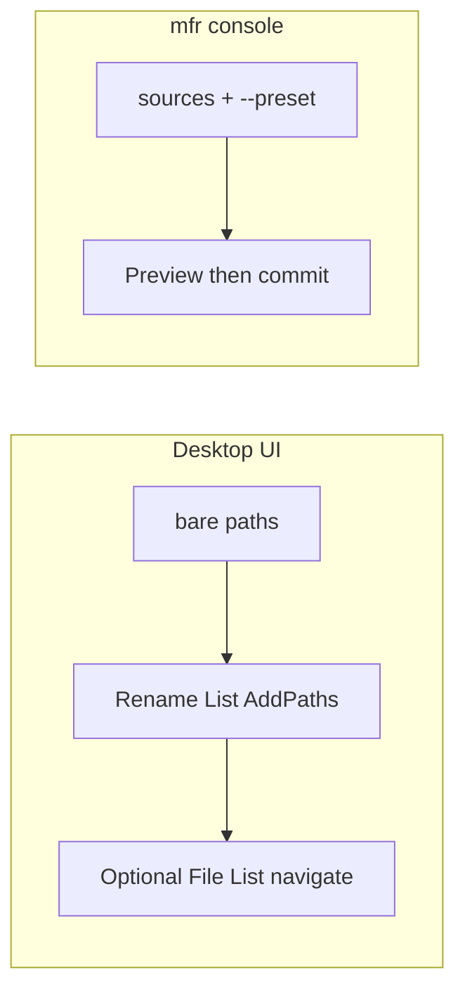

# Desktop UI command-line parameters

## What will be supported (v1)

| Supported           | Behavior                                                                                                                           |
| ------------------- | ---------------------------------------------------------------------------------------------------------------------------------- |
| Bare path arguments | Files, folders, wildcards on the desktop app command line → seed the **Rename List** (same add rules as drag-drop / Options prefs) |

After add: optionally navigate the File List to the first added item (MFR7 parity). The UI opens for interactive work — **no auto-rename**.

Add behavior (files vs folders, recursive, include hidden) comes from **existing Options prefs**, not from new GUI flags in v1.

## What will not be supported (UI)

| Not on desktop UI                                                     | Where it lives instead                           |
| --------------------------------------------------------------------- | ------------------------------------------------ |
| Preset / dry-run / confirm / commit                                   | Console `mfr`                                    |
| `--file-list` / MFR7 `/FILELIST:`                                     | Out of scope (shell can pass concrete paths)     |
| One-shot `--files` / `--folders` / `--recursive` / `--include-hidden` | Deferred (prefs cover v1; optional later)        |
| Single-instance + forward paths to running window                     | Deferred with Explorer shell integrate           |
| MFR7 `/F±` `/D±` `/R±` `/H±` slash API                                | Prefer long options if overrides are added later |
| `/NFS`, `/DKF`, `/A:`                                                 | Skip (dead / license / “use console”)            |

## Verdict

**Yes — support a thin GUI startup path API**, separate from the console (`mfr`). MFR7’s GUI CML never auto-renamed; it only seeded the Rename List. That remains useful for:

- Dragging files/folders onto the app icon / shortcut
- Desktop/taskbar shortcuts with fixed folders
- Future Explorer “Rename with MFR…” (listed as deferred in [docs/debts.md](../debts.md); needs the same path intake)
- Power users who want the UI open with a batch already in the list

Automation that applies a preset stays on **`mfr`**. Do **not** port console flags onto the UI.

Current docs mark this as “not in this build”: [help/guide/console.html](../../help/guide/console.html), [help/intro/migrations.html](../../help/intro/migrations.html), [help/intro/whatsnew.html](../../help/intro/whatsnew.html). UI entry today passes argv straight through Avalonia with no product parsing ([Mfr.App.Ui/Program.cs](../../Mfr.App.Ui/Program.cs)).

## MFR7 reference brief

### Sources

- Help: `C:\Program Files\FineBytes\MFR7\Help\cml.html` (GUI CML; console is separate)
- Code: `D:\Devl\mfr7\Core\MFRGui\Forms\Main\Main.cs` (`ProcessCML`), `D:\Devl\mfr7\Core\MFR\Program.cs`
- finebytes status: not implemented; help documents gap

### Behavior

- Purpose: add paths from argv to Rename List only (no auto-rename)
- Documented switches: `/F±` `/D±` `/R±` `/H±`, `/NFS` (dead), bare paths; code also `/FILELIST:`, `/ONEINST`, `/DKF`, `/A:` (reject → use console)
- Defaults from Options: AddFiles=true, AddFolders=false, AddFolderContents=true; AddHiddenItems=false
- After add: File List navigates/selects first item via `LocateFile`

### Parity gaps / intentional diffs

- v1: bare paths only; prefs for add mode (no slash toggles, no `/FILELIST:`)
- Auto-rename remains console-only (`mfr`)

## Decisions (locked)

- Desktop UI accepts bare startup paths to seed Rename List only
- No `--file-list` / `/FILELIST:` in v1
- Reuse existing Rename List add pipeline and Options prefs for v1
- Defer one-shot add overrides and single-instance until shell integration
- Keep help split: desktop seeds list; `mfr` renames

## Non-goals

- Porting console preset/commit flags to the UI
- File-list / `/FILELIST:` bulk-path file intake
- Explorer shell extension in this plan (consumes path API later)
- MFR7 slash-flag compatibility layer

## Implementation sketch

- Parse in UI startup (not CLI project): thin argv reader next to [Mfr.App.Ui/Program.cs](../../Mfr.App.Ui/Program.cs) / app init after main window + VMs exist
- Feed paths into the same add path used by drag-drop (`RenameListViewModel` add / `RenameListAddSourceResolver`)
- Tests: argv → Rename List contents; invalid path handling; ignore Avalonia-only noise if any
- Help: update `cml.html` / `console.html` / migrations / whatsnew for desktop vs console
