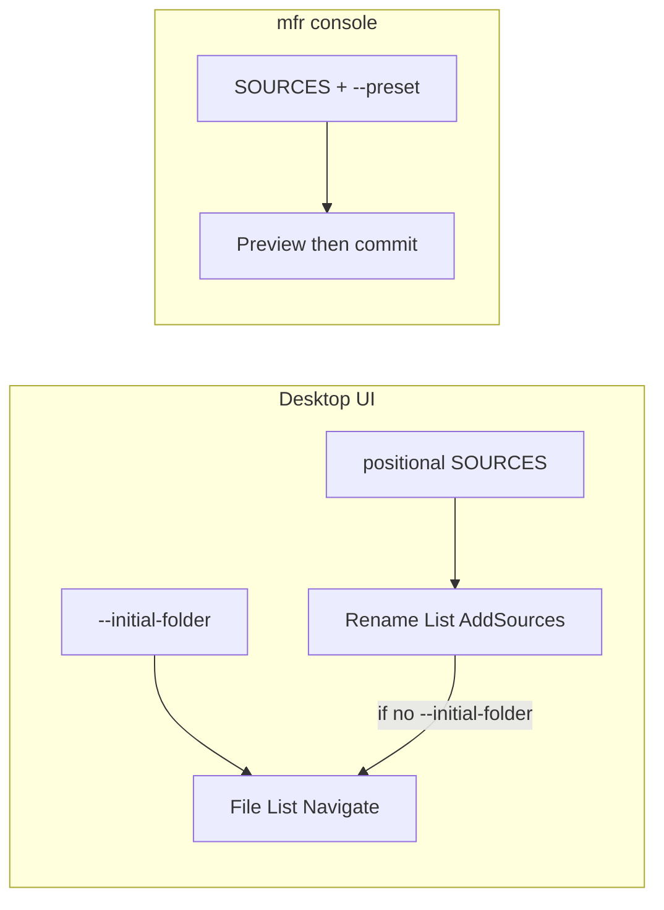

# Desktop UI command-line parameters

## What will be supported (v1)

Two independent startup intents (can be combined):

| Option | Behavior |
| ------ | -------- |
| Positional `<SOURCES>…` | Files, folders, wildcards → seed the **Rename List** (same role as console `mfr <SOURCES>…`) |
| `--initial-folder <PATH>` | Open the **File List** at that directory only (no Rename List add). UI-only; console has no File List. |

**Add modifiers** (same names as console; apply only when seeding from `<SOURCES>`):

| Option | Console twin | UI when omitted |
| ------ | ------------ | --------------- |
| `--files yes\|no` | yes | Options prefs (Add files) |
| `--folders yes\|no` | yes | Options prefs (Add folders) |
| `-r` / `--recursive` | yes | Options prefs (Add folder contents) |
| `--include-hidden` | yes | Options prefs (include hidden/system) |

Notes:

- Named `--initial-folder` (not `--folder`) so it does not collide with console `--folders`.
- After a successful **add**, if `--initial-folder` was **not** set, navigate the File List to the first added item (MFR7 parity). If `--initial-folder` was set, that path wins for File List location.
- UI opens for interactive work — **no** preset / dry-run / confirm / commit on the desktop app.

Examples:

```text
Mfr.App.Ui.exe D:\music\*.mp3
Mfr.App.Ui.exe D:\photos --files yes --folders no -r
Mfr.App.Ui.exe --initial-folder D:\photos
Mfr.App.Ui.exe D:\batch\a.jpg D:\batch\b.jpg --initial-folder D:\batch
```

## What will not be supported (UI)

| Not on desktop UI | Where it lives instead |
| ----------------- | ---------------------- |
| `-p` / `--preset`, `--dry-run`, `-c` / `--confirm`, commit | Console `mfr` |
| `--file-list` / MFR7 `/FILELIST:` | Out of scope |
| Single-instance + forward paths to running window | Deferred with Explorer shell integrate |
| MFR7 `/F±` `/D±` `/R±` `/H±` slash API | Use console-aligned long options above |
| `/NFS`, `/DKF`, `/A:` | Skip |

## Verdict

**Yes — thin GUI startup API**, separate from console rename automation. Useful for drag-to-icon, shortcuts, and future Explorer “Rename with MFR…” ([docs/debts.md](../debts.md)).

Shipped: thin UI argv parse ([`UiStartupArgsParser`](../../Mfr.App.Ui/UiStartupArgsParser.cs)) + apply after main window ([`UiStartupArgsApplier`](../../Mfr.App.Ui/UiStartupArgsApplier.cs)); help covers desktop vs console ([help/guide/cml.html](../../help/guide/cml.html)).



## MFR7 reference brief

### Sources

- Help: `C:\Program Files\FineBytes\MFR7\Help\cml.html` (GUI CML; console is separate)
- Code: `D:\Devl\mfr7\Core\MFRGui\Forms\Main\Main.cs` (`ProcessCML`), `D:\Devl\mfr7\Core\MFR\Program.cs`
- finebytes status: implemented (P1–P3); desktop uses console-style long options + `--initial-folder`

### Behavior

- Purpose: add paths from argv to Rename List only (no auto-rename)
- Documented switches: `/F±` `/D±` `/R±` `/H±`, `/NFS` (dead), bare paths; code also `/FILELIST:`, `/ONEINST`, `/DKF`, `/A:`
- Defaults from Options: AddFiles=true, AddFolders=false, AddFolderContents=true; AddHiddenItems=false
- After add: File List navigates/selects first item via `LocateFile`
- No dedicated “browse folder only” switch in MFR7

### Parity gaps / intentional diffs

- Public API uses console-style long options (`--files`, `--folders`, `-r`, `--include-hidden`), not MFR7 slash toggles
- New UI-only `--initial-folder` for File List start without add
- When add modifiers omitted, UI uses Options prefs (console always uses its own CLI defaults)
- Auto-rename remains console-only (`mfr`)

## Decisions (locked)

- **Add:** positional `<SOURCES>…` → Rename List (same shape as console sources)
- **Browse:** `--initial-folder <PATH>` → File List only
- **Modifiers:** `--files` / `--folders` / `-r|--recursive` / `--include-hidden` match console; omitted → Options prefs
- No `--file-list` / `/FILELIST:`
- Defer single-instance until shell integration
- Keep help split: desktop seeds / browses; `mfr` renames

## Non-goals

- Porting console preset/commit flags to the UI
- File-list / `/FILELIST:` bulk-path file intake
- Explorer shell extension in this plan
- MFR7 slash-flag compatibility layer

## Implementation sketch

- Parse in UI startup (not CLI project): thin argv reader next to [Mfr.App.Ui/Program.cs](../../Mfr.App.Ui/Program.cs) / app init after main window + VMs exist
- Prefer sharing option name/semantics with [Mfr.App.Cli/CliArgParser.cs](../../Mfr.App.Cli/CliArgParser.cs) (`--files`, `--folders`, `-r`, `--include-hidden`); do not require Spectre on the UI
- Feed sources into Rename List add (`RenameListViewModel` / raw engine sources for wildcards like console); call `FileListViewModel.NavigateTo` / `TryLocatePath` for `--initial-folder` (or first-added locate when browse unset)
- Tests: sources-only add; `--initial-folder` only; both combined; modifier overrides vs prefs; invalid paths
- Help: update `cml.html` / `console.html` / migrations / whatsnew for desktop vs console

## Phases

### P1 — UiStartupArgs parser

- Add a thin argv parser under `Mfr.App.Ui` (no Spectre): positional sources, `--initial-folder`, `--files` / `--folders` yes|no, `-r`/`--recursive`, `--include-hidden`.
- Omitted add modifiers stay unset so apply can fall back to Options prefs; reject unknown flags / bad yes|no.
- Unit tests for parse shapes (sources-only, folder-only, modifiers, errors).
- Exit: parser + tests green; no App/VM wiring yet.
- Status: done

### P2 — Apply after main window

- After `MainWindow` + VMs exist, apply parsed intents: seed Rename List from sources (engine `AddSources` path, including wildcards; optional policy overrides), navigate/locate File List for `--initial-folder` or first-added item when browse unset.
- Wire from `App` / desktop args; soft-handle apply failures so the UI still opens.
- Tests: sources-only; `--initial-folder` only; both; modifier overrides vs prefs; invalid paths.
- Exit: startup apply + tests green.
- Status: done

### P3 — Help docs

- Update `help/guide/cml.html`, `help/guide/console.html`, `help/intro/migrations.html`, `help/intro/whatsnew.html` for desktop seed/browse vs console rename.
- Exit: help no longer says desktop CML is “not in this build”; documents `--initial-folder` and add modifiers.
- Status: done
