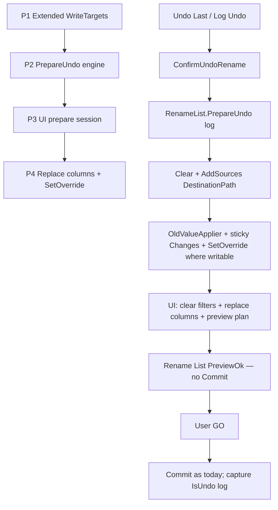

# Undo as preview session plan

Parent: [docs/plans/undo.plan.md](docs/plans/undo.plan.md) (P1–P5 complete). This follow-on **replaces** the locked “Mechanism / Rename List on undo” auto-Commit behavior.

Canonical copy after approval: [docs/plans/undo-preview-session.plan.md](docs/plans/undo-preview-session.plan.md).

## Decisions (locked)

- **P1 first: Extended WriteTargets** — Ship Attrs + Creation/LastWrite/LastAccess as real `WriteTarget`s **before** undo work. Useful on its own for F2 Manual Override / Edit as Name List / ForceValue. Undo later reuses them for sticky overrides.
- **Extended targets scope** — Wire on Rename List catalog fields only. **Do not** add to Filter Options Apply-To (`FilterTargetCatalog`); Attributes Setter / DateTime Setter already cover filter Apply-To. Size / Folder File Count stay non-writable.
- **String formats** — `GetTargetString` matches grid display (`RAHS`, culture `"G"` dates). `SetTargetString` parses that display form; also accept log-friendly forms where cheap (`FileAttributes` enum names; round-trip `"O"` dates) so undo `SetOverride` from OldValues is reliable.
- **Preview-only** — Undo Last and Log Undo **never** call `Commit`. They replace the Rename List with the undo session and leave Preview ready; user presses **GO** to apply (same confirm-before-apply / progress path as a normal rename).
- **Sticky OldValues** — Keep [`RenamePropertyOldValueApplier`](Mfr.Engine/Preview/RenamePropertyOldValueApplier.cs) as the fidelity path (path, attrs, dates, `AudioTag.Block.*`). Attach each row’s undoable `Changes` as a sticky seed reapplied after every preview cycle until cleared (Cancel / RefreshOriginals / successful Commit). Also `SetOverride` (preview side) for properties that have a `WriteTarget`, so ForceValue UI matches.
- **Clear Applied Filters** — Silent `AppliedFiltersViewModel.ReplaceFromChain(empty)` (no separate Clear-filters confirm). Empty chain + sticky seed = reverse plan. The Undo confirm dialog is the warning surface (see Confirm).
- **Columns** — **Replace** visible columns with the preview-side field keys for properties changed in the undo session (plus the usual status/required columns). Do not merge into the previous set. Hydrate metadata via existing shuttle/loader when TagLib columns appear. Session/prefs pick up the new set on the next save as with any column change.
- **Confirm** — Keep `ConfirmationKind.UndoRename` at Normal/More. Message must warn that **the Rename List will be replaced** and **Applied Filters will be cleared**, and that the user must press **GO** to apply (e.g. “Replace the Rename List with this undo session and clear Applied Filters? Press GO to apply.”). Still the only pre-prepare gate.
- **No File List refresh** on prepare; refresh only after a later GO (existing commit path).
- **Last op / log** — Preparing undo does **not** write a rename log or clear `LastOperation`. A new log/`IsUndo` entry is written only when the user GOs the prepared session (one-shot pending flag on the list set by PrepareUndo and consumed by the next Commit).
- **Non-undoable** — Unchanged: strip-only / Tag Remover rows skipped; unrestorable deltas ignored.

## MFR7 reference brief

### Sources

- Help: `undolast.html`, `log.html`; code: `Log.Undo` + `LogForm.UndoLog` → populate RIL then **Apply** immediately
- finebytes today: [`RenameList.Undo`](Mfr.Engine/RenameList/RenameList.cs) = populate + OldValueApplier + **Commit** (MFR7 parity)
- Extended columns: MFR7 ReadWrite dates/attrs; finebytes already `supportsPreview: true` but no `WriteTarget`

### Behavior (legacy)

- Undo reverses last/any logged GO; populates Rename List; auto-Applies
- Help emphasizes populate; auto-Apply is implementation detail

### Parity gaps (intentional)

- finebytes Undo becomes **prepare session**, not auto-Apply (extra GO step)
- Sticky seed + overrides instead of one-shot Preview mutation + Commit
- Confirm copy / no File List refresh until GO
- Extended WriteTargets enable F2 on attrs/dates (MFR7-adjacent ReadWriteApply)

## Non-goals

- Changing `.mfrlog` schema or retention Options
- Importing MFR7 XML logs
- Filter / FormatEditor text undo
- Auto-GO under Fewer prompts
- Remapping `AudioTag.Block.*` onto semantic MediaTag columns for fidelity (seed keeps block applier)
- Adding Extended targets to Filter Options Apply-To

## Architecture

Hook points:

- P1: [`Targets.cs`](Mfr.Models/Filters/Targets.cs), [`FileMetaPreviewExtensions`](Mfr.Models/Rename/FileMetaPreviewExtensions.cs), [`ExtendedRenameListFields`](Mfr.Models/RenameList/Fields/Extended/ExtendedRenameListFields.cs), parse helpers next to [`RenameListFieldDisplay`](Mfr.Models/RenameList/RenameListFieldDisplay.cs); JsonDerivedType + any FilterTargetKey catalog tests; **not** [`FilterTargetCatalog`](Mfr.App.Ui/ViewModels/AppliedFilters/FilterTargetCatalog.cs)
- Engine: split today’s `Undo` into `PrepareUndo` (stop before Commit); sticky reapply after filters in preview pipeline ([`FilterChain`](Mfr.Models/Filters/FilterChain.cs) / [`RenameList`](Mfr.Engine/RenameList/RenameList.cs) PreviewEnd)
- UI: [`RenameListViewModel.Undo.cs`](Mfr.App.Ui/ViewModels/RenameList/RenameListViewModel.Undo.cs), [`MainWindowViewModel`](Mfr.App.Ui/ViewModels/MainWindow/MainWindowViewModel.cs) (drop File List refresh on undo prepare), Log dialog still returns `LogToUndo`
- Columns: replace via existing `SetVisibleColumns` / `ApplyFieldShuttleAsync` on [`RenameListViewModel.Columns.cs`](Mfr.App.Ui/ViewModels/RenameList/RenameListViewModel.Columns.cs) (status column first + mapped undo field keys)
- Filters: `ReplaceFromChain([])`
- Map log `RenamePropertyNames` → `RenameListFieldKey` (preview) for columns + overrides

## Phases

### P1 — Extended WriteTargets (standalone) — done

- Scope / files: new `FilterTarget` records for Attributes + three file dates; `GetTargetString` / `SetTargetString` (+ parse of display and log-friendly strings); pass `writeTarget:` into Extended Attrs/date field ctors so `SupportsWrite` is true; unit tests for round-trip and F2 eligibility
- Exit criteria: F2 Manual Override works on preview Attrs / Creation / Last Write / Last Access; override survives re-preview and commits via existing GO path; Apply-To catalog unchanged
- Tests: Models tests for Get/SetTargetString; catalog `SupportsWrite`; optional small override→commit smoke
- Note: shippable and useful without any undo changes

### P2 — Engine `PrepareUndo` + sticky seed

- Scope / files: [`Mfr.Engine/RenameList/RenameList.cs`](Mfr.Engine/RenameList/RenameList.cs) — replace auto-Commit `Undo` with `PrepareUndo`; [`RenameItem`](Mfr.Models/Rename/RenameItem.cs) sticky OldValue changes + clear on Cancel/RefreshOriginals/Commit success; preview pipeline reapplies seed after PreviewEnd; one-shot `pendingUndoCommit` for next log `IsUndo`
- Exit criteria: PrepareUndo loads destinations, Preview shows OldValues, no filesystem change, re-preview with empty filters keeps OldValues; strip-only skipped
- Tests: rewrite [`Mfr.Tests/Engine/RenameListUndoTests.cs`](Mfr.Tests/Engine/RenameListUndoTests.cs) for prepare (not disk restore); round-trip = PrepareUndo + Commit

### P3 — UI: Undo Last / Log → prepare session

- Scope / files: [`RenameListViewModel.Undo.cs`](Mfr.App.Ui/ViewModels/RenameList/RenameListViewModel.Undo.cs), MainWindow undo/log handlers, confirm string in [`RenameListView.axaml.cs`](Mfr.App.Ui/Views/RenameList/RenameListView.axaml.cs) (warn: list replaced + filters cleared + press GO), status (“Prepared undo of N items — press GO to apply”); clear filters via `ReplaceFromChain`; **no** File List refresh on prepare
- Exit criteria: Ctrl+Z / Log Undo fills list + clears filters; disk unchanged until GO; GO restores files and writes undo log; confirm still gated by policy
- Tests: [`MainWindowUndoTests`](Mfr.Tests/Ui/MainWindow/MainWindowUndoTests.cs), [`RenameLogDialogTests`](Mfr.Tests/Ui/LogDialog/RenameLogDialogTests.cs)

### P4 — Columns + SetOverride mirror

- Scope / files: replace visible columns from log-property → field-key map (dedupe across entries; status/required first) + metadata hydrate; after OldValueApplier, `SetOverride` for writable preview keys (path + Extended from P1 + semantic audio where mapped)
- Exit criteria: undoing name/dir/attr/date/tag ops **replaces** column set with those preview columns; path/Extended overrides show as ForceValue and survive re-preview
- Tests: column replace unit/VM tests; override mirror smoke

### P5 — Docs

- Scope: amend [undo.plan.md](docs/plans/undo.plan.md) Decisions (mechanism + Rename List on undo); [keyboard-shortcuts.md](docs/keyboard-shortcuts.md) Undo Last wording; brief note in debts if needed
- Exit criteria: docs describe prepare + GO, not auto-undo commit
