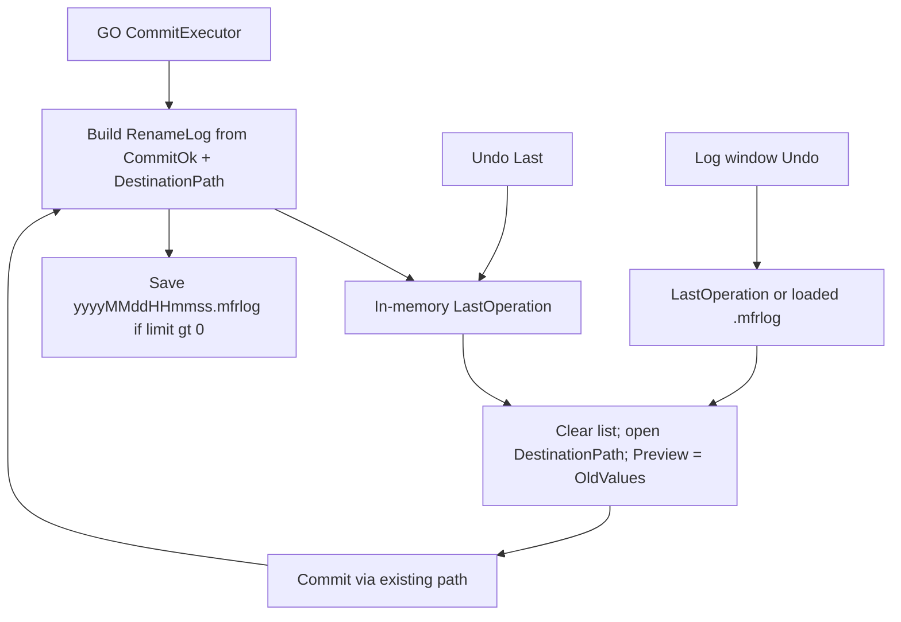

# Undo feature plan

Parent: deferred from [rename-list-go.plan.md](rename-list-go.plan.md), [options-dialog.plan.md](options-dialog.plan.md), [status-bar-outcomes.plan.md](status-bar-outcomes.plan.md), [docs/debts.md](../debts.md).

## Decisions (locked)

### Product calls (taken — change these if wrong)

- **v1 scope** — Full surface in this plan: Undo Last + Log window + disk `.mfrlog` history + Options retention (phased P1–P4), not Undo-Last-only first.
- **Options retention UI** — Ship Undo & Log tab in **P4** (not hand-edit-only forever).
- **Confirm before Undo?** — Gate via **Confirmation prompts** (`ConfirmationPolicy` + new `ConfirmationKind.UndoRename`). Same threshold as `GoWithPreviewErrors`: confirm at **Normal** and **More**, skip at **Fewer**. Applies to Undo Last and Log-window Undo. (MFR7 never confirmed; finebytes intentional.)
- **Rename List on undo** — **Replace without a separate non-empty-list warn** — clear current list and load the undone session (MFR7 parity). The Confirmation-prompts dialog above is the only pre-undo gate.
- **Default disk retention** — Keep last **10** logs (0 = disk off / memory-only Undo Last; unlimited supported).

### Other locked (engineering / already-shipped chrome)

- **Rename-commit undo only** — Undo reverses a completed GO (path / attrs / dates / audio tag setters). Not filter edits, list edits, presets, or File List Cut/Copy/Paste/Delete (Recycle remains delete undo; see [file-list-cut-copy-paste-delete.plan.md](file-list-cut-copy-paste-delete.plan.md)).
- **Mechanism** — Log Old→New per property at GO; undo clears Rename List, loads items at **post-GO path**, sets Preview to OldValues, reuses existing Preview→`Commit` path (same as MFR7 `Log.Undo` + `Apply`). Undo of a successful undo writes a new log entry (undo-of-undo).
- **In-memory last op always** — `UndoLast` works even when disk retention is 0 (MFR7 parity).
- **JSON `.mfrlog`**, not MFR7 XML — current schema only; no reading legacy ProgramData XML logs.
- **Storage** — `%LocalApplicationData%/finebytes/mfr/rename-logs/` (separate from diagnostic Serilog `log` / `logs/`). New prefs section `renameLog` (not overload `log`).
- **Shortcuts stay finebytes** — Ctrl+Z Undo Last, Ctrl+Shift+L Log (already wired; MFR7 used Ctrl+U / Ctrl+L).
- **Non-undoable** — Tag Remover / `StripAllEmbeddedTagsOnCommit` (already warned in editor). No file-contents filters in finebytes; no extra Contents warn needed.
- **CLI** — successful CLI commit writes the same rename log when retention > 0 (MFR7 console parity); undo stays GUI-only.

## MFR7 reference brief

### Sources

- Help: `undolast.html`, `log.html` (+ `Images/log.gif`), `optionswin.html#log`, `applychanges.html`; filter notes that Tag Remover cannot undo
- Code: `Core/MfrLib/Items/Log.cs`, `RenameItemList.UndoLog` / `Apply`, `RenameItem.ApplyProperties`; GUI `Main.UndoLast`, `LogForm`, `Options` LogLimit; `Context.LogPath` = ProgramData `…\MFR\Logs`
- finebytes status: chrome stubs only — `MainWindowViewModel.UndoLast` / `ShowLog` empty + `_CanExecuteUnimplemented`; GO commit fully live via `CommitExecutor` + `RenamePropertyChange` rows

### Behavior

- Purpose: reverse last (or any logged) **apply/GO**, not general Ctrl+Z
- Recorded: name/ext/dir moves, attributes, dates, ID3/tag **setters** that actually changed and are loggable
- Not recorded / not restorable: Tag Remover; preview-only; list/filter/preset edits
- Stack: one in-memory last op + many on-disk timestamped logs; Log UI lists newest-first + `[Last Operation]`
- Undo: restore OldValues into Rename List → Apply again; files must still be at post-rename location
- Retention default: keep last **10** logs; 0 = disk off (last in-memory still undoable); unlimited supported

### UX notes

- Toolbar/menu Undo + Log; Log dialog: list / details / Undo / Erase
- “Nothing to undo”; success/error summaries; Undo populates Rename List with undone session items

### Parity gaps / intentional diffs

- Ctrl+Z / Ctrl+Shift+L (not Ctrl+U / Ctrl+L)
- JSON `.mfrlog` under LocalAppData `rename-logs` (not ProgramData XML)
- Diagnostic `config.log` stays Serilog-only; rename retention is `renameLog`
- Undo confirms via Confirmation prompts (Normal/More) — MFR7 had no confirm
- No MFR7 OptionsNode/`LogLimit` config bugs

## Non-goals

- File List clipboard/delete ↔ Undo coupling
- Show Last Rename Errors (still debts)
- Importing MFR7 XML logs
- Filter / Applied Filters / FormatEditor text undo
- Green success status tint
- Explorer shell integrate

## Architecture

Hook points:

- Capture: after [`CommitExecutor`](../../Mfr.Engine/Commit/CommitExecutor.cs) / [`RenameList.Commit`](../../Mfr.Engine/RenameList/RenameList.cs) — today [`RenameResultItem`](../../Mfr.Models/Rename/RenameResultItem.cs) has `OriginalPath` + `Changes` but **not** `DestinationPath` (needed for undo); extend result or emit a dedicated log DTO from `PlanOutcome`
- Reverse property map: invert [`RenamePropertyChangeBuilder`](../../Mfr.Engine/Preview/RenamePropertyChangeBuilder.cs) names (`Prefix`, `Extension`, `DirectoryPath`, attrs/dates, tag fields, `StripAllEmbeddedTagsOnCommit`) onto `FileMeta` / overlays
- UI stubs: [`MainWindowViewModel.UndoLast` / `ShowLog`](../../Mfr.App.Ui/ViewModels/MainWindow/MainWindowViewModel.cs); enable `CanExecute` when last op exists / always for Log
- Prefs: new `renameLog.limit` (0 / N / unlimited); Options tab deferred from options-dialog

## Phases

### P1 — Rename-log model + capture on Commit

- Scope / files: `Mfr.Models` rename-log records (entries, property deltas, timestamp, errors); `DestinationPath` on successful outcomes; `RenameLogStore` (path under `AppDataPaths.LocalRoot()` + `rename-logs`); wire capture from engine Commit (UI + CLI) into in-memory last op; optional save when limit > 0 with default limit **10** in `config.json` `renameLog`
- Exit criteria: after GO, last op holds CommitOk rows with post-path + Old/New; disk file written when enabled; diagnostic `log` untouched
- Tests: engine unit tests for capture / trim / limit 0 skips disk; CLI smoke optional

### P2 — Undo Last

- Scope / files: engine `Undo(RenameLog)` → rebuild Rename List items, map OldValues → Preview, `Commit`; [`MainWindowViewModel.UndoLast`](../../Mfr.App.Ui/ViewModels/MainWindow/MainWindowViewModel.cs) + progress reuse; `CanExecute` when last op non-empty; before undo, `ConfirmationPolicy.ShouldConfirm(ConfirmationKind.UndoRename)` (add kind + Normal|More arm like GO preview errors); sticky status via `StatusBarText` (debts); refresh File List after; docs [`keyboard-shortcuts.md`](../keyboard-shortcuts.md)
- Exit criteria: Ctrl+Z / menu / toolbar undoes last GO (name move + a tag/attr case); confirm shows at Normal/More and is skipped at Fewer; “nothing to undo” when empty; Tag Remover strip still unrestorable
- Tests: engine undo round-trip; VM/command enabled state; confirm gate by prompts level; status outcome

### P3 — Log window

- Scope / files: `ShowLog` dialog (list newest-first, `[Last Operation]`, detail pane of changes/errors, Undo + Erase); Log Undo uses same `ConfirmationKind.UndoRename` gate as Undo Last; Erase deletes disk file only (last-op row erase does not clear in-memory — MFR7); wire [`ShowLogCommand`](../../Mfr.App.Ui/ViewModels/MainWindow/MainWindowViewModel.cs)
- Exit criteria: can undo an older disk log (with same confirm policy); erase removes file from list; Esc closes
- Tests: VM + headless dialog smoke where practical

### P4 — Options Undo & Log tab

- Scope / files: Options dialog second tab (or section) — Disabled / Limited to N / Unlimited → `renameLog.limit`; amend [options-dialog.plan.md](options-dialog.plan.md) / [docs/debts.md](../debts.md); `MfrConfig` remarks
- Exit criteria: changing limit affects subsequent saves/trim; 0 keeps Undo Last in-memory only
- Tests: Options VM round-trip + store trim behavior

### P5 — Docs / debts cleanup

- Scope: mark Undo status debt done; update debts Options bullet; cross-link plans; help note if any user-facing doc lists stubs
- Exit criteria: no “Undo stub” claims left in shortcuts/debts for shipped behavior

## Implementation notes (for phase agents)

- Prefer applying OldValues through existing commit — do not invent a parallel mover
- Do not soft-migrate MFR7 logs
- Keep rename-log folder name and `renameLog` config key stable once shipped
- Reuse GO progress/error dialog patterns for undo apply failures (“N errors during undo”)
