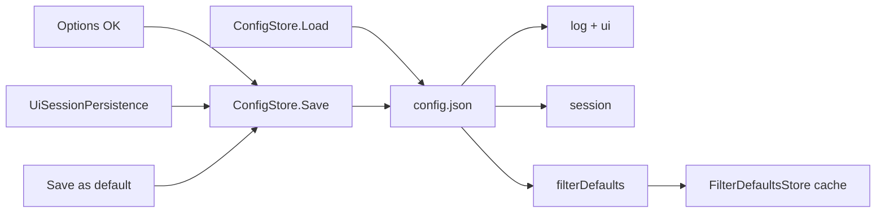

# Unify prefs into config.json

## Decisions (locked)

- **One prefs file:** [`config.json`](../../Mfr.Models/Config/ConfigStore.cs) under `%AppData%/finebytes/mfr/`. Stop reading/writing `session.json` and `filter-defaults.json`.
- **Keep the filename** `config.json` (CLI `--config` / `--set` unchanged).
- **Still separate:** `presets.json` only (named user content, hard-fail, kept on Reset).
- **Document shape** (one current schema only):

```json
{
  "log": { "...": "string leaves as today" },
  "ui": { "confirmationPrompts": "...", "doubleClickAddsToRenameList": "..." },
  "session": { "mainWindow": {}, "fileList": {}, "renameList": {}, "filterEditor": {} },
  "filterDefaults": { "<FilterType>": { /* BaseFilter JSON */ } }
}
```

- `session`: reuse [`SessionState`](../../Mfr.Models/Config/SessionState.cs) DTOs.
- `filterDefaults`: same map as today’s former `filter-defaults.json` `defaults` object (type discriminator → filter snapshot). Omit or `{}` when empty.
- **Load dialect (soft) for the whole prefs file:** missing default AppData file → factory defaults. Corrupt / unreadable → defaults (app continues). Missing keys → field initializers / empty filter-defaults cache. Invalid `log`/`ui` leaf → skip that leaf. Bad filter-default entries → skip those types (same as today). Explicit `--config PATH` missing → hard-fail (CLI typo). Explicit path corrupt → soft to defaults.
- **CLI `--set`:** still hard-fail on bad assignments.
- **Dev cutover:** no migration, no converters, no reading old `session.json` / `filter-defaults.json`, no orphan-delete code. Wipe AppData manually if needed.
- **In-memory API:**
  - [`ConfigStore`](../../Mfr.Models/Config/ConfigStore.cs) owns `Config` + `Session` + opaque `FilterDefaultsJson` and is the **only** writer of `config.json`.
  - [`FilterDefaultsStore`](../../Mfr.Engine/Presets/FilterDefaultsStore.cs) stays the Engine cache/API for get/set/clone-on-add, but **does not own a file path**; load from the `filterDefaults` section after `ConfigStore.Load`, and pin/save merges into that section then `ConfigStore.Save()`.
  - `SessionStore` deleted.
- **Layering:** Keep filter-default JSON as an opaque `JsonObject` on the config document; Engine’s `FilterDefaultsStore` deserializes typed filters from that object (same serializers as today).
- **Write cadence:**
  - Options OK → `ConfigStore.Save()` (whole document).
  - Window close → `UiSessionPersistence` merges layout into `Session`, then `ConfigStore.TrySave()`.
  - Pin / save-as-default → update filter-defaults cache + section, then `ConfigStore.Save()`.
  - `EnsureDefaultFile` → write defaults when missing (`session` / `filterDefaults` empty objects OK).
- **Reset:** [`PersistedConfigurationReset`](../../Mfr.Engine/Config/PersistedConfigurationReset.cs) deletes **only** `config.json` and clears in-memory session / filter-defaults.
- **Docs:** [`AGENTS.md`](../../AGENTS.md) (prefs = soft `config.json`; presets = hard-fail), [`Mfr.App.Ui/README.md`](../../Mfr.App.Ui/README.md), store remarks.

## Why (brief)

`session.json` and `filter-defaults.json` were separate soft-load prefs files for historical / dialect reasons, not because missing keys needed different behavior. Folding both into `config.json` matches MFR7’s single `mfrconfig.xml` prefs surface. Presets stay out: they are libraries of named chains, hard-fail on corrupt, and survive Reset.



## Non-goals

- Any backwards compatibility with `session.json` / `filter-defaults.json`
- Orphan file deletion
- Merging `presets.json` into config
- Soft-loading presets
- Changing Options UX or filter-default UX
- Renaming CLI `--config`
- Rewriting string-leaf `log`/`ui` binding to full STJ

## Phases

### P1 — Store + schema — done

- Extended `ConfigStore` load/save for `session` + opaque `filterDefaults`; soft-load as locked; expose `ConfigStore.Session` + `FilterDefaultsJson`.
- Retargeted `FilterDefaultsStore` to memory + section merge (no file path).
- Removed `SessionStore`.
- Unit tests: round-trip session + one filter default in one file; corrupt file → defaults; missing `--config` path still throws; pin-save rewrites whole config.

### P2 — UI / CLI / Reset wire-up — done

- App / Program: single Load; wire `FilterDefaultsStore` from loaded section.
- `UiSessionPersistence`, Options OK, Applied Filters pin path, `PersistedConfigurationReset` (delete + clear in-memory session/filter-defaults); dropped MainWindow `ConfigFilePath`.
- Tests retargeted to the single prefs file.

### P3 — Docs + AGENTS — done

- `AGENTS.md`, UI README, store remarks: one soft prefs file; Reset deletes `config.json` only (presets kept).
- This plan file under `docs/plans/`.

## Tests (summary)

- Unified save/load for ui + session + filterDefaults.
- Soft corrupt → continue with defaults.
- Existing SessionStore / FilterDefaultsStore / ConfigStore / Options / Reset tests retargeted to the single file.
