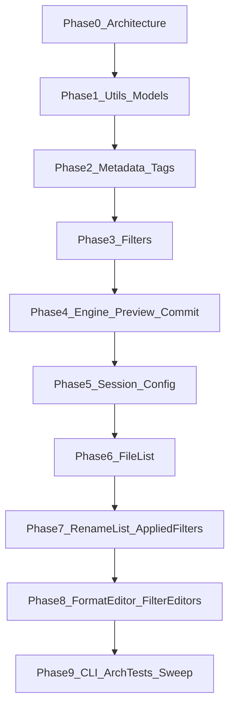

# Whole codebase review (phased)

## Decisions locked

- **Order:** architecture / layering first, then full [`mfr-code-review`](../../.agents/skills/mfr-code-review/SKILL.md) per slice.
- **Per phase:** apply high-confidence fixes in-pass; report remaining findings + cost-to-value-ranked deeper refactors (skill default).
- **Artifact:** this file — phase status + rolling **Deeper refactors backlog**. Do not re-open “already done” items in [`f5-…`](f5-attributes-audio-editors-review-deeper-refactors.md) / [`f6-…`](f6-formateditor-deep-refactors.md).

## Method (every content phase)

1. Scope paths for the phase (project folders + matching `Mfr.Tests/…`).
1. **Architecture check** (lightweight after Phase 0): deps vs [`docs/mfr-folder-layering.md`](../mfr-folder-layering.md); UI `Views → ViewModels → Services`; no second resolver in UI; policy in domain.
1. Run **mfr-code-review** lenses; apply high-confidence fixes; run affected tests + format touched files.
1. Append report section here; promote structural items into the backlog ranked by cost-to-value.
1. Subagents only when skill triggers: `explore` for cross-file twins; `bugbot` on Engine Commit/Preview; `security-review` on path/UNC/session deserialize surfaces.

## Status

| Phase                               | Status   | Notes                                                              |
| ----------------------------------- | -------- | ------------------------------------------------------------------ |
| **0** Architecture / layering       | **done** | Project graph healthy; Services→Views fixed; arch tests tightened  |
| **1** Utils + Models                | **done** | Numeric parity + Windows path chars; TextValues deleted            |
| **2** Metadata + Tags               | **done** | Semantic 0→null; row Compare owners; detector path guard           |
| **3** Filters                       | **done** | Setup caches + exhaustiveness; Formatting tokens OK                |
| **4** Engine Preview/Commit         | **done** | failFast stash; rebase PreviewOk; DirectoryPath ordinal; bugbot OK |
| **5** Session/Config                | **done** | sort DTO merge; Version docs; ConfigStore test isolation           |
| **6** File List                     | **done** | path sentinel reuse; history cap; thumb CTS; explore twins OK      |
| **7** Rename List + Applied Filters | **done** | DnD formats/paths; FS-root helper; OrderedDraft→ListReorder        |
| **8** Format Editor + FilterEditors | **done** | Factory+locator coverage; exhaustiveness; stale dialog test        |
| **9** CLI + arch tests + sweep      | pending  |                                                                    |

______________________________________________________________________

## Phase 0 — Architecture / layering gate (done)

**Goal:** one current picture of allowed deps and known violations before deep cleanup.

### Layer health

| Check                                                                                     | Verdict                                                                                                                                                  |
| ----------------------------------------------------------------------------------------- | -------------------------------------------------------------------------------------------------------------------------------------------------------- |
| `.csproj` ProjectReference graph vs [`mfr-folder-layering.md`](../mfr-folder-layering.md) | **Healthy** — L5→L0 strict; Tests → entry points only                                                                                                    |
| Engine / Filters → Avalonia / App.Ui                                                      | **Clean**                                                                                                                                                |
| Models → TagLib / MetadataExtractor / Metadata / Filters / Engine                         | **Clean**                                                                                                                                                |
| TagLib / MetadataExtractor package ownership                                              | **Clean** — packages only in `Mfr.Metadata` (+ Tests fixtures)                                                                                           |
| Filters TagLib I/O                                                                        | **Clean** — lazy load via Metadata readers only                                                                                                          |
| UI Services → ViewModels                                                                  | **Clean**                                                                                                                                                |
| UI Services → Views                                                                       | **Was broken; fixed**                                                                                                                                    |
| Design doc                                                                                | [`magic-file-renamer-design.md`](../magic-file-renamer-design.md) is an empty stub — use layering + domain docs as truth; **do not invent a design doc** |

**Allowed spine (confirmed):**

`App.Ui / App.Cli → Engine → Filters → Metadata → Models → Utils`

Ui also refs Filters directly (catalog/editors). Cli does not. Engine + Filters both ref Metadata as documented.

### Applied (high confidence)

1. **Services must not take `MainWindow`:** introduced `MainWindowPaneGrids` DTO; `SplitterSession` / `UiSessionPersistence` take Avalonia `Window` + pane grids; `MainWindow.GetPaneGrids()` builds the handle from the view.
1. **Architecture test:** `UiServicesLayerArchitectureTests` now forbids `Mfr.App.Ui.Views` as well as ViewModels.
1. **Doc drift:** `ProjectReferenceArchitectureTests` remarks updated to match current L0–L5 labels (map values were already correct).

### Deferred (later phases / backlog)

| Item                                                                      | Why defer                                                                             |
| ------------------------------------------------------------------------- | ------------------------------------------------------------------------------------- |
| Models JSON/FS I/O (`ConfigStore`, `SessionStore`, `RenameResultSummary`) | Ownership smell, not a layer violation; **kept in Phase 5** (AppData/DTO co-location) |
| `RenameListFieldDisplay` directory scan for folder file-count             | Domain field resolve; Phase 7 if touched                                              |
| `JpegExifThumbnailReader` hand-rolled EXIF in UI Services                 | **Resolved Phase 6 — keep in UI** (ME does not own thumb bytes; L2 move low value)    |
| Fuller UI DAG tests (Views↛Services shortcuts, VM↛Views)                  | Nice-to-have; Phase 9 if still wanted                                                 |
| Forbidden-using / package-ownership arch tests for lower layers           | csproj + spot-check enough for now; Phase 9                                           |

### Phase 0 exit

Layer picture is current; one real UI-internal leak fixed and guarded. Ready for Phase 1 (Utils + Models core).

______________________________________________________________________

## Phase 1 — L0 Utils + L1 Models core (done)

**Scope:** `Mfr.Utils/`, `Mfr.Models/` (Rename, Filters targets/chain, RenameList catalog), matching `Mfr.Tests/Models/` + `Utils/`. Explore subagent used for cross-file twins.

**Verdict:** Core is coherent — one Rename List field schema, FilterChain/`_Setup` contracts sound, no dual persist schemas. Applied drift/dead-code fixes; leftover items are naming collisions and intentional I/O ownership smells.

### Applied (high confidence)

1. **Deleted** dead `TextValues` twin of `DelimitedText` (zero production callers).
1. **Unified File Name Numeric** via `FileNameNumericValue.Extract` (MFR7 `[0-9]{1,10}` + `long.Parse`) — Rename List field + formatter token share one owner (token previously had no 10-digit cap).
1. **Windows path chars:** `WindowsFileNameChars.ContainsInvalidPath`; `FileMetaPreviewExtensions` no longer uses host `Path.GetInvalidPathChars` (Linux CI ↔ Windows product parity).
1. **Docs:** `SessionState.Version` no longer says “migrations”; `PathRelations.SameOnDisk` vs `IsSamePath` trailing-sep difference clarified; `FilterTargetText.TryGet` documents false ≠ empty field.
1. **File rename:** `ContractAssert.cs` → `Contracts.cs` (`Check` / `Require`).
1. **Tests:** `FileNameNumericValueTests`, `WindowsFileNameCharsTests`, `PathRelations` IsSamePath cases, `FileMeta` path-write / illegal-char cases, token 11-digit cap.

### Correctness (found, not changed)

| Item                                                 | Notes                                                                                                                                                                           |
| ---------------------------------------------------- | ------------------------------------------------------------------------------------------------------------------------------------------------------------------------------- |
| “Parent Folder” label collision                      | Apply-To ancestor L1 = segment name; Rename List column = absolute `DirectoryPath`; “Parent Directory” = absolute dir target — MFR7-facing; don’t force one map without UI pass |
| Prefix/extension writes skip Windows name validation | Ancestor segments validate; name parts rely on Cleaner / commit — product choice                                                                                                |
| `FileMeta.Clone` shares Media/Image/Exif refs        | Safe while snapshots stay immutable                                                                                                                                             |

### Deeper refactors (promoted to backlog)

See backlog below (SameOnDisk collapse, FirstDelimitedSegment, folder-file-count I/O, session sort DTO, label maps).

### Phase 1 exit

Utils/Models numeric + path policy aligned; dead twin removed. Ready for Phase 2 (Metadata + Tags).

______________________________________________________________________

## Phase 2 — L2 Metadata + Tags (done)

**Scope:** `Mfr.Metadata/`, `Mfr.Models/Tags/`, docs `audio-tag-model.md` / `image-metadata-model.md`, `Mfr.Tests/Metadata/` + `Mfr.Tests/Models/Tags/`. Explore subagent used for cross-file twins ([Metadata Tags twins](4089d359-8272-4d95-8c6a-4fcf3322505e)).

**Verdict:** Layering matches the design — TagLib/ME stay in Metadata; overlay/semantic/merge/policy stay in Models; field-patch Apply never dual-writes `file.Tag`. Image/EXIF lazy map is coherent and allowlist-gated. Applied numeric clear parity, shared row/frame comparers (killing `\0`-Join drift), detector path hardening, and empty-block prune on ASF/Apple reads. Leftovers are known-key catalogs for Ape/Riff (Xiph already has `XiphKnownKeys`) and optional TagLib open helper.

### Applied (high confidence)

1. **`SemanticFields._ParseNullableUInt`:** `"0"` → `null` (aligned with Id3v1 field IO, projection `_ParseUInt`, and audio-tag-model “never store 0”).
1. **`Id3v1TagData.IsEmpty`:** one owner; SemanticMerge + BlockFieldIo prune through it.
1. **Shared `Compare` on row/frame types:** `TextFieldRow`, `Id3v2ModeledFrame`, `AppleAtomRow`, `AsfDescriptorRow`, `RiffInfoFieldRow` — Metadata TagFields + SemanticMerge + BlockFieldIo (removed divergent `Join('\0')` sorts).
1. **`AudioTagContainerDetector.Detect`:** `RequireExistingRegularFile` (parity with Read/Apply/image opens).
1. **`AsfTagFields.Read`:** empty descriptor list → `null` block (same as other readers).
1. **`AppleTagFields.Read`:** `DelimitedText.TrimNonEmpty` + skip empty value rows.
1. **Exhaustiveness:** `MediaPropertiesReader` MPEG version + `AudioTagContainerPolicy` container switches → `UnreachableException`.
1. **Docs:** `TagBlocksStructurallyEquals` no longer falsely inheritdocs `Equals`; clarifies same contract / named call-site API.
1. **Tests:** `SemanticFieldsTests` zero-clear theory; detector missing-file ArgumentException.

### Correctness (found, not changed)

| Item                                                    | Notes                                                                                                                      |
| ------------------------------------------------------- | -------------------------------------------------------------------------------------------------------------------------- |
| `SemanticFields` year/BPM range                         | No 1–9999 / 1–65535 clamp — `AudioTagSetterFilter` owns product ranges; direct BlockFieldIo Id3v1 year still maxes at 9999 |
| `TagBlocksStructurallyEquals` vs `Equals`               | Same body; Engine prefers the long name for “blocks only” clarity — optional rename later (backlog)                        |
| Live Id3v1 empty (`Id3v1TagFields._IsEffectivelyEmpty`) | TagLib sentinels (`Year == 0`, …) — keep separate from `Id3v1TagData.IsEmpty`                                              |
| Apple binary atoms / freeform catalog                   | Intentionally unmodeled; BPM/track/disc text gaps documented in merge                                                      |
| Image ME allowlist vs TagLib photo tokens               | Separate caches by design (`image-*` / `exif-*` vs `media-photo-*`)                                                        |

### Deeper refactors (promoted to backlog)

See backlog items 17–20 below.

### Phase 2 exit

Metadata I/O + Tags domain hygiene closed; numeric clear and sort/compare ownership fixed. Ready for Phase 5 (Session/Config) — Phases 3–4 already done.

______________________________________________________________________

## Phase 3 — L3 Filters pipeline (done)

**Scope:** `Mfr.Filters/` by group (Formatting tokens/compiler last), `FilterCatalog`, `BaseFilter` setup caches; matching `Mfr.Tests/Models/Filters/`. Explore subagent used for cross-file twins.

**Verdict:** Pipeline is sound — palette reflection + `PresetJsonOptions` stay aligned via existing catalog/polymorphism tests; `_Setup` caches that existed were already unconditional. Applied local setup-cache moves, exhaustiveness, CharacterRun/KISS cleanup, and Counter auto-pad unify. Leftovers are structural (regex compile per replace, sentence-casing twins, ConfigStore line-length, dual JSON registration).

### Applied (high confidence)

1. **Setup caches** for char-set options that rebuilt `HashSet` every transform: `CleanerFilter`, `SpaceAfterFilter`, `SpaceAroundFilter`, `CapitalizeAfterFilter` (unconditional assign / clear-to-null for `with`).
1. **`CharacterRunHelpers`:** regex → linear collapse (Shrink Spaces / Shrink Duplicate Characters).
1. **`AudioTagSetterFilter`:** early-return when no semantic fields configured (skip `EnsureTagLibLoaded` / merge).
1. **Exhaustive switches:** `LettersCaseFilter`, `AttributesSetterFilter`, Media/Image/Mpeg property formatters → `UnreachableException` (no silent fall-through).
1. **Dead `partial`** on `FormatterFilter`; non-nullable compiled `Formatter` fields on Formatter / Inserter / NameList / ReplaceList (drop `Check.NotNull` after setup).
1. **Counter automatic pad-width:** one owner `CounterPadding.ResolveAutomaticPadWidth` — filter and `<counter>` both throw when list counts are missing (was silent no-pad on filter). Follow-up from [Filters cross-file twins](3a7748bf-dc7c-4ea3-9e19-c836c70a17e6).
1. **Tests:** Cleaner + SpaceAfter `with`-clear; CounterFilter missing-count throws; filter suite green.

### Correctness (found, not changed)

| Item                                             | Notes                                                                                                                                                                        |
| ------------------------------------------------ | ---------------------------------------------------------------------------------------------------------------------------------------------------------------------------- |
| `ContainsLikelyFormatTokens` vs always-`Compile` | Inserter / AudioTag / Id3v2 use heuristic literals; Replacer / ReplaceList / Formatter / NameList / PathMover always compile (MFR7 format-string replacements). Intentional. |
| `ListEntryLength` → `ConfigStore`                | Filters read process config max line length; ownership smell → Phase 5                                                                                                       |
| `UppercaseInitialsFilter` SYSLIB1045 disable     | Documented; GeneratedRegex noise — leave                                                                                                                                     |
| Sentence-end defaults                            | Options/JSON/`RenameItem` default `".!?"`; add-to-list `"-.!"` (MFR7). Documented in filter docs — keep                                                                      |
| LettersCase vs CasingList sentence-initial       | Divergent letter/separator rules — backlog #7                                                                                                                                |

### Deeper refactors (promoted to backlog)

See backlog items 6–12 below.

### Phase 3 exit

Filters setup/transform hygiene improved; Formatting registry/compiler coherent. Ready for Phase 4 (Engine Preview/Commit) once Phase 2 is done or explicitly skipped again.

______________________________________________________________________

## Phase 4 — L4 Engine Preview + Commit (done)

**Scope:** `Mfr.Engine/Preview/`, `Commit/`, RenameList Preview/Commit/plan plumbing (not unfinished rename-list UI 14b–16; Presets/Config deferred to Phase 5). Matching `Mfr.Tests/Engine/`. Explore twins + bugbot on uncommitted fixes.

**Verdict:** Preview → rebase → conflict → plan → execute spine is sound and single-owned; UI does not re-plan. Applied fail-fast on stash failure, PreviewOk-only rebase ancestors, ordinal DirectoryPath change rows, and dead-API/doc cleanup. Leftovers are structural twins (ancestor rewrite loops, vacate graph, path-equality naming) and progress-phase labeling.

### Applied (high confidence)

1. **`CommitExecutor` fail-fast on stash failure:** stash errors now set `stopped` when `failFast` (previously only finalize failures did) so cycle partners are not attempted against a path that never vacated.
1. **`RenamePreviewFolderRebaser`:** folder ancestors from `PreviewFolderPathChanges.Collect` restricted to `PreviewOk` (aligned with conflict/planner scoping).
1. **`RenamePropertyChangeBuilder` DirectoryPath:** `OrdinalIgnoreCase` → `Ordinal` so case-only directory renames appear in change rows (matches `IsPreviewPathUnchanged` / `HasPreviewChanges`).
1. **Deleted** unused `RenameItem.IsPreviewPathSameOnDisk` (dead twin of `PathRelations.SameOnDisk` / `DiffersOnlyInCase`).
1. **Docs:** stash is cycle-only (not case-only); case-only commit uses direct `File`/`Directory.Move`; folder-child test summaries updated.
1. **Tests:** stash fail-fast cycle skip; PreviewError folder not used as rebase ancestor; DirectoryPath case-only emits row. Engine suite green (231). Bugbot on uncommitted Engine delta: no findings.

### Correctness (found, not changed)

| Item                                                        | Notes                                                                                              |
| ----------------------------------------------------------- | -------------------------------------------------------------------------------------------------- |
| Preview cancel still plans partial list                     | Documented on `RenameList.Preview`; intentional                                                    |
| Conflict `Exists` not re-checked at commit                  | TOCTOU by design; FS errors become CommitError                                                     |
| `failFast: false` after stash failure                       | Later cycle members may still hit FS errors (same-item finalize skipped via `Status != PreviewOk`) |
| Progress phase `LoadMetadata` used for preview filter apply | UI remaps labels via `RenameListProgressCopy`; enum docs already mention preview                   |
| Case-only commit without temp stash                         | .NET Move accepts same-path different casing on Windows — verified by folder-child tests           |

### Deeper refactors (promoted to backlog)

See backlog items 1 (updated), 13–16 below.

### Phase 4 exit

Engine Preview/Commit risk gate closed with stash fail-fast + rebase scoping fixes. Ready for Phase 5 (Session/Config).

______________________________________________________________________

## Phase 5 — Session / Config / Presets / Reset (done)

**Scope:** `Mfr.Models/Config/` (`ConfigStore`, `SessionStore`, `SessionState`, `MfrConfig`), `Mfr.Utils/Config/`, `Mfr.Engine/Presets/` + `PersistedConfigurationReset`, `Mfr.App.Ui/Services/Session/`, `ListEntryLength` / Reset UI hooks; matching `Mfr.Tests/`. Explore used for twins ([Session Config twins](84b16c9a-f204-495b-b8f7-a3474983f734)). Security-review subagent skipped (empty uncommitted diff); parent self-audited deserialize surfaces.

**Verdict:** Persistence is coherent — one current JSON shape per store, no migration converters, UI session adapters stay thin (no second resolvers). Soft-load (session / filter-defaults) vs hard-fail (config / presets) is intentional product dialect, not a bug. Applied sort-key DTO collapse, Version honesty, defaults-path trim parity, and ConfigStore test isolation. Leftovers are structural (`ListEntryLength`↔`ConfigStore`, dual FilterCatalog/`PresetJsonOptions` registration). Phase 0 Models JSON/FS I/O smell: **keep** (see below).

### Architecture (lightweight)

| Check                                                                     | Verdict                                                                                                                                                                           |
| ------------------------------------------------------------------------- | --------------------------------------------------------------------------------------------------------------------------------------------------------------------------------- |
| Project refs vs layering                                                  | **Healthy** — Config binder in L0 Utils; stores + DTOs in L1 Models; presets/reset in L4 Engine; UI Session services → Models only                                                |
| UI `Views → ViewModels → Services`                                        | **Clean** — `UiSessionPersistence` / `WindowSession` / `SplitterSession` / `FileListSessionSnapshot` take Window + DTOs, not Views                                                |
| Models JSON/FS I/O (`ConfigStore`, `SessionStore`, `RenameResultSummary`) | **Keep** — not a layer violation; AppData + CLI result JSON sit next to domain DTOs shared by Cli/Ui. Moving to Engine is churn without clearer ownership. Documented smell only. |
| Filters → `ConfigStore` (`ListEntryLength`)                               | **Smell retained** — backlog #9                                                                                                                                                   |

### Security (self-audit)

| Surface                       | Notes                                                                                                                               |
| ----------------------------- | ----------------------------------------------------------------------------------------------------------------------------------- |
| Session STJ                   | Concrete sealed DTOs; no polymorphism; corrupt → empty session                                                                      |
| Config binder                 | Annotated fields only; leaf values are JSON strings; invalid → throw                                                                |
| Preset / filter-defaults poly | Allowlisted `BaseFilter` derived types only (`PresetJsonOptions`); unknown discriminator skipped (defaults) or fails load (presets) |
| Paths                         | Default AppData roots; explicit paths are caller-supplied (tests/CLI); no traversal gadget in stores                                |

### Applied (high confidence)

1. **Merged** `SessionStateRenameListSortField` into `RenameListSortKey` (`JsonPropertyName` `key` / `descending`) — one type for domain + `session.json` `sortFields`; deleted bridge `ToSortKeys` / `FromSortKeys`.
1. **`SessionState.Version` docs** honesty (not a migrate/reject gate); normalize `<= 0` → `1` on load (parity with save).
1. **`FilterDefaultsStore.DeleteFileAt`** trims explicit paths (parity with Session/Config resolve).
1. **`PresetJsonOptions` docs** — no longer claims “single source of truth” vs `FilterCatalog`.
1. **ConfigStore tests:** `ConfigStoreCollection` (DisableParallelization) + EnsureDefaultFile asserts on file JSON (avoids singleton race flake).
1. **Tests:** session sort round-trip via `RenameListSortKey`; version normalize fact; VM/helpers updated.

### Correctness (found, not changed)

| Item                          | Notes                                                                         |
| ----------------------------- | ----------------------------------------------------------------------------- |
| Soft vs hard load             | Session/defaults soft-empty; config/presets throw — product intent            |
| `Version` unused as gate      | STJ ignore-unknown + CLR defaults; no remaps (AGENTS policy)                  |
| `SessionStore.TrySave`        | Test-facing; UI `SaveOnClose` uses `Save` inside its own catch                |
| Reset leaves `presets.json`   | Documented MFR7 parity                                                        |
| ConfigStore process singleton | Still global; collection serializes mutator tests — not a production redesign |

### Deeper refactors (promoted / updated)

See backlog: **#4 done**; **#9 / #10** refined (still open); **#21–#22** added.

### Phase 5 exit

Session/config/presets/reset hygiene closed; sort persist type unified. Ready for Phase 6 (File List).

______________________________________________________________________

## Phase 6 — File List services + UI (done)

**Scope:** `Mfr.App.Ui/ViewModels/FileList/`, `Views/FileList/`, `Services/FileList/`; matching `Mfr.Tests/Ui/FileList/` (+ Thumbnails / `RenameListAddSourceResolver` bridge). Explore used for cross-file twins ([File List twins](7aa8d555-fbca-4f79-bfc0-860f2f58892c)). `debts.md` shell ops (Cut/Copy/Paste/Delete, Properties) — **still accurate**, not implemented.

**Verdict:** File List is coherent — single browse resolver (`FileListCatalog.TryResolvePath`), breadcrumb policy in `FileListPath`, Views → VM → Services clean, no second catalog in UI. Applied sentinel/persistable-folder reuse, path-history cap, thumbnail CTS safety, decode-width ownership, and listing-host dedup. Leftovers are cross-pane DnD twins and optional root-gate / shell-opener unification (Phase 7+). Phase 0 `JpegExifThumbnailReader` L2 move: **skip** (see below).

### Architecture (lightweight)

| Check                                      | Verdict                                                                                                                                                        |
| ------------------------------------------ | -------------------------------------------------------------------------------------------------------------------------------------------------------------- |
| Project refs vs layering                   | **Healthy** — File List services stay Avalonia/UI; no Engine/Metadata package leak                                                                             |
| UI `Views → ViewModels → Services`         | **Clean** — catalog/path/icons/shell in Services; VM binds; Views own gestures                                                                                 |
| Second resolver in UI                      | **None** — navigate / locate / start path all call `FileListCatalog.TryResolvePath`                                                                            |
| `JpegExifThumbnailReader` vs Metadata EXIF | **Keep in UI** — binary IFD1 thumb for Avalonia decode; ME maps tag fields, does not own preview bytes. Optional L2 move is low value / Avalonia coupling risk |
| Views → Views (`InternalReorderFormat`)    | **Smell retained** — backlog #23                                                                                                                               |
| `debts.md` File List context menu          | **Still accurate** — Cut/Copy/Paste/Delete + Properties deferred; view-mode radios intentionally menu-only                                                     |

### Applied (high confidence)

1. **`IsFilesystemFolderPath(string?)`** — one sentinel gate; `UiSessionPersistence._IsPersistableFolder` and `RenameListAddSourceResolver.CanAddAllFrom` reuse it (+ `Directory.Exists` for persist).
1. **Path history cap** (`_MaxRememberedPaths = 20`) — parity with mask suggestions; stops unbounded address-bar / Network-seed growth.
1. **`FileListThumbnailSession.BeginLoad`** calls `CancelLoad` first — no leaked CTS on overlapping passes.
1. **`ThumbnailSizes.Huge = ImageThumbnailLoader.DecodeWidth`** — one decode-width constant (test already asserted equality).
1. **`FormatListingError`** exhaustive → `UnreachableException` (no silent default string).
1. **`FileListView._ActiveListingHost`** — one owner for view-mode → control; selection sync / active-sender share it.
1. **Tests:** `NavigateTo_Keeps_Only_Last_20_Paths`. File List + Thumbnails + AddSourceResolver: **142 passed**.

### Correctness (found, not changed)

| Item                                                       | Notes                                                                                 |
| ---------------------------------------------------------- | ------------------------------------------------------------------------------------- |
| Path history does not promote on revisit                   | Unlike masks; behavior change → optional later                                        |
| Network listing timeout leaves uncancellable SMB work      | Documented; ContinueWith observes faults                                              |
| Failed thumbnail decode cached as null until folder reload | Intentional (avoid hammering bad files)                                               |
| UI root reject vs Engine `_ThrowIfRootPath`                | Complementary gates; extract shared “is FS root?” only if touching both (backlog #25) |

### Deeper refactors (promoted / updated)

See backlog **#23–#26** below. JpegExif L2: **do not** — keep under What to keep.

### Phase 6 exit

File List hygiene closed; browse ownership confirmed. Ready for Phase 7 (Rename List + Applied Filters / Palette).

______________________________________________________________________

## Phase 7 — Rename List UI + Applied Filters / Palette (done)

**Scope:** `Mfr.App.Ui` Rename List + Applied Filters + Filter Palette (ViewModels / Views / Services); matching `Mfr.Tests/Ui/RenameList|AppliedFilters|FilterPalette`. Explore subagent used for DnD + label-map twins ([DnD twins](3c2d6d02-da59-4607-bf7b-05d797f7270c)). Respect open [`rename-list-ui.plan.md`](rename-list-ui.plan.md) **14b–16** — shipped code only; no GO/export/manual-rename feature work.

**Verdict:** Shipped Rename List / Applied Filters / Palette is coherent — Views → ViewModels → Services, ListBox DnD already shared, add-source soft-gate complements Engine hard-reject, progress UI remaps preview labels over `LoadMetadata`. Applied high-value DnD ownership fixes (#23–#24), shared FS-root helper (#25), OrderedDraft→`ListReorder`, and FileCount docs. Leftovers are optional DataGrid session merge, progress enum honesty, and product-gated label catalogs.

### Architecture (lightweight)

| Check                                | Verdict                                                                                     |
| ------------------------------------ | ------------------------------------------------------------------------------------------- |
| Views → ViewModels → Services        | **Clean**                                                                                   |
| Services → Views                     | **Clean**                                                                                   |
| File List → Rename List Views import | **Was smell; fixed** — `RenameListDragFormats` under `Views/DragAndDrop`                    |
| Domain policy in UI                  | **Clean** — add expansion stays in Engine; UI only maps rows→sources                        |
| Second resolver / label maps         | Apply-To vs Rename List labels diverge by product (MFR7); do not merge without UI pass (#5) |
| Open feature phases 14b–16           | **Untouched**                                                                               |

### Applied (high confidence)

1. **`RenameListDragFormats.InternalReorder`** — moved format out of `RenameListView`; File List drag-back no longer imports Rename List.
1. **`LocalFileDrop.HasFiles` / `ReadLocalPaths`** — one owner; `FilterEditorFileDrop` + Rename List grid drop call it.
1. **`PathRelations.IsFilesystemRoot`** — UI soft-catch + Engine `_ThrowIfRootPath` share the root rule.
1. **`OrderedDraft.TryMoveIndicesTo`** — delegates to `ListReorder.TryMoveIndicesTo` (selection tracking kept).
1. **`FormatFolderFileCount` remarks** — documents live `GetFiles` on resolve/sort paint (intentional MFR7 cost).
1. **Tests:** `PathRelationsTests.IsFilesystemRoot_*`; Rename List helpers updated for new format.

### Correctness (found, not changed)

| Item                                                                                                   | Notes                                                                                                       |
| ------------------------------------------------------------------------------------------------------ | ----------------------------------------------------------------------------------------------------------- |
| Progress phase `LoadMetadata` for preview filter apply                                                 | Enum docs + `RenameListProgressCopy` remapping are honest enough; optional `ApplyPreview` stays backlog #15 |
| Apply-To “Ancestor Folder” option vs `GetLabel` “Parent Folder” (level 1) vs “Parent Directory” target | Confusing trio; MFR7-facing — don’t rename without UI pass                                                  |
| Semantic audio Apply-To vs Rename List display names                                                   | Artist/Performers etc. diverge; product vocabulary (#5)                                                     |
| Grid DnD press/snapshot fork (File List vs Rename List)                                                | Small asymmetry (Rename re-applies snapshot on move); optional `DataGridDragSession` (#26)                  |

### Deeper refactors (promoted / refined)

See backlog: #3 FileCount cache demoted after docs; #15 kept; #23–#25 **done**; #26 DataGrid session retained; **#27** drop-mark brush; **#28** palette group exhaustiveness.

### Phase 7 exit

Rename List + Applied Filters / Palette hygiene closed; DnD Views→Views leak fixed. Ready for Phase 8 (Format Editor + FilterEditors).

______________________________________________________________________

## Phase 8 — Format Editor + FilterEditors (done)

**Scope:** Format Editor (`ViewModels/Views/FormatEditor`, token editors) + `FilterEditors/<FilterGroup>/`; matching `Mfr.Tests/Ui/FilterEditors|FormatEditor`. Explore used for cross-file twins ([Format/Filter twins](68959676-c553-4061-8dfc-7917202273e2)). Respect f5/f6 already-done items (do not re-open Date/Time merge, Attributes radios, Tag Remover catalog UI, FormatStringScan walk, nested `source=` FormatEditor, etc.).

**Verdict:** Format Editor + Filter Configuration editors are coherent — Views → ViewModels, live option replace via shared `LoadWithoutApplying` / `ApplyIfChanged`, convention ViewLocators, no second domain options resolver in Views. Applied factory/locator completeness (#11), dead drop wrappers, exhaustiveness, and stale dialog alignment test. Leftovers are structural (named-arg parse twin from f6, inclusive position helpers, ViewLocator merge).

### Architecture (lightweight)

| Check                         | Verdict                                                                                   |
| ----------------------------- | ----------------------------------------------------------------------------------------- |
| Views → ViewModels → Services | **Clean** — editors bind VMs; folder picker / file-drop are view glue                     |
| Second resolver in UI         | **None** for filter options — factory + registry own “who has an editor”; Views only host |
| Domain policy in UI           | **Clean** — parsers / clamp / Compile stay in Filters; UI soft-parse for dialogs          |
| f5/f6 already-done            | **Untouched**                                                                             |

### Applied (high confidence)

1. **`FilterOptionsEditorFactory` completeness tests** — option-bearing catalog types must get a non-null editor; optionless allowlist gated; ViewLocator resolves every factory editor (`FilterOptionsEditorFactoryTests`). Closes backlog **#11**.
1. **Deleted** unused `FilterEditorFileDrop.HasFiles` / `ReadLocalPaths` wrappers — Path Mover calls `LocalFileDrop` directly inside folder-drop handlers.
1. **Exhaustiveness:** `VisualTrimHelperViewModel` mode switch, `SpaceCharacterFilterEditorViewModel._ResolveSpaceCharacter`, `CountFilterEditorViewModel` tooltip/mode → `UnreachableException` (no silent defaults).
1. **Stale host test:** `Non_string_filter_shows_title_only` → `Tag_remover_loads_options_editor` (Tag Remover has an options body).
1. **Stale FormatTokenEditor dialog test:** FieldsetGroup layout no longer uses a labeled “Resulting format string” row — updated to assert Format ↔ Preview SharedSizeGroup alignment.
1. **Tests:** FilterEditors + FormatEditor suites **251 passed**.

### Correctness (found, not changed)

| Item                                                     | Notes                                                                                                  |
| -------------------------------------------------------- | ------------------------------------------------------------------------------------------------------ |
| Space Character Other + empty → `\0`                     | Intentional; filter setup throws (MFR7) — do not silently fall back to space (f5 follow-up superseded) |
| `ReplaceList` `parseEntries: false` on match-flag change | Avoids lossy re-parse when search contains `=>`                                                        |
| Named-arg parse twin still duplicated                    | Soft dialog vs Compile throw dialects — backlog **#29** (f6 #1)                                        |
| Inclusive left/right index twins                         | TrimBetween `Side` ↔ ApplyScope `StringScopeAnchor`; Inserter insert-before stays separate — **#12**   |
| Counter filter UI vs `<counter>` token UI                | Surfaces differ; `CounterPadding` already shared (Phase 3)                                             |

### Deeper refactors (promoted / updated)

See backlog: **#11 done**; **#12** refined; **#27–#28** unchanged; **#29–#31** added from Phase 8 / f6 carry-in.

### Phase 8 exit

Format Editor + FilterEditors hygiene closed; factory silent-null footgun gated. Ready for Phase 9 (CLI + arch tests + backlog/debts sweep).

______________________________________________________________________

## Deeper refactors backlog

Ranked cost-to-value. Do not duplicate f5/f6 “already done.”

1. **Collapse or rename `SameOnDisk` vs `IsSamePath`**
   Sites: `PathRelations`; callers in Engine / Ui (dead `IsPreviewPathSameOnDisk` removed in Phase 4)
   Target: one equality API + explicit trim overload, or keep both with names that cannot be confused
   Value: closes trailing-sep footgun
   Cost: medium churn across Engine/Ui
   Rank: medium — Phase 7 if touched; Engine callers already deliberate

1. **`FirstDelimitedSegment` → `DelimitedText` only if empty-first semantics match**
   Sites: `RenameListFieldDisplay.FirstDelimitedSegment` vs `DelimitedText.Split` (AudioTag first-segment fields)
   Target: shared first-part helper **only if** `" ; Bob"` empty-first behavior is acceptable
   Value: small dedup
   Cost: low, but behavior risk
   Rank: medium — Phase 7 if AudioTag display touched

1. **Move or lazy-gate `FormatFolderFileCount` directory scan** — **docs Phase 7**
   Sites: `RenameListFieldDisplay.FormatFolderFileCount`
   Target: remarks now document live `GetFiles` on resolve/sort paint (MFR7 FileCount). Optional cache only if measured cost.
   Value: paint/sort side effects
   Cost: medium (Engine/UI cache?)
   Rank: low–medium — skip unless profiling shows FileCount column hot

1. **`SessionStateRenameListSortField` vs `RenameListSortKey`** — **done Phase 5**
   Applied: persist `RenameListSortKey` directly (`key` / `descending`); bridge type deleted.

1. **Shared Apply-To / Rename List / Picard display labels**
   Sites: `FilterTargetCatalog` vs `AudioTagRenameListFields` vs `AudioCatalogFieldMaps`
   Target: optional Models display catalog — only if labels should converge
   Value: unclear (MFR7 may want divergent labels)
   Cost: high
   Rank: low — skip unless UI pass demands it

1. **Cache compiled regex in Replacer / ReplaceList setup**
   Sites: `ReplacerMatching.ReplaceSegment` builds `new Regex` every call; filters already `_Setup`
   Target: compile pattern (+ flags) once in `_Setup`, reuse in transform (list = one regex per entry)
   Value: preview cost on large lists
   Cost: medium — mode/flags/`with` must invalidate; WholeWord wrapping
   Rank: medium — do when profiling preview or touching Replace

1. **Sentence-initial uppercasing twin**
   Sites: `LettersCaseFilter._ApplySentenceCase` vs `CasingListFilter._UppercaseSentenceInitials` (ASCII-letter vs `IsLetter` nuance)
   Target: one shared helper **only if** MFR7 parity allows unifying letter detection
   Value: one behavior for sentence starts
   Cost: medium behavior risk
   Rank: medium — Case group only if product wants one rule

1. **`AudioTagSetterFilter` PascalCase private formatter fields**
   Sites: `PerformersFormatter`, `TitleFormatter`, …
   Target: `_performersFormatter`-style names (or a field→formatter map)
   Value: naming clarity; optional map reduces ApplyCore boilerplate
   Cost: medium churn in one large file
   Rank: low–medium — rename anytime; map only if editing the filter again

1. **`ListEntryLength` / max line length off `ConfigStore`**
   Sites: `ListEntryLength`; Name/Replace/Casing list parsers; `MfrConfig.FilterConfig.MaxListFileLineLength`
   Target: inject max length into parsers at setup, or Filters-owned options snapshot filled at process start (avoid live `ConfigStore.Config` reads during transform/parse)
   Value: clearer L3 ownership; testability without process singleton; pairs with ConfigStore isolation
   Cost: medium — parser/filter call-site + CLI override wiring
   Rank: medium — next time touching list parsers or config reshape (Phase 5 kept coupling)

1. **Generate `PresetJsonOptions` derived types from `FilterCatalog` discovery**
   Sites: `FilterCatalog` reflection vs `PresetJsonOptions.s_BaseFilterDerivedTypes` (drift gated by `FilterCatalogTests`)
   Target: one registration owner (generate JSON list from palette types, or reverse)
   Value: closes permanent dual-list surface
   Cost: medium Engine/Filters wiring
   Rank: medium — Phase 9 sweep or when adding many filters

1. **`FilterOptionsEditorFactory` completeness vs option-bearing catalog types** — **done Phase 8**
   Applied: `FilterOptionsEditorFactoryTests` (option-bearing ↔ non-null editor; optionless allowlist; ViewLocator for every factory editor).

1. **Shared inclusive left/right string-position helper**
   Sites: `SubstringApplyScope` / `StringApplyScopeTransform._ResolveIndex` ↔ `TrimBetweenFilter._GetAbsoluteIndex` (`Side` vs `StringScopeAnchor`); `<substr>` signed positions stay separate
   Target: one Models/Filters helper for inclusive left/right 1-based → 0-based; **do not** merge Inserter `_ComputeInsertIndex` (insert-before / append dialect)
   Value: one place for clamp/anchor bugs on slice endpoints
   Cost: medium behavior risk; enum unify optional
   Rank: medium — ride along when next touching ApplyScope or Trim Between

1. **Shared innermost-ancestor rewrite helper**
   Sites: `RenamePreviewFolderRebaser._RebaseItemAgainstAncestors` ↔ `CommitPlanner._ResolveActualSourcePath`
   Target: one `ApplyInnermostAncestorRewrites(path, ancestors, matchPredicate)` with call-site selectors (preview-dir vs original-fullpath)
   Value: closes compose-order / ReplaceAncestor drift
   Cost: medium — two match dialects must stay explicit
   Rank: medium — do when next touching rebase or planner

1. **Vacate policy vs path-shift / containment edges**
   Sites: `PreviewConflictDetector._WillBeVacatedByBatch` ↔ `CommitPlanner` path-shift + containment
   Target: optional shared “batch path graph” helper, or documented invariant tests that conflict vacate ≡ planner order assumptions
   Value: prevents silent preview-ok / commit-fail drift
   Cost: medium–high behavior risk
   Rank: medium — add invariant tests first if touching either side

1. **Preview progress phase naming**
   Sites: `RenameListProgressPhase.LoadMetadata` used for filter apply; `RenameListProgressCopy` remaps UI titles
   Target: add `ApplyPreview` (or rename) so engine enum matches work; update UI binding
   Value: removes papered-over phase lie
   Cost: low–medium enum + UI/tests
   Rank: medium — Phase 7 reviewed; UI remapping adequate; do when next editing Engine progress tracker

1. **Path split + preview-field reset helpers**
   Sites: `RenameItemSnapshotBuilder` ↔ `FileMetaPreviewExtensions.SetFromAbsoluteFullPath`; `ResetState` ↔ `ClearPreview`
   Target: shared path-dissection helper; private reset-of-preview-fields on `RenameItem`
   Value: small dedup / fewer clone-reset omissions
   Cost: low–medium Models churn
   Rank: low–medium — ride along when editing add/refresh or RenameItem

1. **`ApeKnownKeys` / `RiffInfoKnownKeys` (mirror `XiphKnownKeys`)**
   Sites: `ApeTagFields._KnownKeys` + alias map; `RiffInfoTagFields._KnownKeys`; hardcoded keys in `SemanticAudioTag` / `AudioTagSemanticMerge`
   Target: Models-owned known-key lists (+ Ape alias fold) used by Metadata read and merge/projection
   Value: closes key-list drift (Xiph already has one owner)
   Cost: medium — Metadata + Models + Filter Options Apply-To if exposed
   Rank: medium — do when next touching Ape/Riff field IO

1. **TagLib open helper**
   Sites: `AudioTagPersistence` / `TagLibFileReader` / `MediaPropertiesReader` / `AudioTagContainerDetector` (`RequireExistingRegularFile` + `LocalFileAbstraction`)
   Target: internal `TagLibFileOpen.OpenExisting(path)` (or similar) in Metadata
   Value: one open/guard pattern
   Cost: low churn, Metadata-only
   Rank: medium — ride along when next editing persistence opens

1. **Collapse `TagBlocksStructurallyEquals` onto `Equals`**
   Sites: `AudioTagOverlay`; Engine `RenamePropertyChangeBuilder` uses structural name
   Target: keep `Equals` only, or obsolete the long alias
   Value: one public name
   Cost: low call-site rename
   Rank: low — optional clarity pass

1. **Wire catalog maps to existing key constants**
   Sites: `AudioCatalogFieldMaps` re-lists `MUSICBRAINZ_*` / ASF `"MusicBrainz/…"` already on `XiphKnownKeys` / `AsfDescriptorNames`
   Target: reference those constants from the catalog rows (do not collapse the catalog table)
   Value: string-literal drift closed for catalog IDs
   Cost: low
   Rank: medium — ride along with #17 or catalog edits

1. **Shared AppData delete-if-exists helper**
   Sites: `ConfigStore.DeleteDefaultFile`, `SessionStore.Delete`, `FilterDefaultsStore.DeleteFileAt`
   Target: one small `AppDataFile.DeleteIfExists(path, errorMessage)` (or Models helper)
   Value: tiny dedup of identical try/delete wrappers
   Cost: low; three call sites
   Rank: low — cosmetic; skip unless touching all three

1. **Unify soft-load / hard-fail documentation (not behavior)**
   Sites: `SessionStore` / `FilterDefaultsStore` soft-empty vs `ConfigStore` / `PresetManager` throw
   Target: short remarks cross-links stating intentional dialects; do **not** unify failure modes without product change
   Value: onboarding clarity
   Cost: docs only
   Rank: low — docs pass anytime

1. **Move Rename List internal drag format out of `RenameListView`** — **done Phase 7**
   Applied: `RenameListDragFormats.InternalReorder` under `Views/DragAndDrop`; File List no longer imports Rename List.

1. **Shared local file-drop path reader** — **done Phase 7**
   Applied: `LocalFileDrop.HasFiles` / `ReadLocalPaths`; `FilterEditorFileDrop` + Rename List call it.

1. **Shared “filesystem root?” gate for add sources** — **done Phase 7**
   Applied: `PathRelations.IsFilesystemRoot`; UI soft-catch + Engine `_ThrowIfRootPath` throw dialect retained.

1. **DataGrid multi-select drag press/snapshot session**
   Sites: `FileListView` + `RenameListView` DataGrid press/threshold/snapshot vs `ListBoxDragSession`
   Target: optional DataGrid-aware session sibling (same Avalonia collapse fix); payloads stay pane-specific
   Value: one gesture machine for grids; fewer press-collapse bugs
   Cost: medium–high — two large code-behinds; careful headless coverage
   Rank: medium — do when next editing either grid DnD; do not force a merge for elegance alone

1. **Shared salmon drop-mark brush**
   Sites: `ListBoxDropMark`, Rename List grid append mark, theme `RenameListDropIndicatorBrush` / `#FA8072` fallbacks
   Target: one brush resource (or constant) for insert indicators
   Value: tiny visual drift closed
   Cost: low — resources + 2–3 call sites
   Rank: low — cosmetic; ride along if touching drop marks

1. **FilterPalette group toolbar vs `FilterGroup` exhaustiveness**
   Sites: `FilterPaletteViewModel` hardcoded `Groups` list vs `FilterGroup` enum / `FilterCatalog`
   Target: UI/architecture test that every `FilterGroup` has a toolbar button (All stays separate)
   Value: silent missing-group footgun when a new filter group lands
   Cost: low test
   Rank: medium — Phase 9 or when adding a FilterGroup

1. **Share named-arg parse with Filters** (f6 #1 carry-in)
   Sites: `NamedFormatOptionsBuilder` (`TryParse` / `_SplitNamedArgumentSegments`) ↔ `FormatOptionsParsing.SplitNamedArgumentSegments` / `ParseNamedKeyValuePairs`
   Target: one public owner in `Mfr.Filters` (or Utils); UI wraps throw→bool and keeps Join / FormatInt / FormatBool / soft Get helpers
   Value: dialog OK and Compile cannot drift on nested `source=<…>` / `key=value` rules
   Cost: medium — public API + Filters tests; keep soft dialog defaults separate from Compile throws
   Rank: high — best remaining Phase 8 structural win; do when next touching FormatEditor tokens or named options

1. **Merge convention ViewLocators**
   Sites: `FilterEditorViewLocator` ↔ `FormatTokenEditorViewLocator` (near-identical namespace suffix rewrite)
   Target: one generic `ConventionViewLocator` (VM ns prefix → View ns prefix) parameterized by match type
   Value: delete ~80 LOC twin; one place for naming-convention bugs
   Cost: low–medium Avalonia template wiring + two test suites
   Rank: medium — ride along when adding another convention locator

1. **Multiline list Entries fieldset control** (f5 #6 carry-in)
   Sites: Name List + Replace List Entries AXAML fieldsets (Casing List is space-separated — not a twin)
   Target: shared multiline Entries control / hint chrome where semantics match
   Value: less AXAML drift
   Cost: medium
   Rank: medium — only if Entries layout keeps churning

______________________________________________________________________

## Remaining phase briefs

### Phase 6 — File List (services + UI) — **done**

See report above. `debts.md` shell ops remain deferred.

### Phase 7 — Rename List UI + Applied Filters / Palette — **done**

See report above. Open rename-list feature phases 14b–16 untouched.

### Phase 8 — Format Editor + FilterEditors — **done**

See report above. f5/f6 already-done items not re-litigated.

### Phase 9 — CLI + architecture tests + sweep

**Scope:** CLI, arch tests, backlog triage, `debts.md` refresh if needed.

## Out of scope

- Finishing open feature plan phases (rename-list 14b–16, etc.) unless a review fix is required for correctness.
- Writing a full design doc into the empty stub unless asked separately.
- Re-litigating completed f5/f6 “already done” items.
