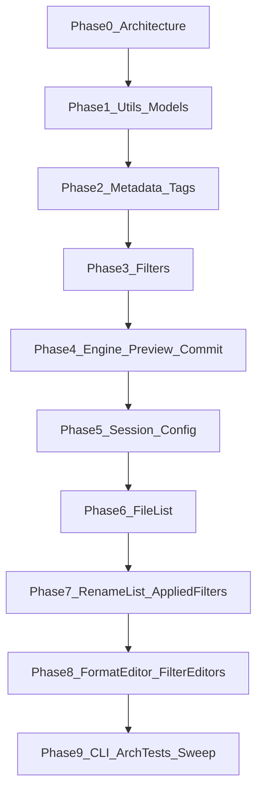

# Whole codebase review (phased)

## Decisions locked

- **Order:** architecture / layering first, then full [`mfr-code-review`](../../.agents/skills/mfr-code-review/SKILL.md) per slice.
- **Per phase:** apply high-confidence fixes in-pass; report remaining findings + cost-to-value-ranked deeper refactors (skill default).
- **Artifact:** this file — phase status + rolling **Deeper refactors backlog**. Do not re-open “already done” items in [`f5-…`](f5-attributes-audio-editors-review-deeper-refactors.md) / [`f6-…`](f6-formateditor-deep-refactors.md).

## Method (every content phase)

1. Scope paths for the phase (project folders + matching `Mfr.Tests/…`).
1. **Architecture check** (lightweight after Phase 0): deps vs [`docs/mfr-folder-layering.md`](../mfr-folder-layering.md); UI `Views → ViewModels → Services`; no second resolver in UI; policy in domain.
1. Run **mfr-code-review** lenses; apply high-confidence fixes; run affected tests + format touched files.
1. Append report section here; promote structural items into the backlog ranked by cost-to-value.
1. Subagents only when skill triggers: `explore` for cross-file twins; `bugbot` on Engine Commit/Preview; `security-review` on path/UNC/session deserialize surfaces.

## Status

| Phase                               | Status   | Notes                                                             |
| ----------------------------------- | -------- | ----------------------------------------------------------------- |
| **0** Architecture / layering       | **done** | Project graph healthy; Services→Views fixed; arch tests tightened |
| **1** Utils + Models                | pending  | Next                                                              |
| **2** Metadata + Tags               | pending  |                                                                   |
| **3** Filters                       | pending  |                                                                   |
| **4** Engine Preview/Commit         | pending  |                                                                   |
| **5** Session/Config                | pending  |                                                                   |
| **6** File List                     | pending  |                                                                   |
| **7** Rename List + Applied Filters | pending  |                                                                   |
| **8** Format Editor + FilterEditors | pending  |                                                                   |
| **9** CLI + arch tests + sweep      | pending  |                                                                   |

______________________________________________________________________

## Phase 0 — Architecture / layering gate (done)

**Goal:** one current picture of allowed deps and known violations before deep cleanup.

### Layer health

| Check                                                                                     | Verdict                                                                                                                                                  |
| ----------------------------------------------------------------------------------------- | -------------------------------------------------------------------------------------------------------------------------------------------------------- |
| `.csproj` ProjectReference graph vs [`mfr-folder-layering.md`](../mfr-folder-layering.md) | **Healthy** — L5→L0 strict; Tests → entry points only                                                                                                    |
| Engine / Filters → Avalonia / App.Ui                                                      | **Clean**                                                                                                                                                |
| Models → TagLib / MetadataExtractor / Metadata / Filters / Engine                         | **Clean**                                                                                                                                                |
| TagLib / MetadataExtractor package ownership                                              | **Clean** — packages only in `Mfr.Metadata` (+ Tests fixtures)                                                                                           |
| Filters TagLib I/O                                                                        | **Clean** — lazy load via Metadata readers only                                                                                                          |
| UI Services → ViewModels                                                                  | **Clean**                                                                                                                                                |
| UI Services → Views                                                                       | **Was broken; fixed**                                                                                                                                    |
| Design doc                                                                                | [`magic-file-renamer-design.md`](../magic-file-renamer-design.md) is an empty stub — use layering + domain docs as truth; **do not invent a design doc** |

**Allowed spine (confirmed):**

`App.Ui / App.Cli → Engine → Filters → Metadata → Models → Utils`

Ui also refs Filters directly (catalog/editors). Cli does not. Engine + Filters both ref Metadata as documented.

### Applied (high confidence)

1. **Services must not take `MainWindow`:** introduced `MainWindowPaneGrids` DTO; `SplitterSession` / `UiSessionPersistence` take Avalonia `Window` + pane grids; `MainWindow.GetPaneGrids()` builds the handle from the view.
1. **Architecture test:** `UiServicesLayerArchitectureTests` now forbids `Mfr.App.Ui.Views` as well as ViewModels.
1. **Doc drift:** `ProjectReferenceArchitectureTests` remarks updated to match current L0–L5 labels (map values were already correct).

### Deferred (later phases / backlog)

| Item                                                                      | Why defer                                                  |
| ------------------------------------------------------------------------- | ---------------------------------------------------------- |
| Models JSON/FS I/O (`ConfigStore`, `SessionStore`, `RenameResultSummary`) | Ownership smell, not a layer violation; revisit in Phase 5 |
| `RenameListFieldDisplay` directory scan for folder file-count             | Domain field resolve; Phase 1 or 7 if touched              |
| `JpegExifThumbnailReader` hand-rolled EXIF in UI Services                 | No ME package leak; optional L2 move — Phase 6             |
| Fuller UI DAG tests (Views↛Services shortcuts, VM↛Views)                  | Nice-to-have; Phase 9 if still wanted                      |
| Forbidden-using / package-ownership arch tests for lower layers           | csproj + spot-check enough for now; Phase 9                |

### Phase 0 exit

Layer picture is current; one real UI-internal leak fixed and guarded. Ready for Phase 1 (Utils + Models core).

______________________________________________________________________

## Deeper refactors backlog

Ranked cost-to-value. Empty until content phases add items. Do not duplicate f5/f6 “already done.”

_(none yet)_

______________________________________________________________________

## Remaining phase briefs

### Phase 1 — L0 Utils + L1 Models core

**Scope:** `Mfr.Utils/`, `Mfr.Models/` (esp. `Rename/`, `Filters/` targets/chain, `RenameList/` field catalog), matching tests under `Mfr.Tests/Models/`, `Utils/`.

**Focus:** path helpers / Windows name chars; `FilterTargetText` / `Targets` / `FileMeta`; FilterChain contracts; `_Setup` cache `with`-copy policy if touched via Models; no dual persisted schemas.

### Phase 2 — L2 Metadata + Tags

**Scope:** `Mfr.Metadata/`, `Mfr.Models/Tags/`, docs `audio-tag-model.md` / `image-metadata-model.md`, `Mfr.Tests/Metadata/`.

### Phase 3 — L3 Filters pipeline

**Scope:** `Mfr.Filters/` by group (Formatting tokens/compiler **last**), `FilterCatalog`, `BaseFilter` setup caches.

### Phase 4 — L4 Engine Preview + Commit (risk gate)

**Scope:** Preview / Commit / RenameList engine; prefer `bugbot` after fixes. Review **engine** correctness — not unfinished rename-list UI (14b–16).

### Phase 5 — Session / Config / Presets / Reset

**Scope:** Models/Engine config + presets, `Mfr.App.Ui/Services/Session/`, `PersistedConfigurationReset`. One current JSON schema; corrupt → defaults.

### Phase 6 — File List (services + UI)

**Scope:** File List VM/Views + `Services/FileList/`; note `debts.md` shell ops as deferred.

### Phase 7 — Rename List UI + Applied Filters / Palette

**Scope:** Rename List + Applied Filters + Palette; respect open [`rename-list-ui.plan.md`](rename-list-ui.plan.md) phases 14b–16 — review shipped code only.

### Phase 8 — Format Editor + FilterEditors

**Scope:** Format Editor + `FilterEditors/<FilterGroup>/`; skip f5/f6 already-done items.

### Phase 9 — CLI + architecture tests + sweep

**Scope:** CLI, arch tests, backlog triage, `debts.md` refresh if needed.

## Out of scope

- Finishing open feature plan phases (rename-list 14b–16, etc.) unless a review fix is required for correctness.
- Writing a full design doc into the empty stub unless asked separately.
- Re-litigating completed f5/f6 “already done” items.
