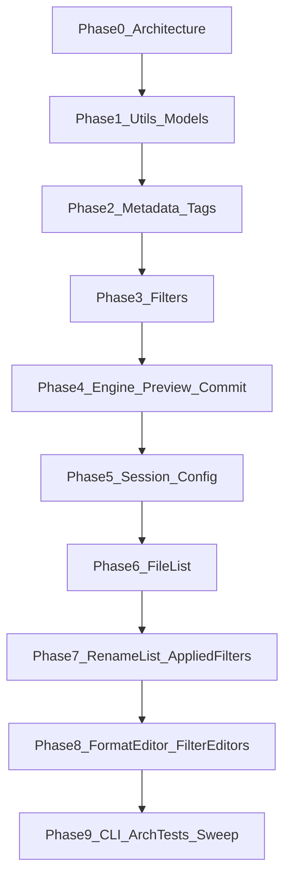

# Whole codebase review (phased)

## Decisions locked

- **Order:** architecture / layering first, then full [`mfr-code-review`](../../.agents/skills/mfr-code-review/SKILL.md) per slice.
- **Per phase:** apply high-confidence fixes in-pass; report remaining findings + cost-to-value-ranked deeper refactors (skill default).
- **Artifact:** this file — phase status + rolling **Deeper refactors backlog**. Do not re-open “already done” items in [`f5-…`](f5-attributes-audio-editors-review-deeper-refactors.md) / [`f6-…`](f6-formateditor-deep-refactors.md).

## Method (every content phase)

1. Scope paths for the phase (project folders + matching `Mfr.Tests/…`).
1. **Architecture check** (lightweight after Phase 0): deps vs [`docs/mfr-folder-layering.md`](../mfr-folder-layering.md); UI `Views → ViewModels → Services`; no second resolver in UI; policy in domain.
1. Run **mfr-code-review** lenses; apply high-confidence fixes; run affected tests + format touched files.
1. Append report section here; promote structural items into the backlog ranked by cost-to-value.
1. Subagents only when skill triggers: `explore` for cross-file twins; `bugbot` on Engine Commit/Preview; `security-review` on path/UNC/session deserialize surfaces.

## Status

| Phase                               | Status   | Notes                                                             |
| ----------------------------------- | -------- | ----------------------------------------------------------------- |
| **0** Architecture / layering       | **done** | Project graph healthy; Services→Views fixed; arch tests tightened |
| **1** Utils + Models                | **done** | Numeric parity + Windows path chars; TextValues deleted           |
| **2** Metadata + Tags               | pending  | Still next (skipped ahead to 3 in one pass)                       |
| **3** Filters                       | **done** | Setup caches + exhaustiveness; Formatting tokens OK               |
| **4** Engine Preview/Commit         | pending  |                                                                   |
| **5** Session/Config                | pending  |                                                                   |
| **6** File List                     | pending  |                                                                   |
| **7** Rename List + Applied Filters | pending  |                                                                   |
| **8** Format Editor + FilterEditors | pending  |                                                                   |
| **9** CLI + arch tests + sweep      | pending  |                                                                   |

______________________________________________________________________

## Phase 0 — Architecture / layering gate (done)

**Goal:** one current picture of allowed deps and known violations before deep cleanup.

### Layer health

| Check                                                                                     | Verdict                                                                                                                                                  |
| ----------------------------------------------------------------------------------------- | -------------------------------------------------------------------------------------------------------------------------------------------------------- |
| `.csproj` ProjectReference graph vs [`mfr-folder-layering.md`](../mfr-folder-layering.md) | **Healthy** — L5→L0 strict; Tests → entry points only                                                                                                    |
| Engine / Filters → Avalonia / App.Ui                                                      | **Clean**                                                                                                                                                |
| Models → TagLib / MetadataExtractor / Metadata / Filters / Engine                         | **Clean**                                                                                                                                                |
| TagLib / MetadataExtractor package ownership                                              | **Clean** — packages only in `Mfr.Metadata` (+ Tests fixtures)                                                                                           |
| Filters TagLib I/O                                                                        | **Clean** — lazy load via Metadata readers only                                                                                                          |
| UI Services → ViewModels                                                                  | **Clean**                                                                                                                                                |
| UI Services → Views                                                                       | **Was broken; fixed**                                                                                                                                    |
| Design doc                                                                                | [`magic-file-renamer-design.md`](../magic-file-renamer-design.md) is an empty stub — use layering + domain docs as truth; **do not invent a design doc** |

**Allowed spine (confirmed):**

`App.Ui / App.Cli → Engine → Filters → Metadata → Models → Utils`

Ui also refs Filters directly (catalog/editors). Cli does not. Engine + Filters both ref Metadata as documented.

### Applied (high confidence)

1. **Services must not take `MainWindow`:** introduced `MainWindowPaneGrids` DTO; `SplitterSession` / `UiSessionPersistence` take Avalonia `Window` + pane grids; `MainWindow.GetPaneGrids()` builds the handle from the view.
1. **Architecture test:** `UiServicesLayerArchitectureTests` now forbids `Mfr.App.Ui.Views` as well as ViewModels.
1. **Doc drift:** `ProjectReferenceArchitectureTests` remarks updated to match current L0–L5 labels (map values were already correct).

### Deferred (later phases / backlog)

| Item                                                                      | Why defer                                                  |
| ------------------------------------------------------------------------- | ---------------------------------------------------------- |
| Models JSON/FS I/O (`ConfigStore`, `SessionStore`, `RenameResultSummary`) | Ownership smell, not a layer violation; revisit in Phase 5 |
| `RenameListFieldDisplay` directory scan for folder file-count             | Domain field resolve; Phase 7 if touched                   |
| `JpegExifThumbnailReader` hand-rolled EXIF in UI Services                 | No ME package leak; optional L2 move — Phase 6             |
| Fuller UI DAG tests (Views↛Services shortcuts, VM↛Views)                  | Nice-to-have; Phase 9 if still wanted                      |
| Forbidden-using / package-ownership arch tests for lower layers           | csproj + spot-check enough for now; Phase 9                |

### Phase 0 exit

Layer picture is current; one real UI-internal leak fixed and guarded. Ready for Phase 1 (Utils + Models core).

______________________________________________________________________

## Phase 1 — L0 Utils + L1 Models core (done)

**Scope:** `Mfr.Utils/`, `Mfr.Models/` (Rename, Filters targets/chain, RenameList catalog), matching `Mfr.Tests/Models/` + `Utils/`. Explore subagent used for cross-file twins.

**Verdict:** Core is coherent — one Rename List field schema, FilterChain/`_Setup` contracts sound, no dual persist schemas. Applied drift/dead-code fixes; leftover items are naming collisions and intentional I/O ownership smells.

### Applied (high confidence)

1. **Deleted** dead `TextValues` twin of `DelimitedText` (zero production callers).
1. **Unified File Name Numeric** via `FileNameNumericValue.Extract` (MFR7 `[0-9]{1,10}` + `long.Parse`) — Rename List field + formatter token share one owner (token previously had no 10-digit cap).
1. **Windows path chars:** `WindowsFileNameChars.ContainsInvalidPath`; `FileMetaPreviewExtensions` no longer uses host `Path.GetInvalidPathChars` (Linux CI ↔ Windows product parity).
1. **Docs:** `SessionState.Version` no longer says “migrations”; `PathRelations.SameOnDisk` vs `IsSamePath` trailing-sep difference clarified; `FilterTargetText.TryGet` documents false ≠ empty field.
1. **File rename:** `ContractAssert.cs` → `Contracts.cs` (`Check` / `Require`).
1. **Tests:** `FileNameNumericValueTests`, `WindowsFileNameCharsTests`, `PathRelations` IsSamePath cases, `FileMeta` path-write / illegal-char cases, token 11-digit cap.

### Correctness (found, not changed)

| Item                                                 | Notes                                                                                                                                                                           |
| ---------------------------------------------------- | ------------------------------------------------------------------------------------------------------------------------------------------------------------------------------- |
| “Parent Folder” label collision                      | Apply-To ancestor L1 = segment name; Rename List column = absolute `DirectoryPath`; “Parent Directory” = absolute dir target — MFR7-facing; don’t force one map without UI pass |
| Prefix/extension writes skip Windows name validation | Ancestor segments validate; name parts rely on Cleaner / commit — product choice                                                                                                |
| `FileMeta.Clone` shares Media/Image/Exif refs        | Safe while snapshots stay immutable                                                                                                                                             |

### Deeper refactors (promoted to backlog)

See backlog below (SameOnDisk collapse, FirstDelimitedSegment, folder-file-count I/O, session sort DTO, label maps).

### Phase 1 exit

Utils/Models numeric + path policy aligned; dead twin removed. Ready for Phase 2 (Metadata + Tags).

______________________________________________________________________

## Phase 3 — L3 Filters pipeline (done)

**Scope:** `Mfr.Filters/` by group (Formatting tokens/compiler last), `FilterCatalog`, `BaseFilter` setup caches; matching `Mfr.Tests/Models/Filters/`. Explore subagent used for cross-file twins.

**Verdict:** Pipeline is sound — palette reflection + `PresetJsonOptions` stay aligned via existing catalog/polymorphism tests; `_Setup` caches that existed were already unconditional. Applied local setup-cache moves, exhaustiveness, and CharacterRun/KISS cleanup. Leftovers are structural (regex compile per replace, sentence-casing twins, ConfigStore line-length).

### Applied (high confidence)

1. **Setup caches** for char-set options that rebuilt `HashSet` every transform: `CleanerFilter`, `SpaceAfterFilter`, `SpaceAroundFilter`, `CapitalizeAfterFilter` (unconditional assign / clear-to-null for `with`).
1. **`CharacterRunHelpers`:** regex → linear collapse (Shrink Spaces / Shrink Duplicate Characters).
1. **`AudioTagSetterFilter`:** early-return when no semantic fields configured (skip `EnsureTagLibLoaded` / merge).
1. **Exhaustive switches:** `LettersCaseFilter`, `AttributesSetterFilter`, Media/Image/Mpeg property formatters → `UnreachableException` (no silent fall-through).
1. **Dead `partial`** on `FormatterFilter`; non-nullable compiled `Formatter` fields on Formatter / Inserter / NameList / ReplaceList (drop `Check.NotNull` after setup).
1. **Tests:** Cleaner + SpaceAfter `with`-clear drops prior cache; full `Mfr.Tests.Models.Filters` suite green (731).

### Correctness (found, not changed)

| Item                                             | Notes                                                                                                                                                                        |
| ------------------------------------------------ | ---------------------------------------------------------------------------------------------------------------------------------------------------------------------------- |
| `ContainsLikelyFormatTokens` vs always-`Compile` | Inserter / AudioTag / Id3v2 use heuristic literals; Replacer / ReplaceList / Formatter / NameList / PathMover always compile (MFR7 format-string replacements). Intentional. |
| `ListEntryLength` → `ConfigStore`                | Filters read process config max line length; ownership smell → Phase 5                                                                                                       |
| `UppercaseInitialsFilter` SYSLIB1045 disable     | Documented; GeneratedRegex noise — leave                                                                                                                                     |

### Deeper refactors (promoted to backlog)

See backlog items 6–9 below.

### Phase 3 exit

Filters setup/transform hygiene improved; Formatting registry/compiler coherent. Ready for Phase 4 (Engine Preview/Commit) once Phase 2 is done or explicitly skipped again.

______________________________________________________________________

## Deeper refactors backlog

Ranked cost-to-value. Do not duplicate f5/f6 “already done.”

1. **Collapse or rename `SameOnDisk` vs `IsSamePath`**
   Sites: `PathRelations`; callers in Engine / Ui / `RenameItem.IsPreviewPathSameOnDisk`
   Target: one equality API + explicit trim overload, or keep both with names that cannot be confused
   Value: closes trailing-sep footgun
   Cost: medium churn across Engine/Ui
   Rank: medium — Phase 4/7 if touched

1. **`FirstDelimitedSegment` → `DelimitedText` only if empty-first semantics match**
   Sites: `RenameListFieldDisplay.FirstDelimitedSegment` vs `DelimitedText.Split` (AudioTag first-segment fields)
   Target: shared first-part helper **only if** `" ; Bob"` empty-first behavior is acceptable
   Value: small dedup
   Cost: low, but behavior risk
   Rank: medium — Phase 7 if AudioTag display touched

1. **Move or lazy-gate `FormatFolderFileCount` directory scan**
   Sites: `RenameListFieldDisplay.FormatFolderFileCount`
   Target: avoid live FS on every resolve/sort paint, or document as intentional expensive field
   Value: paint/sort side effects
   Cost: medium (Engine/UI cache?)
   Rank: medium — Phase 7

1. **`SessionStateRenameListSortField` vs `RenameListSortKey`**
   Sites: session DTO vs domain sort key
   Target: one type if JSON shape can stay identical
   Value: thin dedup
   Cost: session churn
   Rank: low — Phase 5

1. **Shared Apply-To / Rename List / Picard display labels**
   Sites: `FilterTargetCatalog` vs `AudioTagRenameListFields` vs `AudioCatalogFieldMaps`
   Target: optional Models display catalog — only if labels should converge
   Value: unclear (MFR7 may want divergent labels)
   Cost: high
   Rank: low — skip unless UI pass demands it

1. **Cache compiled regex in Replacer / ReplaceList setup**
   Sites: `ReplacerMatching.ReplaceSegment` builds `new Regex` every call; filters already `_Setup`
   Target: compile pattern (+ flags) once in `_Setup`, reuse in transform (list = one regex per entry)
   Value: preview cost on large lists
   Cost: medium — mode/flags/`with` must invalidate; WholeWord wrapping
   Rank: medium — do when profiling preview or touching Replace

1. **Sentence-initial uppercasing twin**
   Sites: `LettersCaseFilter._ApplySentenceCase` vs `CasingListFilter._UppercaseSentenceInitials` (ASCII-letter vs `IsLetter` nuance)
   Target: one shared helper **only if** MFR7 parity allows unifying letter detection
   Value: one behavior for sentence starts
   Cost: medium behavior risk
   Rank: medium — Case group only if product wants one rule

1. **`AudioTagSetterFilter` PascalCase private formatter fields**
   Sites: `PerformersFormatter`, `TitleFormatter`, …
   Target: `_performersFormatter`-style names (or a field→formatter map)
   Value: naming clarity; optional map reduces ApplyCore boilerplate
   Cost: medium churn in one large file
   Rank: low–medium — rename anytime; map only if editing the filter again

1. **`ListEntryLength` / max line length off `ConfigStore`**
   Sites: `ListEntryLength`; Name/Replace/Casing list parsers
   Target: inject max length or read from a Filters-owned options type at setup (Phase 5 config pass)
   Value: clearer ownership; testability
   Cost: medium with config reshape
   Rank: medium — Phase 5

______________________________________________________________________

## Remaining phase briefs

### Phase 2 — L2 Metadata + Tags

**Scope:** `Mfr.Metadata/`, `Mfr.Models/Tags/`, docs `audio-tag-model.md` / `image-metadata-model.md`, `Mfr.Tests/Metadata/`.

### Phase 4 — L4 Engine Preview + Commit (risk gate)

**Scope:** Preview / Commit / RenameList engine; prefer `bugbot` after fixes. Review **engine** correctness — not unfinished rename-list UI (14b–16).

### Phase 5 — Session / Config / Presets / Reset

**Scope:** Models/Engine config + presets, `Mfr.App.Ui/Services/Session/`, `PersistedConfigurationReset`. One current JSON schema; corrupt → defaults.

### Phase 6 — File List (services + UI)

**Scope:** File List VM/Views + `Services/FileList/`; note `debts.md` shell ops as deferred.

### Phase 7 — Rename List UI + Applied Filters / Palette

**Scope:** Rename List + Applied Filters + Palette; respect open [`rename-list-ui.plan.md`](rename-list-ui.plan.md) phases 14b–16 — review shipped code only.

### Phase 8 — Format Editor + FilterEditors

**Scope:** Format Editor + `FilterEditors/<FilterGroup>/`; skip f5/f6 already-done items.

### Phase 9 — CLI + architecture tests + sweep

**Scope:** CLI, arch tests, backlog triage, `debts.md` refresh if needed.

## Out of scope

- Finishing open feature plan phases (rename-list 14b–16, etc.) unless a review fix is required for correctness.
- Writing a full design doc into the empty stub unless asked separately.
- Re-litigating completed f5/f6 “already done” items.
